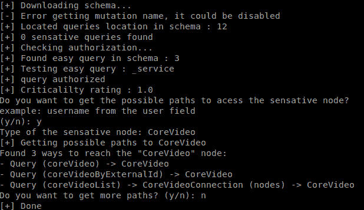

# GraphCrawler : GraphQL 自动化安全测试工具包

> 原文：<https://kalilinuxtutorials.com/graphcrawler/>

.png)

**Graph Crawler** 是任何 GraphQL 端点最强大的自动化测试工具包。

### 1.2 版本发布了

新功能:可以使用 Escape Technology 强大的 Graphinder 工具为您搜索端点。只要将它指向一个域并添加“-e”选项，Graphinder 就会进行子域枚举+搜索 GraphQL 端点的流行目录。毕竟，GraphCrawler 将接管并处理每个发现。如果模式不能被自省，那么您可以使用“-s”选项将其作为 json 文件提供。

它将运行并检查是否启用了突变，检查任何可用的敏感查询，如用户和文件，它还将测试它找到的任何简单查询，以查看是否需要身份验证。

如果端点上没有启用自省，它将检查它是否是一个 Apollo 服务器，然后可以运行透视来强行获取建议，尝试自己构建模式。(关于这方面的更多细节，请参见千里眼项目)。然后，它会对调查结果进行 1-10 分的评分，10 分是最重要的。

如果您想更深入地研究这个模式，您还可以使用 graphql-path-enum 来查找某些类型的路径，比如用户 id、电子邮件等。

我希望这能为你节省和我一样多的时间

## 用法

**python graph crawler . py-u https://test.com/graphql/api-o-a " "**

██████╗ ██████╗ █████╗ ██████╗ ██╗ ██╗ ██████╗██████╗ █████╗ ██╗ ██╗██╗ ███████╗██████╗
██╔════╝ ██╔══██╗██╔══██╗██╔══██╗██║ ██║██╔════╝██╔══██╗██╔══██╗██║ ██║██║ ██╔════╝██╔══██╗
██║ ███╗██████╔╝███████║██████╔╝███████║██║ ██████╔╝███████║██║ █╗ ██║██║ █████╗ ██████╔╝
██║ ██║██╔══██╗██╔══██║██╔═══╝ ██╔══██║██║ ██╔══██╗██╔══██║██║███╗██║██║ ██╔══╝ ██╔══██╗
╚██████╔╝██║ ██║██║ ██║██║ ██║ ██║╚██████╗██║ ██║██║ ██║╚███╔███╔╝███████╗███████╗██║ ██║
╚═════╝ ╚═╝ ╚═╝╚═╝ ╚═╝╚═╝ ╚═╝ ╚═╝ ╚═════╝╚═╝ ╚═╝╚═╝ ╚═╝ ╚══╝╚══╝ ╚══════╝╚══════╝╚═╝ ╚═╝

output 选项不是必需的，默认情况下它会输出到 schema.json

### 示例输出

### 要求

*   Python3
*   码头工人
*   用 pip 安装所有 Python 依赖项

来自谷歌的单词表-10000-英语

[**Download**](https://github.com/gsmith257-cyber/GraphCrawler)