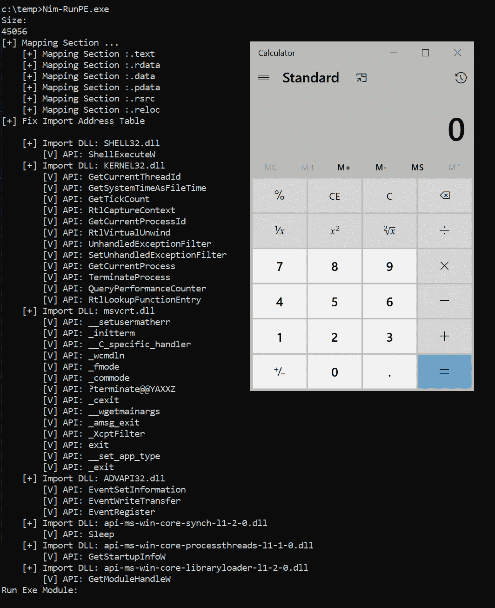
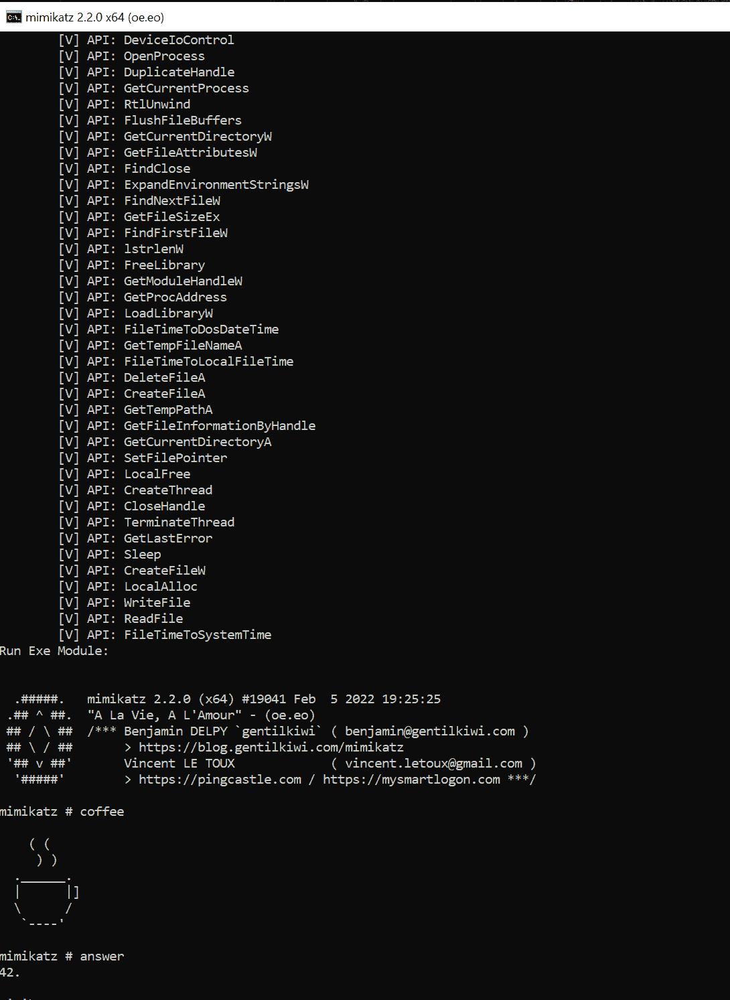

# Nim-RunPE:从内存进行反射 PE 加载的 Nim 实现

> 原文：<https://kalilinuxtutorials.com/nim-runpe/>

.png)

Nim-RunPE ，是从内存进行反射 PE 加载的 Nim 实现。这段代码的基础取自内存中的 RunPE——我把它移植到了 Nim。

您需要安装以下依赖项:

`**nimble install ptr_math winim**`

我只在 Nim 版本 1.6.2 上测试过，所以请使用那个版本进行测试，否则我不能保证在使用另一个版本时不会出错。

## 编译

如果您想在运行时传递参数或者根本不想传递参数，可以通过以下方式编译:

`**nim c NimRunPE.nim**`

如果您想要硬编码自定义参数，请根据您的需要修改`**const exeArgs**`,并使用以下代码进行编译:

`**nim c -d:args NimRunPE.nim**`–本文由@glynx 贡献，谢谢

## 更多信息

这项技术本身非常古老，但是我还没有找到 Nim 实现。所以现在这种情况已经改变了。🙂

如果你计划用这种技术加载 Mimikatz，确保自己从源代码编译一个版本，因为发布的二进制文件在被这个加载器反射性加载后不接受参数。为什么？我真的不知道这很奇怪，但这是事实。如果你自己编译，它仍然可以工作:

我的私有打包器也用这种技术武器化了——但是所有的 Win32 函数都被替换成了 Syscalls。这使得这项技术更加隐秘。

[**Download**](https://github.com/S3cur3Th1sSh1t/Nim-RunPE)