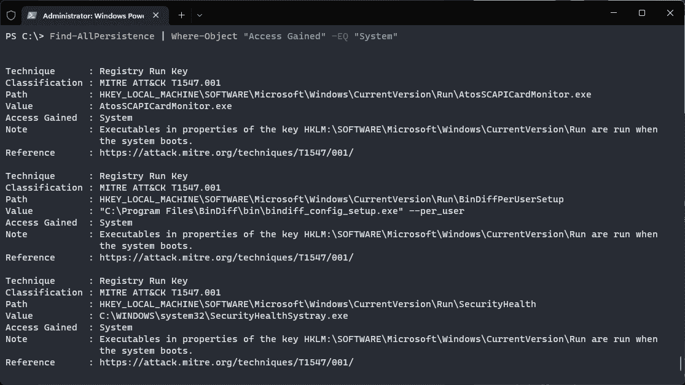
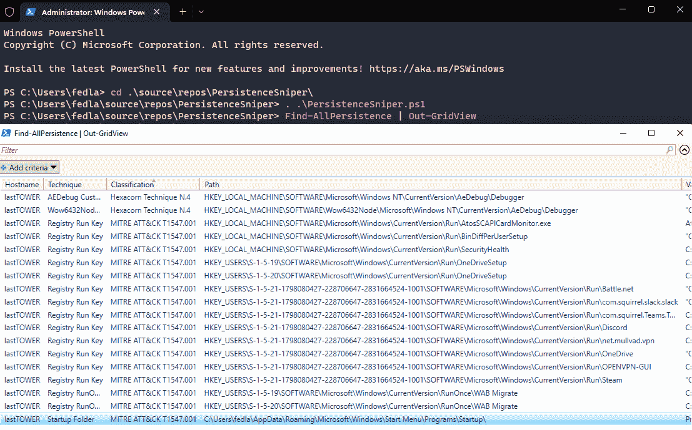

# PersistenceSniper:可供蓝队、事故响应者和系统管理员使用的 Powershell 脚本

> 原文：<https://kalilinuxtutorials.com/persistencesniper/>

%20(3).png)

**PersistenceSniper** 是一个 Powershell 模块，蓝队、事件响应者和系统管理员可以使用它来搜索植入 Windows 机器的持久性。Powershell Gallery 上也提供了该脚本。该工具正在积极开发中，新版本将于本周发布，因此请确保使用最新版本！

## 为什么

你可能会问，为什么要编写这样一个工具。首先，我试着四处寻找，但没有找到适合我的特定用例的工具，即跨多台机器自动寻找已知的持久性技术，同时能够快速轻松地解析和比较结果。当然，Sysinternals 的 Autoruns 是一个令人惊叹的工具，它绝对值得使用，但是，鉴于它以非标准格式输出结果，并且不能远程运行，除非你用它的命令行等价物做一些恶作剧，我不觉得它很适合我。另外，据我所知，我目前在 PersistenceSniper 中实现的一些技术还没有在 Autoruns 中实现。无论如何，如果你需要的是一个易于使用的，基于图形用户界面的工具，有很多已经实现的功能，自动运行是正确的选择，否则让 PersistenceSniper 试试，它不会错过的🙂

## 用法

使用 PersistenceSniper 就像以管理员身份启动 Powershell 并运行:

git 克隆 https://github.com/last-byte/PersistenceSniper
PS C:>导入模块。\持续狙击\持续狙击\持续狙击. PS D1
PS C:>Find-all persistence

如果您更喜欢 Powershell Gallery 版本(每次在 Github 上推出新版本时，都会通过 Github 动作自动更新)，请以管理员身份打开 Powershell 并运行:

**PS C:>Install-Module persistence sniper
PS C:>Import-Module persistence sniper
PS C:>Find-all persistence**

如果您需要关于如何使用该工具或哪些参数可用以及它们如何工作的详细说明，PersistenceSniper 的`**Find-AllPersistence**`支持 Powershell 的帮助功能，因此您可以在导入模块后使用以下命令获得详细的更新帮助:

**Get-Help-Name Find-all persistence-Full**

如果您只想检查一种持久性技术，您可以依赖于`**Find-AllPersistence**`的`**PersistenceMethod**`参数。例如，您只想检查通过 Run 和 RunOnce 注册表项植入的持久性:

**PS C:>Find-all persistence-persistence 方法 RunAndRunOnce**

`**PersistenceMethod**`参数使用 Powershell 的`**ValidateSet**`指令，因此您可以浏览它，而不用写下选择的持久化方法。

PersistenceSniper 的`**Find-AllPersistence**`返回具有以下属性的 PSCustomObject 类型的对象数组:

**$ persistence object =[PSCustomObject]@ {
' computer name ' = $ computer name
' Technique ' = $ Technique
' class ification ' = $ class ification
' Path ' = $ Path
' Value ' = $ Value
' Access gapped ' = $ Access gapped
Note ' = $ Note
' Reference ' = $ Reference
' Signature ' = Find-certificate info(Get-executable from command line $ Value)
' isbuiltinpoint**

这使得输出格式化和过滤变得容易。假设您只想看到允许攻击者以 NT AUTHORITY\SYSTEM(又名 SYSTEM)的身份重新获得访问权的持久性:

**PS C:>Find-all persistence | Where-Object“获得访问权”-EQ“系统”**

当然，作为一个基于 Powershell 的工具，可以执行一些很酷的技巧，比如将它的输出传递给`**Out-GridView**`以便有一个基于 GUI 的表格与之交互。

## 解释结果

如前所述，`**Find-AllPersistence**`输出 Powershell 定制对象的数组。每个对象都有以下属性，这些属性可用于筛选、排序和更好地理解函数寻找的不同技术:

*   计算机名:这相当简单。如果运行`**Find-AllPersistence**`时没有带`**-ComputerName**`参数，PersistenceSniper 将只在本地机器上运行。否则，它将在您指定的远程计算机上运行；
*   技术:这是技术本身的名称，在社区中众所周知；
*   分类:此属性可用于根据技术的米特 ATT&CK 技术和子技术编号快速识别技术。对于那些没有米特 ATT&CK 分类的技术，使用其他分类，最常见的是 Hexacorn 的分类，因为许多技术是他发现的。当一项技术的来源不能可靠地确定时，就使用“未列入目录的技术 N.#”分类法；
*   Path:这是在文件系统或注册表中植入技术的路径；
*   Value:这是该技术使用的注册表属性的值，或者是所使用的可执行文件/库的名称，如果它是一种依赖于在文件系统上植入某些东西的技术；
*   获得的访问权:这是该技术授予攻击者的一种访问权。例如，如果它是 HKCU 下的运行键，获得的访问权限将是用户级的，而如果它是 HKLM 下的，它将是系统级的；
*   注意:这是对该技术的一个快速解释，因此可以很容易地掌握它的工作原理；
*   参考:这是一个链接，如果分析师需要进一步研究，可以链接到更深入的技术解释；
*   Signature:此属性报告与找到的持久性技术相关联的二进制文件的签名信息；
*   IsBuiltinBinary:此布尔属性报告与找到的持久化技术相关联的二进制文件是否通常在操作系统上找到并被认为是内置的；
*   IsLolbin:如果找到的与持久性技术相关的二进制文件是一个 Lolbin，那么这个布尔属性被设置为 True。

## 处理误报

让我们面对现实吧，寻找持久性技术也伴随着必须处理大量的误报。发生这种情况是因为，虽然一些技术几乎从未被合法使用，但许多确实是由合法软件使用的，这些软件需要在系统启动或用户登录时自动运行。

这带来了挑战，在许多环境中可以通过创建包含已知误报的 CSV 文件来解决。如果您的组织使用类似黄金映像的东西部署系统，您可以在您刚刚创建的系统上运行 PersistenceSniper，获得结果的 CSV，并使用它来过滤其他机器上的结果。这种方法具有以下优点:

*   不必管理冗长且容易出错的持久性白名单；
*   为使用该工具的组织及其组织单位定制误报；
*   这使得想要通过不在工具代码中公开披露误报来混入误报的攻击者更加困难。

`**Find-AllPersistence**`带有允许将结果直接输出到 CSV 文件的参数，同时也能够将 CSV 文件作为输入并区分结果。

**PS C:>Find-all persistence-diff CSV false _ positives . CSV**

## 通过拍摄增量快照来寻找持久性

我的朋友 Riccardo 建议的一个很酷的使用持久性的方法是以增量的方式使用它:你可以设置一个每 X 小时运行一次的计划任务，通过`**-DiffCSV**`参数接收前一次迭代的输出，并将结果输出到一个新的 CSV。通过跟踪增量变化，您应该能够在相当短的时间内发现您所监控的机器上植入的新持久性。

## 迄今为止实现的持久性技术

持久性这个话题，尤其是在 Windows 机器上，是基本上每隔一周就会有新发现的话题之一。考虑到目前为止研究人员发现的大量持久性技术，我仍然在实现它们的过程中。到目前为止，已经成功实施了以下 **34 项技术**:

*   运行键
*   RunOnce 密钥
*   图像文件执行选项
*   自然语言开发平台 6 DLL 重写路径
*   AEDebug 键
*   Windows 错误报告调试器
*   Windows 错误报告反射调试器
*   命令提示符自动运行
*   浏览器加载
*   Winlogon 用户初始化
*   Winlogon Shell
*   Windows 终端开始用户登录
*   AppCertDlls DLL 注入
*   应用程序路径劫持
*   ServiceDll 劫持
*   组策略扩展 dll
*   Winlogon MPNotify
*   CHM 助手 DLL
*   劫持 hhctrl.ocx
*   启动文件夹
*   用户初始化 Mpr 登录脚本
*   自动拨号 Winsock 注射
*   LSA 扩展 DLL
*   ServerLevelPluginDll DNS 服务器 Dll 劫持
*   LSA 身份验证包 DLL
*   LSA 安全包 DLL
*   Winlogon 通知包 DLL
*   资源管理器工具劫持
*   。NET DbgManagedDebugger
*   ErrorHandler.cmd 劫持
*   WMI 订阅
*   Windows 服务
*   终端服务初始程序
*   辅助工具后门

[**Download**](https://github.com/last-byte/PersistenceSniper)