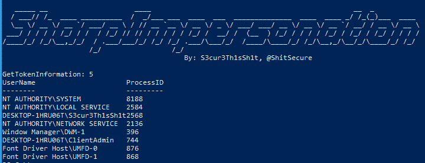

# SharpImpersonation:一个用户模拟工具——通过令牌或外壳代码注入

> 原文：<https://kalilinuxtutorials.com/sharpimpersonation/>

.png)

SharpImpersonation 是一个用户模拟工具——通过令牌或外壳代码注入。从我的角度来看，这是一个边做边学的项目。众所周知的技术被用来建立*只是*另一个模仿工具，与其他公共工具相比有一些改进。代码库取自:

*   https://github.com/0xbadjuju/Tokenvator

有关介绍的博客帖子可以在这里找到:

*   https://s3cur3th1ssh1t.github.io/SharpImpersonation-Introduction/

## 列出用户进程

## 仅列出提升的进程

**PS>PS C:\ temp>SharpImpersonation.exe 列表升高**

## 模拟目标用户的第一个进程来启动一个新的二进制文件

**PS>PS C:\ temp>SharpImpersonation.exe 用户:binary:**

## 将 base64 编码的外壳代码注入目标用户的第一个进程

**PS>PS C:\ temp>SharpImpersonation.exe 用户:外壳代码:**

## 将从 web 服务器加载的外壳代码注入目标用户的第一个进程

**PS>PS C:\ temp>SharpImpersonation.exe 用户:外壳代码:**

## 通过 ImpersonateLoggedOnuser 模拟当前会话的目标用户

SharpImpersonation.exe 用户:技术:ImpersonateLoggedOnuser

[**Download**](https://github.com/S3cur3Th1sSh1t/SharpImpersonation)