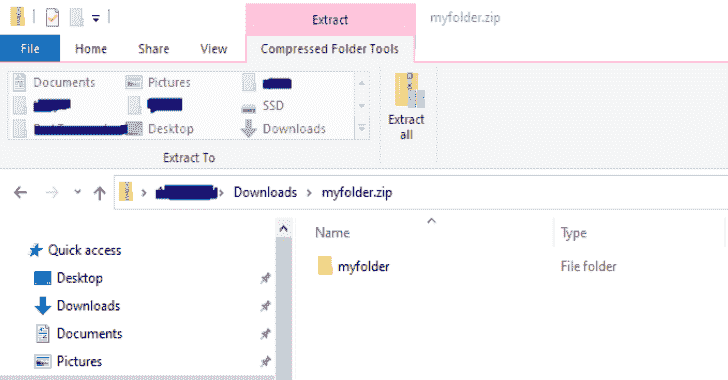
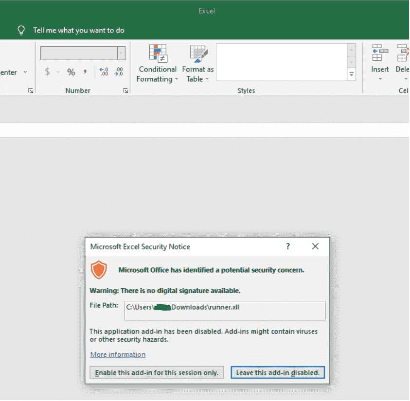
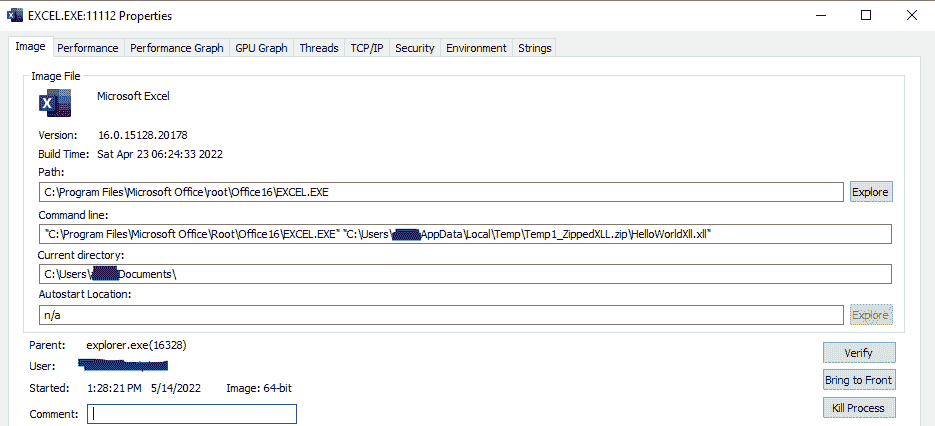

# XLL 网络钓鱼:XLL 网络钓鱼的惯用伎俩

> 原文：<https://kalilinuxtutorials.com/xll_phishing/>

.png)

**XLL _ 网络钓鱼**，随着微软最近宣布阻止来自互联网(电子邮件和网络下载)的文档中的宏，攻击者已经开始积极探索其他选项来实现用户驱动访问(UDA)。在寻找可行的网络钓鱼访问方法时，需要权衡几个因素:

*   复杂性——用户需要的步骤越多，我们成功的可能性就越小。
*   特异性–大多数受害机器容易受到您的攻击吗？您的攻击架构是特定的吗？是否需要安装某些软件？
*   交付–目标网络上是否存在限制您交付 maldoc 的网络/策略缓解措施？
*   防御—是否实施了应用程序白名单？
*   检测–客户端运行的是什么类型的反病毒/EDR？

这些是主要的问题，然而肯定还有更多。当你意识到这些因素相互混合时，事情变得更加复杂；例如，如果一个客户端有一个禁止下载可执行文件或 DLL 的 web 代理，您可能需要将您的有效负载放在一个容器(ZIP、ISO 等)中。当涉及到检测时，这样做可能会带来进一步的问题。更强大的防御需要更复杂的技术组合来击败。

这篇文章将写一个虚构的目标组织；该组织采用了多种防御措施，包括电子邮件过滤规则、禁止下载某些文件类型的黑名单、终端上的应用程序白名单，以及作为 EDR 解决方案的 Microsoft Defender for Endpoint。

真正的组织可能不采用这些防御措施，或者采用一些甚至更多的防御措施，这些措施可能会简化或复杂化本研究中概述的技术。一如既往，了解你的目标。

## 什么是 XLL？

XLL 的是 DLL 的，专门为微软 Excel 制作的。对于外行人来说，它们看起来很像普通的 excel 文档。

XLL 为 UDA 提供了一个非常有吸引力的选择，因为它们是由 Microsoft Excel 执行的，这是一个在客户网络中非常常见的软件；额外的好处是，因为它们是由 Excel 执行的，我们的有效负载几乎肯定会绕过应用程序白名单规则，因为一个受信任的应用程序(Excel)正在执行它。XLL 可以用 C、C++或 C#编写，这比 VBA 宏提供了更多的灵活性和功能(以及健全性),这进一步使它们成为理想的选择。

当然，缺点是 XLL 的合法用途很少，所以组织通过电子邮件和网络下载阻止该文件扩展名的下载应该是非常容易的。遗憾的是，许多组织已经落后了好几年，因此，XLL 在一段时间内将成为一种可行的网络钓鱼方法。

有一系列不同的事件可用于在 XLL 中执行代码，其中最著名的是 xlAutoOpen。

双击 XLL 时，用户会看到以下屏幕:

这个对话框是用户和代码执行之间的唯一屏障；有了相当薄的社会工程，代码执行几乎是有保证的。

必须记住的是，XLL 是可执行的，是特定于架构的。这意味着你必须知道你的目标；目标组织使用的 Microsoft Office/Excel 版本将(通常)决定您需要为哪种架构构建有效负载。

Office 版本中有一个非常清晰的界限，可以作为经验法则:

Office 2016 或更早版本:x86

Office 2019 或更高版本:x64

应该注意的是，可以为每个产品安装其他体系结构，但是这些是默认安装的体系结构，在大多数情况下，这应该是一种可靠的方式来决定为哪个体系结构推出您的 XLL。当然，根据交付方式和网络钓鱼活动中使用的伪装，有可能提供两种版本，并依靠受害者为其系统选择合适的版本。

### 资源

在这项研究中建造的 XLL 有效载荷是基于 edparcell 的这个项目。他的存储库中有关于在 Visual Studio 中开始使用 XLL 的很好的指导，我使用他的代码作为起点来开发一个恶意的 XLL 文件。

与他的库有一个明显的不同是，如果你想创建自己的 XLL 项目，你需要下载最新的 Excel SDK，然后按照之前链接的回购协议的说明使用这个版本，而不是自述文件中提到的 2010 版本的 SDK。

## 交货

在 UDA 中，有效载荷的交付是一个重要的考虑因素。我们将重点介绍两种主要方法:

*   电子邮件附件
*   网络交付

### 电子邮件附件

无论是通过附加文件还是包含一个可以下载文件的网站链接，电子邮件都是 UDA 流程的重要组成部分。多年来，许多组织(和电子邮件提供商)已经成熟并实施了规则来保护用户和组织免受恶意附件的侵害。里程会有所不同，但组织现在有能力:

*   阻止可执行附件(EXE、DLL、XLL、MZ 头文件)
*   阻止像 ISO/IMG 这样的可挂载且可能包含可执行内容的容器
*   检查 zip 文件并阻止包含可执行内容的文件
*   阻止受密码保护的 zip 文件
*   更大的

模糊组织的电子邮件规则可能是项目的重要组成部分，但是必须始终小心谨慎，以免泄露红队正在开展行动以及正在积极收集信息。

出于本文的目的，我们假设目标组织拥有健壮的电子邮件附件规则，可以阻止 XLL 有效负载的传递。我们将重点关注 web 交付。

### 网络交付

在这种攻击媒介中，电子邮件仍然会被使用，但是它不是用来发送附件，而是用来发送指向网站的链接。控制允许的文件下载类型的 Web 代理规则和网络缓解可能不同于针对电子邮件附件实施的规则和网络缓解。出于本文的目的，假设组织阻止从 web 下载可执行文件(MZ 头文件)。既然如此，探索封隔器/容器是值得的。

前提是，我们可能能够将可执行文件放在另一种文件类型中，并绕过组织的策略。这里主要考虑的是对文件类型的本机支持；例如，如果不安装第三方软件，Windows 就无法打开 7Z 文件，所以它们不是一个很好的选择。像 ZIP、ISO 和 IMG 这样的格式是很有吸引力的选择，因为它们本来就受 Windows 支持，而且作为额外的好处，它们给受害者增加了很少的额外步骤。

不幸的是，该组织禁止从网上下载 ISO 和 IMG 的产品；此外，由于他们采用了数据丢失防护(DLP ),用户无法安装外部存储设备，而 ISO 和 IMG 认为这是可行的。

幸运的是，尽管该组织禁止下载 MZ 头文件，但它允许下载包含可执行文件的 zip 文件。这些 zip 文件被主动扫描恶意软件，包括提示用户输入密码保护的 zip 文件的密码；但是，因为可执行文件是压缩的，所以不会被 MZ 文件的全面拒绝所阻止。

## 压缩文件并执行

选择 Zip 文件作为我们 XLL 负载的容器是因为:

*   它们本身与 Windows 兼容
*   该组织允许从互联网上下载它们
*   它们几乎没有给攻击增加额外的复杂性

然而有一些奇怪的事情；它识别为恶意的文件在 C:\ users \ user \ Appdata \ Local \ Temp \ Temp 1 _ zipped xll . zip 中，而不是我们双击的 C:\ users \ user \ Downloads \ zipped xll \中。查看 ProcessExplorer 中的 Excel 实例可以看到，Excel 实际上是从 appdata\local\temp 运行 XLL，而不是从它所在的 ZIP 文件运行:

这似乎是一个与 ZIP 文件有关的问题，而不是 XLL 的问题。使用记事本打开 zip 中的 TXT 文件也会导致 TXT 文件被复制到 appdata\local\temp 并从那里打开。虽然从这个位置打开一个文本文件是可以的，但是 Defender 似乎会将在这个位置执行的任何类型的代码识别为恶意代码。

如果用户要从 ZIP 文件中提取 XLL，然后运行它，它将没有任何问题地执行；然而，没有办法保证用户这样做，我们真的不能掷骰子弹出反病毒/EDR 应该他们不提取它。此外，双击拉链，然后双击 XLL 要简单得多，受害者更倾向于完成这些简单的动作，而不是麻烦地拉开拉链。

这个问题使我开始考虑一种不同于 XLL 的有效载荷类型；我开始探索 VSTO，它是用于 Office 的 Visual Studio 模板。我强烈建议你去看看那篇文章。

VSTO 最终调用一个 DLL，该 DLL 可以位于。XLSX 启动一切，或远程托管并由下载。XLSX 通过 http/https。本地选项没有提供真正的优势(实际上还有几个缺点，因为有几个文件与 VSTO 攻击相关联)，并且不幸的是，远程选项需要代码签名证书或者远程位置是受信任的网络。由于没有有效的代码签名证书，VSTO 无法缓解我们的 XLL 有效负载在这种情况下遇到的任何问题。

我们似乎真的被逼到了墙角。运行 XLL 本身没问题，但是根据组织政策，XLL 不能通过电子邮件附件或网络下载自行发送给受害者。XLL 需要打包在一个容器中，但是由于 DLP 格式，如 ISO、IMG 和 VHD 不可行。受害者需要能够在没有任何第三方软件的情况下打开容器，这实际上留下了 ZIP 作为选项；然而，如前所述，从压缩文件夹中运行 XLL 会导致从 appdata\local\temp 中复制并运行它，这将标记 AV。

我花了很多时间进行头脑风暴和测试，深入 VSTO 兔子洞，探索所有可能的选择，直到我最终决定尝试一些愚蠢的东西，它可能会工作。

## 谍报技术

让受害者下载并执行 XLL 的借口会因组织和交付方式的不同而大相径庭；主题可能包括员工工资数据、基于技能的薪酬计算器、项目信息、活动参与者名单等。无论诱惑是什么，如果我们真的向受害者提供了他们所承诺的东西，我们的攻击就会有效得多。如果不坚持到底，受害者可能会产生怀疑，并向他们的安全团队报告该文档，这可能会很快暴露攻击者并限制对目标系统的访问。

在我们的代码执行完毕后，XLL 本身只会留下一个空白的 Excel 窗口；我们最好提供受害者正在寻找的 Excel 电子表格。

我们可以将 XLSX 作为字节数组嵌入到 XLL 中；当 XLL 执行时，它将把 XLSX 放到 XLL 旁边的磁盘上，然后打开它。我们将 XLSX 命名为 XLL 相同，唯一的区别是扩展。

假设我们的 XLL 是用 C 写的，我们可以引入我以前写的关于 C 有效负载能力的文章中的一些能力，即自删除。结合这两种技术会导致 XLL 从磁盘上被删除，而同名的 XLSX 被删除。对于没有洞察力的人来说，XLSX 似乎一直都在那里。

不幸的是，删除 XLL 和放置 XLSX 的位置是 appdata\temp\local 文件夹，而不是原始的 ZIP 文件；为了解决这个问题，我们可以创建第二个只包含 XLSX 的 ZIP 文件，并将它读入 XLL 中的一个字节数组。除了上述操作之外，在执行时，XLL 可以尝试在 c:\users\victim\Downloads\中找到原始 ZIP 文件，并在删除第二个仅包含 XLSX 的 ZIP 文件之前删除它。当然，如果用户将原始 ZIP 文件保存在不同的位置或不同的名称下，这可能会失败，但是在许多/大多数情况下，它应该会自动放入用户的下载文件夹中。

此屏幕截图在下方窗格中显示了在 appdata\local\temp 中创建的 temp 文件夹，其中包含 XLL 和放置的 XLSX，而顶部窗格显示了打开 XLL 的原始文件资源管理器窗口。请注意，在下方窗格中，XLL 的大小为 0。这是因为它在执行过程中删除了自己，但是在顶部窗格关闭之前，XLL 文件不会从 appdata\local\temp 位置完全消失。即使受害者再次点击 XLL，它现在是惰性的，并不真正存在。

类似地，一旦受害者退出文件资源管理器中打开的 ZIP(通过关闭它或导航到不同的文件夹)，如果他们再次单击 spreadsheet.zip，他们现在将发现测试文件夹包含 importantdoc.xlsx 因此，XLL 已被删除，并由无害的 XLSX 在磁盘上的两个位置取代。

这个 GIF 演示了 XLL 在 MDE 试用虚拟机上的下载和执行。请注意，由于某种原因，Excel 在这里打开了两个实例；在我的家用电脑上，它只打开了一个，所以不太清楚为什么会不同。

## 代码示例

大多数人可能都在等待这个时刻，我提供了我开发的 XLL runner 的代码示例，仅限于 Tradecraft 部分讨论的那些部分。实际上，读者需要将代码放入 XLL，并与他们的运行程序的其余部分一起实现它。一如既往，不做伤害，有权限钓鱼组织等。

### 编译和设置

我已经包含了一个程序的源代码，该程序将接收一个文件并产生十六进制数，该十六进制数可以被复制到代码片段中定义的字节数组中。在您希望呈现给用户的 XLSX 上使用它，以及包含相同 XLSX 的文件夹的 ZIP 文件，并将它们存储在各自的字节数组中。使用以下代码编译此代码:

**gcc-o ingest 文件。c**

我在 kali 机器上使用 MingW 编译我的 XLL 时遇到了一些问题，所以我想在这里发布命令:

**x64**

**x86 _ 64-w64-mingw 32-gcc snippet . c 2013 _ Office _ System _ Developer _ Resources/excel 2013 xllsdk/LIB/x64/XL call 32。LIB-o important doc . xll-s-Os-duni code-shared-I 2013 _ Office _ System _ Developer _ Resources/excel 2013 xllsdk/INCLUDE/**

**x86**

**i686-w64-mingw 32-gcc snippet . c 2013 _ Office _ System _ Developer _ Resources/excel 2013 xllsdk/LIB/XL call 32。LIB-o hello world xll . xll-s-duni code-Os-shared-I 2013 _ Office _ System _ Developer _ Resources/excel 2013 xllsdk/INCLUDE/**

编译后，你需要创建一个新的文件夹，并将 XLL 复制到这个文件夹中。然后使用以下命令将其压缩:

**zip -r .zip /**

请注意，为了让本文中概述的 tradecraft 能够工作，您需要将代码片段中的一些变量与您命名的 XLL 和 zip 文件进行匹配。

## 结论

随着 Office Macro 的统治地位即将结束，XLL 为网络钓鱼活动提供了一个有吸引力的选择。通过一些创新，它们可以与其他技术结合使用，绕过组织和安全团队实施的许多层防御。谢谢你的阅读，我希望你学到了有用的东西！

[**Download**](https://github.com/Octoberfest7/XLL_Phishing)