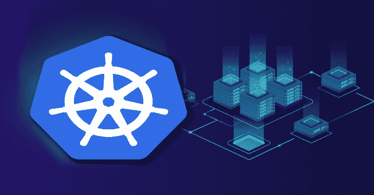
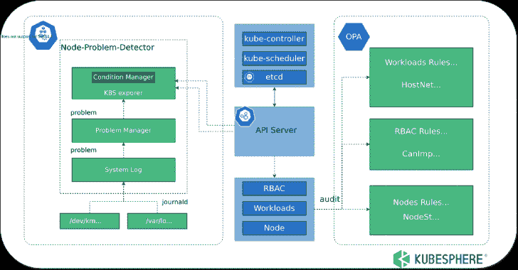

# kube eye:Kubernetes 的审计工具

> 原文：<https://kalilinuxtutorials.com/kubeeye/>

**KubeEye** 是 Kubernetes 的检查工具，用于发现 Kubernetes 资源(通过 OPA)、集群组件、集群节点(通过 Node-Problem-Detector)和其他配置是否符合最佳实践，并给出修改建议。

KubeEye 支持自定义检查规则和插件安装。通过 KubeEye 操作员，您可以通过网页上的图形显示来查看检查结果和修改建议。

## 建筑

KubeEye 通过 Kubernetes API 获取集群资源细节，通过检查规则和插件检查资源配置，并生成检查结果。详见架构。

## 如何使用

*   在你的机器上安装 KubeEye
    *   从发行版下载预构建的可执行文件。
    *   或者您可以从源代码构建(注意:make install 将在您的机器上的/usr/local/bin/中创建 kubeeye)。

**git 克隆 https://github.com/kubesphere/kubeeye.git
CD kubeeye
make installke**

*   [可选]安装节点问题检测器

注意:这将在您的集群上安装 npd，仅当您需要详细报告时才需要。

**kubeeye 安装新产品开发**

*   运行 KubeEye

注意:kubeeye 的结果按资源种类排序。

**kubeeye audit
KIND NAMESPACE NAME REASON LEVEL MESSAGE
节点 docker-desktop kubelet 没有足够的可用内存警告 kubelethasnosufficificent memory
节点 docker-desktop kubelet 没有足够的可用 PID 警告 KubeletHasDiskPressure】节点 docker-desktop kubelet 有磁盘压力警告 KubeletHasDiskPressure】部署默认 testkubeeye nopulimits
部署默认 testkubeeye noreadessprobe
部署默认 testkubeeye NotRunAsNonRoot 【T8
daemon set kube-system kube-proxy NoCPULimits
daemon set k ube-system kube-proxy NotRunAsNonRoot
事件 kube-system core DNS-558 BD 4d 5 db-c26j 8.16 D5 fa 3d df 56675 f 不健康警告就绪探测失败:获取“http://10.1.0.87:8181/ready”:拨打 TCP 10 . 1 . 0 . 87:8181:connect:connection 来自守护程序的错误响应:对控制器的拉访问被拒绝，存储库不存在或可能需要“docker 登录”:被拒绝:对资源的请求访问被拒绝
事件 kubeeye-system kubeeye-manager-controller-manager-7f 79 C4 cc c8-F2 njw . 16 D5 fa 3f 61 b 28527 失败警告错误:ImagePullBackOff
角色 kubeeye-system kubeeye-leader-election-Role candelete resources
cluster Role kubeeye-manager-Role candelete resources
cluster Role**

## KubeEye 能做什么

*   KubeEye 根据 Kubernetes 的最佳实践检查集群资源，以使集群稳定。
*   KubeEye 可以发现你的集群控制平面的问题，包括 kube-API server/kube-controller-manager/etcd 等。
*   KubeEye 帮助您检测各种集群节点问题，包括内存/CPU/磁盘压力、意外内核错误日志等。

## 清单

| 是/否 | 检查项目 | 描述 | 水平 |
| --- | --- | --- | --- |
| 981 号房 | 私人地理 | 允许权限提升 | 危险 |
| 981 号房 | 犬瘟热 | 角色/集群角色可以模拟其他用户 | 警告 |
| 981 号房 | CanModifyResources | 角色/集群角色可以删除 kubernetes 资源 | 警告 |
| 981 号房 | CanModifyWorkloads | 角色/集群角色可以修改 kubernetes 工作负载 | 警告 |
| 981 号房 | 没有限制 | 资源不设置容器中 CPU 的限制。资源 | 危险 |
| 981 号房 | NoCPURequests | 资源没有在容器中设置 CPU 请求。资源 | 危险 |
| 981 号房 | 高风险能力 | 在 ALL/SYS_ADMIN/NET_ADMIN 等功能中包含高风险选项 | 危险 |
| 981 号房 | HostIPCAllowed | HostIPC 设置为 true | 危险 |
| 981 号房 | 允许的主机网络 | 主机网络设置为真 | 危险 |
| 981 号房 | HostPIDAllowed | HostPID 设置为 true | 危险 |
| 981 号房 | 允许的主机端口 | 主机端口设置为真 | 危险 |
| 981 号房 | ImagePullPolicyNotAlways | 图像拉取策略并不总是 | 警告 |
| 981 号房 | imagetagislastest | 图像标签是最新的 | 警告 |
| 981 号房 | ImageTagMiss | 图像标签不声明 | 危险 |
| 981 号房 | 不安全能力 | 在 KILL/SYS_CHROOT/CHOWN 等功能中有不安全的选项 | 危险 |
| 981 号房 | 无效探针 | 资源未设置 livenessProbe | 警告 |
| 981 号房 | 命名记忆极限 | 资源不设置容器中的内存限制。资源 | 危险 |
| 981 号房 | 名词记忆请求 | 资源不在容器中设置内存请求。资源 | 危险 |
| 981 号房 | NoPriorityClassName | 资源未设置 priorityClassName | 忽视 |
| 981 号房 | 特权允许 | 以特权模式运行 pod 意味着 pod 可以访问主机的资源和内核功能 | 危险 |
| 981 号房 | NoReadinessProbe | 资源未设置 readinessProbe | 警告 |
| 981 号房 | NotReadOnlyRootFilesystem | 资源未将 readOnlyRootFilesystem 设置为 true | 警告 |
| 981 号房 | NotRunAsNonRoot | 资源未将 runAsNonRoot 设置为 true，可能以 Root 帐户身份运行 | 警告 |
| 981 号房 | 证书过期期限 | 证书到期日期少于 30 天 | 危险 |
| 981 号房 | 事件审计 | 事件审计 | 警告 |
| 981 号房 | 节点状态 | 节点状态审计 | 警告 |
| 981 号房 | 码头状态 | 码头工人状况审计 | 警告 |
| 981 号房 | KubeletStatus | 库伯莱状态审计 | 警告 |

## 添加您自己的检查规则

### 添加自定义 OPA 规则

*   为 OPA 规则创建目录

**mkdir opa**

*   添加自定义 OPA 规则文件

注意:工作负载的 OPA 规则，包名必须是 *kubeeye_workloads_rego* 对于 RBAC，包名必须是 *kubeeye_RBAC_rego* 对于节点，包名必须是 *kubeeye_nodes_rego*

*   将以下规则保存到规则文件，如 *imageRegistryRule.rego* ，以检查图像注册表地址是否符合规则。

**package kubeeye _ workloads _ rego
deny[msg]{
resource:= input
type:= resource。Object.kind
resourcename :=资源。object . metadata . name
resource namespace:=资源。object . metadata . namespace
workloadstype:= { " deployment "，" replicaset "，" DaemonSet "，" StatefulSet "，" job " }
workloadstype[type]
not workloadsimageregistryrule(resource)
msg:= {
" name ":sprintf(" % v "，[resourcename])，
"Namespace": sprintf("%v "，[resourcenamespace])，
"Type": sprintf("%v "，[type]),【t11+"，资源。object . spec . template . spec . containers[_]。图像)
}**

*   使用自定义规则运行 KubeEye

注意:指定路径，然后 Kubeeye 将读取目录中所有以*结尾的文件。rego* 。

**root:# kubeeye audit-p ./opa
命名空间名称种类消息
默认 nginx1 部署[ImageRegistryNotmyregistry notreadonlyroot file system NotRunAsNonRoot]
默认 nginx11 部署[ImageRegistryNotmyregistry privilegeescalallowed HighRiskCapabilities HostIPCAllowed HostPortAllowed ImagePullPolicyNotAlways imagetagislastinsecurecapabilities noprioritycyclassname privileged allowed notreadonlyroot]
默认**

## 库伯耶算子

### 什么是 KubeEye 算子

KubeEye 操作员是 Kubernetes 的检查平台，通过操作员管理 KubeEye 并生成检查结果。

### 【KubeEye 操作员能做什么

*   KubeEye 运营商通过网页提供管理功能。
*   KubeEye 操作员通过 CR 记录检查结果，可以通过网页查看和比较集群检查结果。
*   KubeEye 运营商提供更多插件。
*   KubeEye 操作员提供了更详细的修改建议。

### 部署 Kubeeye

**kube CTL apply-f https://raw . githubusercontent . com/kubesphere/kubeeye/main/deploy/kubeeye . YAML
kube CTL apply-f https://raw . githubusercontent . com/kubesphere/kubeeye/main/deploy/kubeeye _ insights . YAML**

## 得到检查结果

**apiVersion: v1
项:
API version:kubeeye.kubesphere.io/v1alpha1
种类:ClusterInsight
元数据:
名称:clusterinsight-sample
命名空间:默认
规格:
审计周期:24h
状态:
审计结果:
审计结果:
资源类型:节点
结果信息:
命名空间:“
资源信息:
项:
级别:警告【T18**

[**Download**](https://github.com/kubesphere/kubeeye#how-to-use)