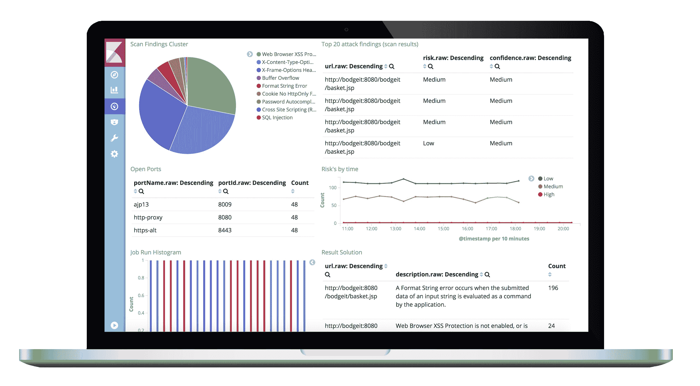
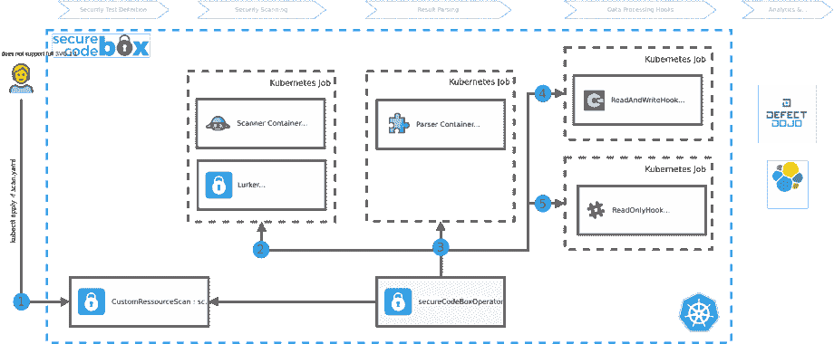

# SecureCodeBox:自动化一系列现成的安全测试工具

> 原文：<https://kalilinuxtutorials.com/securecodebox/>

secureCodeBox 是一个基于 kubernetes 的模块化工具链，用于对软件项目进行持续的安全扫描。它的目标是协调并轻松自动化一系列开箱即用的安全测试工具。

## 该项目的目的

确保应用程序安全性的典型方法是在项目的某个阶段雇佣一名安全专家(也称为渗透测试员)来检查应用程序的安全缺陷和漏洞。通常，这种检查在项目的后期进行，有两个主要缺点:

1.  如今，很多项目都是连续交付的，这意味着开发人员每天都要部署多次新版本。渗透测试人员只能检查单个快照，但是一些进一步的提交可能会引入新的安全问题。为了确保持续的应用程序安全性，渗透测试人员还应该持续测试应用程序。不幸的是，这种方法在经济上很少可行。
2.  由于典型的时间框分析，渗透测试人员不得不关注琐碎的安全问题(低挂水果)，因此可能不会解决严重的、不明显的问题。

借助 *secureCodeBox* ,我们提供了一个工具链，用于持续扫描应用程序，以便在开发过程的早期发现容易发现的问题，并释放渗透测试人员的资源，专注于主要的安全问题。

*secureCodeBox* **的目的不是**取代渗透测试仪或使其过时。我们强烈建议由经验丰富的渗透测试人员对您的所有应用程序进行广泛的测试。

**重要提示**:*安全密码箱*不是简单的一键点击解决方案！您必须对安全性以及如何配置扫描仪有深刻的理解。此外，理解扫描结果以及如何解释它们也是必要的。

在软件工程杂志 OBJEKTSpektrum 上有一篇关于安全开发的德国文章。

## 架构概述

## 升级

### 已将 Kubebuilder 版本升级到 v3

CRD 现在使用的是`**apiextensions.k8s.io/v1**`而不是`**apiextensions.k8s.io/v1beta1**`，这要求 Kubernetes 版本至少为 1.16 或更高。操作员现在使用新的 kubebuilder v3 命令行标志来启用领导者选举和设置度量端口。如果您在部署中使用的是官方的 secureCodeBox 舵轮图表，则该图表会自动更新。

如果您正在使用自定义部署，您必须将 **`--enable-leader-election`** 标志更改为`**--leader-elect**`并将`**--metrics-addr**`更改为`**--metrics-bind-address**`。有关更多上下文，请参见:https://book . kube builder . io/migration/v2 vs v3 . html # tldr-of-the-new-gov 3-plugin

### 重新构建了 secureCodeBox HelmCharts，以在 HelmChart 值中引入更多一致性

钩子和扫描器的 secureCodeBox HelmCharts 遵循所有 HelmChart 值的新结构:

代替 secureCodebox 版本 2 的示例:

**image:
image.repository —运行扫描的容器图像
repository:owasp/zap 2 docker-stable
Image . tag—默认为图表 appVersion
标记:null
parse rimage:
parse rimage . repository—解析器图像存储库
repository:docker.io/securecodebox/parser-zap
parse rimage . tag—解析器图像标记
@default —默认为图表版本
标记:null
parse job:
parse job . ttsecondsafterf 需要 Kubernetes TTLAfterFinished 控制器:https://Kubernetes . io/docs/concepts/workloads/controllers/TTLAfterFinished/
ttlssecondsafterfinished:null
scannerJob:
scannerJob . ttlssecondsafterfinished—秒后将删除扫描仪的 Kubernetes 作业。需要 Kubernetes TTLAfterFinished 控制器:https://Kubernetes . io/docs/concepts/workloads/controllers/TTLAfterFinished/
ttlssecondsafterfinished:null
scannerjob . back offlimit—有些情况下，由于配置中的逻辑错误等原因，在重试一定次数后，您希望扫描作业失败。为此，请设置 backoffLimit 以指定将扫描作业视为失败之前的重试次数。(参见:https://kubernetes . io/docs/concepts/workloads/controllers/job/# pod-back off-failure-policy)
@ default-3
back off limit:3**

### 向图表值添加了 scanner.appendName

使用{{ .Release.name }}作为 **`scanTypes`** 的`**nmap**` HelmChart 名称会导致在将此图表用作另一图表的依赖项时出现问题。所有扫描仪 HelmChart 都已经为它们引入的`**scanType**`使用了一个固定的名称，只有一个例外:扫描仪 helm chart。

最初引入 nmap 异常是为了让您自己配置一个`**nmap-privilidged**`扫描类型成为可能，该扫描类型能够运行需要一些更高权限的操作系统扫描:https://www . secure codebox . io/docs/scanners/nmap # operating-system-scans

这种扩展扫描类型名称的想法现在出现在第 3 版 general 中，适用于所有的 HelmCharts。

解决方案是添加一个新的 HelmChart 值`**scanner.appendName**`,为已经定义的 scanType 名称添加一个后缀。例如:ZAP 扫描仪的`**scanner.nameAppend: -privileged**`将创建**、`zap-api-scan-privileged`、`zap-full-scan-privileged`、**作为新的扫描类型，而不是**、`zap-api-scan`、`zap-full-scan`。**

### 将演示应用重命名为演示目标

提供的易受攻击的演示从`**demo-apps**`重命名为`**demo-targets**`，这包括 helmcharts 的名称空间和文件夹。

### 将钩子子程声明性后续扫描重命名为级联扫描

负责级联扫描的钩子从`**declarative-subsequent-scans**`重命名为`**cascading-scans**`。

### 修复了 Docker 映像/存储库中的名称一致性

对于扫描仪和解析器的 docker 图像，我们已经有了以`**scanner-**`或`**parser-**`作为这些图像前缀的命名约定。

然而钩子图像的命名并不一致(有些以`**hook**-`为前缀，有些没有前缀)。为了引入更多的一致性，我们重命名了所有的钩子图像，并像我们对解析器和扫描器图像所做的那样给它们加上前缀`**hook-**`。

如果您在自己的 HelmCharts 或自定义实现中引用了我们的一些 hook 图像，请注意这一点。

### 改名`lurcher`为`lurker`

在 3.0 版本中，我们纠正了`**lurcher**`中的拼写错误。要在升级后删除剩余部分，请从您过去执行扫描的命名空间中删除旧的服务帐户和角色:

**找到相关的名称空间
ku bectl get service accounts–all-namespaces | grep lurcher
删除特定名称空间的角色、角色绑定和服务帐户
ku bectl–namespace Delete service account lurcher
ku bectl–namespace Delete role bindings lurcher
ku bectl–namespace Delete role lurcher**

### 移除挂钩团队网页挂钩

我们实现了一个更通用的*通知挂钩*，它可以用来通知不同的系统，如 *MS 团队*和 *Slack* 以及基于自定义消息模板的更加灵活的电子邮件。有了这个新挂钩，就没有必要再维护先前存在的 MS Teams 挂钩了，因此我们移除了它。

[**Download**](https://github.com/secureCodeBox/secureCodeBox#architecture-overview)