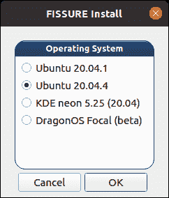

# 裂缝:基于频率无关软件无线电的信号理解和逆向工程

> 原文：<https://kalilinuxtutorials.com/fissure/>

.png)

**裂隙**是一个开源的 RF 和逆向工程框架，设计用于所有技能水平，挂钩信号检测和分类、协议发现、攻击执行、智商操纵、漏洞分析、自动化和 AI/ML。该框架旨在促进软件模块、无线电、协议、信号数据、脚本、流程图、参考资料和第三方工具的快速集成。裂隙是一个工作流使能器，它将软件保持在一个位置，并允许团队毫不费力地达到速度，同时为特定的 Linux 发行版共享相同的经验证的基线配置。

裂隙中包含的框架和工具旨在检测射频能量的存在，了解信号的特征，收集和分析样本，开发传输和/或注入技术，以及制作定制的有效载荷或消息。裂隙包含一个不断增长的协议和信号信息库，以帮助识别，数据包制作和模糊。在线存档功能可以下载信号文件，并建立播放列表来模拟交通和测试系统。

友好的 Python 代码库和用户界面允许初学者快速了解涉及 RF 和逆向工程的流行工具和技术。网络安全和工程领域的教育工作者可以利用内置材料或利用框架来展示他们自己的真实应用。开发人员和研究人员可以使用裂隙进行日常工作，或者向更广泛的受众展示他们的尖端解决方案。随着社区中对裂隙的认识和使用的增长，它的能力范围和它所包含的技术的广度也将增长。

## 开始使用

**支持的**

裂隙中有三个分支，使文件导航更容易，减少代码冗余。Python2_maint-3.7 分支包含围绕 Python2、PyQt4 和 GNU Radio 3.7 构建的代码库；Python3_maint-3.8 分支围绕 Python3、PyQt5、GNU Radio 3.8 构建；而 Python3_maint-3.10 分支是围绕 Python3、PyQt5 和 GNU Radio 3.10 构建的。

| 操作系统 | 裂隙分支 |
| --- | --- |
| Ubuntu 18.04 (x64) | Python2_maint-3.7 |
| Ubuntu 18.04.5 (x64) | Python2_maint-3.7 |
| Ubuntu 18.04.6 (x64) | Python2_maint-3.7 |
| Ubuntu 20.04.1 (x64) | Python3_maint-3.8 |
| Ubuntu 20.04.4 (x64) | Python3_maint-3.8 |
| KDE 霓虹灯 5.25 (x64) | Python3_maint-3.8 |

**进行中(测试版)**

这些操作系统仍处于测试阶段。它们正在开发中，已知有几个功能缺失。安装程序中的项目可能会与现有程序冲突，或者在状态被移除之前无法安装。

| 操作系统 | 裂隙分支 |
| --- | --- |
| DragonOS Focal (x86_64) | Python3_maint-3.8 |
| Ubuntu 22.04 (x64) | Python3_maint-3.10 |

注:某些软件工具并不适用于每种操作系统。参考软件和冲突

**安装**

**git 克隆 https://github.com/ainfosec/FISSURE.git
CD 裂缝
git 检验或
git 子模块更新–初始化
。/安装**

如果没有找到，这将安装启动安装 GUI 所需的 PyQt 软件依赖项。

接下来，选择与您的操作系统最匹配的选项(如果您的操作系统匹配某个选项，将会自动检测到该选项)。

建议在干净的操作系统上安装裂隙，避免存在冲突。选择所有推荐的复选框(默认按钮)以避免在裂隙中操作各种工具时出错。在整个安装过程中会有多个提示，主要是询问提升的权限和用户名。如果项目末尾包含“验证”部分，安装程序将运行随后的命令，并根据该命令是否产生任何错误，以绿色或红色突出显示复选框项目。没有“验证”部分的选中项目在安装后将保持黑色。

**用途**

打开终端并输入:

**裂缝**

## 细节

**组件**

*   仪表盘
*   中央枢纽(HIPRFISR)
*   目标信号识别
*   协议发现
*   流程图和脚本执行程序(FGE)

**硬件**

以下是具有不同集成度的“受支持”硬件列表:

*   USRP: X300 系列，B210，B210 迷你
*   HackRF
*   RTL2832U
*   802.11 适配器
*   LimeSDR
*   bladeRF
*   打开嗅探器
*   PlutoSDR

[**Download**](https://github.com/ainfosec/FISSURE)