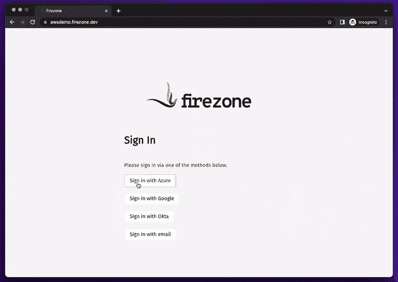
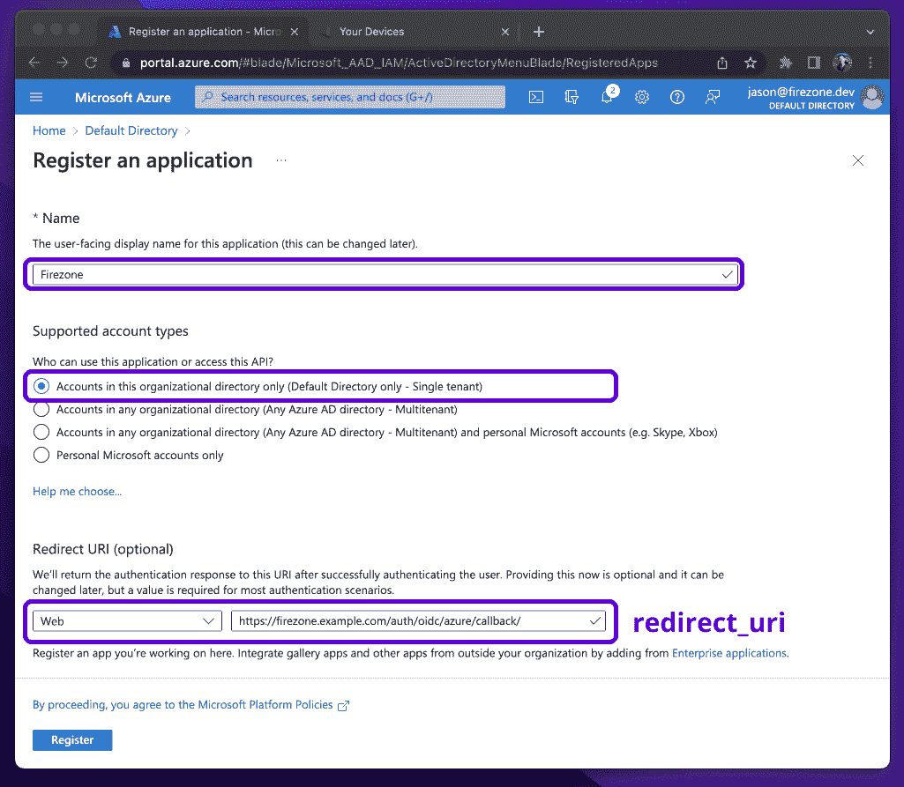
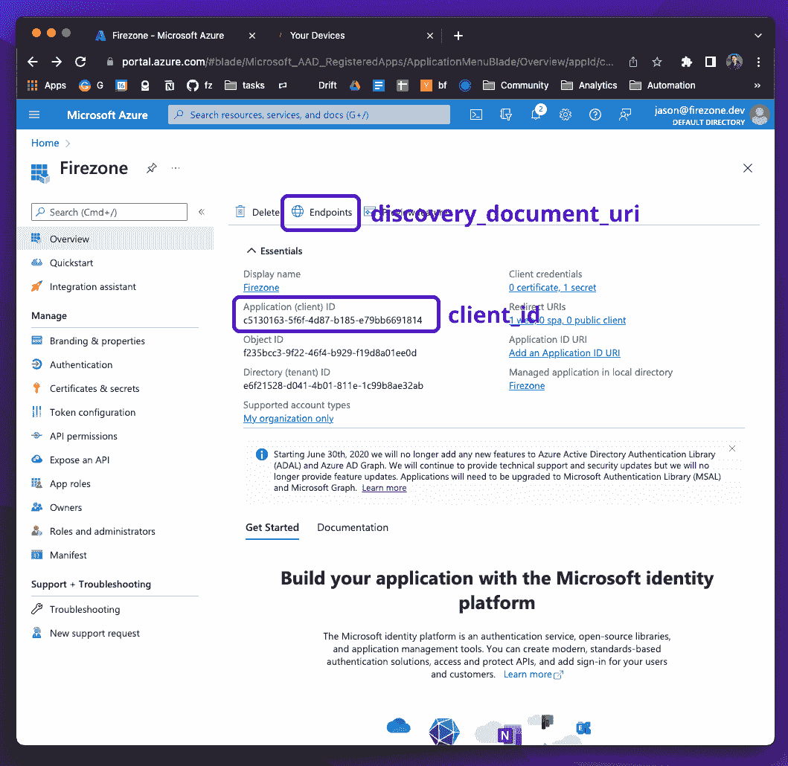
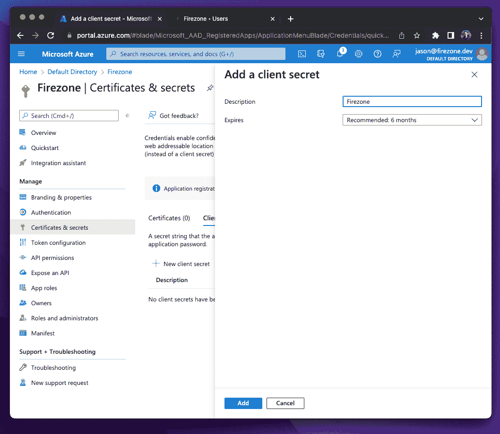
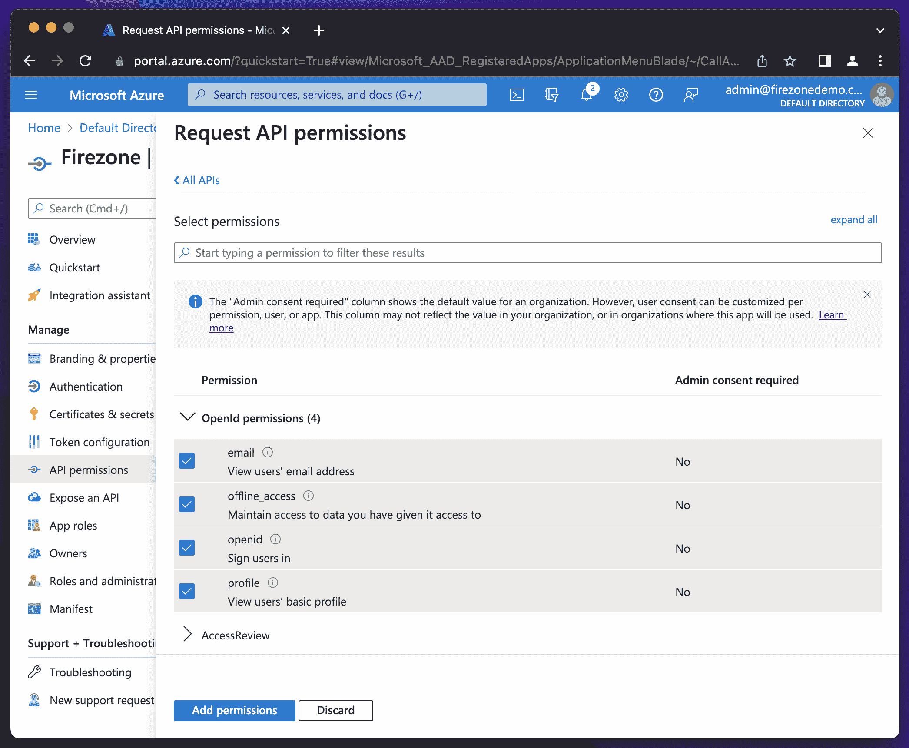

# Firezone:基于 WireGuard 的 VPN 服务器和防火墙

> 原文：<https://kalilinuxtutorials.com/firezone/>

.png)

## Firezone 是一个自托管的 VPN 服务器和 Linux 防火墙

*   通过直观的 web 界面和 CLI 实用程序管理远程访问。
*   部署在您自己的基础架构上，以保持对网络流量的控制。
*   基于 WireGuard 构建，稳定、高性能、重量轻。

## 开始

按照我们的部署指南安装您的 Firezone 自托管实例。

或者，如果您在受支持的平台上，请尝试我们的一行安装脚本:

**sudo-E bash-c " $(curl-fsSL https://github . com/fire zone/fire zone/raw/master/scripts/install . sh)"**

## 特征

*   **快:**使用 WireGuard 比 OpenVPN 快 3-4 倍。
*   **SSO 集成:**使用任何具有 OpenID Connect (OIDC)连接器的身份提供者进行身份验证。
*   **没有依赖关系:**所有的依赖关系都是捆绑在一起的，这要感谢 Chef Omnibus。
*   **简单:**设置只需几分钟。通过简单的 CLI 进行管理。
*   **安全:**无特权运行。HTTPS 强制执行。加密的 cookies。
*   **包含防火墙:**使用 Linux nftables 来阻止不需要的出口流量。

### 反功能

火区是**不是:**

*   入站防火墙
*   创建网状网络的工具
*   功能齐全的路由器
*   IPSec 或 OpenVPN 服务器

# 部署

### 通过在受支持的平台上自行托管，在几分钟内开始使用 Firezone

Firezone 可以在运行受支持的 Linux 发行版的服务器上自行托管，只需几分钟。本指南将引导您完成入门步骤。

## 第一步:环境设置

### 支持的操作系统

首先检查您的环境是否列在支持的平台上。可能需要进行内核升级，以确保 WireGuard 可用。

### 安全设置

确保在您的防火墙上启用了端口转发。默认 Firezone 配置要求打开以下端口:

*   `**443/tcp**`:访问网络用户界面。
*   `**51820/udp**`:VPN 流量监听端口。

注意

Firezone 修改内核 netfilter 和路由表。修改 Linux 路由表或防火墙的其他程序可能会干扰 Firezone 的操作。有关解决连接问题的帮助，请参阅《故障排除指南》。

### 生产部署

Firezone 要求为生产部署设置 DNS 记录和匹配的 SSL 证书。请参见此处的说明。

## 步骤 2:服务器安装脚本

开始使用 Firezone 最简单的方法是通过下面的自动安装脚本。

**sudo-E bash-c " $(curl-fsSL https://github . com/fire zone/fire zone/raw/master/scripts/install . sh)"**

这将询问您几个关于安装的问题，为您的平台安装最新版本，然后创建一个管理员用户，并将登录 web UI 的说明打印到控制台。

默认情况下，可以通过服务器的 IP 或域名访问 web UI。您可以使用`**firezone-ctl create-or-reset-admin**`命令重新生成管理员凭证。

如果脚本失败，请按照说明进行手动安装。

## 第三步:安装客户端应用

成功部署后，可以添加用户和设备以连接到 VPN 服务器:

*   添加用户:添加用户以授权他们访问您的网络。
*   客户端指令:建立 VPN 会话的指令。

## 设置[后](https://docs.firezone.dev/deploy#after-setup)

恭喜你。您已经完成了设置，但是您还可以对 Firezone 做更多的事情。

*   集成您的身份提供者以验证客户端
*   使用 Firezone 建立静态 IP
*   使用反向隧道在多个对等体之间创建隧道
*   使用分割隧道仅通过 Firezone 路由特定流量

通过以下方式支持我们:

*   在 Github 上开始我们的回购
*   在 Twitter 上关注我们，地址是@firezonehq
*   请在 LinkedIn @ fire zone HQ 上关注我们

# 支持的平台

Firezone 目前支持以下平台:

| 操作系统（Operating System） | 体系结构 | 状态 | 笔记 |
| --- | --- | --- | --- |
| 亚马逊 Linux 2 | **T0`arm64`** | **完全支持** | 参见 AmazonLinux 2 注释 |
| CentOS 7 | `**amd64**` | **完全支持** | 参见 CentOS 7 注释 |
| CentOS 8 | **T0`arm64`** | **完全支持** | 参见 CentOS 8 注释 |
| CentOS 流 9 | **T0`arm64`** | **完全支持** | 按原样工作 |
| 红帽企业版 Linux 7 | `**amd64**` | **完全支持** | 参见 RHEL 7 的注释 |
| 红帽企业版 Linux 8 | **T0`arm64`** | **完全支持** | 参见 RHEL 8 的注释 |
| 红帽企业版 Linux 9 | **T0`arm64`** | **完全支持** | 参见 RHEL 9 的注释 |
| Debian 10 | **T0`arm64`** | **完全支持** | 参见 Debian 10 笔记 |
| Debian 11 | **T0`arm64`** | **完全支持** | 按原样工作 |
| Fedora 33 | **T0`arm64`** | **完全支持** | 参见 Fedora 笔记 |
| Fedora 34 | **T0`arm64`** | **完全支持** | 参见 Fedora 笔记 |
| Fedora 35 | **T0`arm64`** | **完全支持** | 参见 Fedora 笔记 |
| Ubuntu 18.04 | `a`**`md64``arm64`** | **完全支持** | 参见 Ubuntu 18.04 注释 |
| Ubuntu 20.04 | **T0`arm64`** | **完全支持** | 按原样工作 |
| Ubuntu 22.04 | **T0`arm64`** | **完全支持** | 按原样工作 |
| openSUSE Leap 15.3 | `**amd64**` | **完全支持** | 参见 openSUSE 注释 |

如果您的发行版没有在这里列出，请先尝试使用最近发行版的软件包。比如，既然树莓 Pi OS 是基于 Debian 的，那就试试用 Debian Firezone 包吧。

如果这不起作用，请打开一个问题，让我们知道。新的发行版会定期得到支持，很有可能你的发行版会很快被添加进来。

注意，我们只支持基于 RPM 和 DEB 的打包系统。其他的，比如 Arch Linux，目前正在这个问题上进行研究。

## AmazonLinux 2 笔记

需要内核升级:

**sudo Amazon-Linux-extras install-y kernel-5.10**

## 七分音符

需要将内核升级到 5.6 以上。要升级到最新的主线内核并选择它作为默认引导内核:

**sudo rpm–import https://www.elrepo.org/RPM-GPG-KEY-elrepo.org
sudo yum install-y https://www . El repo . org/El repo-release-7 . El 7 . El repo . no arch . rpm
sudo yum install-y El repo-release
sudo yum–enable repo = El repo-kernel install-y kernel-ml
sudo grub 2-set-default 0
sudo grub 2-mkconfig-o/boot/grub 2/grub . CFG
sudo reboot**

## 八分音符

需要安装 WireGuard 内核模块:

**yum install El repo-release epel-release
yum install kmod-wire guard**

## RHEL 7 笔记

Red Hat Enterprise Linux 与 CentOS 是二进制兼容的，因此 CentOS 7 的 Firezone 包应该可以很好地适用于 RHEL 7。然而，你仍然需要将你的内核升级到 5.6 以上。为此，请遵循上述 CentOS 7 注释的步骤。

## RHEL 8 笔记

Red Hat Enterprise Linux 与 CentOS 是二进制兼容的，因此 CentOS 8 的 Firezone 包应该可以很好地适用于 RHEL 8。然而，您仍然需要安装 WireGuard 内核模块。见上文 CentOS 8 注释。

## RHEL 9 笔记

使用 CentOS 9 的软件包。

## Fedora 音符

在新安装的 Fedora 上，您可能需要安装一个 cron 实现来支持 logrotate 功能，否则您可能会收到关于缺少`**/etc/cron.hourly**`目录的错误。

yum 安装 cronie-anacron

## Ubuntu 18.04 注释

需要将内核升级到 5.4 以上:

**sudo 安装 Linux-image-generic-hwe-18.04**

## Debian 10 笔记

需要将内核升级到 5.6 以上。有关示例，请参见本指南。

## openSUSE 笔记

Firezone 需要`**setcap**`实用程序，但是一些最近的 openSUSE 版本可能没有默认安装它。要进行修复，请确保安装了`**libcap-progs**`:

sudo zypper 安装 libcap-progs

# 先决条件

Firezone 要求为生产部署设置 DNS 记录和匹配的 SSL 证书。

## 创建一个 DNS 记录

Firezone 需要完全合格的域名(例如`**firezone.company.com**`)才能用于生产。为此，您需要在您的注册服务商处创建适当的 DNS 记录。根据您的要求，这通常是 A、CNAME 或 AAAA 记录。

## 创建 SSL 证书

虽然 Firezone 会在安装时为您生成一个自签名 SSL 证书，但您需要一个有效的 SSL 证书才能在生产环境中使用 Firezone。

我们建议使用 Let's Encrypt 为您的域生成一个免费的 SSL 证书。从 Firezone 0.5.0 开始，您可以选择自动配置让我们使用 ACME 协议为您的实例加密 SSL 证书。默认情况下，这是禁用的，以保持现有安装的向后兼容性。

为此，您必须确保满足以下条件:

*   `**80/tcp**`是否允许入站
*   捆绑的 Firezone `**nginx**`服务已启用并正常运行
*   您拥有分配给此实例的公共 IP 的有效 DNS 记录
*   以下 3 个设置在配置文件中进行配置:
    *   `**default['firezone']['external_url'**]`:服务器的 FQDN。
    *   `**default['firezone']['ssl']['email_address']**`:将用于已颁发证书的电子邮件。
    *   `**default['firezone']['ssl']['acme']['enabled']**`:设置为 true 以启用它。

## 安全组和防火墙设置

默认情况下，Firezone 要求端口`**443/tcp**`和`**51820/udp**`分别可供 HTTPS 和 WireGuard 流量访问。这些端口可以根据您在配置文件中的配置而改变。有关详细信息，请参见配置文件参考。

## 资源需求

我们建议**从 1 个 vCPU 和 1gb RAM 开始，随着用户和设备数量的增加而扩展**。

对于内存小于 1GB 的服务器上的基于 Omnibus 的部署，我们建议打开交换以防止 Linux 内核意外地杀死 Firezone 进程。当这种情况发生时，通常很难调试，并导致奇怪的、不可预测的故障模式。

对于 VPN 隧道本身，Firezone 使用了内核 WireGuard，所以它的性能应该非常好。1 个 vCPU 应该足以使 1 Gbps 的网络链路饱和。

# 安装服务器

**重要提示**:在遵循本指南之前，请确保您已经满足了先决条件。

## 安装说明

假设您正在一个受支持的平台上运行受支持的 Linux 内核，请使用下面的方法之一开始:

### 自动安装

开始使用 Firezone 最简单的方法是通过自动安装脚本:

**sudo-E bash-c " $(curl-fsSL https://github . com/fire zone/fire zone/raw/master/scripts/install . sh)"**

这将询问您几个关于安装的问题，为您的平台安装最新版本，然后创建一个管理员用户，并将登录 web UI 的说明打印到控制台。

### 从我们的 Debian 或 RedHat 库安装

如果自动安装脚本失败，请尝试这些步骤从我们的 Cloudsmith 存储库中安装 Firezone。

*   为您的发行版安装 WireGuard。如果使用 Linux 内核 5.6 或更高版本，请跳过这一步。
*   为您的发行版的软件包格式安装我们的软件包库:
    *   deb 包:

**curl-1 SLF \
' https://dl . cloud Smith . io/public/fire zone/fire zone/setup . deb . sh ' \
| sudo-E bash**

如果脚本无法设置 repo，请参阅 Debian 设置文档以了解更多选项。

*   rpm 包:

**curl-1 SLF \
' https://dl . cloud Smith . io/public/fire zone/fire zone/setup . rpm . sh ' \
| sudo-E bash**

*   如果脚本无法设置 repo，请参阅 RedHat setup 文档了解更多选项。
*   用发行版的软件包管理器安装 Firezone:

**使用 apt
sudo apt 安装 firezone
使用 dnf
sudo dnf 安装 firezone
使用 yum
sudo yum 安装 firezone
使用 zypper
sudo zypper 安装 firezone**

*   按照引导说明设置 Firezone。

### 手动安装

如果其他方法都失败了，请尝试这些步骤来手动安装 Firezone。

*   为您的发行版安装 WireGuard。如果使用 Linux 内核 5.6 或更高版本，请跳过这一步。
*   从发布页面下载相关的发行包。
*   根据您的发行版安装`**sudo rpm -i firezone*.rpm**`或 **`sudo dpkg -i firezone*.deb`** 。
*   按照引导说明设置 Firezone。

### 自举火区

*   用`**sudo firezone-ctl reconfigure**`引导应用程序。这将初始化配置文件，设置所需的服务并生成默认配置。
*   编辑位于`**/etc/firezone/firezone.rb**`的默认配置。我们选择了合理的默认值，这应该是大多数安装的良好起点。对于生产安装，您需要指定一个有效的外部 URL，并启用 ACME 进行证书颁发和续订:

*   有关更多详细信息，请参见完整的配置文件参考。
*   重新配置应用程序以获得新的更改: **`sudo firezone-ctl reconfigure`。**
*   最后，用`**sudo firezone-ctl create-or-reset-admin**`创建一个管理员用户。登录凭证将被打印到控制台输出中。
*   现在，您应该能够通过您在上面步骤 5 中指定的 URL 登录到 web UI，例如`**https://firezone.example.com**`

## 自定义反向代理

## 简介

Firezone 附带了一个捆绑的 Nginx 反向代理，但是，在某些情况下，您可能想要部署自己的服务器，例如在您自己的负载平衡器后面使用时。

## 先决条件

下面你会发现使用自定义反向代理设置 Firezone 的要求。

### 防火区配置要求

*   通过在配置文件中将`**default['firezone']['nginx']['enabled']**`设置为`**false**`来禁用捆绑的 Nginx。
*   如果您的主要反向代理和 Firezone web 应用程序之间有任何直接代理，请将其 IP 添加到`**default['firezone']['phoenix']['external_trusted_proxies']**`。由于 X-Forwarded-For 头的工作方式，这是解析实际客户端的 IP 地址以防止 IP 欺骗所必需的。

### 代理要求

*   所有的代理都需要配置`**X-Forwarded-For**`头，如下所述
*   您的代理还应该将`**X-Forwarded-Proto**`设置为`**https**`。
*   您的代理(或另一个下游代理)**必须**终止 SSL，因为我们实施安全 cookies。
*   Firezone 需要使用 WebSockets 来建立实时连接。我们建议遵循您的代理的特定文档来支持 WebSockets，因为每个代理各不相同。通常，您的代理需要能够代理 HTTP 1.1 连接，Firezone web 应用希望设置以下标头:
    *   `**Connection: upgrade**`
    *   `**Upgrade: websocket**`

## 安全注意事项

除了上面的标头，出于安全目的，我们建议添加以下标头:

*   **T2`X-XSS-Protection: 1; mode=block`**
*   **T2`X-Content-Type-Options nosniff`**
*   **T2`Referrer-Policy no-referrer-when-downgrade`**
*   **T2`Content-Security-Policy: default-src 'self' ws: wss: http: https: data: blob: 'unsafe-inline'; frame-ancestors 'self';`**
*   **T2`Permissions-Policy: interest-cohort=()`**

由于上游 Firezone web 应用程序需要普通的 HTTP 流量，代理转发的任何请求都是通过 HTTP 发送的，因此**没有加密**。在大多数情况下，反向代理安装在受信任的网络中，这不是问题。但是您的可信代理和 Firezone web 应用程序之间的连接跨越了一个不可信的网络(如互联网)，您可能希望让捆绑的`**nginx**`代理启用 SSL 终止，并设置您的自定义反向代理来代理该代理。

## 示例配置

*   街头流氓
*   Traefik
*   HAProxy

这些配置写得尽可能简单。它们被设计成一个简单的模板，您可以根据自己的需要进一步定制。

如果您有一个不同的反向代理或现有代理的不同版本的工作配置，我们感谢任何为社区扩展示例的贡献。

# 街头流氓

下面是有和没有 SSL 终端的 apache 配置示例。

他们希望 apache 和 Firezone 运行在同一个主机上，而`**default['firezone']['phoenix']['port']**`是`**13000**`。

## 无 SSL 终止

由于 Firezone 要求 web 门户使用 HTTPS，请记住，在这种情况下，下游代理需要终止 SSL 连接。

`**<server-name>**`需要替换为您的域名。

该配置需要放在`**/etc/sites-available/<server-name>.conf**`中

并用`**a2ensite <server-name>**`激活

**load module rewrite _ module/usr/lib/Apache 2/modules/mod _ rewrite . so
load module proxy _ module/usr/lib/Apache 2/modules/module proxy _ http _ module/usr/lib/Apache 2/modules/usr/lib/Apache 2/modules/mod _ proxy _ ws tunnel . so
servername proxy passreverse "/" http(.*) "ws://127.0.0.1:13000/$1" [P，L]**

## 带 SSL 终端[的](https://docs.firezone.dev/deploy/reverse-proxies/apache#with-ssl-termination)

这种配置建立在上述配置的基础上，并使用 Firezone 自动生成的自签名证书。

**load module rewrite _ module/usr/lib/Apache 2/modules/mod _ rewrite . so
load module proxy _ module/usr/lib/Apache 2/modules/module proxy _ http _ module/usr/lib/Apache 2/modules/usr/lib/Apache 2/modules/modules _ proxy _ ws tunnel . so
load module SSL _ module/usr/lib(.*) "ws://127.0.0.1:13000/$1" [P，L]sslengene On SSL certificate file "/var/opt/firezone/SSL/ca/acme-test . firez . one . CRT " SSL certificate key file "/var/opt/firezone/SSL/ca/acme-test . firez . one . key "**

# Traefik

以下是将 Traefik 代理配置为 Firezone 反向代理的示例。

在这些示例中，我们假设 Traefik 使用 Docker 部署在与 Firezone 相同的主机上。要做到这一点，你需要确保 Firezone 的 phoenix 应用程序绑定到 Docker 接口地址上的端口`**13000**`，并且`**external_trusted_proxies**`设置正确:

## 无 SSL 终止

由于 Firezone 要求 web 门户使用 HTTPS，请记住，在这种情况下，下游代理需要终止 SSL 连接。

使用以下 **`docker-compose.yml`** 和`**rules.yml**`文件配置 Traefik:

### `docker-compose.yml`

**版本:' 3'
服务:
反向代理:
#network_mode: "host"
#官方 v2 Traefik Docker image
image:Traefik:v 2.8
#启用 web UI 并告知 Traefik 监听 docker
命令:
––providers . Docker "
––providers . file . filename = rules . yml "
––entry points . web . address =:80 "/rules.yml:/rules.yml"**

`**rules.ym**l`

**http: 【T2:】路由器:
测试:
入口点:
–“web”
服务:测试
规则:“主机(`44.200.42.78`)”
服务:
测试:
负载均衡器:
服务器:
–URL:“http://Host . docker . internal:13000”**

现在您应该能够使用 **`docker compose up`启动 Traefik 代理了。**

## 带 SSL 终端[的](https://docs.firezone.dev/deploy/reverse-proxies/traefik#with-ssl-termination)

此配置使用 Firezone 自动生成的自签名证书。

### **SSL `docker-compose.yml`**

**服务:
反向代理:
#network_mode: "host"
#官方 v2 Traefik docker 镜像
镜像:traefik:v2.8
#启用 web UI，告诉 Traefik 监听 docker
命令:
–"--providers . Docker "
–"--providers . file . filename = rules . yml "
–"--entry points . web . address =:443 "
–"-"/rules . yml:/rules . yml "
–/var/opt/fire zone/SSL/ca:/SSL:ro**

# HAProxy

以下是 HAProxy 代理的反向代理配置示例。我们假设`**default['firezone']['phoenix']['port']**`是`**13000**`，代理运行在与 Firezone 应用相同的主机上。

由于 Firezone 要求 web 门户使用 HTTPS，请记住，在这种情况下，下游代理需要终止 SSL 连接。

您还可以配置 HAProxy 来处理这里解释的 SSL 终止，但是要考虑到`**ssl crt**`选项期望的`**pem**`文件需要包含`**crt**`和`**key**`文件。

# 鉴定

可以将 Firezone 配置为要求用户在生成或下载设备配置文件之前进行鉴定。可选地，还可以要求用户定期重新认证，以维护他们的 VPN 会话。

Firezone 支持以下身份验证方法:

*   本地邮箱/密码:默认启用。基于时间的一次性密码(TOTP)可以选择配置为添加额外的身份验证因素。
*   单点登录(SSO):允许用户使用 Okta、Google、Azure AD 或任何支持 OpenID Connect (OIDC)协议的服务中的凭证登录。

## 集成一个单点登录提供者

我们包含了如何使用几个流行的身份提供商设置 Firezone 的说明:

*   天空的八分之一
*   Azure 活动目录
*   谷歌
*   Onelogin

如果您的身份提供商未在上面列出，但具有通用 OIDC 连接器，请参考其文档，以找到有关获取所需配置设置的说明。关于使用通用 OIDC 提供程序设置 Firezone 的说明可以在这里找到。

打开 Github 问题以请求文档或提交 pull 请求来为您的提供商添加文档。如果您在设置 OIDC 提供商时需要帮助，请加入 Firezone Slack 组。

### OIDC 重定向网址

为每个 OIDC 提供者创建一个相应的 URL，用于重定向到已配置的提供者的登录 URL。URL 格式是`**https://firezone.example.com/auth/oidc/PROVIDER**`，其中`**PROVIDER**`是特定提供者的 OIDC 键。

例如，下面的 OIDC 配置

**默认[' fire zone '][' authentic '][' oidc ']= {
Google:{
#…
}，
okta: {
# …
}**

会生成以下 URL:

*   **T2`https://firezone.example.com/auth/oidc/google`**
*   **T2`https://firezone.example.com/auth/oidc/okta`**

然后，管理员可以将这些 URL 直接分发给最终用户，让他们导航到相应的身份提供商登录页面，以通过 Firezone 的身份验证。

## 强制定期重新认证

通过更改`**settings/security**`中的设置，可以强制执行定期重新认证。这可用于确保用户必须定期登录 Firezone，以维持其 VPN 会话。

您可以将会话长度设置为最短 **1 小时**，最长 **90 天**。将此项设置为“从不”会禁用此设置，从而无限期地允许 VPN 会话。这是默认值。

### 重新认证

要重新验证过期的 VPN 会话，用户需要关闭他们的 VPN 会话并登录到 Firezone 门户(在部署期间指定的 URL)。

请在此查看有关如何重新验证您的会话的详细客户端说明。

#### VPN 连接状态

用户的连接状态显示在用户页面的表格列`**VPN Connection**`下。连接状态包括:

*   启用–连接已启用。
*   禁用–管理员或 OIDC 刷新失败导致连接禁用。
*   过期–由于身份验证过期或用户首次未登录，连接被禁用。

# 本地认证

默认情况下，Firezone 将使用本地电子邮件/密码向 Firezone 门户验证用户。管理员可以在`**/users**`页面添加用户并分配密码。

# 多因素认证

可以通过 Firezone 直接添加多因素身份认证(MFA ),或者通过您的身份提供商直接添加附加因素。

## 带 Firezone 的 MFA

Firezone 目前支持使用基于时间的一次性密码(TOTP)作为附加因素。只有本地身份验证方法支持这一点；对于 SSO 身份验证，我们建议启用您的提供商的 MFA 功能，如下所述。

管理员可以访问管理门户中的`**/settings/account/register_mfa**`，生成二维码，供您的验证器应用程序扫描。

无权限用户登录用户门户后可以访问`**/user_account/register_mfa**`。

## 具有身份提供者的 MFA

除了电子邮件/密码之外，大多数身份提供商还支持其他身份认证因素。请查阅您的提供商的文档以强制执行附加因素。我们在下面提供了一些常见提供商的链接:

*   天空的八分之一
*   蓝色广告
*   谷歌
*   Onelogin

# 天空的八分之一

Firezone 通过通用的 OIDC 连接器支持使用 Okta 的单点登录(SSO)。本指南将指导您如何获得集成所需的以下配置设置:

*   `**discovery_document_uri**`:OpenID 连接提供者配置 URI，它返回一个 JSON 文档，用于构造对这个 OIDC 提供者的后续请求。
*   `**client_id**`:应用的客户端 ID。
*   `**client_secret**`:应用程序的客户端机密。
*   `**redirect_uri**`:指示 OIDC 提供商在认证后重定向到哪里。这应该是你的火区`**EXTERNAL_URL + /auth/oidc/<provider_key>/callback/**`(例如 **`https://firezone.example.com/auth/oidc/okta/callback/`)。**
*   `**response_type**`:设置为`**code**`。
*   从您的 OIDC 供应商处获得 OIDC 镜。这应该设置为`**openid email profile offline_access**`，以便在返回的声明中向 Firezone 提供用户的电子邮件。
*   `**label**`:显示在 Firezone 登录界面上的按钮标签文本。

## 步骤 1–创建 Okta 应用程序集成

指南的这一部分基于 Okta 的文档。

在管理控制台中，进入**应用程序>应用程序**，点击**创建应用程序集成**。将**签到方式**设置为**OICD-OpenID 连接**和**应用类型**到 **Web 应用**。

在以下屏幕上，配置以下设置:

*   **App 名称** : `**Firezone**`
*   **App logo** : Firezone logo(链接另存为)。
*   **授权类型**:勾选**刷新令牌**框。这可确保 Firezone 与身份提供商同步，并且一旦用户被移除，VPN 访问就会终止。
*   **登录重定向 URIs** :添加你的火区`**EXTERNAL_URL +** /` **`auth/oidc/okta/callback/`(如`https://firezone.example.com/auth/oidc/okta/callback/`** )作为授权重定向 URIs 的入口。
*   **分配**:限制您希望提供 Firezone 实例访问权限的组。

保存设置后，您将获得一个**客户端 ID** 、**客户端密码**和 **Okta 域名**。这 3 个值将在步骤 2 中用于配置 Firezone。

## 与 Firezone [集成](https://docs.firezone.dev/authenticate/okta#integrate-with-firezone)

编辑`**/etc/firezone/firezone.rb**`以包含以下选项。你的 **`discovery_document_url`** 会被`**/.well-known/openid-configuration**`追加到你的`**okta_domain**`的末尾。

# 使用 Okta 作为 SSO 身份提供者

**默认[' fire zone '][' authentic '][' oidc ']= {
okta:{
discovery _ document _ uri:" https:///。知名/openid-configuration "，
client_id:" "，
client_secret:" "，
redirect _ uri:" https://fire zone . example . com/auth/oidc/Okta/callback/"，
response_type: "code "，
scope:" OpenID email profile offline _ access "，
label: "Okta"
}
}**

运行`**firezone-ctl reconfigure**`更新应用程序。你现在应该在根 Firezone URL 看到一个带有 Okta 按钮的**登录。**

## 限制某些用户的访问

Okta 可以限制用户访问 Firezone 应用程序。为此，请在 Okta 管理控制台中转至 Firezone 应用程序集成的“分配”选项卡。

# Azure 活动目录

Firezone 通过通用 OIDC 连接器支持使用 Azure Active Directory 的单点登录(SSO)。本指南将指导您如何获得集成所需的以下配置设置:

1.  `**discovery_document_uri**`:OpenID 连接提供者配置 URI，它返回一个 JSON 文档，用于构造对这个 OIDC 提供者的后续请求。
2.  `**client_id**`:应用的客户端 ID。
3.  `**client_secret**`:应用程序的客户端机密。
4.  `**redirect_uri**`:指示 OIDC 提供商在认证后重定向到哪里。这应该是你的火区`**EXTERNAL_URL + /auth/oidc/<provider_key>/callback/**`(例如 **`https://firezone.example.com/auth/oidc/azure/callback/`)。**
5.  `**response_type**`:设置为`**code**`。
6.  从您的 OIDC 供应商处获得 OIDC 镜。这应该设置为`**openid email profile offline_access**`，以便在返回的声明中向 Firezone 提供用户的电子邮件。
7.  `**label**`:显示在 Firezone 登录界面上的按钮标签文本。

## 获取配置设置

本指南改编自 Azure Active Directory 文档。

导航到 Azure 门户上的 Azure Active Directory 页面。选择管理菜单下的应用注册链接，点击`New **Registration**`，输入以下内容后注册:

1.  **`Name` : `Firezone`**
2.  **`Supported account types` : `(Default Directory only - Single tenant)`**
3.  `**Redirect URI**`:这应该是你的火区`**EXTERNAL_URL +** **/auth/oidc/azure/callback/**`(例如`**https://firezone.example.com/auth/oidc/azure/callback**/`)。确保您包含了尾随斜线。**这将是`redirect_uri`值**。

注册后，打开应用的详细视图，复制`**Application (client) ID**`。**这将是`client_id`值**。接下来，打开端点菜单来检索`**OpenID Connect metadata document**`。**这将是`discovery_document_uri`值**。

接下来，选择管理菜单下的证书和密码链接，并创建一个新的客户端密码。复制客户端密码-**这将是`client_secret`值**。

最后，选择管理菜单下的 API 权限链接，点击`**Add a permission**`，并选择`**Microsoft Graph**`。在所需权限中添加**`email``openid``offline_access`**`**profile**`。

## 与 Firezone [集成](https://docs.firezone.dev/authenticate/azuread#integrate-with-firezone)

编辑`**/etc/firezone/firezone.rb**`以包含以下选项。

# 使用 Azure Active Directory 作为 SSO 身份提供者

d**efault[' fire zone '][' authentic '][' oidc ']= {
azure:{
discovery _ document _ uri:"https://login.microsoftonline.com//v2.0/。知名/openid-configuration "，
client_id:" "，
client_secret:" "，
redirect _ uri:" https://fire zone . example . com/auth/oidc/Azure/callback/"，
response_type: "code "，
scope:" OpenID email profile offline _ access "，
label:" Azure "
}
}**

运行`**firezone-ctl reconfigure**`更新应用程序。您现在应该会在根 Firezone URL 上看到一个`**Sign in with Azure**`按钮。

## 限制某些成员的访问

Azure AD 允许管理员将应用访问限制为组织内的用户子集。关于如何做到这一点的更多信息，请参见微软的文档。

# 谷歌

Firezone 通过通用的 OIDC 连接器支持使用 Google Workspace 和云身份的单点登录(SSO)。本指南将指导您如何获得集成所需的以下配置设置:

1.  `**discovery_document_uri**`:OpenID 连接提供者配置 URI，它返回一个 JSON 文档，用于构造对这个 OIDC 提供者的后续请求。
2.  `**client_id**`:应用的客户端 ID。
3.  `**client_secret**`:应用程序的客户端机密。
4.  `**redirect_uri**`:指示 OIDC 提供商在认证后重定向到哪里。这应该是你的火区`**EXTERNAL_URL +** **/auth/oidc/<provider_key>/callback/**`(如 **`https://firezone.example.com/auth/oidc/google/callback/` )** 。
5.  `**response_type**`:设定为 **`code`。**
6.  从您的 OIDC 供应商处获得 OIDC 镜。这应该设置为`openid email profile`，以便在返回的声明中向 Firezone 提供用户的电子邮件。
7.  `**label**`:显示在 Firezone 登录屏幕上的按钮标签文本

## 获取配置设置

### 步骤 1–OAuth 配置屏幕

如果这是您第一次创建新的 OAuth 客户端 ID，您将被要求配置同意屏幕。

**重要**:用户类型选择`**Internal**`。这确保了只有属于您的 Google Workspace 组织中的用户的帐户才能创建设备配置。不要选择`**External**`，除非您想让任何拥有有效 Google 帐户的人创建设备配置。

在应用程序信息屏幕上:

1.  **App 名称** : `**Firezone**`
2.  **App logo** : Firezone logo(链接另存为)。
3.  **应用主页**:你的 Firezone 实例的 URL。
4.  **授权域**:Firezone 实例的顶级域。

### 步骤 2–创建 OAuth 客户端 id

本节基于 Google 自己关于设置 OAuth 2.0 的文档。

访问谷歌云控制台凭证页面，点击`**+ Create Credentials**`并选择`**OAuth client ID**`。

在 OAuth 客户端 ID 创建屏幕上:

1.  将`**Application Type**`设置为`**Web application**`
2.  将您的 Firezone `**EXTERNAL_URL + /auth/oidc/google/callback/**`(例如`**https://firezone.example.com/auth/oidc/google/callback/**`)添加为授权重定向 URIs 的条目。

创建 OAuth 客户端 ID 后，您将获得一个客户端 ID 和客户端密码。这些将在下一步中与重定向 URI 一起使用。

# Onelogin

Firezone 支持通过通用 OIDC 连接器使用 OneLogin 进行单点登录(SSO)。本指南将指导您如何获得集成所需的以下配置设置:

1.  `**discovery_document_uri**`:OpenID 连接提供者配置 URI，它返回一个 JSON 文档，用于构造对这个 OIDC 提供者的后续请求。
2.  `**client_id**`:应用的客户端 ID。
3.  `**client_secret**`:应用程序的客户端机密。
4.  `**redirect_uri**`:指示 OIDC 提供商在认证后重定向到哪里。这应该是你的火区`**EXTERNAL_URL + /auth/oidc/<provider_key>/callback/**`(例如`**https://firezone.example.com/auth/oidc/onelogin/callback/**`)。
5.  `**response_type**`:设定为 **`code`。**
6.  从您的 OIDC 供应商处获得 OIDC 镜。这应该设置为`**openid email profile**`，以便在返回的声明中向 Firezone 提供用户的电子邮件。
7.  `**label**`:显示在 Firezone 登录界面上的按钮标签文本。

## 获取配置设置

### 步骤 1–配置自定义连接器

通过访问**设备>自定义连接器**创建一个新的 OIDC 连接器。

1.  **App 名称** : `**Firezone**`
2.  **图标** : Firezone logo 或 Firezone 图标(链接另存为)。
3.  **登录方式**:选择 **OpenID 连接**
4.  **重定向 URI** :添加你的火区`**<EXTERNAL_URL> +** **/auth/oidc/onelogin/callback/**`(例如`**https://firezone.example.com/auth/oidc/onelogin/callback/**`

### 步骤 2–配置 OIDC 应用程序

接下来，单击**将应用程序添加到连接器**以创建 OIDC 应用程序。访问 **SSO** 选项卡，然后将令牌端点认证方法更改为 **POST** 。

您也可以在该页面上找到 Firezone 所需的配置设置值。

# 通用 OIDC 提供程序

以下示例详细说明了 Firezone 通过通用 OIDC 提供程序启用 SSO 所需的配置设置。配置文件可以在`**/etc/firezone/firezone.rb**`找到。要获取更改，运行`**firezone-ctl reconfigure**`来更新应用程序。

集成需要以下配置设置:

1.  `**discovery_document_uri**`:OpenID 连接提供者配置 URI，它返回一个 JSON 文档，用于构造对这个 OIDC 提供者的后续请求。
2.  `**client_id**`:应用的客户端 ID。
3.  `**client_secret**`:应用程序的客户端机密。
4.  `**redirect_uri**`:指示 OIDC 提供商在认证后重定向到哪里。这应该是你的火区`**EXTERNAL_URL + /auth/oidc/<provider_key>/callback/**`(如 **`https://firezone.example.com/auth/oidc/google/callback/` )** 。
5.  `**response_type**`:设定为 **`code`。**
6.  从您的 OIDC 供应商处获得 OIDC 镜。这应根据提供商设置为`**openid email profile**`或`**openid email profile offline_access**`。
7.  `**label**`:显示在 Firezone 登录界面上的按钮标签文本。

# 安装ˌ使成形

Firezone 利用 Chef Omnibus 来处理发布打包、流程监督、日志管理等等。

主配置文件是用 Ruby 写的，可以在`**/etc/firezone/firezone.rb**`找到。更改这个文件**需要重新运行** `sudo firezone-ctl reconfigure`，这会触发 Chef 获取更改并将它们应用到正在运行的系统。

有关配置变量及其描述的详细列表，请参见配置文件参考。

# 管理安装

您的 Firezone 安装可以通过`**firezone-ctl**`命令来管理，如下所示。大多数子命令要求前缀为`**sudo**`。

**root@demo:~# firezone-ctl
我不知道那个命令。
omnibus-ctl: command(子命令)
通用命令:
清理
删除*所有* firezone 数据，从头开始。
create-or-reset-admin
使用默认指定的电子邮件['firezone']['admin_email']重置管理员的密码，如果该电子邮件不存在，则创建新的管理员。
帮助
打印此帮助信息。
重新配置
重新配置应用程序。
reset-network
将 nftables、WireGuard 接口和路由表重置为 Firezone 默认值。
show-config
显示重新配置产生的配置。
拆除网络
移除 WireGuard 接口和 firezone nftables 表。强制证书更新
现在强制证书更新，即使它还没有过期。
stop-cert-renewal
删除更新证书的 cronjob。
卸载
杀死所有进程，卸载进程管理器(数据会保留)。
version
显示 Firezone 的当前版本
服务管理命令:
graceful-kill
尝试一次正常停止，然后 SIGKILL 整个进程组。向服务发送一个 hup。向服务发送一个 int。向服务发送一个 kill。
一旦
服务关闭，则启动服务。如果它们停止，不要重新启动它们。
重启
停止正在运行的服务，然后再次启动。
service-list
列出所有服务(启用的服务以*号出现。)
start
如果服务关闭，则启动服务，如果服务停止，则重新启动服务。
状态
显示所有服务的状态。
停止
停止服务，不要重启。
tail
查看所有已启用服务的服务日志。
term
给服务发送一个 term。将服务发送给 usr1。将服务发送给 usr2。**

# 提升

升级 Firezone 将断开所有 VPN 会话，并要求关闭 Web UI。我们建议大约一个小时的维护窗口，以防升级过程中出现任何问题。

要升级 Firezone，请按照下列步骤操作:

1.  如果尚未安装，请根据您的发行版的软件包格式安装我们的软件包库:
    *   deb 包
    *   rpm 包
2.  使用发行版的软件包管理器升级`**firezone**`软件包。
3.  运行`**firezone-ctl reconfigure**`以获取新的更改。
4.  运行`**firezone-ctl restart**`重启服务。

偶尔会出现问题。如果您遇到任何问题，请通过提交问题让我们知道。

## 从< 0.5.0 to > = 0.5.0 升级

0.5.0 引入了一些需要解决的突破性变化和配置更新。下面阅读更多内容。

### 移除了捆绑的 Nginx 非 ssl 端口(HTTP)请求

0.5.0 及以上版本删除 Nginx 的`**force_ssl**`和`**non_ssl_port**`设置。Firezone 需要 SSL 才能运行；如果您正在使用(或想要使用)自己的反向代理，我们建议您通过设置`**default['firezone']**` **`['nginx']['enabled'] = false`** 并在端口 13000(默认)上将您的反向代理直接指向 Phoenix 应用程序来禁用捆绑 Nginx 服务。

点击此处了解更多关于设置自定义反向代理的信息。

### ACME 协议支持

0.5.0 引入了 ACME 协议支持，通过捆绑的 Nginx 服务自动更新 SSL 证书。为了实现，

*   确保`**default['firezone']['external_url']**`包含一个有效的 FQDN，可以解析为您的服务器的公共 IP 地址。
*   确保端口`**80/tcp**`可以到达
*   在配置文件中使用`**default['firezone']['ssl']['acme']['enabled'] = true**`启用 ACME 协议支持。

### 重叠的出口规则目的地

Firezone 0.5.0 取消了添加具有重叠目的地的规则的功能。当升级到 0.5.0 时，我们的迁移脚本将自动检测这些情况，并且**只保留其目的地包含另一个规则**的规则。如果这样可以的话，**你不需要做什么**。

否则，我们建议在升级前修改您的规则集以消除这些情况。

### 预先配置的 Okta 和 Google SSO

Firezone 0.5.0 取消了对旧式 Okta 和 Google SSO 配置的支持，支持更灵活的基于 OIDC 的新配置。如果您在`**default['firezone']['authentication']['okta']**`或`**default['firezone']['authentication']['google']**`键下有任何配置，**您需要使用下面的指南将这些配置迁移到我们基于 OIDC 的配置。**

#### 现有 Google OAuth 配置

从位于`**/etc/firezone/firezone.rb**`的配置文件中删除包含旧 Google OAuth 配置的这些行

**默认[' fire zone '][' authentic ation '][' Google '][' enabled ']
默认[' fire zone '][' authentic ation '][' Google '][' client _ id ']
默认[' fire zone '][' authentic ation '][' Google '][' client _ secret ']
默认[' fire zone '][' authentic ation '][' Google '][' redirect _ uri ']**

然后，按照这里的说明将 Google 配置为 OIDC 提供商。

#### 现有 Okta OAuth 配置

从位于`**/etc/firezone/firezone.rb**`的配置文件中删除包含旧 Okta OAuth 配置的这些行

**默认[' fire zone '][' authentic ation '][' okta '][' enabled ']
默认[' fire zone '][' authentic ation '][' okta '][' client _ id ']
默认[' fire zone '][' authentic ation '][' okta '][' client _ secret ']
默认[' fire zone '][' authentic ation '][' okta '][' site ']**

然后，按照这里的说明将 Okta 配置为 OIDC 提供商。

## 从 0.3.x 升级到> = 0 . 3 . 16

根据您当前的版本和设置，遵循以下说明:

### 我有一个现有的 OIDC 集成

升级到> = 0.3.16 需要`**offline_access**`范围，某些 OIDC 提供程序才能获得刷新令牌。这可确保 Firezone 与身份提供商同步，并且一旦用户被移除，VPN 访问就会终止。Firezone 的早期版本不具备此功能。在某些情况下，从您的身份提供商删除的用户仍将拥有活动的 VPN 会话。

对于支持`**offline_access**`范围的 OIDC 提供者，您需要将`**offline_access**`添加到您的 OIDC 配置的`**scope**`参数中。Firezone 配置文件可以在`**/etc/firezone/firezone.rb**`中找到，需要运行`**firezone-ctl reconfigure**`来获取更改。

如果 Firezone 能够成功检索到刷新令牌，您将在通过您的 OIDC 提供商认证的用户的 web UI 的用户详细信息页面中看到 **OIDC 连接**标题。

如果这不起作用，您将需要删除现有的 OAuth 应用程序，并重复 OIDC 设置步骤来创建新的应用程序集成。

### 我有一个现有的 OAuth 集成

在 0.3.11 之前，Firezone 使用预配置的 OAuth2 提供程序。按照这里的说明迁移到 OIDC。

### 我没有集成身份提供者

不需要任何操作。您可以按照这里的说明通过 OIDC 提供者启用 SSO。

## 从 0.3.1 升级到> = 0.3.2

配置选项`**default['firezone']['fqdn']**`已被移除，取而代之的是`**default['firezone']['external_url']**`。请将此设置为您的 Firezone 门户网站的可公开访问的 URL。如果不指定，它将默认为`**https://**` +服务器的 FQDN。

提醒一下，配置文件可以在`**/etc/firezone/firezone.rb**`找到。有关配置变量及其描述的详细列表，请参见配置文件参考。

## 从 0.2.x 升级到 0.3.x

从版本 0.3.0 开始，Firezone 不再在 Firezone 服务器上存储设备私钥。任何现有设备应继续按原样运行，但您将无法在 Firezone Web UI 中重新下载或查看这些配置。

## 从 0.1.x 升级到 0.2.x

Firezone 0.2.x 包含一些配置文件更改，如果您从 0.1.x 升级，需要手动处理这些更改。以 root 用户身份运行以下命令，对您的`**/etc/firezone/firezone.rb**`文件执行所需的更改。

# 从计算机上卸载

要完全删除 Firezone 及其配置文件，请运行 uninstall.sh 脚本:

**sudo/bin/bash-c " $(curl-fsSL https://github . com/fire zone/fire zone/raw/master/scripts/uninstall . sh)"**

[**Download**](https://github.com/firezone/firezone#supported-linux-distributions)