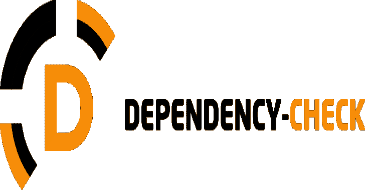

# 依赖性检查:检测应用程序依赖性中公开披露的漏洞

> 原文：<https://kalilinuxtutorials.com/dependency-check/>

.png)

**依赖关系检查**是一个软件组合分析(SCA)工具，它试图检测包含在项目依赖关系中的公开披露的漏洞。它通过确定给定依赖项是否有公共平台枚举(CPE)标识符来实现这一点。如果找到，它将生成一个链接到相关 CVE 条目的报告。

在 github 页面上可以找到生产二进制版本的文档和链接。此外，关于架构和扩展依赖性检查的方法的更多信息可以在 wiki 上找到。

## 7.0.0 升级通知

如果升级到 7.0.0 或更高版本，会有重大变化。如果您收到一条错误消息，指示您无法连接到数据库，您将需要运行 purge 命令来删除旧数据库:

*   度`**./gradlew dependencyCheckPurge**`
*   胃:T0
*   cli: `**dependency-check.sh --purge**`

升级到依赖性检查 7.0.0 的自制软件用户需要清除他们的旧数据库。

## 当前版本

### 詹金斯插件

关于 Jenkins 插件的使用说明，请参见 OWASP 依赖性检查插件页面。

### 命令行

更详细的说明可以在依赖性检查 github 页面上找到。最新的 CLI 可以从 github 的 releases 部分下载。

在*nix 上

**$。/bin/dependency-check . sh-h
$。/bin/dependency-check . sh–out。–scan[要扫描的 jar 文件的路径]**

在 Windows 上

**。\bin\dependency-check.bat -h
。\ bin \ dependency-check . bat–out。–scan[要扫描的 jar 文件的路径]**

在装有自制软件的 Mac 上注意–自制软件用户从 5.x 升级到 6.0.0 需要运行`**dependency-check.sh --purge**`。

**$ brew 更新& & brew 安装依赖-检查
$ dependency-检查-h
$ dependency-检出。–scan[要扫描的 jar 文件的路径]**

### Maven 插件

更详细的说明可以在 dependency-check-maven github 页面上找到。默认情况下，插件被绑定到`**verify**`阶段(即`**mvn verify**`)。或者，可以通过`**mvn org.owasp:dependency-check-**m` **`aven:check`直接调用插件。**

依赖性检查插件可以使用以下内容进行配置:

**… org.owasp 依赖关系-检查-maven 检查… … …**

### 蚂蚁任务

有关 Ant 任务的使用说明，请参见 dependency-check-ant github 页面。

## 发展先决条件

要通过安装，您必须安装以下组件:

*   Java: `**java -versio**n` 1.8
*   Maven: `**mvn -version**` 3.5.0 及更高版本

测试案例要求:

*   点网核心版本 6.0
*   Go: `**go version**` 1.12 及以上
*   ruby bundler-审计
*   故事
*   pnpm

## 开发使用

以下说明概述了如何编译和使用当前快照。虽然每个意图都是维护一个稳定的快照，但建议使用上面列出的发布版本。

由于测试资源的原因，存储库有一些大文件。这个团队已经试图尽可能地清理历史。但是，建议您执行浅层克隆以节省时间:

**git 克隆–深度 1 https://github.com/jeremylong/DependencyCheck.git**

在*nix 上

**$ mvn -s settings.xml 安装
$。/CLI/target/release/bin/dependency-check . sh-h
$。/CLI/target/release/bin/dependency-check . sh–out。扫描。/src/test/resources**

在 Windows 上

**mvn -s settings.xml 安装
。\ CLI \ target \ release \ bin \ dependency-check . bat-h
。\ CLI \ target \ release \ bin \ dependency-check . bat–out。扫描。/src/test/resources**

然后将结果“dependency-check-report.html”加载到您最喜欢的浏览器中。

### 码头工人

在以下示例中，假设要检查的源在当前工作目录中，报告将被写入`**$(pwd)/odc-reports**`。使用持久数据和缓存目录，允许您在运行后销毁容器。

对于 Linux:

# ！/bin/sh

**DC _ 版本= "最新"
DC _ 目录= $ HOME/OWASP-Dependency-Check
DC _ PROJECT = " Dependency-Check 扫描:$(pwd)"
数据 _ 目录= " $ DC _ 目录/数据"
缓存 _ 目录= " $ DC _ 目录/数据/缓存"
如果[！-d " $ DATA _ DIRECTORY "]；然后
echo "初始创建持久目录:$ DATA _ DIRECTORY "
mkdir-p " $ DATA _ DIRECTORY "
fi
if[！-d " $ CACHE _ DIRECTORY "]；然后
回显“最初创建持久目录:$ CACHE _ DIRECTORY”
mkdir-p " $ CACHE _ DIRECTORY "
fi**

# 确保我们使用的是最新版本

**docker pull owasp/dependency-check:$ DC _ 版本
docker run–RM \
-e USER = $ USER \
-u $(id-u $ { USER }):$(id-g $ { USER })\
–volume $(pwd):/src:z \
–volume " $ DATA _ DIRECTORY ":/usr/share/dependency-check/DATA:z \
–volume $(pwd)/ODC-reports:/:z \【T7**

[**Download**](https://github.com/jeremylong/DependencyCheck)