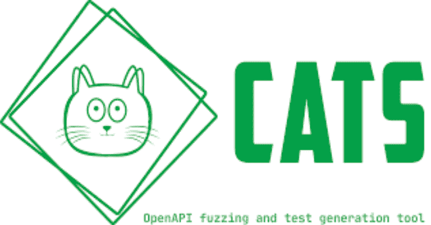

# CATS : REST API Fuzzer 和 OpenAPI 端点的负面测试工具

> 原文：<https://kalilinuxtutorials.com/cats/>

.png)

CATS、REST API fuzzer 和阴性测试工具。几分钟内运行数千次自我修复 API 测试，无需编码！

*   **综合**:基于大量场景自动生成测试，覆盖每个字段和表头的
*   ****智能**:根据数据类型和约束生成测试；每个模糊器都有特定的期望，这取决于被测试的场景**
*   ****高度可配置**:高度定制:您可以过滤特定的模糊器、HTTP 响应代码、HTTP 方法、请求路径、提供业务上下文等等**
*   ****自我修复**:随着测试的生成，任何 OpenAPI 规范的变化都会被自动拾取**
*   ****简单易学**:平坦的学习曲线，具有直观的配置和语法**
*   ****快速**:编写、运行和报告测试的自动化过程，在几分钟内覆盖数千个场景**

 **# 概述

通过使用简单和最小的语法，平坦的学习曲线，CATS(**C**contract**A**自动生成的 **T** ests for **S** wagger)使您能够在几分钟内生成数千个 API 测试，而**无需任何编码工作**。所有测试都是基于一组预定义的 **93 模糊器**自动**生成、运行和报告的。Fuzzers 涵盖了广泛的边界测试和负面场景，从完全随机的大型 Unicode 值到精心制作的、基于请求数据类型和约束的上下文相关值。更重要的是，您可以利用 CATS 动态生成请求负载的事实，并编写简单的端到端功能测试。**

# 装置

## 家酿啤酒

**brew tap endava/tap
brew install cats**

## 指南

CATS 被捆绑成可执行 JAR 或本地二进制文件。本机二进制文件不需要安装 Java。

下载您的操作系统本机二进制文件后，您可以将它添加到 PATH 中，这样您就可以像执行任何其他命令行工具一样执行它:

**sudo cp 猫/usr/local/bin/猫**

您还可以通过下载 cats_autocomplete 脚本来获得自动完成功能，并执行以下操作:

**源猫 _ 自动完成**

为了获得持久的自动完成，在`**~/.zshrc**`或`**./bashrc**`中添加上面的行，但是要确保您为`**cats_autocomplete**`脚本添加了完全限定的路径。

您也可以检查`**cats_autocomplete**`源以获得替代设置。

Windows 没有原生二进制，但是可以使用 uberjar 版本。这需要安装 Java 17+。

你可以用`**java -jar cats.jar**`来运行它。

前往发布页面下载最新版本:https://github.com/Endava/cats/releases.

## 建造

您可以从本地机器上的源代码构建 CATS。你需要 Java 17+。Maven 已经捆绑了。

**在运行第一个构建之前，请确保您执行了`./mvnw clean`。CATS 使用 fork ok `OKHttpClient`，它将安装在本地的`4.10.0-CATS`版本下，所以不用担心覆盖官方版本。**

您可以使用以下 Maven 命令来构建项目:

`**./mvnw package -Dquarkus.package.type=uber-jar**`

您将在`**target**`文件夹中找到一个`**cats-runner.jar**`。你可以用 **`java -jar cats-runner.jar ...`来运行它。**

您还可以使用 GraalVM Java 版本构建本机映像。

`**./mvnw package -Pnative**`

**注意:**您将需要用 Github PAT 配置 Maven，范围为`**read-packages**`以获得构建的一些依赖项。

### 单元测试的注意事项

在运行单元测试时，您可能会看到一些`**ERROR**`日志消息。这些是测试`**Fuzzers**`负面场景的预期行为。

# 奔跑的 CATS

## 黑盒模式

黑盒模式意味着 CATS 不需要任何特定的背景。您只需要提供服务 URL、OpenAPI 规范和最可能的身份验证头。

**cats–contract = open API . YAML–server = http://localhost:8080–headers = headers . yml–black box**

在黑盒模式下，如果接收到的 HTTP 响应代码是`**5XX**`，CATS 将仅报告`**ERRORs**`。模糊器期望的与服务返回的之间的任何其他不匹配(例如服务返回`**400**`和 CATS 期望的`**200**`)将被忽略。

黑盒模式类似于烟雾测试。它会很快告诉你应用程序是否有必须立即解决的重大错误。

## 上下文模式

CATS 的真正强大之处在于它在非黑盒模式下运行，也称为上下文模式。每个 Fuzzer 都有一个基于测试场景的预期 HTTP 响应代码，还会检查响应是否与特定于该响应代码的 OpenAPI 规范中定义的模式相匹配。这将允许您调整您的 OpenAPI 规范或服务行为，以便创建高质量的 API 和文档，并避免可能的严重错误。

在上下文模式下运行 CATS 通常意味着为它提供一个–ref data 文件，其中包含特定于业务逻辑的资源标识符。CATS 还不能自己创建数据，因此需要预先创建那些实体/资源的任何请求字段或查询参数，并将其添加到参考数据文件中，这一点很重要。

**cats–contract = open API . YAML–server = http://localhost:8080–headers = headers . yml–ref data = reference data . yml**

## 跳过测试的注释

您可能会注意到大量标记为`**skipped**`的测试。CATS 会尝试将所有的`**Fuzzers**`应用到所有的领域，但这并不总是可能的。例如，`**BooleanFieldsFuzzer**`不能应用于`**String**`字段。这就是该测试尝试将被标记为跳过的原因。这是一个有意的决定，也报告了`**skipped**`测试，以显示 CATS 实际上在所有字段/路径/端点上尝试了所有的`**Fuzzers**`。

## 控制台输出注释

CATS 生产大量的木材。如果输出被重定向到一个文件，请确保在不需要时进行适当的清理。一次简单的运行可以产生几十 MB 的数据。您可以使用`**--log "error"**`控制日志记录级别，只记录错误。

此外，CATS 支持更多的参数，允许您限制模糊器的数量、提供超时、限制每分钟的请求数量等等。

# 了解 CATS 如何工作并报告结果

CATS 基于已配置的`**Fuzzer**`生成测试。每个`**Fuzzer**`都有特定的场景和特定的预期结果。CATS 引擎将运行该场景，从服务中获取结果，并将其与`**Fuzzer**`预期结果进行匹配。根据匹配结果，CATS 将报告如下:

*   **`INFO` / `SUCCESS`** 是预期和有据可查的行为。不需要行动。
*   `**WARN**`是预期的，但未记录的行为或合同与服务之间的一些不一致。理想情况下，T2 会采取行动。
*   `**ERROR**`异常/意外行为。这个**必须**采取行动。

CATS 将遍历**所有端点**、**所有 HTTP 方法**和**所有关联的请求体和参数**(包括处理`o` **`neOf` / `anyOf`** 元素时的多种组合)，并根据它们定义的数据类型和约束模糊它们的值。实际的模糊化取决于具体执行的`**Fuzzer**`。请查看模糊者及其行为列表。根据 HTTP 方法的不同，模糊化的工作方式也有所不同:

*   对于具有请求体的方法，如 **POST、PUT、PATCH** ，模糊化将在**请求体数据模型级别**应用
*   对于没有请求体的方法，如 **GET，DELETE** 模糊化将应用于 **URL 参数级别**

这意味着对于请求体(`**POST,PUT**`)也有 URL/path 参数的方法，您需要通过`**urlParams**`或`**referenceData**`文件提供`**path**`参数，否则将导致 **`Illegal character in path at index ...`错误。**

# 口译结果

## HTML_JS

`**HTML_JS**`是由 CATS 生成的默认报告。执行报告放在一个名为`**cats-report/TIMESTAMP**`或`**cats-**` **`report`** 的文件夹中，取决于 **`--timestampReports`** 自变量。该文件夹将在当前文件夹中创建(如果不存在)，并且每次运行开始时，将使用`**TIMESTAMP**`值创建一个新的子文件夹。这可以让你有一个运行的历史。报告本身在`**index.html**`文件中，您可以:

*   根据结果过滤测试运行:**`All``Success``Warn`**和`**Error**`
*   基于`**Fuzzer**`进行过滤，以便您可以只看到特定`**Fuzzer**`的运行
*   查看所有测试的摘要及其运行的相应路径和结果
*   能够点击任何测试并获得关于正在执行的场景、预期结果、实际结果以及请求/响应细节的详细信息

随着来自`**index.html**`的总结，每个单独的测试将有一个特定的`**TestXXX.html**`页面，有更多的细节，以及一个 json 版本的测试，可以在以后使用`**> cats replay TestXXX**`重放。

理解`**Result Reason**`值:

*   `**Unexpected Exception**`–报为`**error**`；这可能表明服务中可能存在 bug，或者 CATS 没有正确处理这种情况
*   `**Not Matching Response Schema**`–报告为`**warn**`；这表明服务返回预期的响应代码和响应正文，但是响应正文与协定中定义的模式不匹配
*   `**Undocumented Response Code**`–报告为`**warn**`；这表明服务返回了一个预期的响应代码，但是该响应代码没有记录在契约中
*   `**Unexpected Response Code**`–报告为`**error**`；这表明服务中可能存在 bug 记录了响应代码，但这不是本场景所期望的
*   **`Unexpected Behaviour`**——报为`**error**`；这表明服务中可能存在 bug 响应代码既没有记录，也不是该场景所预期的
*   `**Not Found**`–作为`**error**`报告，以强制提供更多上下文；这表明 CATS 需要额外的业务环境才能成功运行——您可以使用`**--refData**`和/或`**--urlParams**`参数来实现这一点

## 仅限 HTML_ONLY

这种格式与`**HTML_JS**`类似，但是不能进行任何过滤或排序。

## 朱尼特

CATS 也支持 JUNIT 输出。输出将是一个单一的`**testsuite**`，它将包含所有按`**Fuzzer**`名称分组的测试。因为 JUNIT 格式没有`**warning**`的概念，所以使用以下映射:

*   CATS **`error`** 报为 JUNIT `**error**`
*   根本没有使用 JUNIT `**failure**`
*   CATS `**warn**`被报告为朱尼特`s**kipped**`
*   CATS `**skipped**`被报告为朱尼特`d**isabled**`

JUNIT 报告在`c**ats-report**`文件夹中被写成`**junit.xml**`。作为`**.html**`和`**.json**`的单独测试也将被创建。

# 跑猫切片攻略

CATS 有相当数量的`**Fuzzers**`。目前， **89** 还在不断增长。一些`**Fuzzers**`正在为请求中的每个给定字段执行多个测试。例如，`**ControlCharsOnlyInFieldsFuzzer**`有 **63** 个控制字符值，它们将被每个请求字段尝试。例如，如果一个请求有 15 个字段，这将导致 **1020 个测试**。考虑到有额外的`**Fuzzers**`生成相同数量的测试，您可以很容易地在一次典型运行中执行 20k 个测试。这将导致大量报告和长时间运行(即几分钟，而不是几秒钟)。

下面是一些推荐的策略，关于如何将测试分成可以在部署管道中一个接一个地执行的阶段。

## 按端点分割

您可以使用`**--paths=PATH**`参数为每个路径依次运行 CATS。

## 按模糊类别分割

您可以使用`**--checkXXX**`参数来运行 CATS，只使用特定的`**Fuzzers**`，如: **`--checkHttp`、** `**-checkFields**`等。

## 按起毛器类型分割

您可以使用各种参数，如`**--fuzzers=Fuzzer1,Fuzzer2**`或`**-skipFuzzers=Fuzzer1,Fuzzer2**`来包含或排除特定的`**Fuzzers**`。比如你可以运行除了`**ControlChars**`和`**Whitespace**s`以外的所有`**Fuzzers**`，像这样:`-**-skipFuzzers=ControlChars,Whitesspaces**`。这将跳过名称中包含这些字符串的所有模糊化器。之后，您可以仅使用这些 **`Fuzzers` : `--fuzzers=ControlChars,Whitespaces`** 创建额外的运行。

这些只是一些关于你如何分割测试用例类型的建议。根据您的 API 的复杂程度，您可能会使用上述方法的组合，或者使用更细粒度的方法。

请注意，由于`**ControlChars, Emojis and Whitespaces**`即使对于小的 OpenAPI 契约也会产生大量的测试，它们在默认情况下是禁用的。您可以使用 **`--includeControlChars`，`--includeWhitespaces`** 和/或`**-**-` **`includeEmojis`** 参数来启用它们。建议在单独的运行中运行它们，以便获得可管理的报告和最佳运行时间。

# 忽略特定的 HTTP 响应

默认情况下，CATS 将根据每个引信的具体行为报告`**WARNs**`和`**ERRORs**`。但是有些情况下，您可能只想关注关键的 bug。您可以使用`**--ignoreResponseXXX**`参数来提供一个响应代码、响应大小、字数、行数或响应体正则表达式的列表，这些内容应该作为问题被忽略(覆盖 Fuzzer 行为)，并将这些情况报告为成功或`**WARN**`或 **`ERROR`。**例如，如果你想让 CATS 只在出现异常或者服务返回一个`**500**`时才报告`E**RRORs**`，你可以使用这个:`**--ignoreResultCodes="2xx,4xx"**`。

# 忽略未记录的响应代码检查

您也可以选择忽略模糊器所做的检查。默认情况下，每个 Fuzzer 都有一个预期的响应代码，基于测试中的场景，并将报告和`**WARN**`服务返回预期的响应代码，但是响应代码没有记录在契约中。您可以使用`**--ignoreResponseCodeUndocumentedCheck**`参数让 CATS 忽略未记录的响应代码检查(即检查契约中预期的响应代码)。CATS 用现在报告的这些病例作为`**SUCCESS**`而不是`**WARN**`。

# 忽略响应正文检查

此外，您还可以选择忽略响应正文检查。默认情况下，除了检查预期的响应代码之外，每个 Fuzzer 还会检查响应体是否与契约中定义的内容匹配，如果不匹配，就会报告一个`**WARN**`。您可以使用`**--ingoreResponseBodyCheck**`参数让 CATS 忽略响应体检查。CATS 用现在报告的这些病例作为`**SUCCESS**`而不是`**WARN**`。

# 重放测试

当 CATS 运行时，对于每个测试，它将导出一个 HTML 文件和单独的 JSON 文件，HTML 文件将在最终报告中链接。JSON 文件可用于重放该测试。当重放一个测试(或一系列测试)时，CATS 不会产生任何报告。输出将仅在控制台中可用。例如，当您想要查看特定测试的确切行为或将其附加到错误报告中时，这是非常有用的。

重放测试的语法如下:

**猫重播《Test1，Test233，Test15.json，dir/test 19 . JSON》**

关于上述示例的一些注释:

*   测试名称可以用逗号分隔`**,**`
*   如果你为测试名提供一个 json 扩展名，该文件将作为一个路径被搜索，即它将在当前文件夹中搜索`**Test15.json**`，在`**dir**`文件夹中搜索`**Test19.json**`
*   如果您没有为测试名称提供 json 扩展名，它将在`cats-report`文件夹中搜索该测试，即`cats-**report/Test1.json**`和`**cats-report/Test233.json**`

当使用`**$$varible**`重放测试时，您也可以使用环境变量作为头。这对于身份验证头很有用。

# 可用命令

要列出所有可用的命令，请运行:

**猫-h**

下面列出了所有可用的子命令:

*   `**> cats help**`或`**cats -h**`将列出所有可用选项
*   `**> cats list --fuzzers**`将列出所有现有的模糊器，按类别分组
*   `**> cats list --fieldsFuzzingStrategy**`将列出所有可用的字段模糊化策略
*   `**> cats list --paths --contract=CONTRACT**`将列出合同内所有可用的路径
*   **`> cats replay "test1,test2"`** 将重放给定的测试`**test1**`和`**test2**`
*   `**> cats fuzz**`将基于给定的请求模板而不是 OpenAPI 契约进行模糊处理
*   将运行以 CATS YAML 格式编写的功能和目标安全测试

*   `**> cats lint**`将运行 OpenAPI 契约 linters，也称为`**ContractInfoFuzzers**`

# 可用参数

*   `**--contract=LOCATION_OF_THE_CONTRACT**`提供 OpenApi 或 Swagger 契约的位置。
*   `**--server=URL**`提供实现契约的服务的 URL。
*   `**--basicauth=USR:PWD**`提供一个`**username:password**`对，以防服务使用基本授权。
*   `**--fuzzers=LIST_OF_FUZZERS**`提供一个逗号分隔的模糊列表。提供的模糊化器列表可以是部分名称，而不是完整的模糊化器名称。CATS，它检查包含所提供字符串的所有模糊器。如果未提供参数，将运行所有模糊化器。
*   `**--log=PACKAGE:LEVEL**`可以为给定的包配置自定义日志级别。您可以提供以逗号分隔的包和级别列表。当您想要查看完整的 HTTP 流量:`**--log=org.apache.http.wire:debug**`或抑制 CATS 日志:`**--log=com.endava.cats:warn**`时，这很有帮助
*   `**--paths=PATH_LIST**`提供要测试的 OpenApi 路径的逗号分隔列表。如果没有提供路径，将考虑所有路径。
*   要忽略的路径的逗号分隔列表。如果未提供路径，则不会忽略任何路径
*   `**--fieldsFuzzingStrategy=STRATEGY**`指定哪种策略将用于字段模糊化。可用策略有 **`ONEBYONE`、`SIZE`** 和`**POWERSET**`。关于字段模糊化的更多信息可以在下面的章节中找到。
*   `**--maxFieldsToRemove=NUMBER**`指定使用`**SIZE**`字段模糊策略时要删除的字段的最大数量。
*   **`--refData=FILE`** 指定包含静态参考数据的文件，必须修复这些数据，以便拥有有效的业务请求。这是 YAML 的档案。这将在下面的章节中进一步解释。
*   `**--headers=FILE**`指定一个文件，该文件包含将在向端点发送有效负载时添加的头。例如，您可以使用此选项添加 oauth/JWT 令牌。
*   `**--edgeSpacesStrategy=STRATEGY**`指定在字段内发送尾随空格和前缀空格时，服务器的预期行为。可能的值是`**trimAndValidate**`和 **`validateAndTrim`。**
*   `**--sanitizationStrategy=STRATEGY**`指定当在字段中发送 Unicode 控制字符和 Unicode 其他符号时，服务器的预期行为。可能的值有`s**anitizeAndValidate**`和`**validateAndSanitize**`
*   `**--urlParams**`要在 URL 中替换的“名称:值”参数对的逗号分隔列表。当 URL 中有静态参数时(例如“版本”)，这很有用。
*   `**--functionalFuzzerFile**`由`**FunctionalFuzzer**`使用的文件，将用于创建用户提供的有效载荷。
*   `**--skipFuzzers=LIST_OF_FIZZERs**`逗号分隔的模糊器列表，所有**路径都将跳过这些模糊器。您可以提供完整的`**Fuzzer**`名称(例如: **`--skippedFuzzers=VeryLargeStringsFuzzer` )** 或部分`**Fuzzer**`名称(例如:`**--skipFuzzers=VeryLarge**`)。`**CATS**`将检查`**Fuzzer**`名称是否包含您在 arguments 值中提供的字符串。**
*   由逗号分隔的字段列表，这些字段将被替换模糊化器跳过，如 EmptyStringsInFields、NullValuesInFields 等。
*   `**--httpMethods=PUT,POST,etc**`以逗号分隔的 http 方法列表，用于过滤将为合同中的每个路径执行的 HTTP 方法
*   `**--securityFuzzerFile**`一个由`**SecurityFuzzer**`使用的文件，它将被用来注入特殊字符串以利用可能的漏洞
*   `**--printExecutionStatistics**`如果提供(不需要值)，打印每个端点和 HTTP 方法的执行时间摘要。默认情况下，这将打印每个端点的摘要:最大值、最小值和平均值。如果您想要详细的报告，您必须提供`**--printExecutionStatistics=detailed**`
*   `**--timestampReports**`如果提供(不需要值)，它将输出仍然在`**cats-report**`文件夹中的报告，但是在一个带有当前时间戳的子文件夹中
*   `**--reportFormat=FORMAT**`指定 CATS 报告的格式。支持的格式:**、**、`**HTML_JS**`或`**JUNIT**`。如果您希望报告不包含任何 Javascript，可以使用`**HTML_ONLY**`。由于 Javascript 内容安全策略，这在 CI 环境中很有用。默认为 **`HTML_JS`** ，包含一些排序和过滤功能。
*   **`--useExamples`如果`true`** (未提供时的默认值)，则 CATS 将使用 OpenAPI 联系人中提供的示例。如果`**false**` CATS 将只依赖生成的价值
*   如果提供(不需要值)，它将只运行字段模糊器
*   如果提供(不需要值)，它将只运行标题模糊器
*   如果提供(不需要值)，它将只运行 HTTP 模糊器
*   如果提供(不需要值)，它将包括空白模糊器
*   如果提供(不需要值)，它将包括表情模糊器
*   如果提供(不需要值)，它将包括控制字符模糊化器
*   `**--includeContrac**t`如果提供(不需要值)，它将包括`**ContractInfoFuzzers**`
*   `**--sslKeystore**`持有证书的 JKS 密钥库的位置，该证书在使用单向或双向 SSL 对呼叫进行身份验证时使用
*   `**--sslKeystorePwd**`的密码`**sslKeystore**`
*   `**--sslKeyPwd**`来自`**sslKeystore**`的私钥的密码
*   `**--proxyHost**`代理服务器的主机名(如果运行在代理之后)
*   `**--proxyPort**`代理服务器的端口号(如果运行在代理之后)
*   `**--maxRequestsPerMinute**`每分钟的最大请求数；当 API 实现了速率限制时，这很有用；默认值为 10000
*   `**--connectionTimeout**`CATS 应与服务器建立连接的时间段(秒);默认值为 10 秒
*   `**--writeTimeout**`向服务器发送请求时，两个数据包之间不活动的最长时间(秒);默认值为 10 秒
*   `**--readTimeout**`等待服务器响应时，两个数据包之间不活动的最长时间(秒);默认值为 10 秒
*   如果提供，它将使用提供的配置模拟服务的运行。该运行不会生成报告，但是会显示将为每个 OpenAPI 端点生成和运行多少测试
*   HTTP_CODES_LIST 以逗号分隔的 HTTP 响应代码列表，即使 Fuzzer 通常会将其报告为警告或错误，该列表也会被视为成功。您可以使用响应代码系列作为 **`2xx`、`4xx`、**等。**如果提供，将跳过所有合同模糊器**。
*   以逗号分隔的响应大小列表，该列表将被视为成功，即使模糊化器通常会将其报告为警告或错误
*   COUNT_LIST 以逗号分隔的单词列表，即使模糊化器通常会将其报告为警告或错误，也将被视为成功
*   即使 Fuzzer 通常会将响应报告为警告或错误，响应中被视为成功的逗号分隔的行数列表
*   一个正则表达式，它将与被认为是成功的响应相匹配，即使 Fuzzer 通常会将其报告为警告或错误
*   从 cats-report 文件夹中以 JSON 格式列出一个逗号分隔的已执行测试列表。如果您提供的列表没有。json 扩展 CATS 将在 cats-report 文件夹中搜索测试
*   `**--ignoreResponseCodeUndocumentedCheck**`如果提供(非所需值),它不会检查从服务接收的响应代码是否与模糊器预期的值匹配，并将测试结果返回为成功，而不是警告
*   如果被提供(不需要值),它不会检查从服务收到的响应体是否与契约中提供的模式匹配，并将测试结果返回为成功，而不是警告
*   `**--blackbox**`如果提供(不需要值),它将忽略除 5XX 之外的所有响应代码，5XX 将作为错误返回。这类似于`**--ignoreResponseCodes="2xx,4xx"**`
*   如果 OpenAPI 规范使用内容类型协商版本控制，则为自定义 mime 类型。
*   《CATS 报告》的写作之路。默认为当前目录中的`**cats-report**`
*   `**--skipReportingForIgnoredCodes**`对于`**--ignoreResponseXXX**`中提供的任何被忽略的参数，完全跳过报告

这将使用`**my.yml**`作为 API 规范运行 CATS 对`**http://localhost:8080**`，并且将只运行 HTTP 头`Fuzzers`。

# 可用的起毛器

要获得 fuzzers 列表，运行`**cats list --fuzzers**`。将返回所有可用模糊器的列表，以及每个模糊器的简短描述。

有多种类别的`**Fuzzers**`可用:

*   `**Field Fuzzers**`哪些目标请求体字段或路径参数
*   **`Header Fuzzers`** 哪个目标 HTTP 头
*   **`HTTP Fuzzers`** 只针对与服务的交互(没有模糊字段或标题)

额外的检查实际上没有使用任何模糊处理，而是利用 CATS 内部模型运行测试，如`**Fuzzers**`:

*   检查合同中的 API 良好实践
*   需要进一步配置的特殊类别，专注于更复杂的活动，如功能流程、安全测试或提供您自己的请求模板，而不是 OpenAPI 规范

## 野战模糊器

`**CATS**`目前有 47 个注册字段`**Fuzzers**`:

*   `**BooleanFieldsFuzzer**`–遍历每个布尔字段，并在目标字段中发送随机字符串
*   **`DecimalFieldsLeftBoundaryFuzzer`**–遍历每个数字字段(浮点型或双精度型)，发送目标字段左侧值超出范围的请求
*   **`DecimalFieldsRightBoundaryFuzzer`**–遍历每个数字字段(浮点型或双精度型)，发送目标字段右侧值超出范围的请求
*   `**DecimalValuesInIntegerFieldsFuzzer**`–遍历每个整数字段，并在目标字段中发送带有小数值的请求
*   `**EmptyStringValuesInFieldsFuzzer**`–遍历每个字段，并在目标字段中发送带有空字符串值的请求
*   `**ExtremeNegativeValueDecimalFieldsFuzzer**`–遍历每个数字字段，在目标字段中发送尽可能小的值的请求(无格式为-9999999999999999999999999999999999999999.9999999999999999，浮点型为-3.4028235E38，双精度型为-1.734862 3157 e308)
*   `**ExtremeNegativeValueIntegerFieldsFuzzer**`–遍历每个整数字段，发送目标字段中可能的最小值请求(int32 为-9223372036854775808，int64 为-18446744073709551616)
*   `**ExtremePositiveValueDecimalFieldsFuzzer**`–遍历每个数字字段，在目标字段中发送具有可能的最高值的请求(99999999999999999999999999999999999999999999.9999999999999，无格式为 3.4028235E38，浮点数为 3.4028235 e38，双精度为 1.7976931348623157E308)
*   `**ExtremePositiveValueInIntegerFieldsFuzzer**`–遍历每个整数字段，发送目标字段中可能的最高值请求(int32 为 9223372036854775807，int64 为 18446744073709551614)
*   `**IntegerFieldsLeftBoundaryFuzzer**`–遍历每个整数字段，发送目标字段左侧值超出范围的请求
*   **`IntegerFieldsRightBoundaryFuzzer`**–遍历每个整数字段，发送目标字段右侧值超出范围的请求
*   `**InvalidValuesInEnumsFieldsFuzzer**`–遍历每个枚举字段并发送无效值
*   `**LeadingWhitespacesInFieldsTrimValidateFuzzer**`–遍历每个字段并发送请求，在目标字段的当前值前添加 Unicode 空格和不可见分隔符
*   `**LeadingControlCharsInFieldsTrimValidateFuzzer**`–遍历每个字段并发送带有 Unicode 控制字符前缀的请求，这些字符是目标字段中的当前值
*   `**LeadingSingleCodePointEmojisInFieldsTrimValidateFuzzer**`–遍历每个字段并发送以单个代码点表情符号为前缀的值
*   `**LeadingMultiCodePointEmojisInFieldsTrimValidateFuzzer**`–遍历每个字段并发送以多代码点表情符号为前缀的值
*   `**MaxLengthExactValuesInStringFieldsFuzzer**`–遍历声明了 maxLength 的每个**字符串**字段，并发送值与目标字段中的 maxLength 大小/值相匹配的请求
*   `**MaximumExactValuesInNumericFieldsFuzzer**`–遍历声明了最大值的每个**数字和整数**字段，并发送值与目标字段中的最大大小/值相匹配的请求
*   `**MinLengthExactValuesInStringFieldsFuzzer**`–遍历声明了 minLength 的每个**字符串**字段，并发送值与目标字段中的 minLength 大小/值相匹配的请求
*   `**MinimumExactValuesInNumericFieldsFuzzer**`–遍历声明了最小值的每个**数字和整数**字段，并发送值与目标字段中的最小大小/值相匹配的请求
*   `**NewFieldsFuzzer**`–发送一个“快乐”流请求，并在请求中添加一个名为“catsFuzzyField”的新字段
*   `**NullValuesInFieldsFuzzer**`–遍历每个字段，发送在目标字段中包含空值的请求
*   `**OnlyControlCharsInFieldsTrimValidateFuzzer**`–遍历每个字段，仅发送包含控制字符的值
*   **`OnlyWhitespacesInFieldsTrimValidateFuzzer`**–遍历每个字段，只发送带有 unicode 分隔符的值
*   `**OnlySingleCodePointEmojisInFieldsTrimValidateFuzzer**`–遍历每个字段，仅使用单一代码点表情符号发送值
*   `**OnlyMultiCodePointEmojisInFieldsTrimValidateFuzzer**`–遍历每个字段，仅使用多代码点表情符号发送值
*   `**RemoveFieldsFuzzer**`–遍历每个请求字段，并根据提供的“fieldsFuzzingStrategy”删除某些字段
*   `**StringFieldsLeftBoundaryFuzzer**`–遍历每个字符串字段，发送目标字段左侧值超出范围的请求
*   `**StringFieldsRightBoundaryFuzzer**`–遍历每个字符串字段，发送目标字段右侧值超出范围的请求
*   `**StringFormatAlmostValidValuesFuzzer**`–遍历每个字符串字段并获取其“格式”值(即电子邮件、ip、uuid、日期、日期时间等)；发送具有几乎有效的值的请求(例如 email@yhoo。电子邮件，888.1.1。用于 ip 等)
*   `**StringFormatTotallyWrongValuesFuzzer**`–遍历每个字符串字段并获取其“格式”值(即电子邮件、ip、uuid、日期、日期时间等)；发送值完全错误的请求(例如，电子邮件的 abcd，1244。用于 ip 等)
*   `**StringsInNumericFieldsFuzzer**`–遍历每个整数(int，long)和数字字段(float，double)并发送目标字段中具有`**fuzz**`字符串值的请求
*   `**TrailingWhitespacesInFieldsTrimValidateFuzzer**`–遍历每个字段，并在目标字段中发送带有 Unicode 空格和不可见分隔符的请求
*   `**TrailingControlCharsInFieldsTrimValidateFuzzer**`–遍历每个字段，并在目标字段中发送带有 Unicode 控制字符的请求
*   `**TrailingSingleCodePointEmojisInFieldsTrimValidateFuzzer**`–遍历每个字段并发送带有单个代码点表情符号的值
*   `**TrailingMultiCodePointEmojisInFieldsTrimValidateFuzzer**`–遍历每个字段并发送带有多代码点表情符号的值
*   **`VeryLargeStringsFuzzer`**–遍历每个字符串字段，并在目标字段中发送具有很大值(40000 个字符)的请求
*   `**VeryLargeDecimalsInNumericFieldsFuzzer**`–遍历每个数值字段，并在目标字段中发送非常大的数字(40000 个字符)请求
*   **`VeryLargeIntegersInNumericFieldsFuzzer`**–遍历每个数值字段，并在目标字段中发送包含非常大的数字(40000 个字符)的请求
*   `**VeryLargeUnicodeStringsInFieldsFuzzer**`–遍历每个字段，并在目标字段中发送具有非常大的随机 unicode 值的请求
*   `**IterateThroughEnumValuesFieldsFuzzer**`–遍历每个枚举字段，发送遍历每个可能的枚举值的快乐流请求
*   `**ReplaceObjectsWithPrimitivesFieldsFuzzer**`–遍历每个非原始字段，并用原始值替换它
*   `**WithinControlCharsInFieldsSanitizeValidateFuzzer**`–遍历每个字段并发送包含 unicode 控制字符的值
*   **`WithinSingleCodePointEmojisInFieldsTrimValidateFuzzer`–**遍历每个字段并发送包含单个代码点表情符号的值
*   `**WithinMultiCodePointEmojisInFieldsTrimValidateFuzzer**`–遍历每个字段并发送包含多个代码点表情符号的值
*   `**ZalgoTextInStringFieldsValidateSanitizeFuzzer**`–遍历每个字段并发送包含 zalgo 文本的值

通过提供 **`--checkFields`** 参数，您可以只运行这些`**Fuzzers**`。

## 割台模糊器

`**CATS**`目前有 28 个注册头`**Fuzzers**`:

*   `**AbugidasCharsInHeadersFuzzer**`–遍历每个头，发送目标头中带有 abugidas 字符的请求
*   `**CheckSecurityHeadersFuzzer**`–检查所有关于安全相关标题的良好实践的回复，例如:[{name=Cache-Control，value=no-store}，{name=X-XSS-Protection，value = 1；mode=block}，{name=X-Content-Type-Options，value=nosniff}，{name=X-Frame-Options，value=DENY}]
*   `**DummyAcceptHeadersFuzzer**`–发送一个带有伪 Accept 报头的请求，并期望得到 406 代码
*   `**DummyContentTypeHeadersFuzzer**`–发送一个带有虚拟内容类型报头的请求，并期望得到 415 代码
*   `**DuplicateHeaderFuzzer**`–发送一个“满意的”流请求并复制一个现有的标题
*   `**EmptyStringValuesInHeadersFuzzer**`–遍历每个头，发送目标头中包含空字符串值的请求
*   `**ExtraHeaderFuzzer**`–发送一个“快乐”流请求，并在请求中添加一个名为“猫-模糊-头”的额外字段
*   `**LargeValuesInHeadersFuzzer**`–遍历每个头，发送在目标头中包含大值的请求
*   `**LeadingControlCharsInHeadersFuzzer**`–遍历每个头和带有控制字符的前缀值
*   `**LeadingWhitespacesInHeadersFuzzer**`–使用 unicode 分隔符遍历每个头和前缀值
*   `**LeadingSpacesInHeadersFuzzer**`–遍历每个标头，并发送请求，在目标标头中的值前加上空格
*   **`RemoveHeadersFuzzer`**–遍历每个标题并删除它们的不同组合
*   `**OnlyControlCharsInHeadersFuzze**r`–遍历每个标题并用控制字符替换值
*   `**OnlySpacesInHeadersFuzzer**`–遍历每个标题并用空格替换值
*   **`OnlyWhitespacesInHeadersFuzzer`–它**遍历每个标题，并用 unicode 分隔符替换值
*   **`TrailingSpacesInHeadersFuzzer`**–遍历每个报头并发送在目标报头中带有尾随空格的请求
*   `**TrailingControlCharsInHeadersFuzzer**`–使用控制字符遍历每个头和尾值
*   `**TrailingWhitespacesInHeadersFuzzer**`–使用 unicode 分隔符遍历每个头和尾值
*   `UnsupportedAcceptHeadersFuzzer`–发送带有不支持的 Accept 报头的请求，并期望获得 406 代码
*   `UnsupportedContentTypesHeadersFuzzer`–发送带有不支持的内容类型头的请求，并期望得到 415 代码
*   `ZalgoTextInHeadersFuzzer`–遍历每个报头，并在目标报头中发送带有 zalgo 文本的请求

通过提供`--checkHeaders`参数，您可以只运行这些`Fuzzers`。

## HTTP Fuzzers

`**CATS**`目前有 6 个注册的 HTTP `**Fuzzers**`:

*   `**BypassAuthenticationFuzzer**`–检查是否提供了认证报头；如果是，尝试在没有它的情况下提出请求
*   `**DummyRequestFuzzer**`–发送虚拟 json 请求{'cats': 'cats'}
*   `**HappyFuzzer**`–发送填写了所有字段和标题的请求
*   `**HttpMethodsFuzzer**`–遍历每个未记录的 HTTP 方法并发送一个空请求
*   `**MalformedJsonFuzzer**`–发送一个格式错误的 json 请求，其末尾有一个字符串“bla”
*   `**NonRestHttpMethodsFuzzer**`–遍历特定于 WebDav 协议的 HTTP 方法列表，REST APIs 不会实现这些方法

通过提供`**--checkHttp**`参数，您可以只运行这些`**Fuzzers**`。

## contract info fuzzer 或 OpenAPI Linters

通常，一个好的 OpenAPI 契约必须遵循几个好的实践，以使它易于被服务客户理解，并尽可能地充当自给自足的文档:

*   遵循命名契约元素(如路径、请求、响应)的良好实践
*   总是使用复数作为路径名，用连字符/下划线分隔路径单词，对任何类型和属性使用 camelCase 或 snake_case
*   为所有操作提供标记，以避免在某些语言上中断代码生成，并对 API 操作进行逻辑分组
*   为所有路径、方法和请求/响应元素提供良好的描述
*   为 **`POST`、`PATCH`** 和`**PUT**`请求提供有意义的响应
*   提供所有请求/响应元素的示例
*   为(理想情况下)所有请求/响应属性(最小值、最大值、正则表达式)提供结构约束
*   heaver 标题中的某种`**CorrelationIds/TraceIds**`
*   至少要有一个安全模式
*   避免让 API 版本成为路径的一部分
*   记录“快乐”和“不快乐”流程的响应代码
*   避免使用`**xml**` payload，除非有一个真正好的理由(比如记录一个旧的 API)
*   json 类型和属性不使用相同的命名(比如用一个名为`**pet**`的属性命名一个`**Pet**`

`**CATS**`目前有 9 个注册合同信息`**Fuzzers**`:

*   `**HttpStatusCodeInValidRangeFuzzer**`–验证所有 HTTP 响应代码都在 100 到 599 的范围内
*   `**NamingsContractInfoFuzzer**`–验证所有 OpenAPI 合同元素是否遵循 REST API 命名良好实践
*   `**PathTagsContractInfoFuzzer**`–验证所有 OpenAPI 路径是否包含 tags 元素，并检查 tags 元素是否与顶级声明的元素相匹配
*   **`RecommendedHeadersContractInfoFuzzer`**–验证所有 OpenAPI 契约路径是否包含推荐的头，如:CorrelationId/TraceId 等。
*   `**RecommendedHttpCodesContractInfoFuzzer**`–验证当前路径是否包含所有操作的所有推荐 HTTP 响应代码
*   `**SecuritySchemesContractInfoFuzzer**`–验证 OpenApi 契约是否包含所有路径的有效安全模式，无论是全局配置的还是按路径配置的
*   **`TopLevelElementsContractInfoFuzzer`**–验证所有 OpenAPI 契约级元素是否存在，并提供有意义的信息:API 描述、文档、标题、版本等。
*   `**VersionsContractInfoFuzzer**`–验证给定路径不包含版本信息
*   **`XmlContentTypeContractInfoFuzzer`–**验证所有 OpenAPI 契约路径响应和请求没有提供`**application/xml**`作为内容类型

使用 **`> cats lint --contract=CONTRACT`只能运行这些`**Fuzzers**`。**

## 特殊起毛器

### 功能模糊器

#### 编写定制测试

您可以利用 CATS 超强的自我修复和有效负载生成能力来编写功能测试。这是通过使用所谓的 **`FunctionaFuzzer`、**来实现的，其本身不是`**Fuzzer**`，但这样命名是为了一致性。使用简单的 DSL 在 YAML 文件中编写功能测试。DSL 支持添加标识符、描述、断言以及在测试之间传递变量。酷的是，通过利用 CATS 生成有效负载的事实，您只需要覆盖特定字段的值。其余的信息将由`**CATS**`使用有效数据填充，就像一个‘快乐的’流请求一样。

**需要注意的是，使用`FunctionalFuzzer`时`reference data`不会被替换。因此，如果有引用数据字段，您还必须在`FunctionalFuzzer`中提供这些字段。**

只有提供了有效的`**functionalFuzzer.yml**`文件，才会触发`**FunctionalFuzzer**`。该文件具有以下语法:

**path:
test number:
description:测试的简短描述
prop:Value
prop # subprop:Value
prop 7:
–Value 1
–Value 2
–Value 3
one of selection:
element # type:" Value "
expected response CODE:HTTP _ CODE
HTTP method:HTTP _ NETHOD**

这是对`**functionalFuzzer.yml**`文件中元素的描述:

*   你可以提供一个`**description**`的测试。这将被设置为`Scenario`描述。如果你不提供一个`**description**`，将会使用`**testNumber**`来代替。
*   同一路径下可以有多个测试: **`test1`、`test2`** 等。
*   `**expectedResponseCode**`是强制的，否则`**Fuzzer**`将忽略该测试。`**expectedResponseCode**`告诉 CATS 在发送这个测试时期望从服务中得到什么。
*   *最多*一个属性可以有多个值。当这种情况发生时，该测试实际上将成为一个测试列表，每个测试对应一个提供的值。例如在上面的例子中`**prop7**`有 3 个值。这实际上会导致 3 个测试，每个值一个。
*   文件内的测试按照声明的顺序执行**。这就是为什么您可以将一个测试的输出作为下一个测试的输入(详见下一节)。**
*   如果提供的`**httpMethod**`在 OpenAPI 给定的路径中不存在，将发出一个`**warning**`并且不执行任何测试
*   如果提供的`**httpMethod**`不是有效的 HTTP 方法，将发出一个`**warning**`,并且不执行任何测试
*   如果请求负载使用一个`**oneOf**`元素来允许多种请求类型，那么您可以使用`**oneOfSelection**`关键字来控制`**FunctionalFuzzer**`将应用于哪些可能的类型。`**oneOfSelection**`关键字的值必须与`**discriminator**`的完全限定名相匹配。
*   如果没有提供`**oneOfSelection**`，并且请求有效负载接受多个`**oneOf**`元素，那么将为每种类型的有效负载创建一个定制测试
*   该文件对您可以提供的所有属性使用 Json 路径语法；您可以通过`**#**`而不是`**.**`来分隔元素，如上例所示

#### 处理一个 Of，anyOf

当您的请求负载可以接受多种对象类型时，您可以使用`**oneOfSelection**`关键字来指定`**FunctionalFuzzer**`需要哪种可能的对象类型。如果不提供此元素，将考虑所有组合。如果您提供一个值，**这个值必须正好是在`discriminator`中使用的值。**

#### 相关测试

由于 CATs 主要依赖于生成的数据，很少借助于一些参考数据，因此用预定义的`**Fuzzers**`测试复杂的业务场景是不可能的。假设我们有一个创建数据的端点(执行一个`**POST**`)，我们想要检查它的存在(通过`**GET**`)。我们需要一种方法从 POST 调用中获取一些标识符，并将其发送给 get 调用。这现在可以使用`**FunctionalFuzzer**`来实现。`**functionalFuzzerFile**`可以有一个`**output**`条目，您可以在其中声明一个变量名，以及来自响应的完全限定名，以便设置它的值。然后，您可以使用另一个测试中的`**${variable_name}**`引用变量，以便使用它的值。

这里有一个例子:

**宠物:
test_1:
描述:创建宠物
httpMethod: POST
名称:"我的宠物"
expectedResponseCode: 200
输出:
petId:Pet # id
/Pet/{ id }:
test _ 2:
描述:获得宠物
id:$ { petId }
expected response code:200**

执行`**test_1**`时，宠物 id 的值将存储在`**petId**`变量中(值`**2**`)。当执行`**test_2**`时，`**id**`参数将被先前案例中的`**petId**`变量(值`**2**`)替换。

请注意:变量在所有定制测试中都是可见的，例如全局变量；请小心命名，因为它们会被覆盖。

#### 验证响应

`**FunctionalFuzzer**`可以验证的不仅仅是**T1。**这是通过使用 **`verify`** 元素实现的。这是上述`**functionalFuzzer.yml**`文件的扩展版本。

**/pet:
test_1:
描述:创建宠物
httpMethod: POST
名称: "我的宠物"
expectedResponseCode: 200
输出:
petId: pet#id
验证:
Pet #名称:" Baby "
Pet # id:"[0-9]+"
/Pet/{ id }:
test _ 2:
描述:获得宠物【T14**

考虑到上述文件:

*   `**FunctionalFuzzer**`将检查响应是否有两个元素`**pet#name**`和`**pet#id**`
*   如果找到了元素，它将检查`**pet#name**`是否有`**Baby**`值，以及`**pet#id**`是否是数字

下面的 json 响应会通过 **`test_1` :**

**{
“宠物”:
{
“id”:2、
“名字”:“宝贝”
}
}**

您还可以通过使用`**${request#..}**`限定符来引用`**verify**`部分中的请求字段。利用上面的例子，通过拥有下面的 **`verify`** 章节:

**/pet:
test_1:
描述:创建宠物
httpMethod: POST
名称: "我的宠物"
expectedResponseCode: 200
输出:
petId: pet#id
验证:
Pet # name:" $ { request # name } "
Pet # id:"[0-9]+"**

它将验证响应是否包含一个`**pet#name**`元素，以及它的值是否等于请求中发送的`**My Pet**`。

一些注意事项:

*   `**verify**`参数支持 Java 正则表达式作为值
*   您可以提供多个参数来检查(如上所示)
*   如果响应中至少有一个参数不存在，`**CATs**`将报告一个错误
*   如果所有参数都被找到并具有有效值，但响应代码不匹配，`**CATs**`将报告一个警告
*   如果所有的参数都被找到并且与它们的值匹配，并且响应代码是预期的，`**CATs**`将报告成功

#### 在功能模糊器中使用附加属性

您也可以使用与设置参考数据中的附加属性相同的语法，通过`**functionalFuzzerFile**`设置`**additionalProperties**`字段。

#### FunctionalFuzzer 保留关键字

以下关键字在`**FunctionalFuzzer**`测试中被保留:**`output``expectedResponseCode``httpMethod``description``oneOfSelection``verify``additionalProperties``topElement``mapValues`**。

### 安全引信

虽然`**CATs**`不是一个安全测试工具，但是你可以用它来测试基本的安全场景，用不同的讨厌的字符串集合来模糊特定的字段。行为类似于`**FunctionalFuzzer**`。您可以对输出变量、测试相关性、验证响应等使用完全相同的元素，此外，您还必须指定一个`**targetFields**`和/或`**targetFieldTypes**`以及一个`**stringsList**`元素。典型的`**securityFuzzerFile**`会是这样的:

**/pet:
test_1:
描述:运行 XSS 场景
名称:"我的宠物"
expected response code:200
http method:all
target fields:
–Pet # id
–Pet # description
strings file:XSS . txt**

如果与您的案例相关，您还可以提供 **`output`、`httpMethod`、`oneOfSelection`、**和/或`**verify**`(与`**FunctionalFuzzer**`中的行为相同)。

该文件对您可以提供的所有属性使用 Json 路径语法；您可以像示例中一样通过`#`而不是`.`来分隔元素。

这是`SecurityFuzzer`在解析上面的`securityFuzzerFile`之后将要做的事情:

*   它会将固定值“我的宠物”添加到字段`name`的所有请求中
*   对于`targetFields`中指定的每个字段，即`pet#id`和`pet#description`，它将为`xss.txt`文件中的每一行创建请求，并在每个字段中提供这些值
*   如果考虑到`CATs`回购中包含的`xss.txt`样本文件，这意味着它将发送 21 个针对`pet#id`的请求和 21 个针对`pet#description`的请求，即总共 **42 个测试**
*   对于这 42 个测试中的每一个，`SecurityFuzzer`都将期待一个`200`响应代码。如果返回另一个响应代码，那么`CATs`将报告测试为`error`。

作为如何创建安全测试的一个想法，您可以将[讨厌的字符串](https://github.com/minimaxir/big-list-of-naughty-strings)分割成您特定上下文中感兴趣的多个文件。你可以有一个`sql_injection.txt`，一个`xss.txt`，一个`command_injection.txt`等等。对于这些文件中的每一个，您可以在`securityFuzzerFile`中创建一个测试条目，其中包含您认为对这些类型的测试有意义的字段。(默认情况下，不包含所有字段是经过深思熟虑的选择(目前)。)这个`expectedResponseCode`应该根据你的具体情况进行调整。您的服务可能会在验证之前清理数据，因此期待一个`200`可能是完全有效的，或者可能会直接验证字段，因此期待一个`400`可能是完全有效的。一个`500`通常意味着一些事情没有被正确处理，可能预示着一个可能的错误。

#### 在 SecurityFuzzer 中使用附加属性

您也可以使用与设置参考数据中的附加属性相同的语法，通过`functionalFuzzerFile`设置`additionalProperties`字段。

#### SecurityFuzzer 保留关键字

以下关键字在`SecurityFuzzer`测试中被保留:`output`、`expectedResponseCode`、`httpMethod`、`description`、`verify`、`oneOfSelection`、`targetFields`、`targetFieldTypes`、`stringsFile`、`additionalProperties`、`topElement`和`mapValues`。

## 模板模糊器

`TemplateFuzzer`可以用来模糊非 OpenAPI 端点。如果目标 API 没有可用的 OpenAPI 规范，您可以使用请求模板来运行有限的模糊器集。运行`TemplateFuzzer`的语法如下(与`curl`非常相似):

**cats fuzz-H header = value-X POST-d ' { " field 1 ": value 1 ", field2 ": value 2 ", field 3 ": value 3 " } '-t " field 1，field 2，header" -i "2XX，4XX" http://service-url**

该命令将:

*   向`http://service-url`发送`POST`请求
*   使用`{"field1":"value1","field2":"value2","field3":"value3"}`作为模板
*   用模糊数据逐个替换`field1,field2,header`,并将每个请求发送到服务端点
*   当收到的响应代码不在此列表中时，忽略`2XX,4XX`响应代码并报告错误

这是一个经过深思熟虑的选择，通过使用`-t`参数提供字段来限制`Fuzzer`将运行的字段。对于嵌套对象，提供完全限定的名称:`field.subfield`。

标题也可以使用与字段相同的机制来模糊化。

此`Fuzzer`将发送以下类型的数据:

*   空值
*   空值
*   zalgo 文本
*   abugidas 字符
*   大型随机 unicode 数据
*   非常大的字符串(80k 个字符)
*   单一和多代码点表情符号
*   unicode 控制字符
*   unicode 分隔符
*   unicode 空格

运行`> cats fuzz -h`获得选项的完整列表。

您也可以使用`-w file`参数提供自己的数据字典。

带有主体的 HTTP 方法只会在请求有效负载和头级别被模糊化。

没有主体的 HTTP 方法将在路径、查询参数和头级别被模糊化。在这种情况下，您不需要提供`-d`参数。

# 参考数据文件

通常情况下，为了使请求成功，一些字段需要包含相关的业务值。您可以使用由`--refData`参数指定的参考数据文件来提供这些值。参考数据文件是 YAML 格式的文件，包含请求文档中不同路径的特定固定值。文件结构如下:

/**path/0.1/auth:
prop # subprop:12
prop 2:33
prop 3 # subprop # subprop 2:"测试"
/path/0.1/cancel:
prop # test:1**

## 设置附加属性

由于附加属性是地图，即它们实际上没有结构，因此 CATS 当前无法生成有效值。如果这种数据结构中的元素对于请求是必不可少的，您可以使用以下语法通过`refData`文件提供它们:

**/path/0.1/auth:
address # Street:"我的街道"
name:" John "
additional properties:
top element:metadata
map values:
test:" value 1 "
another test:" value 2 "**

`additionalProperties`元素必须包含要在请求中发送的实际键-值对，如果需要，还必须包含一个 top 元素。`topElement`不是强制的。上述示例将输出以下 json(也考虑上述示例):

**{
"地址":{
"电话": " 123 "，
"邮政编码": " 408 "，
"街道":"我的街道"
}，
"姓名":"约翰"，
"元数据":{
"测试":"值 1 "，
"另一个测试":"值 2"
}
}**

## RefData 保留关键字

参考数据文件中保留了以下关键字:`additionalProperties`、`topElement`和`mapValues`。

## 发送所有路径的参考数据

您还可以为所有路径发送相同的引用数据(就像您处理头一样)。您可以通过使用`all`作为`refData`文件中的一个键来实现这一点:

所有:
地址#邮编:123

这将尝试替换所有请求的**中的`address#zip`(如果该字段存在)。**

## 删除字段

有些(罕见的)情况下，一些字段放在一起可能没有意义。比如:如果你发送了`firstName`和`lastName`，你就不能同时发送`name`。由于 OpenAPI 不具备发送相互依赖的请求字段的能力，您可以使用`refData`文件指示 CATS 在向服务发送请求之前删除字段。您可以通过使用`cats_remove_field`作为您想要删除的字段的值来实现这一点。对于上述情况，`refData`字段将如下所示:

**all:
name:" cats _ remove _ field "**

## 使用 FunctionalFuzzer 创建参考数据文件

您可以利用`FunctionalFuzzer`可以运行功能流的事实来创建动态的`--refData`文件，这些文件不需要手动设置参考数据值。必须用变量`${variable}`而不是固定值创建`--refData`文件，并且这些变量必须是`functionalFuzzer.yml`文件中的输出变量。为了让`FunctionalFuzzer`正确地用变量名替换变量值，你必须在`FunctionalFuzzer`运行时提供`--refData`文件作为参数。

# 标题文件

这可用于发送带有每个有效负载的自定义固定报头。当您想要使用认证令牌来认证 API 调用时，这是非常有用的。您可以使用路径特定的头或公共头，这些头将通过使用一个`all`元素添加到每个调用中。特定路径将优先于`all`元素。示例头文件:

**全部:
接受:申请/JSON
/path/0.1/auth:
jwt:xxxxxxxxxxxxxx xx
/path/0.2/取消:
jwt:yyyyyyyyyyy**

这将把`Accept`头添加到所有调用中，把`jwt`头添加到指定的路径中。您可以使用`$$VARIABLE_NAME`在头文件中使用环境(系统)变量。(通知双`$$`

# 删除请求

`DELETE`是唯一用于删除资源的 HTTP 动词，执行两次相同的`DELETE`请求将导致第二次请求失败，因为资源不再可用。在`--refData`文件中提供一个很大的标识符列表会很麻烦，这就是为什么建议在运行 CATS 时跳过`DELETE`方法。

但是从 7.0.2 版本开始，CATS 在处理`DELETE`时有了一些智能。为了拥有足够多的有效实体，CATS 会将相应的`POST`请求保存在一个内部队列中，每次执行`DELETE`请求时，它都会从那里轮询数据。为了让这一点真正发挥作用，你的合同必须符合常识惯例:

*   `DELETE`路径实际上是`POST`路径加上一个标识符:如果 POST 是`/pets`，那么 DELETE 应该是`/pets/{petId}`。
*   CATS 将尝试匹配由`POST`请求返回的主体中的`{petId}`参数，同时对`petId`名称进行各种组合。它将尝试搜索以下条目:`petId, id, pet-id, pet_id`不同的情况。
*   如果在存储的`POST`结果中找到这些条目中的任何一个，它将用该值替换`{petId}`。

# 边缘空间策略

对于在有效值前加空格的情况下应该如何处理，还没有达成共识。一种策略是让服务在进行验证之前修剪空间，而其他一些服务将直接验证它们。您可以使用`--edgeSpacesStrategy`参数来控制 CATS 应该如何期望服务处理这样的情况。根据您对服务行为的预期，您可以将其设置为`trimAndValidate`或`validateAndTrim`:

*   `trimAndValidate`意味着服务将首先修剪空格，然后运行验证
*   `validateAndTrim`表示服务首先运行验证，不需要任何空格修剪

这是一个**全局设置**，即当 CATS 启动时配置，所有`Fuzzer`期望来自所有服务端点的一致行为。

# URL 参数

有些情况下，请求 URL 的某些部分会被参数化。举一个类似于`/{version}/pets`的例子。`{version}`应该对所有请求都有相同的值。这就是为什么您可以使用`--urlParams`参数提供实际值来替换这些参数。您可以提供一个`name:value`对的`;`分隔列表，用其对应的`value`替换`name`参数。例如，提供`--urlParams=version:v1.0`将用值`v1.0`替换上述示例中的`version`参数。

# 处理 AnyOf、AllOf 和 OneOf

CATS 还支持由`oneOf`、`allOf`和`anyOf`组成的模式。CATS 将在制造模糊有效载荷时考虑所有可能的组合。

# 配置文件中的动态值

以下配置文件:`securityFuzzerFile, functionalFuzzerFile, refData`支持为内部字段设置动态值。目前**只支持`java.time.*`和`org.apache.commons.lang3.*`的**，但是在不久的将来会有更多类型的元素出现。

假设您有一个日期/日期-时间字段，并且您想将其设置为 10 天后。您可以通过将其设置为值`T(java.time.OffsetDateTime).now().plusDays(10)`来实现这一点。这将返回 UTC 格式的 ISO 兼容时间。

# 处理认证

## 基于 HTTP 报头的认证

CATS 使用[报头](https://github.com/Endava/cats#headers-file)机制支持任何形式的基于 HTTP 报头的认证(基本认证、oauth、定制 JWT、apiKey 等)。您可以提供特定的 HTTP 头名称和值，并应用于`all`端点。此外，使用`--basicauth=USR:PWD`参数也支持基本验证。

## 单向或双向 SSL

默认情况下，CATS 信任所有服务器证书，并且不执行主机名验证。

对于双向 SSL，可以使用以下参数指定保存客户端私钥的 JKS 文件(Java 密钥库):

*   `--sslKeystore`持有证书的 JKS 密钥库的位置，该证书在使用单向或双向 SSL 对呼叫进行身份验证时使用
*   `--sslKeystorePwd`的密码`sslKeystore`
*   `--sslKeyPwd`内私钥的密码`sslKeystore`

有关如何将证书和私钥加载到 Java 密钥库中的详细信息，可以使用本指南:https://mrkandreev.name/blog/java-two-way-ssl/.

[**Download**](https://github.com/Endava/cats)**