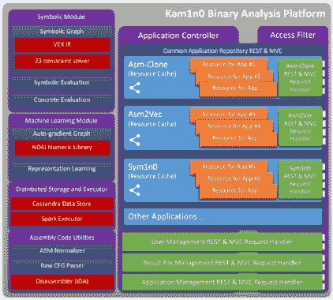

# Kam1n0:汇编分析平台

> 原文：<https://kalilinuxtutorials.com/kam1n0/>

.png)

***Kam1n0 v2.x*** 是一个可扩展的装配管理和分析平台。它允许用户首先将一个(大型)二进制文件集合索引到不同的存储库中，并提供不同的分析服务，如克隆搜索和分类。通过使用 ***应用*** 的概念，支持多租户访问和管理组装库。一个应用程序实例包含它自己的专用存储库，并提供专门的分析服务。考虑到逆向工程任务的通用性，Kam1n0 v2.x 服务器目前提供了三种不同类型的克隆搜索应用:***Asm-Clone******sym1n 0******Asm 2 vec***，以及一个基于 *Asm2Vec* 的 ***可执行分类*** 。新的应用程序类型可以进一步添加到平台中。

用户可以创建多个应用程序实例。一个应用程序实例可以在一组特定的用户之间共享。应用程序所有者可以控制应用程序存储库的读写访问和开关状态。Kam1n0 v2.x 服务器可以使用几个共享资源池同时为应用程序提供服务。

Kam1n0 是由 Steven H. H. Ding 和 Miles Q. Li 在加拿大麦吉尔大学数据挖掘和安全实验室的 Benjamin C. M. Fung 的指导下开发的。它在 2015 年的 Hex-ray 插件大赛中获得了二等奖。如果你觉得 Kam1n0 有用，请引用我们的论文:

*   南丁浩辉、冯本明和夏兰。Kam1n0:基于 MapReduce 的逆向工程装配克隆搜索。在*第 22 届 ACM SIGKDD 知识发现和数据挖掘国际会议(SIGKDD)* 论文集，461-470 页，加利福尼亚州旧金山:ACM 出版社，2016 年 8 月。
*   南丁浩辉、冯本明和夏兰。Asm2Vec:提高针对代码混淆和编译器优化的二进制克隆搜索的静态表示健壮性。在第 40 届 IEEE 安全和隐私研讨会(S&P 的会议录中，18 页，加利福尼亚州三藩市:IEEE 计算机学会，2019 年 5 月。

## Asm 克隆

Asm-Clone 应用试图解决汇编函数的高效子图搜索问题(即图同构问题)(2.3M 函数平均查询时间< 1.3s，平均索引时间< 30ms)。给定一个目标函数(如下所示左边的函数)，它可以在存储库中的其他函数中识别克隆的子图(如下所示右边的函数)。

*   应用程序类型:Asm-克隆
*   Kam1n0 v1.x 中使用的原始克隆搜索服务。
*   目前支持 Meta-PC，ARM，PowerPC，和 TMS320c6(实验)。
*   支持某个汇编代码族内的子图克隆搜索。
    *   +结果的良好可解释性:分解为子图。
    *   +对于在给定的代码族中搜索是准确的。
    *   +适用于区分大型二进制文件的各种补丁或版本。
    *   –对指令集更改、优化和混淆相对更敏感。
    *   –需要预定义汇编代码语言的语法。
    *   –需要在存储库中有相同选择系列的汇编代码。

## Sym1n0

基于区分模糊测试和约束求解的语义克隆搜索。一种高效且可扩展的动态-静态混合方法(1.5M 函数的平均查询时间< 1s，平均索引时间< 100ms)。给定一个目标函数(如下所示左边的函数)，它可以在存储库中的其他函数中识别克隆的子图(如下所示右边的函数)。支持抽象语法图的可视化。

*   应用程序类型:Sym1n0(仅限 v2)
*   通过符号执行和具体执行进行克隆搜索。
*   根据不同的 I/O 行为区分不同的功能。
*   对从 Vex IR(由 LibVex 提供支持)构建的抽象语法图进行克隆搜索。
    *   +跨不同汇编代码系列的克隆搜索。
        *   例如，索引 x86 二进制文件，但查询是 ARM 代码。
    *   +子图克隆搜索。
    *   +支持 throub LibVex 的各种家庭。
        *   x86、AMD64、MIPS32、MIPS64、PowerPC32、PowerPC64、ARM32 和 ARM64。
    *   +一种高效的动态-静态混合方法。
    *   +非常适合分析针对不同处理器编译的固件。
    *   –对繁重的图形操作敏感(如完全展平)。
    *   –对基本块完整性的大规模破坏敏感。

## Asm2Vec

Asm2Vec 利用表示学习。它理解汇编代码的词汇语义关系。例如，`**xmm***`寄存器在语义上与 **`addps`等向量运算相关。`memcpy`** 类似于`**strcpy**`。下图显示了从 libgmp 中`**gmpz_tdiv_r_2exp**`的相同源代码编译的不同汇编函数。汇编函数从左到右依次为 GCC O0 选项、GCC O3 选项、O-LLVM 混淆器控制流图、扁平化选项、LLVM 混淆器伪控制流图选项。Asm2Vec 可以 ***静态*** 识别它们是克隆体。

*   利用表征学习。
*   理解汇编代码的词汇语义关系。
    *   +针对大量代码混淆技术的克隆搜索的最新技术。
        *   (O-LLVM 中应用的所有选项的精度> 0.8，多次迭代)。
    *   +针对代码优化的克隆搜索的最新技术。
        *   (O0 和 O3 之间的精度> 0.8，O2 和 O3 之间的精度> 0.94)
    *   +甚至比最近的动态方法更好的结果。
    *   +比最近的动态方法更有效。
    *   +不需要定义架构。它通过阅读大量代码进行自我学习。
    *   +静态方法:高效且可扩展。
    *   –没有子图。
    *   –假设汇编代码来自同一处理器家族。
    *   –静态方法:无法识别跳转表等。

## 可执行分类

在该应用中，用户定义一组基于功能相关性的软件类，并提供属于每个类的二进制文件。然后，系统自动将功能分组到集群中，集群中的功能通过克隆关系直接或间接连接。对分类有区别的聚类被保留，并用作它们的类别的签名。给定一个目标二进制，系统显示它属于每个软件类的程度。

*   使用 Asm2Vec 作为其函数相似度计算模型
    *   +提供可解释的分类结果。
    *   +学习每个类的共同特征(即函数簇)。
    *   +能够处理比普通机器学习模型更小和不平衡的数据集。
    *   –限制在于，必须假设同一个类中的二进制文件共享一些公共函数，系统才能正常工作。

## 平台概述

下图展示了 Kam1n0 v2.x 的主要 UI 组件和功能，我们采用了材质设计。通常，每个用户都有一个应用程序列表、一个正在运行的作业列表和一个结果文件列表。

*   应用程序列表显示由用户拥有并由其他人共享的应用程序实例。
*   正在运行的作业列表显示了大型查询(如 chrome.dll)和索引过程的运行进度。
*   结果文件列表显示保存的结果。UI 设计的更多细节可以在我们的详细教程中找到。

# 安装说明

Kam1n0 的当前版本包含两个安装程序:核心服务器和 IDA Pro 插件。

| 安装程序 | 包括的组件 | 描述 |
| Kam1n0 服务器. msi | 核心引擎 | 提供索引和搜索服务的主引擎。 |
| 工作台 | 管理存储库和运行服务的用户界面。 |
| 网络用户界面 | 用于搜索/索引二进制文件和汇编函数的 Web 用户界面。 |
| 面向 VS 15 的 Visual C++可再发行版 | z3 的依赖性。 |
| Kam1n0-IDA-Plugin.msi | 插件 | 连接器和用户界面。 |
| Cefpython 的 PyPI 车轮 | 用户界面的渲染引擎。 |
| PyPI 和从属轮子 | Python 的包管理。包含在 IDA 6.8 和 6.9 中。 |

## 安装 Kam1n0 服务器

Kam1n0 核心引擎纯 Java 编写。您需要以下依赖项:

*   [必需 Oracle 最新的 x64 11.x JRE/JDK 发行版。
*   [可选]安装了 idapython 插件的 IDA Pro 的最新版本。Python 插件和运行时应该已经和 IDA Pro 一起安装了。如有必要，重新安装 IDA Pro。

从我们的发布页面下载`**Kam1n0-Server.msi**`文件。按照说明安装服务器。系统将提示您选择安装路径。如果服务器不必处理任何拆卸，IDA Pro 是可选的。换句话说，客户端使用的是 IDA Pro 的 Kam1n0 插件。强烈建议在 Kam1n0 服务器上安装 IDA Pro。Kam1n0 服务器将通过寻找您用来打开`**.i64**`文件的默认应用程序来自动检测您的 IDA Pro。

## 安装 IDA Pro 插件

Kam1n0 IDA Pro 插件的逻辑是用 Python 编写的，呈现是用 HTML/JavaScript 编写的。其安装需要以下依赖项:

*   [必需]安装了 idapython 插件的 IDA Pro (>6.7)。Python 插件和运行时应该已经和 IDA Pro 一起安装了。如有必要，重新安装 IDA Pro。

接下来，从我们的发布页面下载`**Kam1n0-IDA-Plugin.msi**`安装程序。按照说明安装插件和运行时。请注意，插件必须安装在位于`**$IDA_PRO_PATH$/plugins**`的 IDA Pro plugins 文件夹中。例如，在 Windows 上，路径可以是`**C:/Program Files (x86)/IDA 6.95/plugins**`。安装程序将检测并验证路径。

## 在基于 Ubuntu/Debian 的系统上设置 Kam1n0

*   确保你有 Java 11 的 Oracle 版本。(不是默认 apt 中的 jdk。)
    *   添加 Oracle 的 PPA，然后更新您的程序包资料档案库:`**sudo add-apt-repository ppa:webupd8team/java**`
        *   如果您遇到任何错误(比如`**~webupd8team not found**`)，如果您在代理上，请确保您设置并导出了您的`**http_proxy**`和`**https_proxy**`环境变量，然后使用 sudo 上的`-**E**`选项重试。此外，如果你得到一个“add-apt repository command not found”错误，请尝试: **`sudo apt install -y software-properties-common`。**
    *   之后:`**sudo apt-get update**`，和`**sudo apt-get install oracle-java8-installer**`
        *   用`**java -version**`验证你的 Java 版本；您可能需要手动设置 JAVA_HOME 环境变量(在`**/etc/environment**`、`**JAVA_HOME=/usr/lib/jvm/java-11-oracle**`中)
*   从 Kam1n0-Community 下载 Linux(Kam1n0-IDA-Plugin.tar.gz 和 Kam1n0-Server.tar.gz)的最新版本。
*   提取两个 tarballs(即 tar–xvzf Kam1n0-IDA-Plugin.tar.gz 和 tar–xvzf Kam1n0-Server.tar.gz)
*   Kam1n0-Server.tar.gz 文件将创建服务器目录。
*   在`**server**`目录中，您应该看到一个名为`**kam1n0.properties**`的文件，在这里您将为 kam1n0 设置各种配置；这一点非常重要。
*   将`**kam1n0.data.path**`设置为您希望写入 kam1n0 相关数据的位置。我们选择把它放在我们保存`**server**`的同一个地方。`**kam1n0.ida.home**`指您的 IDA 安装位置。如果你没有 IDA，也不打算用 kam1n0 反汇编，就注释这一行(和`**kam1n0.ida.batch**`，下一行)。关于`**kam1n0.properties**`文件的更多(准确)信息，参见`**kam1n0.properties.explained**`文件。
*   运行 kam1n0-server-workbench: `**java -jar kam1n0-server-workbench.jar**`。这个*应该*会弹出一个窗口，提示你实际启动 kam1n0。或者，运行 kam1n0-server: `**java -jar kam1n0-server.jar --start**`。这将在没有窗口的情况下从控制台启动服务器。
*   要连接并使用它，请在浏览器中转至`**127.0.0.1:8571**`(kam1n 0 监听的默认端口应为 8571，但可以在 kam1n0.properties 中更改)。你应该看到漂亮的 kam1n0 web UI。如果您不知道如何使用 Kam1n0，请从这里开始，按照 kam1n 0-社区回购教程进行操作。

## 向后兼容性

最新版本不再支持以前版本(< 2.0.0)中使用的汇编代码库和配置文件。如果您需要迁移旧的存储库，请联系我们。

# 发展

克隆最新的稳定分支(别忘了`**--recursive**`！):

**git clone–recursive-b master 2 . x–单分支 https://github.com/McGill-DMaS/Kam1n0-Community**

## 正在导入项目。

IntelliJ:将根目录/kam1n0/kam1n0/作为 maven 项目导入。所有子模块都将被相应地加载。EclipseEE:将克隆的 git 存储库添加到 git 视图中。从 git 存储库中导入所有 maven 项目。您可能需要修改类路径来解决任何错误。在 ide 中运行时，所有资源路径都是动态修改的(通过 kam1n0-resources 子模块)。

要构建项目:

**CD/kam1n 0/kam1n 0
mvn-DskipTests clean package
mvn-DskipTests package**

生成的二进制文件可以在/kam1n0/build-bins/中找到

要运行测试代码，您需要首先从 http://chromedriver.chromium.org/下载`**chromedriver.exe**`，并将其*绝对路径*添加到名为`**webdriver.chrome.driver**`的环境变量中。还要求系统中安装有 chrome 浏览器。测试代码将启动一个浏览器实例来测试 UI 界面。整个测试过程大约需要 3 个小时。

**CD/kam1n 0/kam1n 0
mvn-DskipTests clean package #如果你已经构建了这个包，你可以跳过这个包
mvn -DskipTests package #如果你已经构建了这个包，你可以跳过这个包
mvn -DforkMode=never test**

这些命令只编译带有预编译轮 libvex 和 z3 的 java。它开箱即用。libvex 和 z3 的构建依赖于平台。我们用安格尔的利维克斯叉子。可以在/kam1n0-builds/下找到更为重要的构建脚本以及 windows/linux 的安装程序

*   kam1n0:服务器的源代码。
*   kam1n0-builds:用于构建发行版的安装程序源代码和脚本。
*   kam1n0-clients:客户端的源代码。

## 二进制版本

我们有一个持续开发和交付的 Jenkin 服务器。最新的稳定版本将在这里发布。我们会定期将我们的内部实验分支与这个库同步。

[**Download**](https://github.com/McGill-DMaS/Kam1n0-Community)