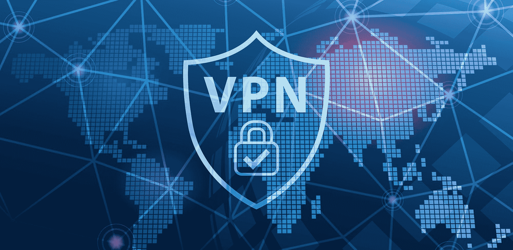
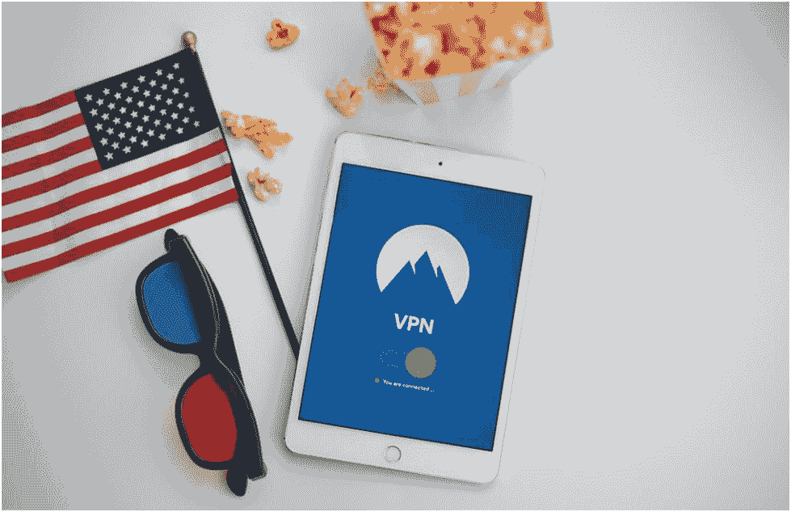
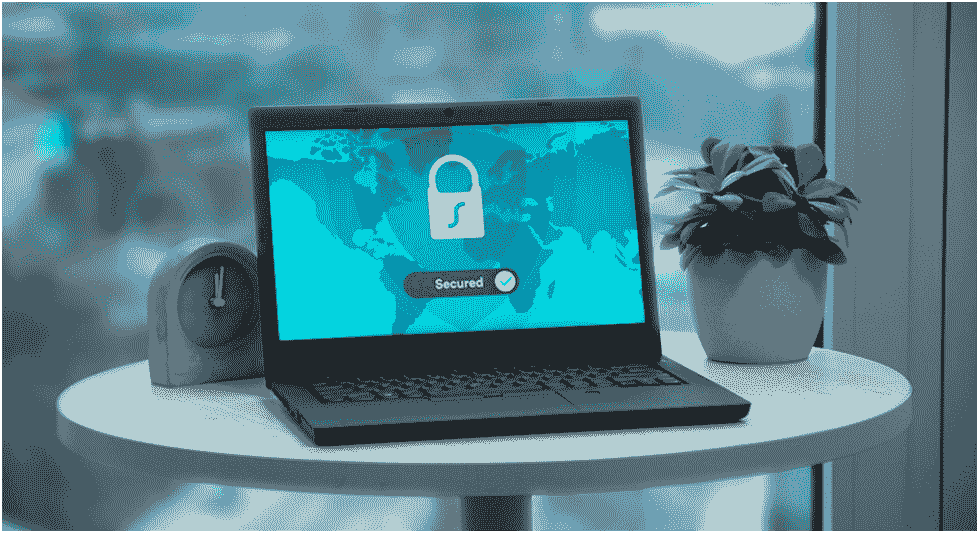

# 免费和付费 VPN:利弊

> 原文：<https://kalilinuxtutorials.com/free-and-paid-vpns-pros-and-cons/>

使用虚拟协议网络(VPN)正变得日益流行。人们需要它们来克服不同类型的地理限制，保护他们的账户不被封锁，应对审查，并在网上感受到更多的保护。

本文比较了免费和付费 VPN，分析了它们的优缺点，以帮助您做出正确的选择。

## **免费和付费 VPN 的区别**

免费使用 VPN 服务总有一种诱惑。这看起来很方便，也很省钱。它完全安全吗？我们可以怀疑。根据来自 [VPNToolBox](https://vpntoolbox.com/) 的研究，大多数免费服务不能提供完全的安全性，因为它们不使用特定的协议。

区别也在质量上。免费虚拟专用网速度较慢，而且也经常停机。另一个问题是——免费服务如何创收？答案很简单——借助广告。这就是为什么你会一直遇到流媒体活动中断的原因。

然而，我们不能说免费 VPN 是完全无用或危险的。免费和付费服务各有利弊。一切看你的需求和要求。反正是你自己决定用什么样的 VPN，为什么用。

现在，让我们更一致地看看免费和付费 VPN 的优缺点

## **免费 VPN:利与弊**

这些虚拟协议网络免费提供服务。这意味着您下载并使用该软件，尽管有时它可能会对您的活动施加某些限制。

### 免费 VPN 的优势

以下是免费 VPN 可以提供的一些无可争议的好处。

1.  它们是免费的，这是一个主要的优势。你不必花费成本去使用它们。你也可以无限期地使用它们。
2.  这些 VPN 可以让您访问锁定的内容。当你是一个经常上网的用户，需要访问你所在国家不允许的网站时，这一点至关重要。这些提供商还会隐藏您的 IP 地址，这样就没有人能看到您的流媒体内容。
3.  免费的 VPN 很容易下载和连接。它们昼夜不停地工作，因此世界各地的许多人都可以使用它们。你可以不受任何限制地在你所在的地方欣赏网飞表演。
4.  免费 VPN 不需要注册。你不必透露你的私人信息或财务数据。所以，你在这里会获得更多的匿名。

### 免费 VPN 的缺点

不过，让我们考虑以下缺点。

1.  安全问题是这类服务的一大缺点。这听起来可能很奇怪，因为使用 VPN 的主要目的是确保没有第三方可以访问您的 IP 地址和帐户。然而，最近的研究显示，大约 40%的免费 VPN 包含恶意软件。它让黑客或欺诈者访问您的帐户或轻松找到您。
2.  在使用免费 VPN 的时候，没有隐私可言。当您注册此类 VPN 或将其下载到您的设备上时，您最初同意共享您的私人信息。这些 VPN 提供商可以在该软件中包含第三方跟踪器。因此，它们会威胁到你的隐私。
3.  免费的 VPN 总是有局限性的。它们可能与数据使用、速度或支持服务器的数量有关。此外，免费 VPN 的常见做法是让你免费参与，然后提供升级到付费订阅。
4.  在这里最大的陷阱中，使用限制(兆字节数)是最令人不快的事情。设置这些限制是为了避免服务器因用户众多而过载。
5.  可用服务器的数量也是有限的。连接到一个最适合您所在位置的网站可能会很有挑战性，而连接到其他网站可能会花费很多时间。即使你成功连接，也不意味着你能立即访问你感兴趣的网站。可能会有很多断开，滞后，延迟，或挂起的网页。
6.  免费 VPN 可能会遭受大量僵尸网络攻击。黑客可以利用它们进入客户的[带宽](https://www.verizon.com/info/definitions/bandwidth/)，对其进行非法操作。
7.  这样的 VPN 可能属于不靠谱的公司，用心不良。所有者可以很容易地监控或记录你的在线活动，然后将这些信息出售给第三方。通过这种方式，如果他们跟踪的信息与有影响的人和知名人士有关，他们希望获得收入和一些奖金。

## 付费 VPN:优点和缺点

你不需要担心你必须为你的订阅支付大量的钱。实际上，这些金额是微不足道的，每个人都可以轻松负担得起，而不会对他们的预算造成任何损害。

当然，付费 VPN 也有其利弊。

### 付费 VPN 有什么好处？

在付费 VPN 的诸多优势中，让我们考虑以下几点:

1.  绝对安全是一个很好的选择。付费 VPN 在其 IPsec 配置中使用全新的 SSL 加密、256 位数据加密和特定的第 2 层隧道协议。相反，免费服务只能使用 PPTP，而且这些协议大多已经过时，不安全。
2.  没有速度限制，浏览速度永远不会下降，因为它们在性能上没有网络节流。
3.  服务器质量更高，付费 VPN 使用的服务器提供了很好的浏览体验，没有网页抓取和屏蔽。
4.  没有广告。你永远不会对那些没完没了的广告感到厌烦，这是免费 VPN 的特点。因此，您的流媒体和浏览将无缝流畅。
5.  他们提供了庞大的网络基础设施。全球数百甚至数千台服务器都参与了这个网络。对最安全的服务器的更多扩展访问不太可能经历拥塞。
6.  付费 VPN 通常通过电子邮件、电话或实时聊天提供全天候的客户支持服务。您也可以通过特定的联系方式在线联系他们。你可能认为在使用 VPN 时，你永远不需要任何客户支持。但是，有时会出现技术问题，您可能希望立即解决它们。

### 付费 VPN 有什么弊端吗？

这似乎只是一个显著的缺点——这些 VPN 应该付费。即使大多数付费虚拟专用网络的标准订阅费没有那么高，那些已经获得大量普及的虚拟专用网络也可能很贵。您可能需要每月支付特定金额或购买一年的订阅服务。

另一个问题是，付费 VPN 可能并不安全和值得信赖，尽管所有的声称完全安全和保障。他们可以保留一些你以前的网络使用记录，他们可能会把这些记录卖给第三方，第三方可能会与当局或勒索者或任何对此感兴趣的人分享这些记录。

即使付费 VPN 服务声称他们奉行“无日志”政策，你也无法证实这一点。您担心的主要原因是，计算机和 VPN 之间的所有交互对 VPN 服务提供商来说都是显而易见的。这就是为什么选择一个被许多人广泛使用和信任的 VPN 是如此重要。

另一个问题是付费 VPN 服务的位置。其中一些似乎有些奇怪，例如，格拉纳达或英属维尔京群岛。那里的立法模糊不清或缺乏，所以没人能查到这些 VPN 的所有者是谁。您可能对付费 VPN 的质量有意见，并希望退款。但是，想要拿回你的钱可能有点困难，甚至不可能。

最后一点，付费 VPN 注册需要大量的个人和财务信息。这可能会带来严重的安全风险。

## 最终想法

如果你需要在免费和付费 VPN 之间选择，先考虑你的目的。例如，如果你是一个经常上网的用户，想浏览被地理屏蔽的网站或看网飞电影，免费 VPN 是一个不错的选择。

但是，如果您需要所有数据都得到可靠的保护，例如，当您处理网络信息搜集或网上银行业务时，您会选择付费 VPN。

你可以有很多理由考虑付费或免费 VPN。然而，在这两种选择中，您需要确保您想要使用的服务提供商足够可靠。此外，即使这项服务是付费的，也不意味着它的所有者不能向第三方出售你的个人数据，这是最严重的缺点。