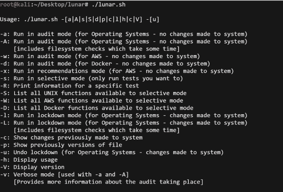

# Lunar : UNIX 安全审计工具

> 原文：<https://kalilinuxtutorials.com/lunar-2/>

.png)

**lunar，**锁定 UNix 审计和报告

## 版本

当前版本 8.0.5

更多最新版本信息，请参考 lunar.sh 和 changelog

## 简介

该脚本生成 Unix 主机安全性的评分审计报告。它以独联体和其他框架为基础。在可能的情况下，准则文档中会提到 CIS 和其他基准。

为什么是 shell 脚本？我想要一个能够在其他工具不可用的锁定系统上运行的工具。我还想要一个可以在所有版本的 UNIX 上运行的工具。已经说过 sh 和 bash 之间有一些不同，所以我只使用了 sh 的函数。

这个脚本没有暗示或给出任何保证。我的建议是仅在审计模式下使用该脚本，并通过策略、文档和配置管理分别处理每个警告。

我绝不是一个程序员，所以这个脚本中肯定会有错误和更好的方法，所以真诚地感谢那些提供反馈、更新和补丁来修复代码中的错误/功能的人。

它也可以执行锁定。与其他一些脚本不同，我增加了取消更改的功能。使用 cpio 将文件备份到基于日期的目录中。

尽管它可以执行锁定，但如前所述，我建议您通过策略、文档和配置管理来解决这些警告。这是我使用工具的方式。AWS 服务审计仅支持报告，不提供锁定功能。

## 支持的操作系统

支持以下操作系统:

*   Linux 操作系统
    *   RHEL 5，6，7
    *   厘斯 5，6，7
    *   科学 Linux
    *   sl10，11，12
    *   一种自由操作系统
    *   人的本质
    *   亚马逊 Linux
*   Solaris (6、7、8、9、10 和 11)
*   麦克·OS X
*   FreeBSD(需要更多测试)
*   AIX(需要更多测试)
*   ESXi(初始支持–一些测试)

Windows 支持需要安装额外的软件，所以我还没有考虑过。话虽如此，Windows 支持可能会在未来通过 bash 实现。

## 支持的服务

支持以下服务:

*   自动警报系统
*   码头工人
*   立方(不完整)
*   阿帕奇(不完整)

AWS 服务审计使用 AWS CLI，因此需要具有适当权限的用户。它目前不支持锁定功能，仅支持根据 CIS 基准生成审计报告。

有几项检查只能通过 GUI 来完成或解决。这方面的一个例子是启用计费。有关更多信息，请参考 CIS 基准。

在可能的情况下，我将建议的修复命令放在详细的审计输出中。同样，在某些情况下，这些只能通过 CLI 完成。有关更多信息，请参考 CIS 基准。

此外，我还添加了一个推荐模式，对照 Cloud compliance 等公司公开发布的最佳实践来检查 AWS。

## 配置管理

支持以下配置管理输出:

*   Ansible

此选项输出用于实现建议的示例性配置管理代码/节。

## 要求

对于 UNIX:

*   Ubuntu / Debian
    *   sysv-rc-conf
    *   公元前
    *   手指

对于 AWS:

*   自动警报系统
    *   AWS CLI
    *   AWS 凭证(API 访问和密钥)
    *   对适当 AWS 服务的读取权限，例如
        *   CloudTrail:描述轨道
        *   配置:描述配置记录器
        *   SNS:列表订阅 ByTopic

## 用法

**用法:。/lunar . sh[OPTIONS…]
-在审核模式下运行(对于操作系统，不对系统进行任何更改)
-在审核模式下运行(对于操作系统，不对系统进行任何更改)
[包括文件系统检查，这需要一些时间]
-v 详细模式[与-a 和-A 一起使用]
[提供了有关正在进行的审核的更多信息]
-在审核模式下运行(对于 AWS，不对系统进行任何更改)
-d 在审核模式下运行(对于 Docker–不对系统进行更改)
-e 在外部主机上以审核模式运行(对于操作系统–不对系统进行更改)
-k 在审核模式下运行(对于 Kubernetes–不对系统进行更改)
-x 在建议模式下运行(对于 AWS–不对系统进行更改)
-s 在选择性模式下运行(仅运行您想要的测试)
-l 在锁定模式下运行(对于操作系统-对系统所做的更改)
-L 在锁定模式下运行(对于操作系统-对系统所做的更改)
[包括需要一些时间的文件系统检查]
-S 列出可用于选择模式的所有 UNIX 函数
-W 列出可用于选择模式的所有 AWS 函数
-D 列出可用于选择模式的所有 docker 函数
-R 打印特定测试的信息
-o 设置 docker 操作系统或容器名称
-t 设置 Docker 标签
-c 运行 Docker-编写测试套件(在审计模式下运行 lunar，不做任何更改)
-C 运行 Docker-编写测试套件(为了进行更多测试，将它放到 shell 中)
-p 显示文件以前的版本
-Z 显示以前对系统所做的更改
-b 列出备份文件
-n 输出可执行的代码段
-r 指定 AWS 区域
-z 运行指定的审计功能
-u 撤消锁定(针对操作系统-对系统所做的更改)
-V 显示版本
-H 显示使用方法
-h 显示帮助**

[**Download**](https://github.com/lateralblast/lunar)