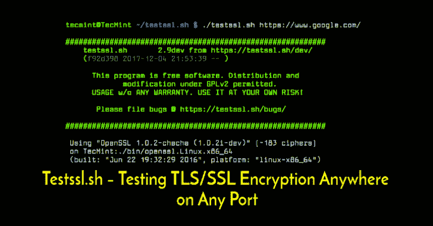

# TestSSL。SH:在任何端口的任何地方测试 TLS/SSL 加密

> 原文：<https://kalilinuxtutorials.com/testssl-sh/>

.png)

`**testssl.sh**`是一个免费的命令行工具，它检查服务器在任何端口上的服务是否支持 TLS/SSL 密码、协议以及一些加密缺陷。

### 主要特点

*   清晰的输出:你可以很容易地判断任何事情是好是坏。
*   机器可读输出(CSV，两种 JSON 格式)
*   不需要安装或配置任何东西。没有宝石，CPAN，皮普或类似的东西。
*   开箱即用:Linux、OSX/达尔文、FreeBSD、NetBSD、MSYS2/Cygwin、WSL(Windows 上的 bash)。只有 OpenBSD 需要 bash。
*   提供了一个 Dockerfile，还有一个官方容器 build @ dockerhub。
*   灵活性:您可以测试任何启用了 SSL/TLS 并启动 TLS 的服务，而不仅仅是端口 443 上的 web 服务器。
*   工具箱:几个命令行选项帮助你运行*你的*测试和配置*你的*输出。
*   可靠性:功能经过全面测试。
*   隐私:看到结果的只有你自己，没有第三方。
*   自由:100%开源。你可以看看代码，看看是怎么回事。
*   开发是开放的(GitHub ),欢迎参与。

### 兼容性

Testssl.sh 可以在每一个现成的 Linux/BSD 发行版上工作。最新版本 2.9dev 由于基于 bash-socket 的检查，openssl 客户端禁用特性的大部分限制都消失了。因此，您也可以使用 LibreSSL 或 OpenSSL >= 1.1.1。testssl.sh 也可以在其他开箱即用的 unixoid 系统上工作，假设他们已经安装了**`/bin/bash`**>= 3.2 版本和标准工具，如 sed 和 awk。当您启动 testssl.sh 时，会对二进制文件进行隐式(静默)检查。System V 可能需要安装 GNU grep。MacOS X 和 Windows(使用 MSYS2、Cygwin 或 WSL)也可以。

在这里或@ twitter 更新通知。

### 安装

您可以通过克隆这个 git 存储库来下载 testssl.sh branch 3.1dev:

**git 克隆–深度 1 https://github.com/drwetter/testssl.sh.git**

把 3.1dev 想成滚动发布，见下文。对于稳定版本，请自行下载 ZIP 或 tar.gz 档案。只需`**cd**`到创建的目录(=INSTALLDIR)并在那里运行它。

#### 码头工人

Testssl.sh 有最低要求。如上所述，您不需要安装或构建任何东西。您可以从提取/克隆的目录中运行它。如果您不想将 GitHub repo 放入您选择的目录，您可以从 dockerhub 中取出一个容器并运行它:

**坞站运行──RM-ti drw etter/test sl . sh**

或者，如果您已经克隆了这个 repo，您也可以直接`**cd**`到 INSTALLDIR 并运行

**码头工人建造。-t image foo&docker run–RM-t image foo example.com**

欲了解更多信息，请咨询 Dockerfile.md。

### 状态

我们目前处于开发阶段，版本 3.1 dev。3.1 dev 最终将成为 3.2。在合并到 3.1dev 之前，在一个单独的分支中开发更大的功能，以避免打嗝或不一致。尽管我们试图尽可能保持 3.1dev 的稳定性，但 3.1dev 中的情况肯定会发生变化。可以将 3.1dev 分支想象为滚动发布。因此，如果你需要稳定性，3.0 分支更适合你。

3.0.X 版收到了错误修复，标记为 3.0.1、3.0.2 等。这种情况会一直持续到 3.2 发布。

对 2.9.5 的支持已被删除。仅支持> = 3.0.x。

### 文档

*   ..它是用来阅读的。请这样做🙂—至少在提问之前。参见`**~/doc/**`中 groff、html 和 markdown 格式的手册页。
*   https://testssl.sh/会帮你起步。
*   对于(较老的)2.8 版本，Hunt 将提供更长、更好的描述，包括有用的背景信息。

[Download](https://github.com/drwetter/testssl.sh)