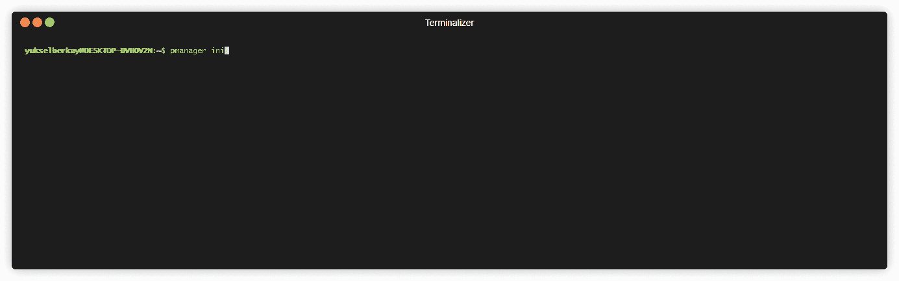

# p manager–从安全的离线数据库中存储和检索您的密码

> 原文：<https://kalilinuxtutorials.com/pmanager/>

[](https://blogger.googleusercontent.com/img/b/R29vZ2xl/AVvXsEgTqN3u7PiYRACahgxjJLq8JpQxglKdOfJV8ZdWPj4LKSnNW0Hzhglv_Irp0J1Upn_dBTYx8DeHb-ZffZ7mtJYNQxHn9X9wmY1R91gHKuaf7v4WmsI9mHdLyfAXyE06iNjamcAX2VxHTakn5xsZZ2J4MFcErBEPs1rj-s6xDywYu5qUqyuIAFzQyNhX/s724/Pmanager.png)

**PManager** 从安全的离线数据库中存储和检索您的密码。检查您的密码以前是否泄露过，以防止有针对性的密码重用攻击。

## 演示



## 特征

*   使用最先进的加密算法实现安全的密码存储。
    *   argon2id 用于密钥派生的多次迭代，使攻击者更难进行暴力攻击。
    *   Aes-gcm256 用于数据库加密。
*   确保数据完整性的自定义加密键值数据库。(阅读我写的关于此事的博文[这里](https://yukselberkay.github.io/programming/2022/09/12/post-keyval-db.html)。)
*   易于安装和使用。核心功能不需要连接到外部服务。
*   检查您的密码之前是否泄露过，以避免有针对性的密码重用攻击。
    *   这是通过用 keccak-512 散列你的密码并将前 10 个数字发送到 [XposedOrNot](https://xposedornot.com/api_doc) 来实现的。

## 装置

Pmanager 依赖于 **ubuntu** 上的“pkg-config”和“libssl-dev”包。只需安装它们

sudo apt install pkg-config libssl-dev -y

根据您当前的操作系统从[版本](https://github.com/yukselberkay/pmanager/releases)下载二进制文件，并将二进制文件的位置添加到 PATH 环境变量中，您就可以开始了。

## 从源构建

### Ubuntu 浏览器

```
sudo apt update -y && sudo apt install curl
curl --proto '=https' --tlsv1.2 -sSf https://sh.rustup.rs | sh
sudo apt install build-essential -y
sudo apt install pkg-config libssl-dev git -y
git clone https://github.com/yukselberkay/pmanager
cd pmanager
make install
```

### Windows

*   按照这里的说明安装 Rust。->[https://www.rust-lang.org/tools/install](https://www.rust-lang.org/tools/install)
*   然后安装 git for Windows。->[https://gitforwindows.org/](https://gitforwindows.org/)

```
git clone https://github.com/yukselberkay/pmanager
cd pmanager
cargo build --release
```

### Mac

我还不能在 Mac 系统上测试 pmanager。但是您应该能够从源代码构建它(“货物构建-发布”)。因为没有操作系统特定的功能。

## 文档

首先，需要使用“init”命令初始化数据库。

### 初始化

```
# Initializes the database in the home directory.
pmanager init --db-path ~
```

### 插入

```
# Insert a new user and password pair to the database.
pmanager insert --domain github.com
```

### 得到

```
# Get a specific record by domain.
pmanager get --domain github.com
```

### 列表

```
# List every record in the database.
pmanager list
```

### 更新

```
# Update a record by domain.
pmanager update --domain github.com
```

### 删除

```
# Deletes a record associated with domain from the database.
pmanager delete github.com
```

### 泄露了

```
# Check if a password in your database is leaked before.
pmanager leaked --domain github.com
```

```
pmanager 1.0.0

USAGE:
    pmanager [OPTIONS] [SUBCOMMAND]

OPTIONS:
    -d, --debug      
    -h, --help       Print help information
    -V, --version    Print version information

SUBCOMMANDS:
    delete    Delete a key value pair from database
    get       Get value by domain from database
    help      Print this message or the help of the given subcommand(s)
    init      Initialize pmanager
    insert    Insert a user password pair associated with a domain to database
    leaked    Check if a password associated with your domain is leaked. This option uses
                  xposedornot api. This check achieved by hashing specified domain's password and
                  sending the first 10 hexadecimal characters to xposedornot service
    list      Lists every record in the database
    update    Update a record from database
```

[Click Here To Download](https://github.com/yukselberkay/pmanager)