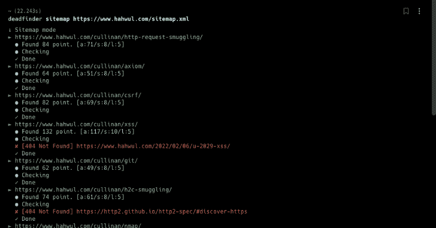

# Dead finder–查找死链接(断开的链接)

> 原文：<https://kalilinuxtutorials.com/deadfinder/>

[](https://blogger.googleusercontent.com/img/b/R29vZ2xl/AVvXsEiTDAEloeaPCle30pvYo6c4vmJEBn25r_5pSFzL9qcoQpJqZMlcteOobkZPI-pBmDsRIt5LMtEau3ricvgPrFqhodafMuBTojGEHi2WjFDiz_zW1aRYbLL7MlU2nFXMBzPY-yc9zzWXXbNTwK4JDOi-CRZisCIvcgkkmMSqCSmnUcna_YJYvh2lHbHb/s728/DeadFinder.png)

死链接是指网页中无法连接的链接。这些链接会对 SEO 和安全性产生负面影响。 **Deadfinder** 工具便于识别和修改。

## 装置

### 用 Gem 安装

```
gem install deadfinder
```

### Docker 图像

```
docker pull ghcr.io/hahwul/deadfinder:latest
```

## 用法

```
Commands:
  deadfinder file            # Scan the URLs from File. (e.g deadfinder file urls.txt)
  deadfinder help [COMMAND]  # Describe available commands or one specific command
  deadfinder pipe            # Scan the URLs from STDIN. (e.g cat urls.txt | deadfinder pipe)
  deadfinder sitemap         # Scan the URLs from sitemap.
  deadfinder url             # Scan the Single URL.
  deadfinder version         # Show version.

Options:
  c, [--concurrency=N]  # Set Concurrncy
                        # Default: 20
  t, [--timeout=N]      # Set HTTP Timeout
                        # Default: 10
  o, [--output=OUTPUT]  # Save JSON Result

```

## 模式

```
# Scan the URLs from STDIN (multiple URLs)
cat urls.txt | deadfinder pipe

# Scan the URLs from File. (multiple URLs)
deadfinder file urls.txt

# Scan the Single URL.
deadfinder url https://www.hahwul.com

# Scan the URLs from sitemap. (multiple URLs)
deadfinder sitemap https://www.hahwul.com/sitemap.xml
```

## JSON 处理

```
deadfinder sitemap https://www.hahwul.com/sitemap.xml \
  -o output.json

cat output.json | jq
```

[Click Here To Download](https://github.com/hahwul/deadfinder)