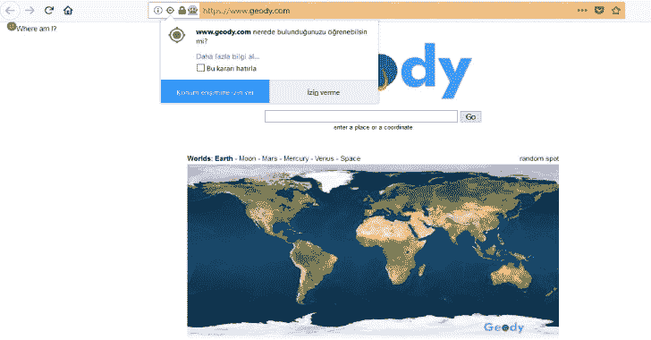

# bayanay——Python 驱动工具

> 原文：<https://kalilinuxtutorials.com/bayanay/>

Bayanay 是一个 Python 驱动工具。驾车是一种步行或开车的导航行为，目的是发现周围地区的无线网络。

## 特征

通过使用 HTML5 地理定位特性将从 scapy 获得的 SSID 信息结合起来，就可以实现向前驱动。

## 使用

我不能对恶意使用车辆负责。

ssidBul.py 已经过 TP-LINK TL WN722N 测试。

Selenium 3.11.0 和 Firefox 59.0.2 用于 location.py，Firefox geckodriver 位于代码所在的目录中。

在测试环境中创建和更改了 SSID 和 MAC 名称及位置信息。

ssidBul.py 和 location.py 必须同时运行。

ssidBul.py 结果:

2018 年 3 月 20 日晚上 11:48 | 9c:B2:B2:11:12:13 | ecfj 3m

2018 年 3 月 20 日晚上 11:48 | c0:25:e9:11:12:13 | t 7068

下面是运行 location.py 时允许位置信息的截图:

位置信息截图如下:

#### **konum.py 结果:**

lat = 38.8333635 | lon = 34.759741899 | 2018 年 3 月 20 日晚上 11:47

lat = 38.8333635 | lon = 34.759741899 | 2018 年 3 月 20 日晚上 11:48

lat = 38.8333635 | lon = 34.759741899 | 2018 年 3 月 20 日晚上 11:48

lat = 38.8333635 | lon = 34.759741899 | 2018 年 3 月 20 日晚上 11:48

lat = 38.8333635 | lon = 34.759741899 | 2018 年 3 月 20 日晚上 11:48

lat = 38.8333635 | lon = 34.759741899 | 2018 年 3 月 20 日晚上 11:49

lat = 38.8333635 | lon = 34.759741899 | 2018 年 3 月 20 日晚上 11:49

在数据收集过程之后，运行 wardriving.py 会得到以下输出:

lat = 38.8333635 | lon = 34.759741899 | 2018 年 3 月 20 日晚上 11:48 | 9c:B2:B2:11:12:13 | ecfj 3m

lat = 38.8333635 | lon = 34.759741899 | 2018 年 3 月 20 日晚上 11:48 | c0:25:e9:11:12:13 | t 7068

[Click Here To Download](https://github.com/anil-yelken/wardriving)