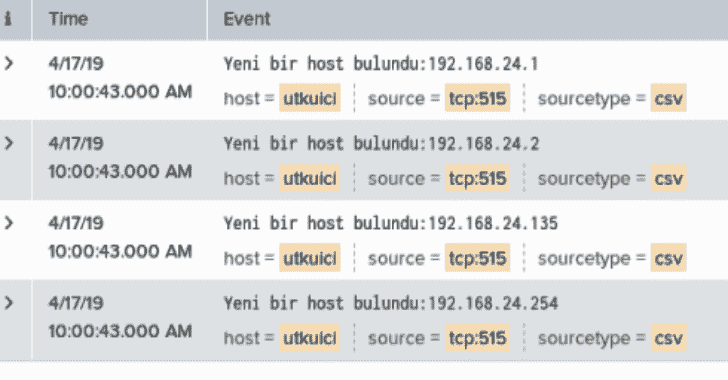
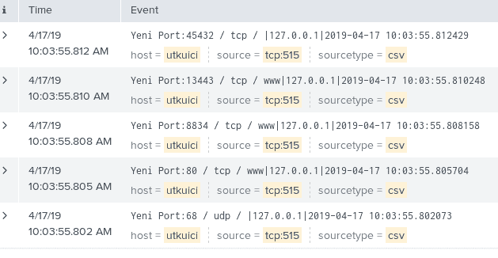
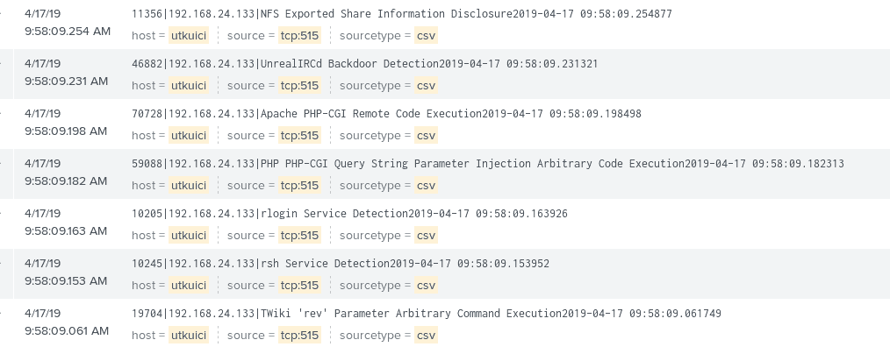

# utkuisi–无 us 自动化

> 原文：<https://kalilinuxtutorials.com/utkuici/>

今天，随着信息技术系统的普及，网络安全领域的投资有了很大程度的增加。执行漏洞管理、渗透测试和各种分析，以准确确定我们的机构受网络威胁的影响程度。利用漏洞管理工具的行业领导者 Tenable Nessus，可以确定刚刚加入公司网络的 IP 地址、新开放的端口、可利用的漏洞，并且已经开发了可以与 Tenable Nessus 集成工作的 python 应用程序 Utkuici，以自动识别这些进程。

## 特征

*   寻找新的 IP 地址
*   寻找新端口
*   发现新的可利用漏洞

## 安装

git 克隆[https://github.com/anil-yelken/Nessus-Automation](https://github.com/anil-yelken/Nessus-Automation)CD Nessus-Automation sudo pip 3 安装要求. txt

## 用法

代码中的 SIEM IP 地址应该更改。

为了准确检测新的 IP 地址，我们检查了 Nessus 扫描名称中是否使用了短语“主机发现”,并且在数据库中记录了带有时间戳的活动 IP 地址，并将不同的 IP 地址发送给 SIEM。主机表的内容如下:

用法:python finding-new-ip-nessus.py

通过检查 Nessus 进行的端口扫描，端口 IP 时间戳信息被记录在数据库中，它通过数据库检测新打开的服务，并将数据以“新端口:”端口 IP 时间戳的形式传输到 SIEM。SIEM 观察到的结果如下:

**用法:python finding-new-port-Nessus . py**

在机构和组织中进行的漏洞扫描的结果中，主要可利用的漏洞应该被关闭。同时，它会记录数据库中可能被机构中的 metasploit 利用的漏洞，并在系统上发现不同的可利用漏洞时将此信息传输给 SIEM。SIEM 观察到的可利用漏洞:

**用法:python finding-exploitable-service-Nessus . py**

[Click Here To Download](https://github.com/anil-yelken/Nessus-Automation)