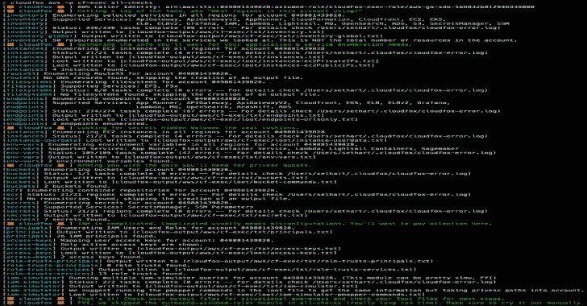

# Cloud fox——自动化云渗透测试的情境感知

> 原文：<https://kalilinuxtutorials.com/cloudfox-automating-situational-awareness-for-cloud-penetration-tests/>

[](https://blogger.googleusercontent.com/img/b/R29vZ2xl/AVvXsEjcFGgykuWe-W6_kEnUOlLoyRhiccYxQOjoRg_oiae1VTN9gXMe1wEiSwPm8Nhnuid3smlkEJdfey4Hol9YVsvm-Wv4OJVdNTdDBS-KBzrI-ouf0l0XAH4h-6mmiG6gxP2Cqv_IoUqrzz2Z1dpj6S4dZ1tHcY-BzRK_Os96vN2b5Q3ZmFl55GMwMbCL/s728/CloudFox.png)

**CloudFox** 帮助你在陌生的云环境中获得态势感知。这是一个开源命令行工具，旨在帮助渗透测试人员和其他攻击性安全专业人员在云基础设施中找到可利用的攻击路径。

## CloudFox 帮助您回答以下常见问题(以及更多问题):

*   该 AWS 客户使用哪些地区，客户中大约有多少资源？
*   EC2 用户数据或特定于服务的环境变量中隐藏着什么秘密？
*   这个[委托人]有什么操作/权限？
*   哪些角色信托过于宽松或允许跨账户假设？
*   我可以从外部起点(公共互联网)攻击哪些端点/主机名/IP？
*   我可以从内部起点攻击哪些端点/主机名/IP(假定在 VPC 内遭到攻击)？
*   我可以从 VPC 内部受损的资源中挂载哪些文件系统？

## 快速启动

CloudFox 是模块化的(您可以一次运行一个命令)，但是有一个 aws `all-checks`命令将为您运行其他 aws 命令，默认设置如下:

cloud fox AWS–profile[profile-name]所有检查


CloudFox 被设计为由具有有限只读权限的主体执行，但它的目的是帮助您找到可以在模拟的妥协场景中利用的攻击路径(也称为基于目标的渗透测试)。

完整的文档请参考我们的 [wiki](https://github.com/BishopFox/CloudFox/wiki) 。

## 支持的云提供商

| 供应者 | CloudFox 命令 |
| --- | --- |
| 自动警报系统 | Fifteen |
| 蔚蓝的 | 2(阿尔法) |
| GCP | 计划支持 |
| 库伯内特斯 | 计划支持 |

## 安装

**选项 1:** 下载适用于您平台的[最新二进制版本](https://github.com/BishopFox/cloudfox/releases)。

**选项 2:** [安装 Go](https://golang.org/doc/install) ，克隆 CloudFox 库并从源代码编译

```
# git clone https://github.com/BishopFox/cloudfox.git
...omitted for brevity...
# cd ./cloudfox
# go build .
# ./cloudfox
```

## 先决条件

### AWS

*   AWS CLI 已安装
*   支持 AWS 概要文件、AWS 环境变量或元数据检索(在 ec2 实例上)
    *   要一次在多个配置文件上运行命令，您可以使用`-l`标志指定一个文件的路径，该文件包含一个由新行分隔的配置文件名称列表，或者使用`-a`标志传递所有存储的配置文件。
*   附有一份推荐保单的委托人(如下所述)
*   推荐附政策: **`SecurityAudit` + [云狐定制政策](https://github.com/BishopFox/cloudfox/blob/main/misc/aws/cloudfox-policy.json)**

其他政策说明(截至 2022 年 9 月):

| 政策 | 笔记 |
| --- | --- |
| [云狐定制策略](https://github.com/BishopFox/cloudfox/blob/main/misc/aws/cloudfox-policy.json) | 拥有 cloudfox 使用的所有权限的完整列表，除此之外别无其他 |
| `arn:aws:iam::aws:policy/SecurityAudit` | 涵盖大多数 cloudfox 检查，但缺少较新的服务或权限，如 apprunner:*，grafana:*，lambda:GetFunctionURL，lightsail:GetContainerServices |
| `arn:aws:iam::aws:policy/job-function/ViewOnlyAccess` | 涵盖了大多数 cloudfox 检查，但缺少较新的服务或权限，如 AppRunner:*、grafana:*、lambda:GetFunctionURL、lightsail:GetContainerServices，还缺少 iam:SimulatePrincipalPolicy。 |
| `arn:aws:iam::aws:policy/ReadOnlyAccess` | 仅缺少 AppRunner，但也授予类似“s3:Get*”的权限，这可能过于宽松。 |
| `arn:aws:iam::aws:policy/AdministratorAccess` | 这对于 CloudFox 来说可以很好地工作，但是如果你作为一名渗透测试人员被授予这种级别的访问权限，这本身就应该是一个发现🙂 |

### 天蓝色

*   应用了查看者或类似权限。

## 支持的命令

| 供应者 | 命令名称 | 描述 |
| --- | --- | --- |
| 自动警报系统 | [所有检查](https://github.com/BishopFox/cloudfox/wiki/AWS-Commands#all-checks) | 使用合理的默认值运行所有其他命令。您仍然希望检查每个命令的非默认选项，但是这是一个很好的起点。 |
| 自动警报系统 | [访问键](https://github.com/BishopFox/cloudfox/wiki/AWS-Commands#access-keys) | 列出所有用户的活动访问键。有助于交叉引用您找到的密钥及其所属的范围内帐户。 |
| 自动警报系统 | [桶](https://github.com/BishopFox/cloudfox/wiki/AWS-Commands#filesystems) | 列出帐户中的存储桶，并为您提供方便的命令来进一步检查它们。 |
| 自动警报系统 | [控制室](https://github.com/BishopFox/cloudfox/wiki/AWS-Commands#ecr) | 列出所有存储库中最近推送的图像 URI。使用 loot 文件通过 docker/nerdctl 下拉选择的图像进行检查。 |
| 自动警报系统 | [终点](https://github.com/BishopFox/cloudfox/wiki/AWS-Commands#endpoints) | 枚举各种服务的终结点。从内部和外部位置扫描这些端点，查找不需要身份验证、配置错误等内容。 |
| 自动警报系统 | [环境变量](https://github.com/BishopFox/cloudfox/wiki/AWS-Commands#env-vars) | 从拥有环境变量的服务中抓取环境变量(支持 App Runner、ECS、Lambda、Lightsail containers、Sagemaker。如果你发现一个敏感的秘密，使用`cloudfox iam-simulator`和`pmapper`看看谁可以访问它们。 |
| 自动警报系统 | [文件系统](https://github.com/BishopFox/cloudfox/wiki/AWS-Commands#filesystems) | 列举不需要凭证就可以挂载的 EFS 和 FSx 文件系统(如果您有正确的网络访问权限)。例如，当您有`ec:RunInstance`但没有`iam:PassRole`时，这很有用。 |
| 自动警报系统 | [iam 模拟器](https://github.com/BishopFox/cloudfox/wiki/AWS-Commands#iam-simulator) | 类似于 pmapper，但是使用 IAM 策略模拟器。它使用 AWS 的评估逻辑，但值得注意的是，它不考虑通过 privesc 的可传递访问，这就是为什么你也应该总是使用 pmapper。 |
| 自动警报系统 | [实例](https://github.com/BishopFox/cloudfox/wiki/AWS-Commands#instances) | 枚举所有区域中 EC2 实例的有用信息，如名称、公共/私有 IP 和实例配置文件。生成 loot 文件，您可以将这些文件提供给 nmap 和其他服务枚举工具。 |
| 自动警报系统 | [库存](https://github.com/BishopFox/cloudfox/wiki/AWS-Commands#inventory) | 大致了解客户规模和首选地区。 |
| 自动警报系统 | [出站假定角色](https://github.com/BishopFox/cloudfox#outbound-assumed-roles) | 列出此帐户中委托人承担的角色。这是找到通向其他帐户的出站攻击路径的一个很好的方法。 |
| 自动警报系统 | [权限](https://github.com/BishopFox/cloudfox/wiki/AWS-Commands#permissions) | 枚举与所有用户和角色关联的 IAM 权限。Grep 该输出以确定特定主体拥有什么权限，而不是登录 AWS 控制台并费力地展开附加到您正在调查的主体的每个策略。 |
| 自动警报系统 | [委托人](https://github.com/BishopFox/cloudfox/wiki/AWS-Commands#principals) | 枚举 IAM 用户和角色，以便您可以轻松获得数据。 |
| 自动警报系统 | [角色信任](https://github.com/BishopFox/cloudfox/wiki/AWS-Commands#role-trusts) | 枚举 IAM 角色信任策略，以便您可以查找过于宽松的角色信任或查找信任特定服务的角色。 |
| 自动警报系统 | [路线 53](https://github.com/BishopFox/cloudfox/wiki/AWS-Commands#route53) | 枚举所有 route53 管理区域的所有记录。将此用于应用程序和服务枚举。 |
| 自动警报系统 | [秘密](https://github.com/BishopFox/cloudfox/wiki/AWS-Commands#secrets) | 列出秘密经理和 SSM 的秘密。在列表中寻找有趣的秘密，然后使用 use `cloudfox iam-simulator`和/或`pmapper`查看谁可以访问它们。 |
| 蔚蓝的 | [实例-地图](https://github.com/BishopFox/cloudfox/wiki/Azure-Commands#instances-map) | 枚举所有可用资源组和订阅中计算实例的有用信息 |
| 蔚蓝的 | [rbac-map](https://github.com/BishopFox/cloudfox/wiki/Azure-Commands#rbac-map) | 枚举所有租户的角色分配 |

[Click Here To Download](https://github.com/BishopFox/cloudfox)