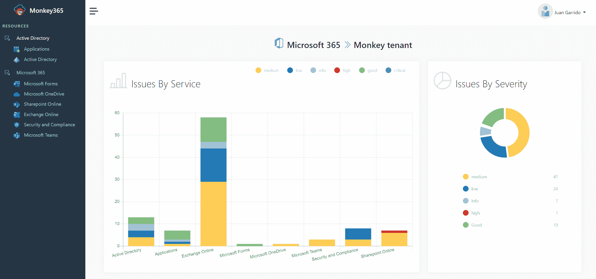

# monkey 365–安全顾问微软 365 的工具

> 原文：<https://kalilinuxtutorials.com/monkey365/>

[](https://blogger.googleusercontent.com/img/b/R29vZ2xl/AVvXsEjO4L5o9sOk9KppzinoTKNeKUCxh8DtqMom2orusncfyP4Mcflvd2r-tHFegc7FngjkKaAfM57B6iV3yVZGp8k8TLnMSpdP8-lYCyXogaNLtXCeoS-OBFnWdeYWytqpzDXN0hq3bCXxIcs9K-5cX4HLt-nzVJyn0E6xxa4Wj5HRr3IrY0fJpFYJnFls/s728/monkey365.png)

Monkey365 是一款开源安全工具，不仅可以用于轻松执行 Microsoft 365，还可以用于 Azure 订阅和 Azure Active Directory 安全配置审查，而无需从一开始就学习工具 API 或复杂的管理面板的大量开销。为了帮助这项工作，Monkey365 还提供了几种方法来确定所需租户设置和配置中的安全差距。Monkey365 就如何最佳配置这些设置以充分利用您的 Microsoft 365 租户或 Azure 订阅提供了宝贵的建议。

## 简介

Monkey365 是一个基于插件的 PowerShell 模块，可用于检查您的云环境的安全状况。使用 Monkey365，您可以根据安全最佳实践和合规标准，跨 Azure、Azure AD 和 Microsoft365 核心应用程序扫描公共云帐户中的潜在错误配置和安全问题。

## 安装

你可以点击[这个链接](https://github.com/silverhack/monkey365/archive/refs/heads/main.zip)下载最新的 zip，或者通过克隆[库](https://github.com/silverhack/monkey365.git)下载 Monkey365:

下载后，您必须解压缩文件，并将文件解压缩到合适的目录中。解压缩 zip 文件后，您可以使用 PowerShell V3 Unblock-File cmdlet 来取消阻止文件:

```
Get-ChildItem -Recurse c:\monkey365 | Unblock-File
```

一旦在系统上安装了 monkey365 模块，您可能会希望使用 Import-Module cmdlet 导入该模块。假设 Monkey365 位于`PSModulePath`中，PowerShell 会将 monkey365 加载到活动内存中:

```
Import-Module monkey365
```

如果 Monkey365 不在`PSModulePath`路径上，您可以使用显式路径导入:

```
Import-Module C:\temp\monkey365
```

如果您想将 Monkey365 模块重新导入到同一个会话中，也可以使用`Force`参数

```
Import-Module C:\temp\monkey365 -Force
```

## 基本用法

以下命令将提供可用命令行选项的列表:

```
Get-Help Invoke-Monkey365
```

要获得示例列表，请使用:

```
Get-Help Invoke-Monkey365 -Examples
```

要获得所有选项和示例的详细信息列表，请使用:

```
Get-Help Invoke-Monkey365 -Detailed
```

以下示例将从 Azure AD 和 SharePoint Online 检索数据和元数据，然后打印结果。如果没有提供凭证，Monkey365 将提示输入凭证。

```
$param = @{
    Instance = 'Microsoft365';
    Analysis = 'SharePointOnline';
    PromptBehavior = 'SelectAccount';
    IncludeAzureActiveDirectory = $true;
    ExportTo = 'PRINT';
}
$assets = Invoke-Monkey365 @param
```

## 法规合规性检查

Monkey365 不仅有助于简化执行 Microsoft 365 的流程，还有助于简化 Azure 订阅和 Azure Active Directory 安全审查的流程。

160 多项检查，涵盖微软 365、Azure 和 Azure Active Directory 的行业定义的安全最佳实践。

Monkey365 将帮助顾问评估云环境，并根据控制和最佳实践分析风险因素。该报告将包含用于快速检查和验证结果的结构化数据。



## 支持的标准

默认情况下，HTML 报告向您显示 CIS(互联网安全中心)基准。Azure 和 Microsoft 365 的 CIS 基准是安全性和合规性最佳实践的指南。

Monkey365 支持以下标准:

*   CIS 微软 Azure 基础基准 1.4.0 版
*   CIS 微软 365 基础性能指标评测 1.4.0 版

更多标准将在下一个版本中添加(NIST、HIPAA、GDPR、PCI-DSS 等..)因为它们是可用的。

安装或高级使用等附加信息可在以下[链接](https://silverhack.github.io/monkey365/)中找到

[Click Here To Download](https://github.com/silverhack/monkey365)