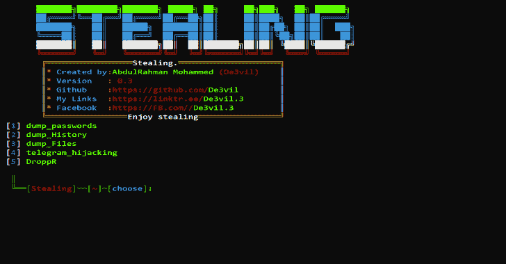
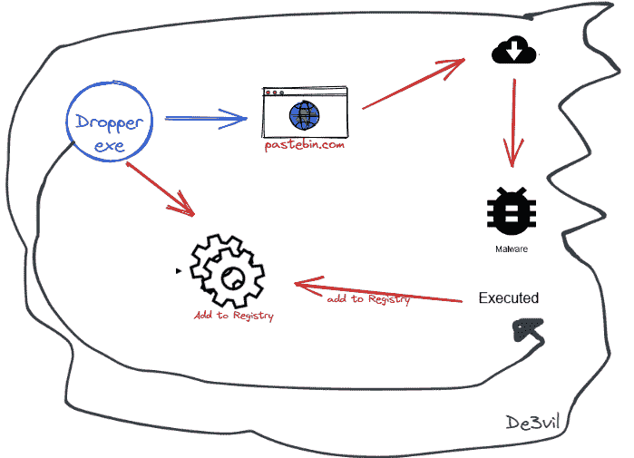
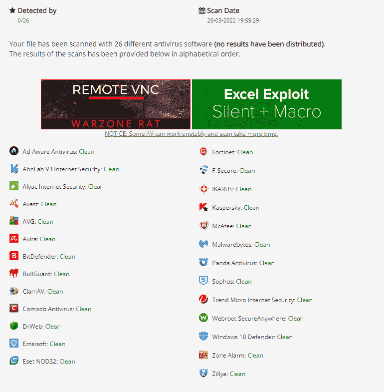

# 窃取:为社会工程设计的开源渗透测试框架

> 原文：<https://kalilinuxtutorials.com/stealing/>

[](https://blogger.googleusercontent.com/img/b/R29vZ2xl/AVvXsEh0BtLgmz-APdYh0YNzQuEYbDTV0HAf0QjMxPSF32IxG8JsC8pnBv5WzdBHfDabV2DfN3G9GGzIyXfaMtRqcFyQ4w56_4MUuxOLAwHgBZ08Qm_FsBodvvHhUgbHN9B_8ff4kfeh6g9mECp0MG1vYRJXCI-STdcweY_BVym9hZEy9QVVouV5joCFlOVN/s728/SteaLinG-2.png)

**窃取**是一个开源的渗透测试框架，是为黑客攻击后的社交工程设计的，你可以上传到受害者的设备上运行。

## 放弃

这仅用于测试目的，并且只能在严格同意的情况下使用。不要将此用于非法目的

## 我如何从这个项目中获益？

*   你可以用它
*   对于开发者来说，你可以阅读源代码，试着理解如何制作这样一个项目

## 特性

* * *

| 组件 | 简短描述 |
| --- | --- |
| **转储密码** | 窃取所有保存的密码，上传文件 a 密码保存到 mega |
| **转储历史** | 转储浏览器历史记录 |
| **转储文件** | 从带有您想要的扩展名的硬盘上窃取文件 |

* * *

## 新功能

| 组件 | 简短描述 |
| --- | --- |
| **1-电报会话劫持** | 电报会话劫持者 |

*   它是如何工作的？Telegram 中的记录会话存储在本地“tedata”文件夹的特定路径`C:\Users<pc name >\AppData\Roaming\Telegram Desktop`中

```
C:
└── Users
    ├── .AppData
    │   └── Roaming
    │       └── TelegramDesktop
    │           └── tdata 
```

一旦您将此文件夹及其所有内容移动到您设备上的同一路径中，接下来您要做的事情就很简单了。该工具完成所有这一切，您所要做的就是在站点上给它一个令牌`https://anonfiles.com/`第一步是转到 tdata 文件所在的路径，然后将其转换为 zip 文件。当然，如果电报工作正常，这就不会发生。如果有任何错误，这意味着电报是开放的，所以我会做杀死过程。反病毒你会看到这是恶意行为，所以我尽量避免这一部分，除了在代码中存档文件的名称用于受害者的设备名称，因为如果你有一个以上的设备，我的意思是，在那之后，你会在 anonfiles 网站上使用 API 密钥或你在该网站上的帐户令牌发布对 zipfile 的请求。在它上面，你会找到你的令牌，老师，它没有被任何 AV 暴露

| 组件 |
| --- |
| **2-滴流器** |

*   他对你有什么要求？
*   它是如何工作的？？要求它问你的第一件事是病毒的`URL`或者你想下载到受害者设备上的任何东西，但是记住`URL must be direct`，这意味着它必须结束它的阎罗王`.exe or .png,`重要的是它是一个以 backstamp 结束的链接第二件事是从你那里拿走 API Kay，你也要回答它。要么你注册，点击单词 API，你会找到它，你会得到用户名和密码，那么它是如何工作的？

第一件事是在网站上创建一个粘贴，并使其私有，然后它添加您给它的 url，然后它给你 exe 文件，它的功能是，当它在任何设备上工作时，它开始以两种不同的方式将自己添加到注册表设备中，它开始打开 pastebin 并插入您创建的特殊粘贴，获取粘贴 url，下载其内容并运行，您可以随时输入 url 并放置另一个 url。这是非常正常的，因为滴管每 10 分钟一次。检查 URL。如果它找到它，它就改变它，下载它的内容，下载它，并连接以找到它。你什么都不用做，所以，每 10 分钟，你就可以从任何地方访问你的设备



3- Linux 支持

4-你现在可以选择 Mega 或 Pastebin

## 要求

*   python >= 3.8 ++下载 [Python](https://www.python.org/ftp/python/3.8.10/python-3.8.10-amd64.exe)
*   操作系统:Windows
*   操作系统:Linux

## 安装到 Windows:

```
git clone https://github.com/De3vil/SteaLinG.git
cd SteaLinG
pip install -r requirements.txt
python SteaLinG.py
```

## 安装到 Linux

```
git clone https://github.com/De3vil/SteaLinG.git
cd SteaLinG
chmod +x linux_setup.sh
bash linux_setup.sh
python SteaLinG.py
```

## 警告

```
* Don't Upload in VirusTotal.com Bcz This tool will not work with Time.
* Virustotal Share Signatures With AV Comapnies.
* Again Don't be an Idiot!
```

**AV 检测**

[Click Here To Download](https://github.com/De3vil/SteaLinG)