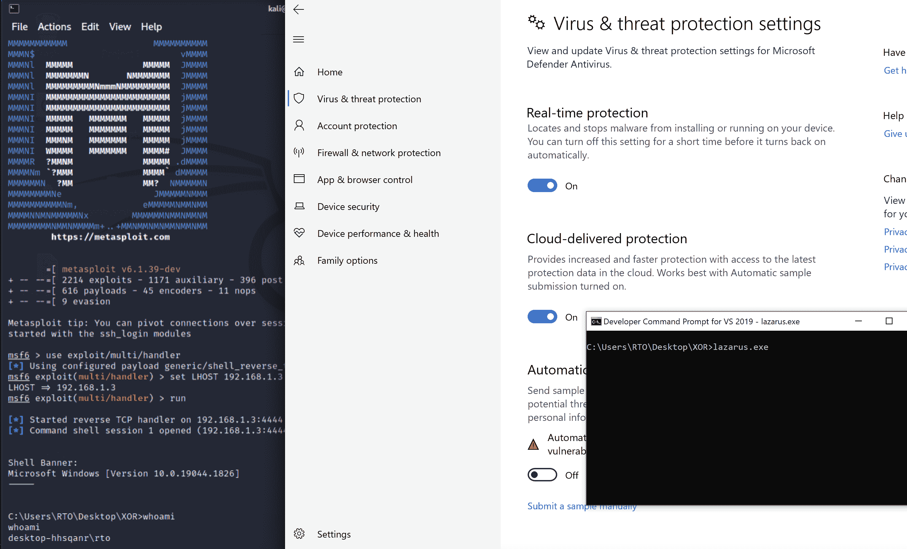
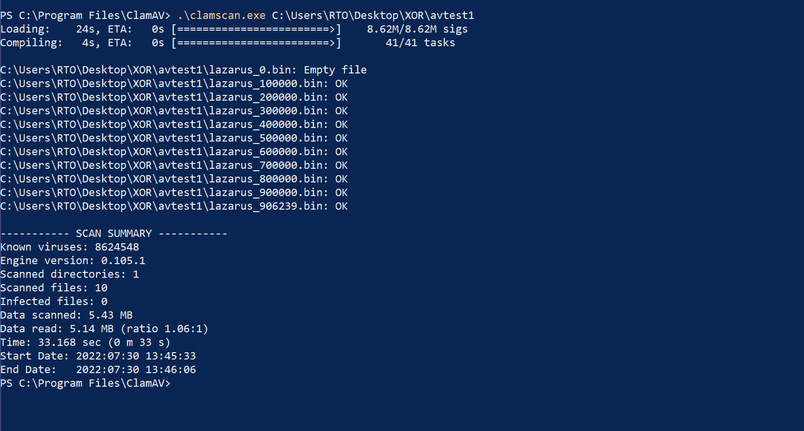
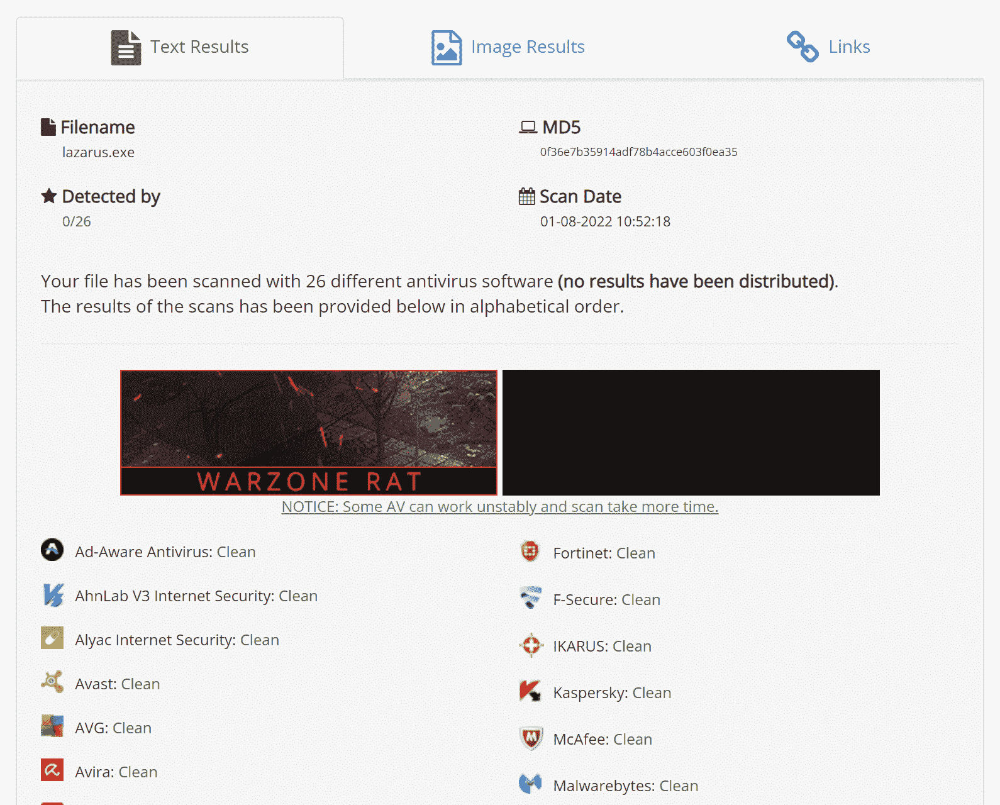

# FUD-UUID-外壳代码:另一个绕过 Windows Defender 的外壳代码

> [https://kallinuxxtauthorities . com/fud-uuid-shell code/](https://kalilinuxtutorials.com/fud-uuid-shellcode/)

[](https://blogger.googleusercontent.com/img/b/R29vZ2xl/AVvXsEiaeALrehe_3iqrgf16SeiquqIZ_3fDtdm4toevIq2TQLgeSzqH5wHJvy7gpNOtD3H4EjRIspBCzalvzanw-be3iEiMw0qAXm9MpqqvSLq4r145Lsj4DY3b9mk7CtkTZ3ss2uHKwiRvmjOcTwK8Yg8I_OUuU_LHRfbasZ0xdbNda5zSxR8rAizuxlq5/s728/FUD-UUID-Shellcode.png)

**FUD-UUID-外壳代码**是另一种使用 C++的外壳代码注入技术，它试图使用异或加密魔法和 UUID 字符串**疯狂**绕过 Windows Defender。

# 它是如何工作的？

## 外壳代码生成

首先，生成二进制格式的有效载荷(使用`CobaltStrike`或`msfvenom`)例如，在`msfvenom`中，你可以这样做(我使用的有效载荷是为了**说明**的目的，你可以使用任何你想要的有效载荷):

MSF venom-p windows/messagebox-f raw-o shellcode . bin

然后使用 Python3 脚本`bin_to_uuid.py`将外壳代码(二进制/原始格式)转换成`UUID`字符串格式:

。/bin _ to _ uuid . py-p shell code . bin > uuid . txt

`xor`使用 Python3 脚本`xor_encryptor.py`加密`uuid.txt`中的`UUID`字符串。

。/xor _ encryptor . py uuid . txt > xor _ crypted _ out . txt

复制文件`xor_crypted_out.txt`中的`C-style`数组，粘贴到 C++文件中作为`unsigned char`的数组，即`unsigned char payload[]{your_output_from_xor_crypted_out.txt}`

## 执行

这种外壳代码注入技术包括以下后续步骤:

*   首先，它通过`VirtualAlloc`为有效载荷的执行和驻留分配虚拟内存
*   它`xor`使用`xor`密钥值解密有效载荷
*   使用`UuidFromStringA`将`UUID`字符串转换成它们的二进制表示，并将它们存储在之前分配的内存中。这是用来避免使用可疑的 API，如`WriteProcessMemory`或`memcpy`。
*   使用`EnumChildWindows`执行先前加载到内存中的有效载荷(在步骤 1 中)

# 是什么让它独一无二？

*   它不使用像`memcpy`或`WriteProcessMemory`这样已知会向 AVs/EDRs 发出警报的标准函数，该程序使用名为`UuidFromStringA`的 Windows API 函数，该函数可用于解码数据并将其写入内存(**这不是很棒吗？** *请不要说“不”*🙂 ).
*   它使用**函数调用混淆**技巧来调用 Windows API 函数
*   最后，因为它看起来很独特🙂(*不是吗？*🙂)

# 重要

*   你必须把`xor`键(第 85 行)改成你想要的。这也必须在`./xor_encryptor.py` python3 脚本中通过改变`KEY`变量来完成。钥匙必须匹配！
*   您必须将默认的`executable filename`值(第 90 行)更改为您的文件名。
*   但是你可以使用任何你喜欢的编译器。🙂

## 编译

*   只需在您的终端/shell 中运行:

```
make
```

## **概念验证(PoC )**



## 静态分析



## AV 扫描结果

在 2022 年 1 月 8 日使用 [antiscan.me](https://antiscan.me/scan/new/result?id=3IYj6CtMq6h8) 扫描二进制文件。

[Click Here To Download](https://github.com/Bl4ckM1rror/FUD-UUID-Shellcode)