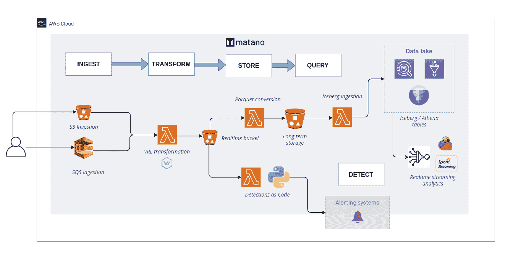

# matano:AWS 的开源安全湖平台

> 原文：<https://kalilinuxtutorials.com/matano/>

[](https://blogger.googleusercontent.com/img/b/R29vZ2xl/AVvXsEi7LcFlmSyKRgBm6WtuQ_x651wxZVATu3_cgES9uAhm_hRjbxylEXmCrxoFrBUqM6HYEnUbsPLAl00C-B_o4DLuLu9WA9bF2SGXN5Apc8Ig1qixdYt03yg9-gjl7WiLnjVIS_TkahZkbR_9VdPmkmFaTd0X-baIJf37trTjCU_UjZch7wRyoOI47OqD/s728/image.psd(1).png)

**Matano** 是 AWS 的开源安全湖平台。它允许您从各种来源获取数 Pb 的安全和日志数据，在开放的 Apache Iceberg 数据湖中存储和查询它们，并创建 Python 检测作为实时警报的代码。Matano 是完全无服务器的，专为 AWS 设计，专注于实现高规模、低成本和零运营。Matano 完全部署到您的 AWS 帐户中。



## 特征

#### 从你所有的来源收集数据

Matano 允许您使用 [S3](https://github.com/matanolabs/matano#) 或基于 SQS 的摄取从源收集日志数据。

#### 接收、转换和规范化日志数据

Matano 使用[矢量重映射语言(VRL)](https://vector.dev/docs/reference/vrl/) 对数据进行标准化和转换。默认情况下，Matano 使用[弹性公共模式(ECS)](https://www.elastic.co/guide/en/ecs/current/index.html) ，您可以定义自己的模式。

#### 将数据存储在 S3 对象存储器中

日志数据始终存储在 S3 对象存储中，以实现经济高效的长期持久存储。

#### 阿帕奇冰山数据湖

所有数据都被吸收到基于 Apache Iceberg 的数据湖中，允许您对所有日志数据执行 ACID 事务、时间旅行等等。Apache Iceberg 是一种开放的表格格式，所以您总是**拥有自己的数据**，没有供应商限制。

#### 无服务器

Matano 是一个完全无服务器的平台，旨在实现零运营和无限制的弹性水平扩展。

#### 作为代码的检测

编写 Python 检测来实现对日志数据的实时警报。

## 安装

[**查看完整的安装说明。**](https://www.matano.dev/docs/installation)

您可以安装 matano CLI，将 matano 部署到您的 AWS 帐户中，并管理您的 Matano 部署。

### 要求

*   码头工人

### 安装

Matano 为[提供了一个包含最新预构建文件的夜间版本](https://github.com/matanolabs/matano/releases/tag/nightly),用于在 GitHub 上安装 Matano CLI。您可以下载并执行这些文件来安装 Matano。

例如，要安装 Matano CLI for Linux，请运行:

```
curl -OL https://github.com/matanolabs/matano/releases/download/nightly/matano-linux-x64.sh
chmod +x matano-linux-x64.sh
sudo ./matano-linux-x64.sh
```

## 开始使用

[**阅读完整的入门文档**](https://www.matano.dev/docs/getting-started) 。

### 部署

要开始使用 Matano，运行`matano init`命令。确保您的环境中(或 AWS CLI 配置文件中)有 AWS 凭据。

交互式 CLI 向导将通过为您生成一个初始的 [Matano 目录](https://www.matano.dev/docs/matano-directory)，初始化您的 AWS 帐户，并将 Matano 部署到您的 AWS 帐户来引导您入门。

[Click Here To Download](https://github.com/matanolabs/matano)