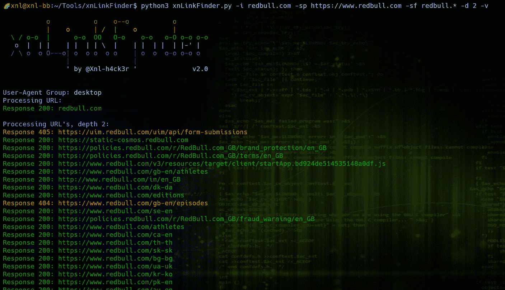
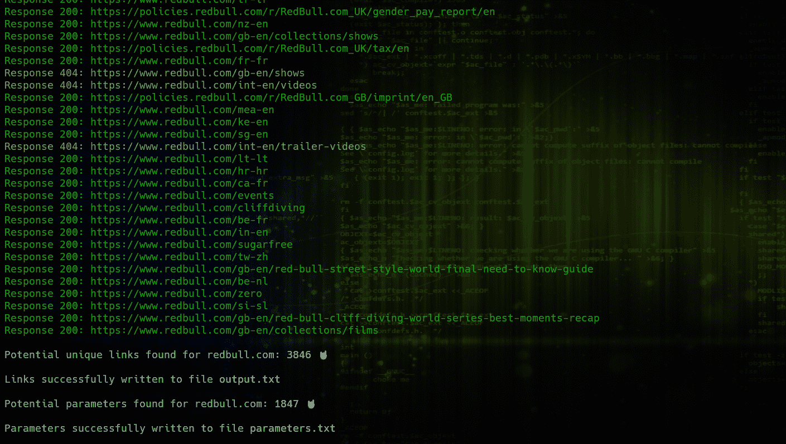
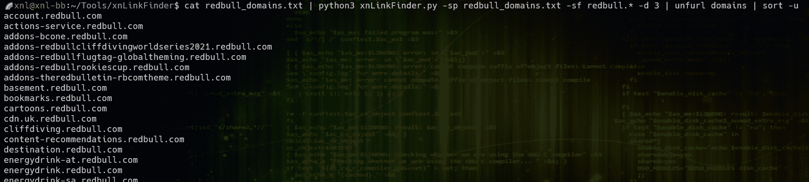

# xnLinkFinder:用于发现端点和潜在参数的 Python 工具

> 原文：<https://kalilinuxtutorials.com/xnlinkfinder/>

[](https://blogger.googleusercontent.com/img/b/R29vZ2xl/AVvXsEhylBCGlMzTq64GTnq5I6UzW6ypFcj-7HsIgQccOWSBnEa1_gwmOCBbypw2Weh7NbZDH9KEWbUXhAcaMnmM7I5yUkiHP3dLjFaWvhpE2Jc4sKZrPiKXKbi6r2aRnCHqXCW5uqw-2gqawHWbJmaGL4gqp9BTxST7pRDaf4G1Jk9cDS4VoljQyTj9v5QD/s728/xnLinkFinder.png)

xnLinkFinder 是一个工具，用于发现给定目标的端点(和潜在参数)。它可以通过以下方式找到它们:

*   搜索目标(传递域/URL)
*   搜索多个目标(传递一个域/URL 文件)
*   在给定目录中搜索文件(传递目录名)
*   从 Burp 项目中获取它们(传递 Burp XML 文件的位置)
*   从 OWASP ZAP 项目中获取它们(传递 ZAP ASCII 消息文件的位置)
*   处理 [waymore](https://github.com/xnl-h4ck3r/waymore) 结果目录(搜索来自`waymore -mode R`的存档响应文件，并请求来自`waymore.txt`的 URL 和来自`index.txt`的原始 URL–参见 [waymore README.md](https://github.com/xnl-h4ck3r/waymore/blob/main/README.md) )

python 脚本基于我的 Burp 扩展 [GAP](https://github.com/xnl-h4ck3r/burp-extensions) 的链接查找功能。作为起点，我使用了 Gerben Javado 的神奇工具 [LinkFinder](https://github.com/GerbenJavado/LinkFinder) ，并使用正则表达式查找链接，但做了额外的改进以找到更多链接。

## 安装

xnLinkFinder 支持 **Python 3** 。

```
$ git clone https://github.com/xnl-h4ck3r/xnLinkFinder.git
$ cd xnLinkFinder
$ sudo python setup.py install

```

## 用法

| 银 | 长参数 | 描述 |
| --- | --- | --- |
| ［构成来自拉丁语、结尾为-us 的名词的复数］ | –输入 | 输入 a: URL、URL 的文本文件、要搜索的文件目录、Burp XML 输出文件或 OWASP ZAP 输出文件。 |
| 表示“具有…性质的” | –输出 | 保存链接输出的文件，必要时包括路径(默认值:output.txt)。如果设置为`cli`，则输出仅写入标准输出。如果该文件已经存在，它将被追加到(和去重复)，除非选项`-ow`被传递。 |
| -op | –输出参数 | 保存潜在参数输出的文件，必要时包括路径(默认值:parameters.txt)。如果设置为`cli`，则输出仅写入 STDOUT(但不会通过管道传送到另一个程序)。如果该文件已经存在，它将被追加到(和去重复)，除非选项`-ow`被传递。 |
| -噢 | –输出-覆盖 | 如果输出文件已经存在，它将被覆盖，而不是被追加。 |
| -sp | –范围前缀 | 在输出中，任何以`/`开头的链接都将以 scope domains 作为前缀，而不是原来的链接。如果传递的值是有效的文件名，将使用该文件，否则将使用字符串文字。 |
| -spo | –范围前缀原始 | 如果参数`-sp`被传递，那么这将决定以`/`开始的原始链接是否也包含在输出中(默认值:false) |
| -科幻 | –范围过滤器 | 将过滤输出链接，仅在链接的域在指定范围内时包含它们。如果传递的值是有效的文件名，将使用该文件，否则将使用字符串文字。 |
| -丙 | –cookie | 添加 cookies 以通过 HTTP 请求。以格式`'name1=value1; name2=value2;'`传入 |
| -H | –接头 | 添加与 HTTP 请求一起传递的自定义标头。以格式`'Header1: value1; Header2: value2;'`传入 |
| -拉 | –正则表达式后 | 正则表达式，用于在输出前对找到的端点进行过滤(例如`/api/v[0-9]\.[0-9]\*`)。如果匹配，则输出链接。 |
| -d | –深度 | 要搜索的深度级别。例如，如果传递的值为 2，那么将在最初找到的所有链接中搜索更多的链接(默认值为 1)。对于 Burp 文件，此选项会被忽略，因为它们可能会很大并消耗大量内存。还建议使用`-sp` ( `--scope-prefix`)参数来确保可以尝试对没有域的链接的请求。 |
| -p | –流程 | 当获得对一个 URL 或 URL 文件(不是一个 Burp 文件)的请求时，就完成了基本的多线程处理。该参数决定了使用的进程(线程)数量(默认值:25) |
| ［加在以-u 结尾的法语词源的名词之后构成复数］ | –排除 | 逗号分隔列表中的附加链接排除(到`config.yml`中的列表)，例如`careers,forum` |
| -orig | –来源 | 是否希望链接的原点出现在输出中。在输出中显示为`LINK-URL [ORIGIN-URL]`(默认:假) |
| 相当于-ED | –超时 | 放弃前等待服务器发送数据的秒数(默认值:10 秒) |
| -公司 | –包括 | 在输出中包含输入(`-i`)链接(默认值:false) |
| -你 | –用户代理 | 为哪些用户代理获取链接，例如`-u desktop mobile` |
| -不安全 | † | 发出请求时是否应禁用 TLS 证书检查(delfault: false) |
| -s429 | † | 当 95%以上的响应返回 429 过多请求时停止(默认值:false) |
| -s403 | † | 当超过 95%的响应返回 403 禁止时停止(默认值:false) |
| -sTO | † | 当超过 95%的请求超时时停止(默认值:false) |
| -sCE | † | 当 95%以上的请求有连接错误时停止(默认值:false) |
| -m | –内存阈值 | 内存阈值百分比。如果机器的内存超过阈值，程序将会停止并在内存耗尽之前正常结束(默认值:95) |
| -mfs | –最大文件大小 | 如果-i 是目录，要检查的文件的最大文件大小(以字节为单位)。如果文件大小超过，它将被忽略(默认值:500 MB)。设置为 0 意味着无论文件大小如何，都不会被忽略.. |
| -重播-代理 | † | 对于使用 URL(或 URL 文件)的主动链接查找，通过此代理重播请求。 |
| -仅限 ascii |  | 是否仅当链接和参数仅包含 ASCII 字符时才添加它们。当您知道目标很可能使用 ASCII 字符，并且由于某种原因您也从二进制文件中得到许多误报时，这可能是有用的。 |
| -v | –冗长 | 详细输出 |
| -vv | –vver bose | 增加了详细输出 |
|  | –版本 | 显示当前版本号。 |
| -h | 救命 | 显示帮助信息并退出 |

与目录、BURP XML 文件或 OWASP ZAP 文件的输入无关

## config.yml

`config.yml`文件中的密钥可以根据您的需要进行更新:

*   `linkExclude`–逗号分隔的字符串列表(如`.css,.jpg,.jpeg`等)。)来检查所有链接。如果一个链接包含任何字符串，那么它将被排除在输出之外。如果输入是一个目录，那么根据这个列表检查文件名。
*   `contentExclude`–逗号分隔的字符串列表(如`text/css,image/jpeg,image/jpg`等)。)来检查所有响应`Content-Type`报头。具有这些内容类型的任何回复都将被排除，并且不会检查链接。
*   `fileExtExclude`–逗号分隔的字符串列表(如`.zip,.gz,.tar`等)。)来检查目录模式下的所有文件。如果文件具有这些扩展名之一，将不会搜索它的链接。
*   `regexFiles`–由竖线字符(如`php|php3|php5`等)分隔的文件类型列表。).当发现的不是明显的链接，而是您想要挑选出来的有趣的文件类型时，可以在链接查找正则表达式中使用它们。如果您添加到这个列表，请确保您转义任何点，以确保正确的正则表达式，例如`js\.map`
*   `respParamLinksFound`——是否从响应中找到的链接中获取潜在参数:`True`或`False`
*   `respParamPathWords`——是否在检索到的链接中添加路径词作为潜在参数:`True`或`False`
*   `respParamJSON`——如果响应的 MIME 类型包含 JSON，是否添加 JSON 键值作为潜在参数:`True`或`False`
*   `respParamJSVars`——是否添加设置了`var`、`let`或`const`的 javascript 变量作为潜在参数:`True`或`False`
*   `respParamXML`——如果响应的 MIME 类型包含 XML，是否添加 XML 属性值作为潜在参数:`True`或`False`
*   `respParamInputField`——如果响应的 MIME 类型包含 HTML，是否添加任何输入字段的名称和 ID 属性作为潜在参数:`True`或`False`
*   `respParamMetaName`——如果响应的 MIME 类型包含 HTML，是否添加任何 META 标签的 NAME 属性作为潜在参数:`True`或`False`

如果在配置文件中找不到，它们将默认为`True`

## 例子

### 查找特定目标的链接-基本

```
python3 xnLinkFinder.py -i target.com

```

### 查找特定目标的链接-详细

理想情况下，为主要域(包括模式)提供范围前缀(`-sp`)，并提供一个范围过滤器(`-sf`)，以便只过滤相关域的结果(这可以是文件或范围域)。此外，您可以传递 cookies 和客户标题，以确保您找到的链接只对授权用户可用。指定用户代理(`-u desktop mobile`)将首先使用桌面用户代理搜索所有链接，然后使用移动用户代理重试。可能存在与给定用户代理相关的特定端点。给定一个深度值(`-d`)将继续向先前深度搜索中找到的链接发送请求，以找到更多链接。

```
python3 xnLinkFinder.py -i target.com -sp target_prefix.txt -sf target_scope.txt -spo -inc -vv -H 'Authorization: Bearer XXXXXXXXXXXXXX' -c 'SessionId=MYSESSIONID' -u desktop mobile -d 10
```

### 从 URL 列表中查找链接——基本

例如，如果您有一个包含 JS 文件 URL 的文件，您可以在这些文件中查找链接:

```
python3 xnLinkFinder.py -i target_js.txt
```

### 从目录中的文件中查找链接——基本

如果你有一个文件，例如 JS 文件，HTTP 响应等。您可以在以下网址中查找链接:

```
python3 xnLinkFinder.py -i ~/Tools/waymore/results/target.com
```

注意:还会检查子目录。可以指定`-mfs`选项来跳过超过一定大小的文件。

### 查找基础打嗝项目的链接

在 Burp 中，通过突出显示范围选择您想要搜索的项目，例如，右键单击并选择`Save selected items`。确保在保存前勾选了选项`base64-encode requests and responses`选项。从文件中获取所有链接(即使文件很大，您也可以获取所有链接):

```
python3 xnLinkFinder.py -i target_burp.xml
```

注意:xnLinkFinder 假设如果用`-i`传递的文件的第一行以`<?xml`开始，那么您正在尝试处理一个 Burp 文件。

### 从一个详细的打嗝项目中找到链接

理想情况下，为主要域(包括模式)提供范围前缀(`-sp`)，并提供一个范围过滤器(`-sf`)，以便只过滤相关域的结果。

```
python3 xnLinkFinder.py -i target_burp.xml -o target_burp.txt -sp https://www.target.com -sf target.* -ow -spo -inc -vv
```

### 查找 OWASP ZAP 项目的链接——基础

在 ZAP 中，通过突出显示历史来选择您想要搜索的项目，例如，单击菜单`Report`并选择`Export Messages to File...`。这将允许您保存一个 ASCII 文本文件，其中包含您想要搜索的所有请求和响应。从文件中获取所有链接(即使文件很大，您也可以获取所有链接):

```
python3 xnLinkFinder.py -i target_zap.txt
```

注意:xnLinkFinder 假设如果用`-i`传递的文件的第一行是格式`==== 99 ==========`，例如，那么您正在尝试处理一个 OWASP ZAP ASCII 文本文件。

### 从 Waymore 结果目录中查找链接

可以使用 [waymore](https://github.com/xnl-h4ck3r/waymore) 工具从各种第三方 API 获取 URL，也可以从 archive.org(way back Machine)下载存档的响应。将 waymore 结果目录传递给 xnLinKFinder 将搜索存档响应的内容，还会从`waymore.txt`请求 URL，从`index.txt`请求存档的 URL，并从这些响应中获取更多链接。

```
python3 xnLinkFinder.py -i ~/Tools/waymore/results/target.com
```

注意:它是作为一个普通的目录传递的，但是 xnLinkFinder 会分别确定它是一个 waymore 结果目录和进程。

### 其他工具的管道

您可以通过管道将 xnLinkFinder 连接到其他工具。任何错误都被发送到`stderr`，任何找到的链接都被发送到`stdout`。除了通过管道连接到下一个程序的链接之外，仍然会创建输出文件。但是，潜在的参数不会通过管道传递给下一个程序，但它们仍然会写入文件。例如:

```
python3 xnLinkFinder.py -i redbull.com -sp https://redbull.com -sf rebbull.* -d 3 | unfurl keys | sort -u
```

也可以通过`stdin`而不是`-i`传递输入。

```
cat redbull_subs.txt | python3 xnLinkFinder.py -sp https://redbull.com -sf rebbull.* -d 3
```

注意:你不能通过管道输入一个 Burp 或 ZAP 文件，这些必须使用`-i`来传递。

## 建议和说明

*   总是使用作用域前缀参数`-sp`。这可以是一个作用域，也可以是包含多个作用域的文件。以下是所用格式的示例(不应包含路径，也不应使用通配符。Schema 是可选的，但默认为 http): `http://www.target.com https://target-payments.com https://static.target-cdn.com`如果发现一个没有域的链接，例如`/path/to/example.js`，那么传递`-sp http://www.target.com`将导致输出`http://www.target.com/path/to/example.js`，如果 Depth ( `-d`)是> 1，那么将能够向该 URL 发出请求以搜索更多的链接。如果使用`-sp`传递一个域文件，那么输出将包括每个域，后跟`/path/to/example.js`，并增加找到更多链接的机会。
*   如果您使用了`-sp`，但仍然希望在输出中额外返回`/path/to/example.js`(没有域)的原始链接，则传递参数`-spo`。
*   始终使用范围过滤器参数`-sf`。这将确保在输出中只返回相关的域，更重要的是，如果 Depth ( `-d`)是> 1，那么将不会在范围外的目标中搜索链接或参数。这可以是一个作用域，也可以是包含多个作用域的文件。下面是使用的格式的例子(不应该包括模式或路径):`target.* target-payments.com static.target-cdn.com`这是过滤链接域只。
*   如果您想以任何方式过滤最终输出，请使用`-ra`。使用[https://regex101.com/](https://regex101.com/)来检查你的正则表达式是否会如你所愿，这总是一个好主意。
*   使用`-v`选项更好地了解工具正在做什么。
*   如果您有问题，使用`-vv`选项，它可能会显示正在发生的错误，这些错误可能会得到解决，或者您可以在 github 上提出问题。
*   在单引号内传递 cookie(`-c`)、header(`-H`)和 regex ( `-ra`)值，例如`-ra '/api/v[0-9]\.[0-9]\*'`
*   设置`-o`选项为链接指定一个特定的输出文件名，而不是默认的`output.txt`。如果你计划运行大深度的搜索，用选项`-v`从 2 开始，检查返回的是什么。然后你可以增加深度，新的输出将被追加到现有的文件中，除非你通过了`-ow`。
*   设置`-op`选项，为潜在参数指定一个特定的输出文件名，而不是默认的`parameters.txt`。任何输出都将被附加到现有文件中，除非你通过`-ow`。
*   如果使用高深度(`-d`)要警惕一些使用动态链接的网站，它会不断发现新的。如果没有找到新的链接，xnlLinkFinder 将停止搜索。还应考虑提供停止标志(`s429`、`s403`、`sTO`、`sCE`)。
*   如果您正在查找大量链接(尤其是如果深度(`-d`值很高)，并且资源有限，则程序将在达到内存阈值(`-m`)值时停止，并在被终止之前优雅地结束，数据保持不变。
*   如果您在运行过程中决定取消 xnLinkFinder(使用`Ctrl-C`)，请耐心等待，任何收集的数据都会在正常结束前保存下来。
*   使用`-orig`选项将显示找到链接的 URL。这可能意味着，如果在多个源上发现了相同的链接，那么在输出中会有重复的链接，但是它会以方括号中的原始 URL 作为后缀。
*   发出请求时，xnLinkFinder 将使用当前组中的一个随机用户代理，默认为`desktop`。如果您有一个目标，它可以为不同的用户代理组提供不同的链接，例如，指定`-u desktop mobile`(用空格分隔)。`mobile`用户代理选项是`mobile-apple`、`mobile-android`和`mobile-windows`的组合。
*   当`-i`被设置到一个目录时，将在该目录的根目录中的文件内容中搜索链接。不搜索子目录中的文件。任何超过`-mfs`设置大小的文件(默认:500 MB)都将被跳过。
*   使用`-replay-proxy`选项时，有时请求会花费更长时间。如果你开始看到更多的`Request Timeout`错误(如果你使用`-v`或`-vv`选项，你会看到错误)，那么考虑使用`-t`来提高超时限制。
*   如果你知道一个目标在链接和参数中只有 ASCII 字符，那么考虑传递`-ascii-only`。这可以消除一些有时从二进制数据中返回的误报。
*   如果您传递一个 [waymore](https://github.com/xnl-h4ck3r/waymore) 结果目录，那么传递`-d` / `--depth`参数来搜索从 URL 请求中找到的任何额外链接是值得的，如果您认为可能会找到不同的内容，也可以传递`-u` / `--user-agent`，例如`-u desktop mobile`。

## 问题

如果您遇到任何问题，或者有改进的想法，请随时在 Github 上提出问题。如果有问题，如果您能够提供您运行的确切命令和问题的详细描述，将会非常有用。如果可能，运行`-vv`来重现问题，并让我知道给出的任何错误消息。

## 示例输出

域的活动链接查找:



管道输入和输出:

[Click Here To Download](https://github.com/xnl-h4ck3r/xnLinkFinder)