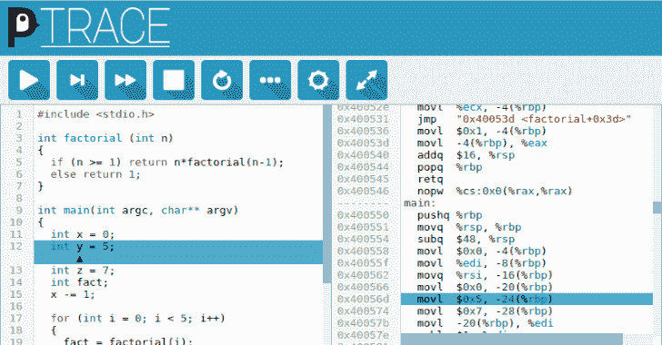

# PenguinTrace:显示代码如何在硬件级别运行的工具

> 原文：<https://kalilinuxtutorials.com/penguintrace/>

[](https://blogger.googleusercontent.com/img/b/R29vZ2xl/AVvXsEjezLRUGmDnYb-pCvAsFnQss7ryZwr6l6w3E239o_igvhXAyn58yubbhmgui3uEOFeChMyo9GS-1TX7qzYYlygBDi4sUdtvfDYG0LpkQjJYAm9QdXB5XiySsUEVk-ndYwiLtf2V66F4YTzCDdZbLrFA1NCvmLe4JUN9Hp_7T_7bVWHdDKFbJCyeNc-E/s728/penguinTrace.png)

penguinTrace 旨在帮助理解程序如何在硬件层面运行。它提供了一种方法来查看编译成什么指令，然后单步执行这些指令，查看它们如何影响机器状态，以及这如何映射回原始程序中的变量。网站上还有更多关于 T2 的背景资料。

penguinTrace 启动一个 web 服务器，它提供一个 web 界面来编辑和运行代码。代码可以用 C，C++或者汇编开发。然后显示生成的程序集，并可以通过显示当前范围内的硬件寄存器和变量的值来单步执行。

penguinTrace 运行在 Linux 上，支持 AMD64/X86-64 和 AArch64 架构。penguinTrace 可以使用 Docker、虚拟机或通过 Linux 的 Windows 子系统(WSL)在其他操作系统上运行。

penguinTrace 的主要目标是允许探索程序如何在处理器上执行，但是开发提供了探索调试器如何工作以及与内核交互的一些底层细节的机会。

**注意:** penguinTrace 允许运行任意代码作为其设计的一部分。默认情况下，它将只侦听来自本地计算机的连接。它只应配置为侦听可信网络上的远程连接，而不应暴露给接口。这可以通过在容器中运行 penguinTrace 来缓解，当`libcap`可用时，可以提供有限程度的步进代码隔离。

## 开始使用

### 先决条件

penguinTrace 要求在 X86-64 或 AArch64 处理器上运行 64 位 Linux。它也可以在运行 64 位(AArch64) Linux 发行版的 Raspberry Pi 上运行。对于其他操作系统，它可以使用 Windows 子系统 for Linux (WSL)在 Windows 10 上运行，或者在 Docker 容器中运行。WSL 不支持 tracee 进程隔离。

```
python
clang
llvm
llvm-dev
libclang-dev
libcap-dev # For containment
```

### 建筑

要在容器外构建 penguinTrace，克隆存储库并运行`make`。默认情况下，二进制文件将放在`build/bin`中。

要在 Docker 中构建 penguinTrace，运行`docker build -t penguintrace github.com/penguintrace/penguintrace`。

### 跑步

一旦构建了 penguinTrace，运行`penguintrace`二进制文件将启动服务器。

如果构建在容器中，那么可以用`docker run -it -p 127.0.0.1:8080:8080 --tmpfs /tmp:exec --cap-add=SYS_PTRACE --cap-add=SYS_ADMIN --rm --security-opt apparmor=unconfined penguintrace penguintrace`运行它。参见[容器](https://github.com/penguintrace/penguintrace#containers)了解更好隔离容器的细节。

然后导航到 [127.0.0.1:8080](http://127.0.0.1:8080) 或 [localhost:8080](http://localhost:8080) 进入 web 界面。

**注意:**为了在 80 端口上运行，可以修改`docker run`命令从 8080 端口映射到 80 端口，例如`-p 127.0.0.1:80:8080`。
如果在本地构建，您可以修改二进制文件，让它通过`sudo setcap CAP_NET_BIND_SERVICE=+ep penguintrace`绑定到 80 端口。然后可以使用`penguintrace -c SERVER_PORT 80`
penguinTrace 缺省端口 8080 运行它，因为它旨在作为无特权用户运行。

#### 临时文件

penguinTrace 服务器使用系统临时目录作为编译的二进制文件和运行被跟踪进程的环境的位置。如果定义了`PENGUINTRACE_TMPDIR`环境变量，将使用该目录。它将退回到`TMPDIR`环境变量，最后是 C 库中指定的目录。

这必须对应于一个没有设置`noexec`的目录，如果在容器中运行，文件系统可能会默认设置这个。

#### 联网

默认情况下，penguinTrace 只监听环回设备和 IPv4。如果服务器配置为监听所有地址，那么将服务器设置为 IPv6 将允许 IPv4 和 IPv6 上的连接，这是在 Docker 容器中运行时的默认模式。

这是因为 penguinTrace 只创建了一个监听连接的线程，因此目前只能绑定到一个地址或所有地址。

#### 会话处理

默认情况下，penguinTrace 以多会话模式运行，每次编译代码时都会创建一个新的会话。UI 的 URL 片段(在“#”之后)用会话 id 更新，并且该 URL 可以用于重新连接到同一个会话。

如果在单会话模式下运行，每个 penguinTrace 实例只支持一个调试实例。web 用户界面将自动重新连接到以前的会话。为了支持多个会话，应该启动多个实例来监听不同的端口。

#### 容器

`docker_build.sh`和`docker_run.sh`脚本提供了如何在 Docker 容器中运行 penguinTrace 的示例。`Dockerfile_noisolate`提供了另一种运行方式，不需要`SYS_ADMIN`功能，但是在服务器和被跟踪的进程之间提供了更少的隔离。服务器跟踪进程总是需要`SYS_PTRACE`功能。`misc/apparmor-profile`提供了一个 AppArmor 配置文件的例子，它适合运行 penguinTrace，但是可能需要对临时目录和编译器的位置进行一些定制。

### AArch64 /树莓派

penguinTrace 只能在 64 位操作系统下运行。为树莓 Pi 提供的官方操作系统都是 32 位的，运行 penguinTrace 需要一些东西，如 [pi64](https://github.com/bamarni/pi64) 或 [Arch Linux Arm](https://archlinuxarm.org/platforms/armv8/broadcom/raspberry-pi-3) 。

关于在 TBD 树莓派上安装 64 位操作系统的完整说明。

[Click Here To Download](https://github.com/penguintrace/penguintrace)