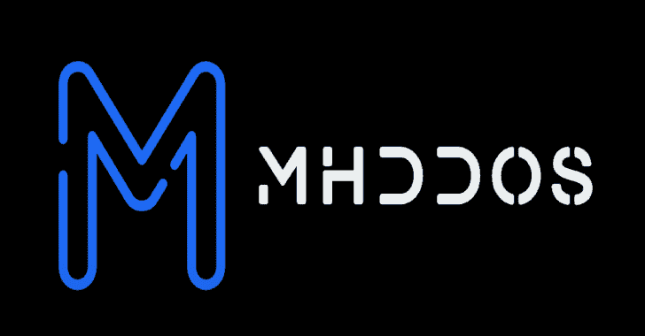
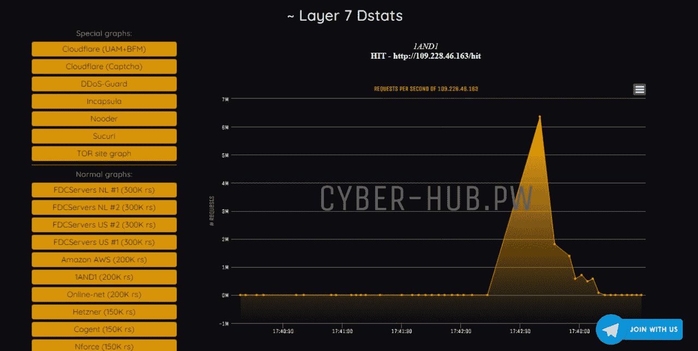
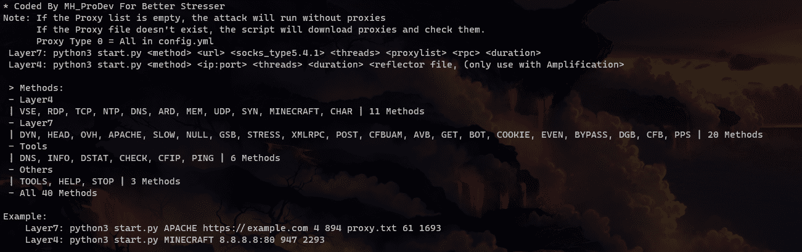

# MHDDoS:有 56 种方法的 DDoS 攻击脚本

> 原文：<https://kalilinuxtutorials.com/mhddos/>

[](https://blogger.googleusercontent.com/img/b/R29vZ2xl/AVvXsEhKr3SOiS5WbQdNl57QOIyIWxFIiwqD-DUD2KieIIaR91DToK6aSX7DsMMbbEOGhfIPK8nxXimIECG8AUMqQ_C2LF3lyp7g0CocFxLD0vg-yD_Y1Dx3MMKmBQTSiihY0E4FL8xDAfMrAdOk1cNl1GSrBZDSJqA1Q6G5IWX4bD4pz-C0cKJkwKHDbwUi/s728/MHDDoS.png)

**MHDDoS** 是一个 DDoS 攻击脚本，有 56 种方法。但是不要在没有所有者同意的情况下攻击网站。



## 特征和方法

*   💣第 7 层
    *   领|领洪水
    *   洪水过后
    *   OVH |旁路 OVH
    *   RHEX |随机十六进制
    *   STOMP |绕过 chk_captcha
    *   压力|发送高字节的 HTTP 数据包
    *   一种新的随机子域方法
    *   DOWNLOADER |缓慢读取数据的新方法
    *   SLOW | SLOW loris DDoS 的老方法
    *   HEAD |[https://developer . Mozilla . org/en-US/docs/Web/HTTP/Methods/HEAD](https://developer.mozilla.org/en-US/docs/Web/HTTP/Methods/HEAD)
    *   空|空用户代理和…
    *   COOKIE |随机 Cookie PHP 'if (isset($_COOKIE))'
    *   PPS | Only ' GET/HTTP/1.1 \ r \ n \ r \ n '
    *   EVEN | GET 方法带有更多标题
    *   GSB |谷歌项目屏蔽旁路
    *   DGB | DDoS 防护旁路
    *   AVB |阿凡云绕道
    *   像谷歌机器人一样
    *   阿帕奇|阿帕奇探险队
    *   XMLRPC | WP XMLRPC exp liot(add/XMLRPC . PHP)
    *   CFB | CloudFlare 旁路
    *   CFBUAM |攻击模式下的 CloudFlare 旁路
    *   绕过|绕过正常的解毒剂
    *   炸弹|带 codesenberg/bombardier 的旁路
    *   🔪KILLER |运行多个线程来杀死一个目标
    *   🧅 TOR |绕过洋葱网站
*   🧨第 4 层:
    *   TCP | TCP 泛洪旁路
    *   UDP | UDP 泛洪旁路
    *   同步洪水
    *   CPS |使用代理打开和关闭连接
    *   ICMP | Icmp 回应请求泛洪(第 3 层)
    *   连接|使用代理打开活动连接
    *   VSE |发送阀源引擎协议
    *   TS3 |发送 Teamspeak 3 状态 Ping 协议
    *   发送 FIVEM 状态 Ping 协议
    *   MEM | Memcached 放大
    *   NTP | NTP 扩增
    *   MCBOT |《我的世界》BOT 攻击
    *   MINECRAFT |《我的世界》状态 Ping 协议
    *   MCPE |《我的世界》PE 状态 Ping 协议
    *   DNS | DNS 放大
    *   CHAR | Chargen 放大
    *   CLDAP | Cldap 扩增
    *   ARD |苹果远程桌面放大
    *   RDP |远程桌面协议放大
*   ⚙️工具–与`python3 start.py tools`一起运行
    *   🌟CFIP |查找由 Cloudflare 支持的网站的真实 IP 地址
    *   🔪DNS |显示网站的 DNS 记录
    *   📍TSSRV | TeamSpeak SRV 解析器
    *   ⚠ PING | PING 服务器
    *   📌检查|检查网站状态
    *   😎DSTAT |显示接收的字节、发送的字节及其数量
*   🎩其他的
    *   ❌停止|停止所有攻击
    *   🌠工具|控制台工具
    *   👑帮助|显示使用脚本

## 我们的社会

*   [矩阵团队电报组](https://t.me/DD0SChat)
*   [矩阵社区电报通道](https://t.me/MatrixORG)
*   [GitHub](https://github.com/MatrixTM/MHDDoS/issues) : [github](https://github.com/MatrixTM/MHDDoS/issues)

## 下载

你可以从 [GitHub 发布版](https://github.com/MatrixTM/MHDDoS/releases)下载

### 开始使用

#### **要求**

*   dnspython
*   [cfscrape](https://github.com/Anorov/cloudflare-scrape)
*   [撞击](https://github.com/SecureAuthCorp/impacket)
*   [请求](https://github.com/psf/requests)
*   [蟒蛇 3](https://python.org)
*   [PyRoxy](https://github.com/MatrixTM/PyRoxy)
*   [ICM lib](https://github.com/ValentinBELYN/icmplib)
*   [认证](https://github.com/certifi/python-certifi)
*   [psutil](https://github.com/giampaolo/psutil)
*   [老](https://github.com/aio-libs/yarl)

* * *

## **视频**

*   Aparat: [https://www.aparat.com/v/bHcP9](https://www.aparat.com/v/bHcP9)
*   YouTube:即将推出…

**教程**

*   https://aparat.com/v/XPn5Z
*   YouTube:即将推出…

## 文档

你可以从 [GitHub Wiki](https://github.com/MatrixTM/MHDDoS/wiki) 上阅读

## **克隆并安装脚本**

```
git clone https://github.com/MatrixTM/MHDDoS.git
cd MHDDoS
pip install -r requirements.txt
```

## **在新 VPS 上一行安装**

```
apt -y update && apt -y install curl wget libcurl4 libssl-dev python3 python3-pip make cmake automake autoconf m4 build-essential ruby perl golang git && git clone https://github.com/MatrixTM/MHDDoS.git && cd MH* && pip3 install -r requirements.txt
```

[Click Here To Download](https://github.com/MatrixTM/MHDDoS)