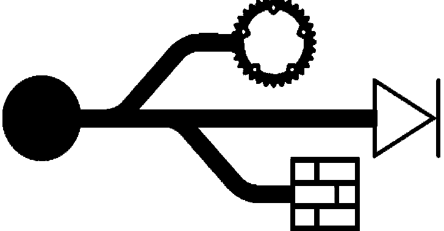

# Usbsas:安全读取不可信 USB 大容量存储设备的工具和框架

> 原文：<https://kalilinuxtutorials.com/usbsas/>

usbsas 是一个免费的开源(GPLv3)工具和框架，用于安全读取不可信的 USB 大容量存储设备。

## 描述

遵循深度防御的概念和最小特权的原则，usbsas 的目标是减少 USB 堆栈的攻击面。为了实现这一点，大多数与 USB 相关的任务(解析 USB 包、SCSI 命令、文件系统等。)通常在(特权)内核空间中执行已经被移动到用户空间，并被分离在不同的进程中(微内核风格)，每个进程都在自己受限的[安全计算模式](https://en.wikipedia.org/wiki/Seccomp)中执行。

这个项目的主要目的是被部署为一个 kiosk / [sheep dip](https://en.wikipedia.org/wiki/Sheep_dip_(computing)) 站，将文件从不可信的 USB 设备安全地传输到可信的 USB 设备。

它在 GNU/Linux 上工作，用 Rust 编写。

## 特性

usbsas 可以:

*   从不可信的 USB 设备读取文件(不使用`uas`、`usb_storage`等内核模块和文件系统模块)。支持的文件系统有`FAT`、`exFat`、`ext4`、`NTFS`和`ISO9660`
*   使用远程防病毒软件分析文件
*   将新文件系统上的文件复制到可信的 USB 设备。支持的文件系统有`FAT`、`exFAT`和`NTFS`
*   将文件上传到远程服务器
*   制作 USB 设备的映像
*   擦除 USB 设备

## 应用

基于 usbsas 构建的应用程序:

*   **Web 客户端/服务器**:这是 usbsas 的主要应用，用于部署安全的 USB 到 USB 文件传输亭。
*   **[熔丝](https://en.wikipedia.org/wiki/Filesystem_in_Userspace)实现**:用 usbsas 挂载 USB 设备(只读)。
*   Python : usbsas 也可以和 Python 一起使用，举个例子，一个脚本可以把所有东西从一个设备复制到另一个设备。

[Click Here To Download](https://github.com/cea-sec/usbsas)