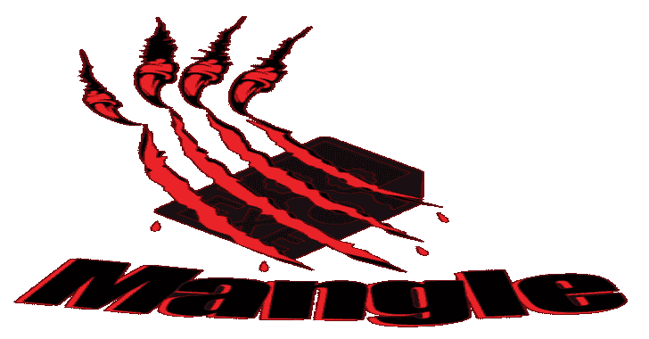
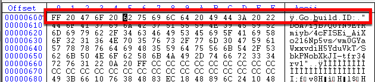
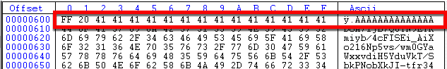
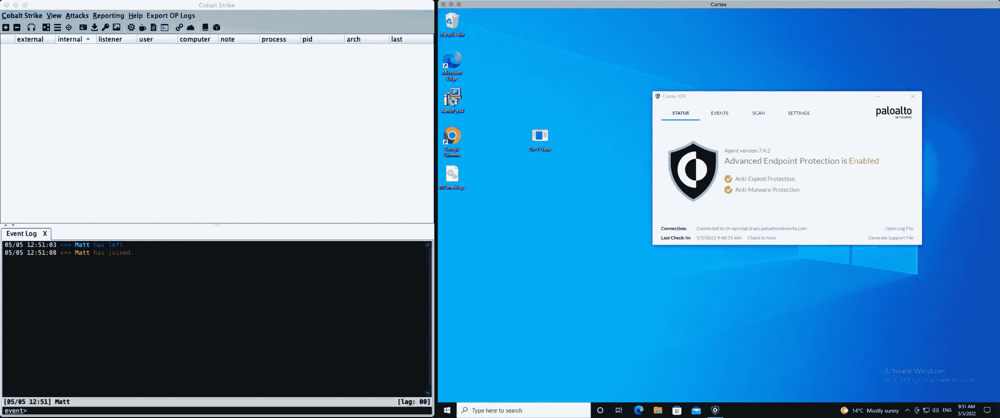
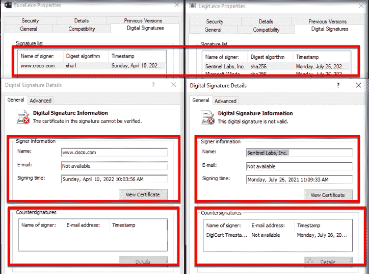

# Mangle:处理编译后的可执行文件的工具。Exe 或 DLL)来避免 EDRs 的检测

> 原文：<https://kalilinuxtutorials.com/mangle/>

[](https://blogger.googleusercontent.com/img/b/R29vZ2xl/AVvXsEhxAnBy1mmbgMRdPGl0MabuKDKDOGGa3vj6A6c3rsPi6A0bvGQPpy3vYlFhIuK0xRW4W5uN5l62TnO4a9uypuQQfVmth0iYgp2R6jeo3OWsa6PGKQ1gZp-QPzJHn9lf8N3C8hMa8BWgY7hPeeTECiXQDW6bMx42YkLNliLr6-tj_GlNMM8EEIVxoA1W/s728/Mangle(1).png)

Mangle 是一个处理编译后的可执行文件的工具。exe 或 DLL)。Mangle 可以删除基于已知危害指示器(IoC)的字符串并用随机字符替换它们，通过增大文件大小来更改文件以避免 EDRs，并且可以从合法文件中克隆代码签名证书。通过这样做，Mangle 帮助加载程序避开磁盘和内存中的扫描器。

## 贡献

曼格勒是在戈朗开发的。

## 安装

一如既往，第一步是克隆回购协议。在编译 Mangle 之前，您需要安装依赖项。要安装它们，请运行以下命令:

```
go get github.com/Binject/debug/pe
```

那就建造它

```
go build Mangle.go
```

## 重要

虽然 Mangle 是用 Golang 编写的，但它的许多特性都是为处理其他语言的可执行文件而设计的。在发布时，Golang 特有的唯一特性是字符串操作部分。

## 用法

```
./mangle -h

	   _____                        .__
	  /     \ _____    ____    ____ |  |   ____
	 /  \ /  \\__  \  /    \  / ___\|  | _/ __ \
	/    Y    \/ __ \|   |  \/ /_/  >  |_\  ___/
	\____|__  (____  /___|  /\___  /|____/\___  >
		\/     \/     \//_____/   	  \/
					(@Tyl0us)
Usage of ./Mangle:
  -C string
        Path to the file containing the certificate you want to clone
  -I string
        Path to the orginal file
  -M    Edit the PE file to strip out Go indicators
  -O string
        The new file name
  -S int
        How many MBs to increase the file by 
```

## 字符串

Mangle 接受输入的可执行文件，并寻找安全产品寻找或警告的已知字符串。这些字符串本身并不是唯一的检测点。通常，这些字符串与其他数据点和遥测数据一起用于检测和预防。Mangle 找到这些已知的字符串，并用随机值替换十六进制值来删除它们。重要提示:Mangle 会替换它所操作的字符串的确切大小。它不会增加更多或更少，因为这会在文件中造成不对齐和不稳定。Mangle 使用`-M`命令行选项来完成这项工作。

目前，Mangle 只做 Golang 文件，但随着时间的推移，其他语言将被添加。如果您知道任何其他语言，请打开问题单并提交。

以前



在...之后



## 膨胀

几乎所有的 edr 都不能扫描超过一定大小的磁盘或内存文件。这仅仅是因为大文件需要更长的时间来检查、扫描或监控。edr 不希望通过降低用户的工作效率来影响性能。Mangle 通过在文件末尾创建空字节(零)的填充来增大文件。这确保了文件中的任何内容都不会受到影响。要膨胀一个可执行文件，使用`-S`命令行选项以及您想要添加到文件中的字节数。随着网速的提高，大的有效载荷真的不再是一个问题，也就是说，不建议制作 2g 的文件。

基于大量用户和内核 edr 的测试案例，建议将大小增加 95-100 兆字节。因为供应商不会检查大文件，所以活动不会被注意到，从而导致外壳代码的成功执行。

### 举例:



## 证书

Mangle 还能够从一个文件中获取合法代码签名证书的完整链和所有属性，并将其复制到另一个文件中。这包括签名日期、反签名和其他可测量的属性。

虽然这个功能听起来可能与我开发的另一个工具类似， [Limelighter](https://github.com/Tylous/Limelighter) ，但两者之间的主要区别在于，Limelighter 基于一个域制作了一个假证书，并用当前的日期和时间对其进行签名，而不是使用有效的属性，其中时间戳是从原始文件中获取的。此选项可以使用 DLL 或。exe 文件，以及要从中复制证书的文件的路径。

[Click Here To Download](https://github.com/optiv/Mangle#certificate)