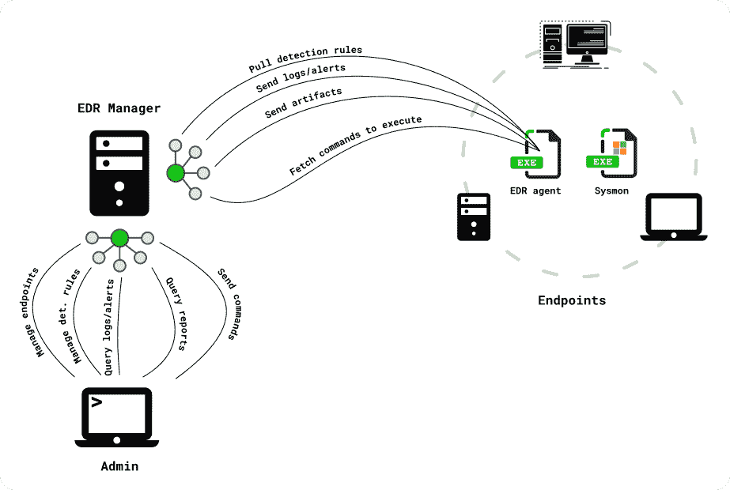

# Whids:用于 Windows 的开源 EDR

> 原文：<https://kalilinuxtutorials.com/whids/>

Whids 是一个用于 Windows 的开源 EDR，通过检测驱动工件收集。检测引擎建立在以前的项目[基因](https://github.com/0xrawsec/gene)的基础上，专门设计用于将 Windows 事件与用户定义的规则进行匹配。

## 你说的“检测驱动的神器收集”是什么意思？

这意味着警报可以直接触发一些工件收集(文件、注册表、进程内存)。通过这种方式，您可以确定您尽可能快地收集了工件(接近实时)。

所有这些工作都是在我的空闲时间完成的，希望它能帮助其他人，我希望你会喜欢它。除非我得到一些资金来进一步发展这个项目，我将继续尽最大努力开发它。我会尽我所能及时解决问题并提供更新。随时提出问题来改进项目并保持它的活力。

## 为什么

*   向社区提供一个**开源 EDR**
*   提高检测规则的透明度，让分析师了解规则触发的原因
*   通过灵活的规则引擎提供强大的检测原语
*   通过大幅缩短检测和工件收集之间的时间，优化事件响应流程

## 如何？

**注意:**EDR 代理可以独立运行(不需要连接到 **EDR 管理器**

## 你必须知道的

*   它只能在使用 ETW 日志的 Windows 上运行
*   依赖 [Sysmon](https://docs.microsoft.com/en-us/sysinternals/downloads/sysmon) 完成所有繁重的工作(内核组件)
*   非常强大和可定制的检测引擎(由[基因](https://github.com/0xrawsec/gene)驱动)
*   由事件响应者为所有事件响应者构建，目的是减轻他们工作的痛苦
*   低足迹->无过程注入
*   可以与任何杀毒产品**共存(建议与 **MS Defender** 一起运行)**
*   专为高吞吐量而设计。它可以轻松地丰富和分析每个终端每天多达 1500 万个事件，而不会影响性能。祝你好运，用 SIEM 实现它。
*   易于与其他工具集成(Splunk、ELK、MISP……)
*   与 [ATT & CK 框架](https://attack.mitre.org/)整合
*   有一个强大的管理 API 来简化大型部署的管理(还没有 GUI)

## 安装

### 要求

1.  [安装 Sysmon](https://docs.microsoft.com/en-us/sysinternals/downloads/sysmon)
2.  **配置 Sysmon**
    *   你可以在这里找到优化的 Sysmon 配置
    *   记录任何**进程创建**和**进程终止**是强制性的
3.  记下 Sysmon 二进制文件的路径，因为您稍后会用到它

**注意:**事件过滤可以用基因规则 100%完成，所以不要费心创建复杂的 Sysmon 配置。

## 安装前建议

为了充分利用 WHIDS，您可能需要改进您的日志记录策略。

*   [启用 Powershell 模块日志](https://www.fireeye.com/blog/threat-research/2016/02/greater_visibilityt.html)
*   审计服务创建:gpedit.msc -> `Computer Configuration\Windows Settings\Security Settings\Advanced Audit Policy Configuration\System Audit Policies\System\Audit Security System Extension` - > Enable
*   启用文件系统审计。Sysmon 仅在创建新文件时提供 FileCreate 事件，因此如果您想要/需要记录其他类型的访问(读、写等)，您需要启用 FS 审计。
    1.  gpedit.msc -> `Computer Configuration\Windows Settings\Security Settings\Advanced Audit Policy Configuration\System Audit Policies\Object Access\Audit File System` - >启用
    2.  右键单击任意文件夹->属性->安全->高级->审核->添加
        1.  `Select a principal`(在此输入您想要审计的用户/组的名称)。如果您想记录任何用户的访问，请将 group **Everyone** 设为。
        2.  `Apply this to`用于从您选择的文件夹开始选择该审计策略的范围
        3.  `Basic permissions`选择您希望生成日志的访问类型
        4.  使生效
    3.  文件系统审计日志将出现在`Security`日志通道中
*   如果你想让一个**杀毒软件**在你的终端上运行，保留**微软防御软件**，首先因为它是一个好的反病毒软件，而且因为它在一个由 EDR 监控的[专用日志通道](https://docs.microsoft.com/en-us/windows/security/threat-protection/windows-defender-antivirus/troubleshoot-windows-defender-antivirus#windows-defender-av-ids) `Microsoft-Windows-Windows Defender/Operational`中记录警报。

## Whids.exe EDR 端点代理

本节介绍在端点上安装代理。

1.  下载并提取最新的 WHIDS 版本[https://github.com/0xrawsec/whids/releases](https://github.com/0xrawsec/whids/releases)
2.  以**管理员**的身份运行`manage.bat`
3.  通过选择适当的选项启动安装
4.  验证是否已在**安装目录**下创建了文件
5.  通过在`manage.bat`中选择适当的选项或使用您喜欢的文本编辑器来编辑配置文件
6.  如果使用管理器连接运行，请跳过此步骤，因为规则会自动更新。如果在**规则目录**中什么都没有，那么这个工具就没用了，所以要确保那里有一些**基因**规则。一些规则与 WHIDS 打包在一起，系统会提示您选择是否要安装这些规则。如果你想要最新的规则，你可以在这里得到那些(取**编译的**)
7.  从`manage.bat`中的适当选项启动**服务**或直接重启(**首选选项**，否则一些浓缩字段将不完整，导致错误警报)
8.  如果您配置了一个**管理器**,不要忘记运行它以接收警报和转储

**NB:** 在安装时， **Sysmon 服务**将成为 **WHIDS 服务**的*依赖*，这样我们就可以确保在 **Sysmon** 开始生成一些事件之前，EDR 运行。

## EDR 经理

EDR 管理器可以安装在多个平台上，为 Windows、Linux 和 Darwin 提供了预构建的二进制文件。

1.  如果 HTTPS 连接需要，请创建 TLS 证书
2.  创建一个配置文件(有一个命令行参数来生成基本配置)
3.  运行二进制文件

## 配置示例

请访问 [doc/configuration.md](https://github.com/0xrawsec/whids/blob/master/doc/configuration.md)

[Click Here To Download](https://github.com/0xrawsec/whids)