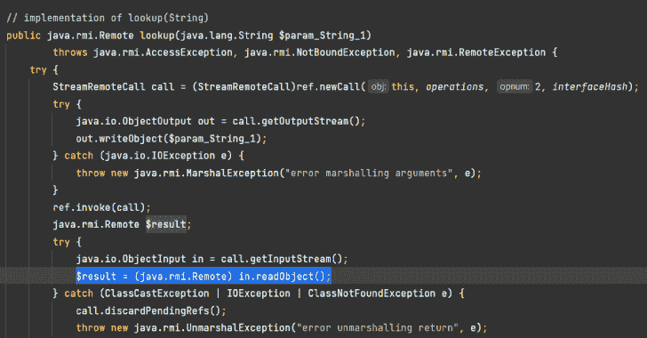
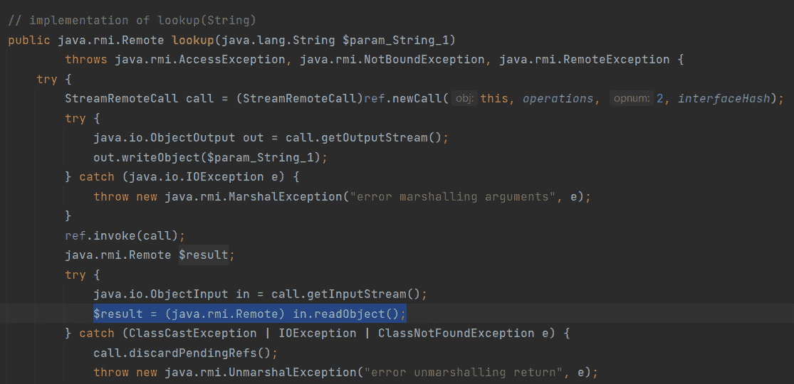
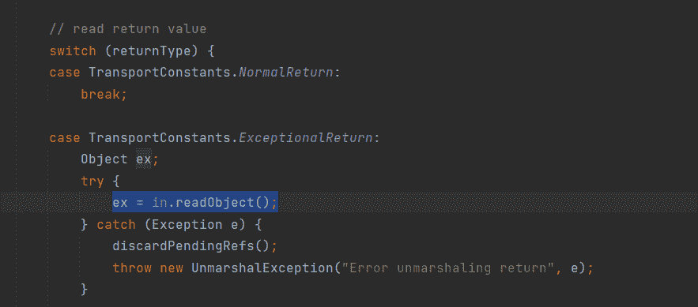
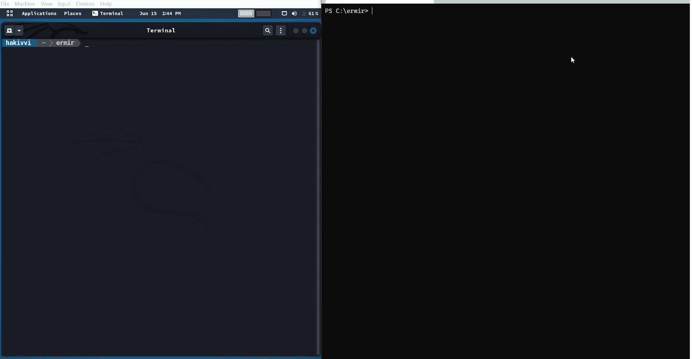

# Ermir:一个邪恶的 Java RMI 注册表

> 原文：<https://kalilinuxtutorials.com/ermir/>

[](https://blogger.googleusercontent.com/img/b/R29vZ2xl/AVvXsEjs0PFlzsSnfe85aNQc_FShca44LCkQH_aHLc-TV-ZbtgA3TBczSYJYI2V2XETlue8F7CBBccQy1unuscXX5iAxieKRCjcpmBqTBnJ2KZhKMg_cVOYUggnzr_cVo9ooQK0UbKa0I29G6IWjnanM09o7kaGdnz1k2UBFon5dRxmECNRHxsmL6K0fDTdq/s728/Ermir.png)

**Ermir** 是一个邪恶/流氓 RMI 注册表，它利用任何 Java 代码上的不安全反序列化来调用其上的标准 RMI 方法(`list()` / `lookup()` / `bind()` / `rebind()` / `unbind()`)。

## 要求

*   Ruby v3 或更新版本。

## 安装

从 rubygems.org 安装 Ermir:

```
$ gem install ermir
```

或者克隆回购，打造创业板:

```
$ git clone https://github.com/hakivvi/ermir.git
$ rake install
```

## 用法

Ermir 是一个 cli gem，它带有两个 cli 文件`ermir`和`gadgetmarshal`，`ermir`是实际的 gem，后者只是一个漂亮的接口到[GadgetMarshaller.java](https://github.com/hakivvi/ermir/blob/main/helpers/gadgetmarshaller/GadgetMarshaller.java)文件，它重写了 [Ysoserial](https://github.com/frohoff/ysoserial) 的小工具以匹配`MarshalInputStream`的要求，然后输出应该通过管道进入`ermir`或一个文件，在定制小工具的情况下使用`MarshalOutputStream`而不是`ObjectOutputStream`将你的序列化对象写入输出流。

`ermir`用法:

```
➜  ~ ermir
Ermir by @hakivvi * https://github.com/hakivvi/ermir.
Info:
    Ermir is a Rogue/Evil RMI Registry which exploits unsecure Java deserialization on any Java code calling standard RMI methods on it.
Usage: ermir [options]
    -l, --listen   bind the RMI Registry to this ip and port (default: 0.0.0.0:1099).
    -f, --file     path to file containing the gadget to be deserialized.
    -p, --pipe     read the serialized gadget from the standard input stream.
    -v, --version  print Ermir version.
    -h, --help     print options help.
Example:
    $ gadgetmarshal /path/to/ysoserial.jar Groovy1 calc.exe | ermir --listen 127.0.0.1:1099 --pipe
```

`gadgetmarshal`用法:

```
➜  ~ gadgetmarshal
Usage: gadgetmarshal /path/to/ysoserial.jar Gadget1 cmd (optional)/path/to/output/file
```

## 它是如何工作的？

`java.rmi.registry.Registry`提供 5 种方式:`list()`、`lookup()`、`bind()`、`rebind()`、`unbind()`:

*   `public Remote lookup(String name)` : lookup()通过名称在注册表中搜索绑定对象，注册表返回一个引用被查找的远程对象的`Remote`对象，使用 [`MarshalInputStream.readObject()`](http://hg.openjdk.java.net/jdk8u/jdk8u/jdk/file/jdk8u232-ga/src/share/classes/sun/rmi/registry/RegistryImpl_Stub.java#l127) 读取返回的对象，这是`ObjectInputStream`之上的另一层，基本上，它在每个类/代理描述符(`TC_CLASSDESC` / `TC_PROXYCLASSDESC`)之后期待一个将用于加载该类或代理类的 URL。这是在 [jdk7u21](https://docs.oracle.com/javase/7/docs/technotes/guides/rmi/enhancements-7.html) 中修复的同一个野生 bug。(Ermir 没有指定此 URL，因为只有旧版本的 Java 容易受到攻击，相反，它只写入了空值)。当使用`ObjectOutputStream`序列化 [Ysoserial](https://github.com/frohoff/ysoserial) 小工具时，Ermir 使用`gadgetmarshal`——GadgetMarshaller.java 的包装器——来序列化指定的 gagdet 以匹配`MarshalInputStream`需求。



`public String[] list()` : list()向注册表请求所有绑定对象的名称，而`String`类型不能被恶意小工具替代，因为它不像任何普通对象，它不是使用`readObject()`而是使用`readUTF()`读取的，然而由于`list()`返回的`String[]`是一个实际的对象，它是使用 [`readObject()`](http://hg.openjdk.java.net/jdk8u/jdk8u/jdk/file/jdk8u232-ga/src/share/classes/sun/rmi/registry/RegistryImpl_Stub.java#l95) 读取的，Ermir 发送小工具而不是这个`String[]`类型。


`public void bind(java.lang.String $param_String_1, java.rmi.Remote $param_Remote_2)` : bind()将一个对象绑定到注册表上的一个名称，在 bind()的情况下，返回类型是`void`并且没有返回任何东西，但是如果注册表在 RMI 返回数据包中指定该返回是一个可执行的返回，客户机/服务器客户机将调用 [`readObject()`](https://hg.openjdk.java.net/jdk8u/jdk8u/jdk/file/tip/src/share/classes/sun/rmi/transport/StreamRemoteCall.java#l270) 尽管返回类型是`void`，这就是 registry 向其客户机(通常是`java.lang.ClassNotFoundException`)发送异常的方式，Ermir 将再次传递序列化的小工具而不是合法的异常对象。



*   `public void rebind(java.lang.String $param_String_1, java.rmi.Remote $param_Remote_2)` : rebind()用提供的远程引用替换传递的名称的绑定，也返回`void`，Ermir 返回一个异常，就像 bind()。
*   `public void unbind(java.lang.String $param_String_1)` : unbind()在 RMI 注册表中通过名称取消远程对象的绑定，这个也返回`void`。

## 验证性测试（Proof of Concept 的缩写）

