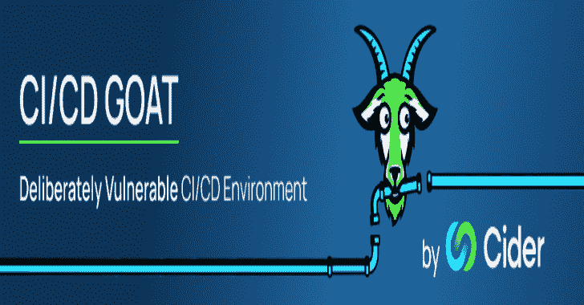
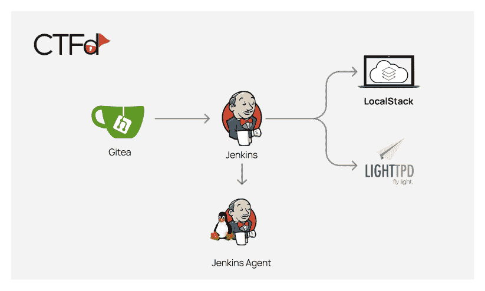

# Cicd-Goat:一个故意脆弱的 CI/CD 环境

> 原文：<https://kalilinuxtutorials.com/cicd-goat/>

[](https://blogger.googleusercontent.com/img/b/R29vZ2xl/AVvXsEjxJbMSoloRJt8zlvlGdfEgXljwieqz_DkQXpZHxTJgbuKoCql40HC7s_wszJ_fHwa6M-Um4tF9wW7CuzZ-blHHHeKm4n9sdUAHED9uVC0VzzUr3d0YKr7-VszcBm_Z_5gEosPPtYFiupJztdqk0pYFUxml5ZgK6XIEhWu9u_jnUOWZjoGopyP7d3aR/s728/cicd-goat.png)

**CI/CD-Goat** 项目允许工程师和安全从业者通过一组 10 个挑战来学习和实践 CI/CD 安全，这些挑战是在真实、成熟的 CI/CD 环境中制定的。这些场景的难度各不相同，每个场景都专注于一个主要的攻击媒介。

这些挑战涵盖了[十大 CI/CD 安全风险](https://www.cidersecurity.io/top-10-cicd-security-risks/?utm_source=github&utm_medium=github_page&utm_campaign=ci%2fcd%20goat_060422)，包括流量控制机制不足、PPE(中毒管道执行)、依赖链滥用、PBAC(基于管道的访问控制)等等。
不同的挑战受到《爱丽丝梦游仙境》的启发，每个挑战都以不同的角色为主题。

该项目的环境基于 Docker 映像，可以在本地运行。这些图像是:

1.  最小 git 服务器
2.  詹金斯
3.  詹金斯代理
4.  LocalStack(在单个容器中运行的云服务模拟器)
5.  Lighttpd
6.  CTFd(捕获旗帜框架)。

映像被配置为以创建全功能管道的方式互连。



## 下载并运行

没有必要克隆存储库。

### Linux & Mac

```
curl -o cicd-goat/docker-compose.yaml --create-dirs https://raw.githubusercontent.com/cider-security-research/cicd-goat/main/docker-compose.yaml
cd cicd-goat && docker-compose up -d
```

### Windows (Powershell)

```
mkdir cicd-goat; cd cicd-goat
curl -o docker-compose.yaml https://raw.githubusercontent.com/cider-security-research/cicd-goat/main/docker-compose.yaml
get-content docker-compose.yaml | %{$_ -replace "bridge","nat"}
docker-compose up -d
```

## 用法

### 说明

*   **剧透警报！**避免浏览存储库文件，因为它们包含剧透。
*   要配置 git 客户端来访问私有存储库，我们建议使用 http url 进行克隆。
*   在每个挑战中，找到旗帜——以 *flag#* 的格式(例如 *flag2* )或其他特别提到的格式。
*   每个挑战都是独立的。不要用在一个挑战中获得的权限来解决另一个挑战。
*   如果需要，使用 CTFd 上的提示。
*   没有必要利用 CVEs。
*   没有必要劫持 Gitea 或詹金斯的管理帐户(命名为“管理”或“红皇后”)。

### 接受挑战

1.  启动容器后，可能需要 5 分钟才能完成容器配置过程。
2.  登录 CTFd 网站 [http://localhost:8000](http://localhost:8000) 查看挑战:
    *   用户名:`alice`
    *   密码:`alice`
3.  黑客:
    *   詹金斯 [http://localhost:8080](http://localhost:8080)
        *   用户名:`alice`
        *   密码:`alice`
    *   gitea[http://localhost:3000](http://localhost:3000)
        *   用户名:`thealice`
        *   密码:`thealice`
4.  在 CTFd 上插入标记，看看你是否做对了。

### 故障排除

*   如果 Gitea 显示一个空白页，刷新页面。
*   当派生一个存储库时，不要改变派生的存储库的名称。

## 贡献

### 发展

1.  克隆存储库。
2.  重命名。git 文件夹以使它们可用:
    python3 rename.py git
3.  安装测试依赖项:pip3 安装 pipenv==2022.8.30 pipenv 安装–部署
4.  运行开发环境来试验新的变化:RM-RF tmp tmp-ctfd/CP-R ctfd/data/tmp-ctfd/docker-compose-f docker-compose-dev . YAML up-d
5.  进行所需的更改:
    *   除 CTFd 之外的所有服务都完全配置为代码，因此应该对适当文件夹中的文件进行所需的更改。
    *   要在 CTFd 中进行更改，请使用[管理员凭证](https://github.com/cider-security-research/cicd-goat/blob/main/break-glass.md)。
6.  关闭环境，移动 CTFd 中所做的更改并重新构建:docker-compose-f docker-compose-dev . YAML down。/apply.sh #保存 CTFd 更改 docker-compose-f docker-compose-dev . YAML up-d-build
7.  运行测试:pytest 测试/
8.  重命名。允许推送的 git 文件夹:python3 rename.py notgit
9.  提交和推送！

### 清单

按照下面的清单添加挑战:

1.  CTFd:
    1.  写下挑战描述。
    2.  根据难易程度选择类别。
    3.  确保挑战是可见的，并且根据难度有价值。
    4.  按照用法顺序写提示。
    5.  添加一个标志。确保选择它是否不区分大小写。
2.  Gitea:
    1.  在 gitea.yaml 中配置新的存储库。
    2.  在 [gitea/repositories](https://github.com/cider-security-research/cicd-goat/blob/main/gitea/repositories) 下创建存储库。使用开源库，该库使用 MIT 许可证作为挑战库的模板。
3.  詹金斯:
    1.  配置 Jenkins 并在 casc.yaml 文件中添加新的 jobdsl 文件。
    2.  确保作业不会定期运行。作业应该由事件/轮询触发。
    3.  确认新的挑战不会干扰其他挑战。
4.  在解决其他挑战时，确保旗帜不可触及。
5.  编写测试。
6.  写出解决方案。
7.  如果需要，更新 README.md。
8.  为了运行 CI，请确保您有一个 CircleCI 帐户，并且您已经在项目的分支上单击了“设置项目”。

[Click Here To Download](https://github.com/cider-security-research/cicd-goat)