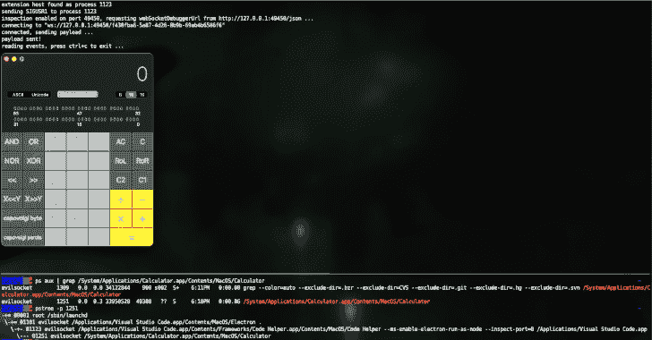

# Jscythe:强制任何基于 Node.Js/Electron/V8 的进程执行任意 Javascript 代码

> 原文：<https://kalilinuxtutorials.com/jscythe/>

[](https://blogger.googleusercontent.com/img/b/R29vZ2xl/AVvXsEjxgBFudwlhN8PizIXeCFR5lH5aa_-GIwrvBeFvC9law41JUatojcFB1DFWKZPn3Tr30WaGtEoT2WBmUNJvcOOUF5g6vXTJuJc2Ib2EHpwkAHn6Btc0hgJ0Ic0h-UvMsirakqso2dmDSWifcPYO7CdeEP-2RasyRPBJtqxglNtx2sgyXgr1T7U97ltN/s728/jscythe.png)

**jscy**滥用 node.js [检查器机制](https://nodejs.org/en/docs/guides/debugging-getting-started/)来强制任何基于 node.js/electron/v8 的进程执行任意 javascript 代码，即使它们的调试功能被禁用。

针对 Visual Studio 代码、Discord、任何 Node.js 应用程序等进行测试和工作！

## 如何？

1.  定位目标进程。
2.  向进程发送`SIGUSR1`信号，这将在一个端口上启用调试器(取决于软件，有时是随机的，有时不是)。
3.  通过发送`SIGUSR1`前后打开端口的不同来确定调试端口。
4.  从`http://localhost:<port>/json`获取 websocket 调试 URL 和会话 id。
5.  用提供的代码发送一个`Runtime.evaluate`请求。
6.  利润。

## 建筑

```
cargo build --release
```

## 跑步

以特定流程为目标，执行一个基本表达式:

```
./target/debug/jscythe --pid 666 --code "5 - 3 + 2"
```

执行文件中的代码:

```
./target/debug/jscythe --pid 666 --script example_script.js
```

`example_script.js`可以要求任何节点模块并执行任何代码，比如:

```
require('child_process').spawnSync('/System/Applications/Calculator.app/Contents/MacOS/Calculator', { encoding : 'utf8' }).stdout
```

按表达式搜索流程:

```
./target/debug/jscythe --search extensionHost --script example_script.js
```

## 其他选项

运行`jscythe --help`获取完整的选项列表。

[Click Here To Download](https://github.com/evilsocket/jscythe)