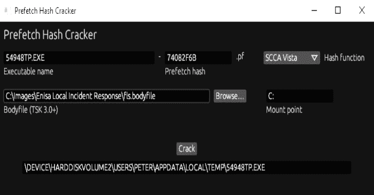

# 预取散列破解程序:一个强力预取散列的小工具

> 原文：<https://kalilinuxtutorials.com/prefetch-hash-cracker/>

[](https://blogger.googleusercontent.com/img/b/R29vZ2xl/AVvXsEgHwfhq6N8c-rDbuQ2BO7-TurIb4BwByZL6q3bQRvkmfCAX7HD_IHpiOHkrRCoRn6m0UOmTPXKv3eKAYimTWAK9EvrjqmoyaWIeOQEFvvZnHCt7Oulo4ABCEjwJpsZ-dI0kG1DbbEUZjW8enMx1h-U3idR17t66_miY8wDnFmQWiuWLCRM46UlyFOH9/s728/Prefetch%20Hash%20Cracker.png)

在对 Windows 机器进行取证分析的过程中，您可能会发现一个已删除的预取(预取哈希破解)文件的名称。虽然预回迁文件的内容可能不可恢复，但文件名本身通常足以找到为其创建预回迁文件的可执行文件的完整路径。

## 使用工具

必须提供以下字段:

*   包含扩展名的可执行文件名称
    。它将被嵌入到预取文件名中，除非[这种](https://github.com/harelsegev/prefetch-hash-cracker#The-29-character-limit)发生。
*   预取散列
    预取文件名末尾的 8 个十六进制数字，就在`.pf`扩展名之前。
*   散列函数
*   正文文件
*   挂载点

### 哈希函数

有 3 种已知的预取散列函数:

*   *SCCA XP*
    用于 Windows XP
*   *SCCA Vista*
    用于 Windows Vista 和 Windows 10
*   *SCCA 2008*
    用于 Windows 7、Windows 8 和 Windows 8.1

### 健美运动员

执行可执行文件的卷的正文文件。

bodyfile 格式的限制不是很严格，所以它有很多变体，其中一些是不受支持的。用`fls`和`MFTECmd`创建的主体文件应该工作正常。

### 挂载点

主体文件的挂载点，如下图所示:

```
0|/Users/Peter/Desktop ($FILE_NAME)|62694-48-2|d/d-wx-wx-wx|...
```

## 它是如何工作的？

提供的 bodyfile 用于获取卷上每个文件夹的路径。该工具将提供的可执行文件名称附加到这些路径中的每一个上，以创建可执行文件的可能完整路径列表。然后使用提供的哈希函数对每个可能的完整路径进行哈希处理。如果有一个可能的完整路径，其结果与提供的哈希匹配，则输出该路径。

## 限制

不支持以下情况:

*   托管应用程序，如`svchost.exe`和`mmc.exe`
*   用`/prefetch:#`标志执行的应用程序
*   从 UNC(网络)路径执行的应用程序

### 29 个字符的限制

如果可执行文件名称超过 29 个字符(包括扩展名)，它将在预回迁文件名中被截断。例如，执行以下文件:

```
This is a very long file nameSo this part will be truncated.exe
```

从 Windows 10 机器上的`C:\Temp`目录，将导致创建此预取文件:

```
THIS IS A VERY LONG FILE NAME-D0B882CC.pf
```

在这种情况下，可执行文件的名称不能从预回迁文件名中获得，所以您不能将它提供给工具。

[Click Here To Download](https://github.com/harelsegev/prefetch-hash-cracker)