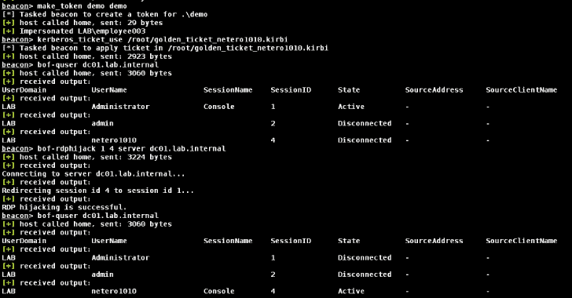

# RDPHijack-BOF:执行本地/远程 RDP 会话劫持

> 原文：<https://kalilinuxtutorials.com/rdphijack-bof/>

[](https://blogger.googleusercontent.com/img/b/R29vZ2xl/AVvXsEhiu0tVdpXIYhVYH5-H08bVlrT4nb_Cqr-nCFVGc-sLHrnTeKmYGAqmz7FSs9GWwyKM0fU1WI7jeoAIAf8U43pfxAuu6aXaU_N0d4NrTj5wYNf5LGDusgMm3g09A-Ud7VMqvoNoDJ6_9NMzwl5OfBcJ7iqfrUlkwpLOUUyqVSV0rEtIKIbcExx1b0xw/s728/BOF.png)

使用 WinStationConnect API 执行本地/远程 RDP 会话劫持的 Cobalt Strike Beacon 对象文件(BOF)。使用会话所有者的有效访问令牌/ kerberos 票证(例如黄金票证)，您将能够远程劫持会话，而不会在目标服务器上丢弃任何信标/工具。

要本地/远程枚举会话，您可以使用 [Quser-BOF](https://github.com/netero1010/Quser-BOF) 。

## 截图


## 使用

```
Usage: bof-rdphijack [your console session id] [target session id to hijack] [password|server] [argument]

Command         Description
--------        -----------
password        Specifies the password of the user who owns the session to which you want to connect.
server          Specifies the remote server that you want to perform RDP hijacking.

Sample usage
--------
Redirect session 2 to session 1 (require SYSTEM privilege):
bof-rdphijack 1 2

Redirect session 2 to session 1 with password of the user who owns the session 2 (require high integrity beacon):
bof-rdphijack 1 2 password P@ssw0rd123

Redirect session 2 to session 1 for a remote server (require token/ticket of the user who owns the session 2):
bof-rdphijack 1 2 server SQL01.lab.internal

```

## 编译

`make`

## 参考

tscon.exe

[Click Here To Download](https://github.com/netero1010/RDPHijack-BOF)