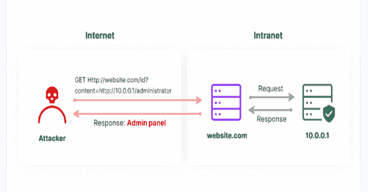

# AutoSSRF:智能的基于上下文的 SSRF 漏洞扫描器

> 原文：<https://kalilinuxtutorials.com/autossrf/>

[](https://blogger.googleusercontent.com/img/b/R29vZ2xl/AVvXsEj07Rl4C07NGm_7g3ON8qGV58pHnskcG8JnuytX-ItLHeh8uIuBm1n4rDRCcuuPxE04On_QGhXP5vB0KLOkCz9sVdvGnzVA6NGpGCW1mj0Oj94I6nrwk4CjnsIpsdyr1ElSRzwWmZFyKxw0MPPk6x445eCjLMvizLQQlM7Ee_fWnR437b1EWsGyXv_D/s728/autoSSRF.png)

autos RF 是您大规模识别 SSRF 漏洞的最佳盟友。与其他 ssrf 自动化工具不同，该工具具有以下两个原始功能:

*   **智能模糊化相关 SSRF 获取参数**模糊化时，**autos RF**只关注与 SSRF 相关的常用参数(`?url=`，`?uri=`，..)并且不干扰其他一切。这确保了被测试的 web 应用程序仍能正确理解原始 URL，而盲目地喷射查询参数的工具可能不会发生这种情况。
*   **基于上下文的动态有效负载生成**对于给定的 URL : `https://host.com/?fileURL=https://authorizedhost.com`，**autos RF**会将*authorizedhost.com*识别为 web 应用程序的潜在白名单主机，并基于此动态生成有效负载，试图绕过白名单验证。这将导致有趣的有效载荷，如:`http://authorizedhost.attacker.com`、`http://authorizedhost%252F@attacker.com`等。

此外，这个工具保证几乎没有**假阳性**。检测依赖于伟大的 ProjectDiscovery 的 *[交互](https://github.com/projectdiscovery/interactsh)* ，允许**autos RF**自信地识别带外 DNS/HTTP 交互。

### 用法

```
python3 autossrf.py -h
```

这将显示该工具的帮助。

```
usage: autossrf.py [-h] [--file FILE] [--url URL] [--output] [--verbose]

options:
  -h, --help            show this help  message and exit
  --file FILE, -f FILE  file of all URLs to be tested against SSRF
  --url URL, -u URL     url to be tested against SSRF
  --output, -o          output file path
  --verbose, -v         activate verbose mode
```

单一 URL 目标:

```
python3 autossrf.py -u https://www.host.com/?param1=X&param2=Y&param2=Z
```

使用 verbose 定位多个 URL:

```
python3 autossrf.py -f urls.txt -v
```

### 安装

1–克隆

```
git clone https://github.com/Th0h0/autossrf.git
```

2–安装要求

Python 库:

```
cd autossrf 
pip install -r requirements.txt
```

交互-客户端:

```
go install -v github.com/projectdiscovery/interactsh/cmd/interactsh-client@latest
```

[Click Here To Download](https://github.com/Th0h0/autossrf)