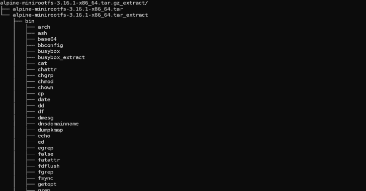

# 从任何类型的容器格式中提取文件

> 原文：<https://kalilinuxtutorials.com/unblob-2/>

**unbob**是一个*准确、快速、易用的* **提取套件**。它解析 30 多种不同的*存档、压缩和文件系统格式*，**递归地提取**它们的**内容**，**从**中切割出**未被考虑的**未知块。

unbob*可以自由使用*，获得*麻省理工学院许可*。它有一个命令行界面，可以用作 Python 库。
这使得 unblob 成为提取、**分析**和**逆向工程固件映像**的完美伴侣。

## 演示

[Click Here To Download](https://github.com/onekey-sec/unblob)