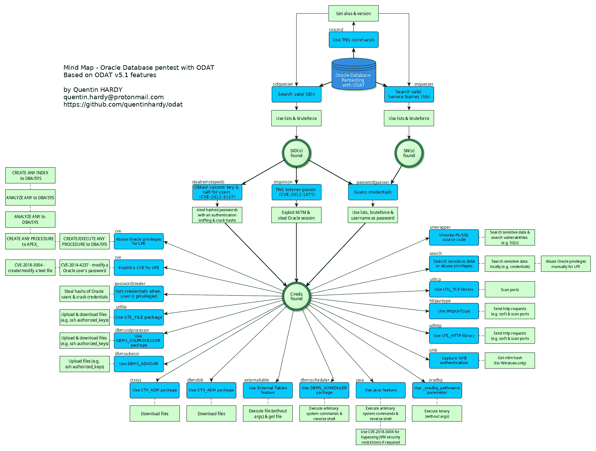

# ODAT : Oracle 数据库攻击工具

> 原文：<https://kalilinuxtutorials.com/odat-oracle-database-attacking-tool/>

[](https://blogger.googleusercontent.com/img/b/R29vZ2xl/AVvXsEgExUwwMLGG9_1yL4h2KETVD4BOzbRXjd3s1SXDESJvq-1eWnPgwtTZP2fqBj2iDkem4PsQENZBoXogqYHvWOsL9pwXinQAx9rJBbVJAO4BCFvZA7FpQa6VeuruUnJapgGPpL8rV_P-TE68rbsfxNOoZ5PVQ0za9DguOh3uDdAvwe6FaUihvl6VKRql/s1700/ODAT.jpg)

**ODAT** (Oracle 数据库攻击工具)是一个开源的**渗透测试**工具，远程测试 **Oracle 数据库的安全性**。

ODAT 的用法示例:

*   您有一个远程监听的 Oracle 数据库，并且想要找到有效的**sid**和**凭证**，以便连接到数据库
*   您在数据库上有一个有效的 Oracle 帐户，并且想要**提升您的权限**成为 DBA 或 SYSDBA
*   您有一个 Oracle 帐户，并且想要**执行系统命令**(例如**反向外壳**)，以便在托管数据库的操作系统上继续运行

在 Oracle 数据库 **10g** 、 **11g** 、 **12c** 、 **18c** 和 **19c** 上测试。

## 特征

借助 ODAT，您可以:

*   通过以下方式在远程 Oracle 数据库监听器上搜索**有效 SID** :
    *   字典攻击
    *   暴力攻击
    *   监听器的别名
*   使用以下方式搜索 Oracle **账户**:
    *   字典攻击
    *   每个 Oracle 用户都喜欢密码(使用此攻击之前需要一个帐户)
*   **在数据库服务器上执行系统命令**,使用:
    *   DBMS _ 调度程序
    *   Java 语言（一种计算机语言，尤用于创建网站）
    *   外部表格
    *   奥德博格
*   **下载存储在数据库服务器上的文件**,使用:
    *   UTL _ 文件
    *   DBMS _ 处理器
    *   外部表格
    *   CTXSYS
    *   DBMS_LOB
*   **在数据库服务器上上传文件**,使用:
    *   UTL _ 文件
    *   DBMS _ 处理器
    *   数据库管理系统顾问
*   **删除文件**使用:
    *   UTL _ 文件
*   使用以下系统特权组合获得特权访问(参见*特权*模块命令的帮助):
    *   创建任何程序
    *   创建过程并执行任何过程
    *   创建任何触发器(和创建过程)
    *   分析任何(并创建程序)
    *   创建任何索引(和创建过程)
*   **从数据库服务器发送/接收 HTTP 请求**,使用:
    *   UTL_HTTP
    *   HttpUriType
*   **扫描本地服务器或远程服务器的端口**,使用:
    *   UTL_HTTP
    *   HttpUriType
    *   UTL_TCP
*   **通过以下方式捕获 SMB 认证**:
    *   顺序索引触发 SMB 连接
*   利用一些 CVE:
    *   [**CVE-2012-3137**](http://cvedetails.com/cve/2012-3137)
        ***   为任意用户拾取会话密钥和 salt*   字典对会话的攻击**
    ***   [**CVE-2012-？？？？**](https://twitter.com/gokhanatil/status/595853921479991297) :经过认证的用户可以修改所有可以选择的表，即使不能正常修改(无修改权限)。*   [**【CVE】-2012-1675**](http://seclists.org/fulldisclosure/2012/Apr/204)(又名 TNS 中毒袭击)**
***   **通过*搜索*模块，在列名**中搜索:
    *   在列名中搜索模式(例如:密码)*   **打开** PL/SQL 源代码(10g/11g 和 12c)*   获得**系统权限**和**角色授予**。也有可能获得特权和角色的角色授予*   执行任意选择请求(也称为最小 sql shell)**

 **这个列表并不详尽。

## 支持的平台和依赖关系

ODAT 只与 Linux 兼容。

**独立版本**的存在是为了不需要安装依赖项(参见 https://github.com/quentinhardy/odat/releases/)。多亏了 *pyinstaller* ，ODAT 单机版得以生成。

如果您想在您的计算机上安装**开发版本**，需要以下工具和依赖项:

*   语言:Python 3
*   Oracle 依赖关系:
    *   即时 Oracle basic
    *   即时 Oracle sdk
*   Python 库:
    *   cx _ 甲骨文
    *   密码库
    *   密码是什么
    *   python scapy(python scapy)
    *   python-libn map(python 5.1 的新特性)
    *   colorlog(推荐)
    *   termcolor(推荐)
    *   argcomplete(推荐)
    *   pyinstaller(推荐)

## 安装(可选，用于开发版本)

本部分描述了如何在 **Ubuntu** 上安装 instantclient、CX_Oracle 和其他一些 python 库，以便拥有 ODAT 开发版本。别忘了 https://github.com/quentinhardy/odat/releases/[的](https://github.com/quentinhardy/odat/releases/) : **有一个 ODAT 单机版，使用单机版**不需要安装什么东西

*   克隆存储库以获得 ODAT 源代码:

```
git clone https://github.com/quentinhardy/odat.git
```

*   更新此存储库中的 wiki 页面，以便在本地获取 ODAT 文档:

```
cd odat/
git submodule init
git submodule update
```

*   从 Oracle 网站获取 instant client basic、sdk (devel)和 sqlplus:
    *   x64:[http://www . Oracle . com/tech network/topics/Linux x86-64 soft-092277 . html](http://www.oracle.com/technetwork/topics/linuxx86-64soft-092277.html)
    *   x86:[http://www . Oracle . com/tech network/topics/Linux soft-082809 . html](http://www.oracle.com/technetwork/topics/linuxsoft-082809.html)
*   目前(2021 年 3 月)，如果您想使用 pyinstaller 生成独立的 ODAT，Oracle 数据库即时客户端版本 11.2 是最佳版本。要使用 ODAT 开发版本，可以使用 Oracle 客户端的最新版本(例如版本 19)。
*   安装 *python3-dev* 、*外星人*和 *libaio1* 包(针对 sqlplus):

```
sudo apt-get install libaio1 python3-dev alien python3-pip
```

*   **使用**从 RPM 文件生成 DEB 文件

```
sudo alien --to-deb oracle-instantclient19.3-basic-???.x???.rpm
sudo alien --to-deb oracle-instantclient19.3-devel-???.x???.rpm
```

*   **安装即时客户端基础版、sdk 和 sqlplus:**

```
sudo dpkg -i oracle-instantclient19.3-basic-???.x???.deb
sudo dpkg -i oracle-instantclient19.3-devel_???_???.deb
```

*   **将这几行放到您的 */etc/profile* 文件中，以便定义 Oracle *env* 变量:**

```
export ORACLE_HOME=/usr/lib/oracle/19.3/client64/
export LD_LIBRARY_PATH=$LD_LIBRARY_PATH:$ORACLE_HOME/lib
export PATH=${ORACLE_HOME}bin:$PATH
```

*   **重启会话(应用环境变量)**
*   **创建*/etc/LD . so . conf . d/oracle . conf*文件，并添加 Oracle 主目录的路径:**

```
/usr/lib/oracle/19.3/client64/lib/
```

*   **使用**更新 ldpath

```
sudo ldconfig
```

*   **安装*CX _ 甲骨文***

```
sudo -s
source /etc/profile
pip3 install cx_Oracle
```

*   **测试是否一切正常:**

```
python3 -c 'import cx_Oracle' 
```

该命令应该*正确无误地返回*。

*   **安装一些 python 库:**

```
sudo apt-get install python3-scapy
sudo pip3 install colorlog termcolor pycrypto passlib python-libnmap
sudo pip3 install argcomplete && sudo activate-global-python-argcomplete
```

*   **下载并安装 python 3 的开发版 py installer([http://www.pyinstaller.org/](http://www.pyinstaller.org/))。**

```
python setup.py install
```

*   **或通过 pip 安装:**

```
pip3 install pyinstaller
```

*   **跑 ODAT:**

```
./odat.py -h
```

[Click Here To Download](https://github.com/quentinhardy/odat)**