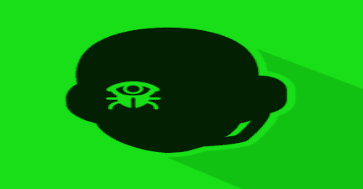

# Stegowiper:一个强大而灵活的工具，可以应用主动攻击来破坏 stego 恶意软件

> [https://kallinuxxtauthorities . com/stewiper/](https://kalilinuxtutorials.com/stegowiper/)

[](https://blogger.googleusercontent.com/img/b/R29vZ2xl/AVvXsEiIbyoK-3JDMkYJSeNGix4hWCCwL2fN7NJRVJLWH850sZu8LE9JhvMivxP8-PuATSuMpS2FaLd38UfKHVdoLwU8e2HQO3tv_onbTRoPfIycdFj3UWZPQFgG7h2K9dX8rhqN2MACqrFXWvuQltvyRPHAUD5mRym7bTR2CJZndMVMIDPepc2EkQuL553z/s728/Stegowiper.png)

在过去的 10 年中，许多威胁组织利用隐写恶意软件或其他基于隐写术的技术来攻击世界各地各个部门的组织。例如:APT15/Vixen Panda、APT23/Tropic Trooper、APT29/Cozy Bear、APT32/OceanLotus、APT34/OilRig、APT37/ScarCruft、APT38/Lazarus Group、Duqu Group、Turla、Vawtrack、Powload、Lokibot、Ursnif、IceID 等。

我们的研究(见 [APTs/](https://github.com/mindcrypt/stegowiper/blob/main/APTs) )表明，大多数组织正在使用非常简单的技术(至少从学术角度来看)和已知的工具来绕过外围防御，尽管更先进的组织也在使用隐写术来隐藏 C & C 通信和数据渗透。我们认为，这种复杂性的缺乏并不是因为缺乏隐写术方面的知识(一些 apt，如 Turla，已经对高级算法进行了实验)，而是因为组织无法保护自己，甚至无法抵御最简单的隐写术技术。

出于这个原因，我们创造了 stegoWiper，这是一种通过攻击所有隐写术算法的最弱点来盲目破坏任何基于图像的隐写软件的工具:它们的鲁棒性。我们已经证实，它能够破坏当今使用的所有隐写术技术和工具(Invoke-PSImage、F5、Steghide、openstego 等)，以及学术文献中基于矩阵加密、湿纸等的最先进算法。(如希尔、J-Uniward、雨果)。事实上，隐写术技术越复杂，stegoWiper 产生的干扰就越多。

此外，我们的主动攻击允许我们通过网络代理 ICAP(互联网内容适配协议)服务(参见 [c-icap/](https://github.com/mindcrypt/stegowiper/blob/main/c-icap) )实时中断组织交换的所有图像中的任何隐写术有效载荷，而无需首先识别图像是否包含隐藏数据。

## 用途&参数

```
stegoWiper v0.1 - Cleans stego information from image files
                  (png, jpg, gif, bmp, svg)

Usage: ${myself} [-hvc <comment>] <input file> <output file>

Options:
  -h              Show this message and exit
  -v              Verbose mode
  -c <comment>    Add <comment> to output image file

```

## 示例–破解隐写术

```
stegowiper.sh -c "stegoWiped" ursnif.png ursnif_clean.png

```

[examples/](https://github.com/mindcrypt/stegowiper/blob/main/examples) 目录包括几个使用不同隐写术算法隐藏秘密信息的基本图像，以及使用 stegoWiper 清除它们的结果。

## 它是如何工作的？

stegoWiper 从输入文件中删除所有元数据注释，还会在图像中添加一些察觉不到的噪声(它是否真的包含隐藏的有效载荷并不重要)。如果图像确实包含隐写有效载荷，这种随机噪声会改变它，因此如果您试图提取它，它将会失败或被损坏，因此隐写软件无法执行。

我们已经测试了几种噪声(均匀、泊松、拉普拉斯、脉冲、乘法)和噪声水平，就有效载荷中断和减少对输入图像的影响而言，最好的是高斯噪声(参见[测试/](https://github.com/mindcrypt/stegowiper/blob/main/tests) 了解我们的实验总结)。同样值得注意的是，由于噪声是随机的，并且分布在整个图像中，攻击者不知道如何避免它。这很重要，因为其他作者已经提出了确定性的改变(例如清除所有像素的最低有效位)，所以攻击者可以很容易地绕过它们(例如仅通过使用第二低有效位)。

## 作者&执照

这个项目是由 Alfonso muoz 博士和 Manuel Urueñ博士开发的，代码在 GNU 通用公共许可证 v3 下发布。

[Click Here To Download](https://github.com/mindcrypt/stegowiper)