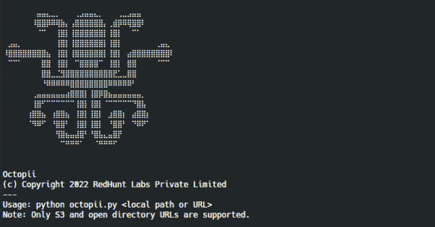

# Octopii:人工智能驱动的个人身份信息(pii)扫描仪

> 原文：<https://kalilinuxtutorials.com/octopii/>

[](https://blogger.googleusercontent.com/img/b/R29vZ2xl/AVvXsEjIZpfEK2Q9vrCAGyPa-McBOOJMBL3HiuE22KEvoDIuPWekkOOXAjVIxZ-ZrRtR72aJu2z-4xTtCdauTxLWHUPPL50ufTSUpXnx2zyoefgGuxREzEQr8nFs9iFOZObNdb83sjSY-4d04dHsOlQyHGOGQVRH29fWrHckANpur2IxdLBouFFv629TG4ef/s728/Octopii.png)

Octopii 是一款开源的人工智能个人身份信息(pii)扫描仪，可以在目录中查找图像资产，如政府身份证、护照、照片和签名。

## 工作

Octopii 使用 Tesseract 的光学字符识别(OCR)和 Keras 的卷积神经网络(CNN)模型来检测可能在公共场所泄露的各种形式的个人身份信息。这是通过以下步骤完成的:

### 1。导入和清理图像

该图像通过 OpenCV 和 Python 图像库(PIL)导入，并经过清洗、去歪斜和旋转以进行扫描。

### 2。执行图像分类和光学字符识别(OCR)

目录被循环并搜索图像。通过图像分类器(通过将其与训练的模型进行比较)扫描这些图像的独特特征，并通过 OCR 在图像中寻找子字符串。这可能会导致以下结果之一:

*   **最佳情况**(得分> =90):图像被发送到图像分类器算法中进行扫描，以获取 ISO/IEC 7810 卡规格、颜色、文本位置、照片、全息图等特征。如果它被成功归类为一种 PII，OCR 将对其进行最终检查，寻找特定的单词和字符串。当这两个都被确认时，Octopii 的结果是非常可靠的。
*   **平均情况**(得分> =50):图像被图像分类器算法部分/不正确地识别，但是 OCR 检查发现矛盾的子串并将其重新分类。
*   **最坏情况**(分数> =0):图像仅由图像分类器算法识别，但 OCR 扫描没有返回结果。
*   **不正确的分类**:由于非常小的模型或 OCR 列表导致的假阳性可能会对 pii 进行不正确的分类，从而给出不准确的结果。

作为最后的验证方法，扫描图像中的某些字符串，以验证模型的准确性。

扫描的准确性可以通过输出中的置信度得分来确定。如果满足所有提到的条件，则返回 100.0 分。

为了训练模型，还可以将数据输入到`model_generator.py`脚本中，并且可以使用新改进的 h5 文件。

## 用法

1.  通过`pip install -r requirements.txt`安装所有依赖项。
2.  通过`sudo apt install tesseract-ocr -y`(对于 Ubuntu/Debian)在本地安装 Tesseract 助手。
3.  要运行 Octopii，请键入`python3 octopii.py <location name>`，例如`python3 octopii.py pii_list/`

python 3 octopy . py<location to="" scan="">中的“T1”</location>

Octopii 目前支持本地扫描和通过网址扫描 S3 目录和开放目录列表。

## 举例

```
owais@artemis ~ $ python3 octopii.py pii_list

Not a valid image format: pii_list/aadhaar/aadhaar-8.gif

[
    {
        "asset_type": Credit and Debit Cards,
        "country_of_origin": "International",
        "confidence": 100,
        "file_name": "credit-card.jpg",
        "extension": "jpg",
        "path": "https://pii-carbonconsole.fra1.digitaloceanspaces.com/credit-card.jpg"
    },
    {
        "asset_type": "PAN",
        "country_of_origin": "IN",
        "confidence": 100,
        "file_name": "dummy-PAN-India.jpg",
        "extension": "jpg",
        "path": "https://pii-carbonconsole.fra1.digitaloceanspaces.com/dummy-PAN-India.jpg"
    },
    {
        "asset_type": Aadhaar,
        "country_of_origin": "IN",
        "confidence": 100,
        "file_name": "dummy-aadhaar.jpg",
        "extension": "jpg",
        "path": "https://pii-carbonconsole.fra1.digitaloceanspaces.com/dummy-aadhaar.jpg"
    },
    {
        "asset_type": Driver License,
        "country_of_origin": "International",
        "confidence": 100,
        "file_name": "dummy-drivers-license-nebraska-us.jpg",
        "extension": "jpg",
        "path": "https://pii-carbonconsole.fra1.digitaloceanspaces.com/dummy-drivers-license-nebraska-us.jpg"
    },
    {
        "asset_type": Passport,
        "country_of_origin": "International",
        "confidence": 100,
        "file_name": "dummy-passport-britain.jpg",
        "extension": "jpg",
        "path": "https://pii-carbonconsole.fra1.digitaloceanspaces.com/dummy-passport-britain.jpg"
    },
    {
        "asset_type": Passport,
        "country_of_origin": "International",
        "confidence": 100,
        "file_name": "dummy-passport-india.jpg",
        "extension": "jpg",
        "path": "https://pii-carbonconsole.fra1.digitaloceanspaces.com/dummy-passport-india.jpg"
    },
    {
        "asset_type": "Signature",
        "country_of_origin": null,
        "confidence": 7,
        "file_name": "dummy-signature.png",
        "extension": "png",
        "path": "https://pii-carbonconsole.fra1.digitaloceanspaces.com/dummy-signature.png"
    }
]

```

[Click Here To Download](https://github.com/redhuntlabs/Octopii)