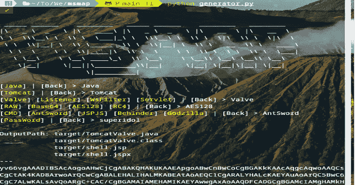
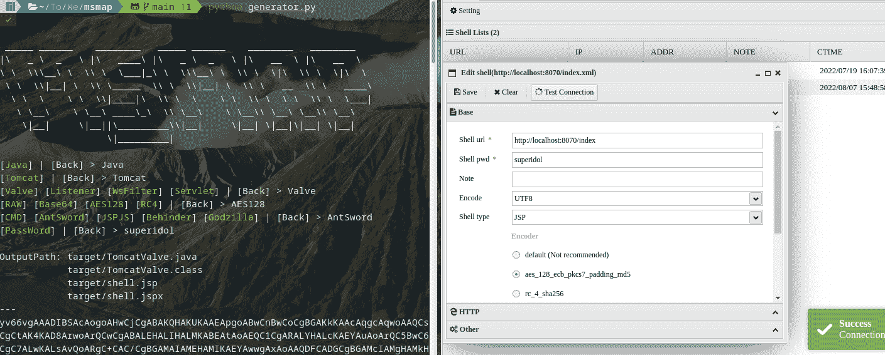
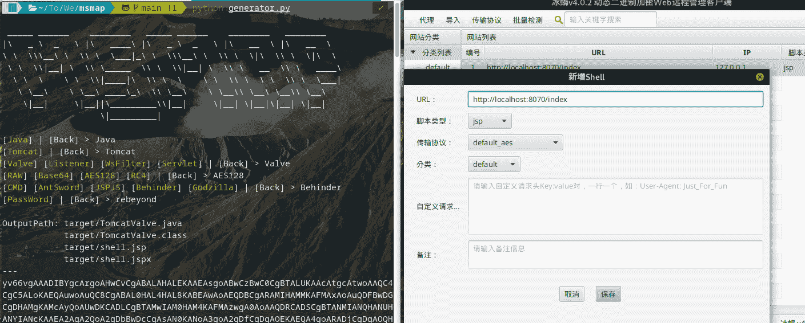
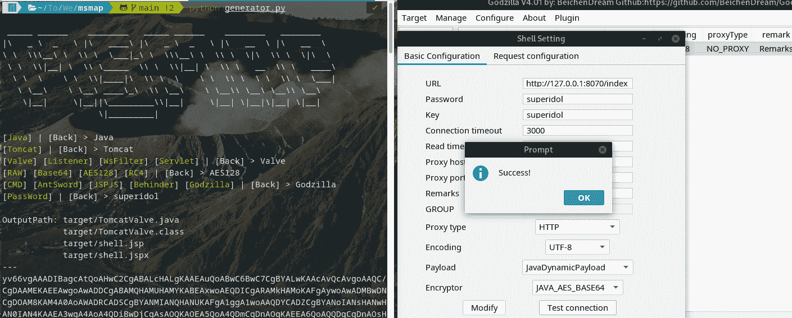

# MSMAP:内存 WebShell 生成器

> 原文：<https://kalilinuxtutorials.com/msmap-memory-webshell-generator/>

[](https://blogger.googleusercontent.com/img/b/R29vZ2xl/AVvXsEj4WGJYMopnmJtFQTdjvUAvVw5lteyOnW40xlu6UQg-4frFn75GAo9gsBdy3AAxZn177EgTThrGXkk58lhsHjftj__MUY4Bhqn37rHAwLFpiB3N2S0ZbpDIYa-VMlLKQVvMMlVV0hg86VET-ye8znDp3nCnUpGkv5Pzaw5614rczljBPYCog--MZpE0/s728/MSMAP1.png)

**Msmap** 是一个内存 WebShell 生成器。兼容各种容器、组件、编码器、 *WebShell / Proxy /黑仔*和管理客户端。



### 功能

*   动态菜单
*   自动编译
*   生成脚本
*   精简模式
*   图形界面

### 容器

*   Java 语言(一种计算机语言，尤用于创建网站)
    *   Tomcat7
    *   Tomcat8
    *   Tomcat9
    *   Tomcat10
    *   树脂 3
    *   树脂 4
    *   万维网环球服务系统
    *   玻璃鱼
    *   中间件
    *   JBoss
    *   春天*
    *   妮蒂
    *   JVM*
*   。网
    *   （同 ImmigrationInspectors 移民检查）
*   服务器端编程语言（Professional Hypertext Preprocessor 的缩写）
*   计算机编程语言

*: SpringHandler 仅支持 JDK8+

*:默认支持`Linux Tomcat 8/9`，更多版本可根据进阶指南进行适配。

### WebShell /代理/黑仔

*   WebShell
    *   CMD / SH
    *   蚂蚁之剑
    *   JSPJS
    *   贝欣德
    *   庞然大物
*   不需要模块化

~~代理:新行，代理~~

黑仔:java-memshell-scanner，ASP。NET-Memshell-Scanner

### 解码器/解密器/散列器

*   解码器
    *   Base64
    *   十六进制
*   解密器
    *   异或运算
    *   RC4
    *   AES128
    *   AES256
    *   南非共和国(Republic of South Africa)
*   厨师
    *   讯息摘要 5
    *   SHA128
    *   SHA256

## 用法

```
git clone git@github.com:hosch3n/msmap.git
cd msmap
python generator.py
```

[警告]必须设置唯一的密码，选项区分大小写。

### 高级

编辑`config/environment.py`

```
# Auto Compile
auto_build = True

# Base64 Encode Class File
b64_class = True

# Generate Script File
generate_script = True

# Compiler Absolute Path
java_compiler_path = r"~/jdk1.6.0_04/bin/javac"
dotnet_compiler_path = r"C:\Windows\Microsoft.NET\Framework\v2.0.50727\csc.exe"
```

编辑`gist/java/container/tomcat/servlet.py`

```
// Servlet Path Pattern
private static String pattern = "*.xml";
```

如果在 WsFilter 中使用了加密编码器，密码需要与路径相同(例如`/passwd`)

`gist/java/container/jdk/javax.py`与`lib/servlet-api.jar`可以根据目标容器进行替换。

`pip3 install pyperclip`支持自动复制到剪贴板。

## 举例

命令/命令
蚂蚁之剑
背后
哥斯拉

[Click Here To Download](https://github.com/hosch3n/msmap)