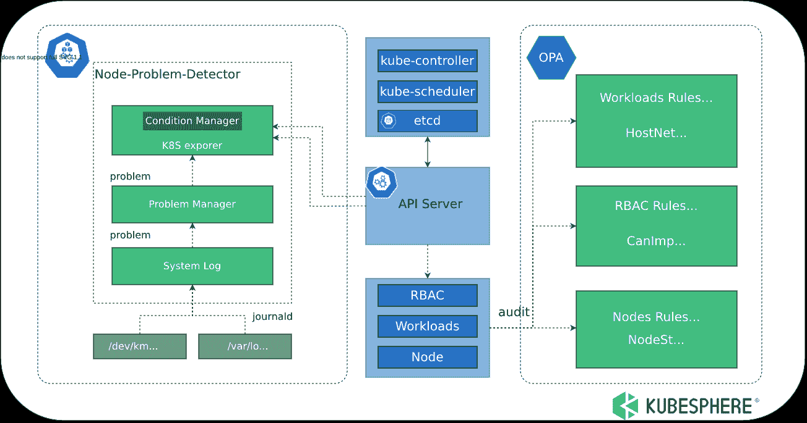

# Kubeeye:在 Kubernetes 上查找各种问题的工具

> 原文：<https://kalilinuxtutorials.com/kubeeye-2/>

[](https://blogger.googleusercontent.com/img/b/R29vZ2xl/AVvXsEjTuc0hcKSK5kn610hMS_j699emTDWeTKPA1yQmgTdRLCr8Ihm9fh5j0n0_Tmiq8liWUQAoYiKCW7Od6cRDHA4_JHERSApaxgZ7zNOEO1FBfDdFmvP8LGlAwemG5-efr1iyJjv8l-xgUCYfRD5o6tNH8UfRJ59S31MRq5ilpwHo32_Ted2ohnuUFupJ/s728/KubeEye-svg.png)

**KubeEye** 是 Kubernetes 的检测工具。它发现 Kubernetes 资源(通过使用 [OPA](https://github.com/open-policy-agent/opa) )、集群组件、集群节点(通过使用[节点问题检测器](https://github.com/kubernetes/node-problem-detector))和其他配置是否符合最佳实践，并相应地提出修改建议。

KubeEye 支持自定义检查规则和插件安装。通过 [KubeEye 操作员](https://github.com/kubesphere/kubeeye#kubeeye-operator)，您可以在 web 控制台上直观地查看检查结果和修改建议。

## 建筑

KubeEye 通过使用 Kubernetes APIs 获得集群资源细节，通过使用检查规则和插件检查资源配置，并生成检查结果。KubeEye 的架构如下:



## 安装和使用 KubeEye

1.  在你的机器上安装 KubeEye。注意:KubeEye 文件将在您机器上的`/usr/local/bin/`中生成。git 克隆 https://github.com/kubesphere/kubeeye.git CD kubeeye make installke
    *   方法一:从[版本](https://github.com/kubesphere/kubeeye/releases)下载预建的可执行文件。
    *   方法 2:从源代码构建。Note: KubeEye files will be generated in
2.  (可选)安装[节点问题检测器](https://github.com/kubernetes/node-problem-detector)。注意:如果您需要详细的报告，运行以下命令，然后 NPD 将安装在您的集群上。kubeeye 安装新产品开发
3.  运行 KubeEye 来检查集群。

注意:KubeEye 的结果是按资源种类排序的。

```
kubeeye audit
KIND          NAMESPACE        NAME                                                           REASON                                        LEVEL    MESSAGE
Node                           docker-desktop                                                 kubelet has no sufficient memory available   warning    KubeletHasNoSufficientMemory
Node                           docker-desktop                                                 kubelet has no sufficient PID available      warning    KubeletHasNoSufficientPID
Node                           docker-desktop                                                 kubelet has disk pressure                    warning    KubeletHasDiskPressure
Deployment    default          testkubeeye                                                                                                                  NoCPULimits
Deployment    default          testkubeeye                                                                                                                  NoReadinessProbe
Deployment    default          testkubeeye                                                                                                                  NotRunAsNonRoot
Deployment    kube-system      coredns                                                                                                               NoCPULimits
Deployment    kube-system      coredns                                                                                                               ImagePullPolicyNotAlways
Deployment    kube-system      coredns                                                                                                               NotRunAsNonRoot
Deployment    kubeeye-system   kubeeye-controller-manager                                                                                            ImagePullPolicyNotAlways
Deployment    kubeeye-system   kubeeye-controller-manager                                                                                            NotRunAsNonRoot
DaemonSet     kube-system      kube-proxy                                                                                                            NoCPULimits
DaemonSet     k          ube-system      kube-proxy                                                                                                            NotRunAsNonRoot
Event         kube-system      coredns-558bd4d5db-c26j8.16d5fa3ddf56675f                      Unhealthy                                    warning   Readiness probe failed: Get "http://10.1.0.87:8181/ready": dial tcp 10.1.0.87:8181: connect: connection refused
Event         kube-system      coredns-558bd4d5db-c26j8.16d5fa3fbdc834c9                      Unhealthy                                    warning   Readiness probe failed: HTTP probe failed with statuscode: 503
Event         kube-system      vpnkit-controller.16d5ac2b2b4fa1eb                             BackOff                                      warning   Back-off restarting failed container
Event         kube-system      vpnkit-controller.16d5fa44d0502641                             BackOff                                      warning   Back-off restarting failed container
Event         kubeeye-system   kubeeye-controller-manager-7f79c4ccc8-f2njw.16d5fa3f5fc3229c   Failed                                       warning   Failed to pull image "controller:latest": rpc error: code = Unknown desc = Error response from daemon: pull access denied for controller, repository does not exist or may require 'docker login': denied: requested access to the resource is denied
Event         kubeeye-system   kubeeye-controller-manager-7f79c4ccc8-f2njw.16d5fa3f61b28527   Failed                                       warning   Error: ImagePullBackOff
Role          kubeeye-system   kubeeye-leader-election-role                                                                                          CanDeleteResources
ClusterRole                    kubeeye-manager-role                                                                                                  CanDeleteResources
ClusterRole                    kubeeye-manager-role                                                                                                  CanModifyWorkloads
ClusterRole                    vpnkit-controller                                                                                                     CanImpersonateUser
ClusterRole                    vpnkit-controller                                                                                           CanDeleteResources
```

## KubeEye 如何帮助你

*   它根据 Kubernetes 最佳实践检查集群资源，以确保集群稳定运行。
*   它检测集群的控制平面问题，包括 kube-apiserver、kube-controller-manager 和 etcd。
*   它检测节点问题，包括内存、CPU、磁盘压力和意外的内核错误日志。

## 清单

| 是/否 | 检查项目 | 描述 | 严重 |
| --- | --- | --- | --- |
| 981 号房 | 私人地理 | 允许权限提升。 | 危险 |
| 981 号房 | 犬瘟热 | 角色/ClusterRole 可以模拟用户。 | 警告 |
| 981 号房 | CanModifyResources | 角色/ClusterRole 可以删除 Kubernetes 资源。 | 警告 |
| 981 号房 | CanModifyWorkloads | 角色/ClusterRole 可以修改 Kubernetes 资源。 | 警告 |
| 981 号房 | 没有限制 | 没有设置 CPU 限制。 | 危险 |
| 981 号房 | NoCPURequests | 没有预留 CPU 资源。 | 危险 |
| 981 号房 | 高风险能力 | 启用高风险功能，如 ALL、SYS_ADMIN 和 NET_ADMIN。 | 危险 |
| 981 号房 | HostIPCAllowed | 主机 IPC 被设置为`true`。 | 危险 |
| 981 号房 | 允许的主机网络 | 主机网络设置为`true`。 | 危险 |
| 981 号房 | HostPIDAllowed | HostPID 被设置为`true`。 | 危险 |
| 981 号房 | 允许的主机端口 | 主机端口被设置为`true`。 | 危险 |
| 981 号房 | ImagePullPolicyNotAlways | 图像拉取策略未设置为`always`。 | 警告 |
| 981 号房 | imagetagislastest | 图像标签是`latest`。 | 警告 |
| 981 号房 | ImageTagMiss | 缺少图像标记。 | 危险 |
| 981 号房 | 不安全能力 | 缺少不安全的选项，如 KILL、SYS_CHROOT 和 CHOWN。 | 危险 |
| 981 号房 | 无效探针 | 无活动探测器未设置。 | 警告 |
| 981 号房 | 命名记忆极限 | 没有设置内存限制。 | 危险 |
| 981 号房 | 名词记忆请求 | 没有预留内存资源。 | 危险 |
| 981 号房 | NoPriorityClassName | 未设置资源计划优先级。 | 忽视 |
| 981 号房 | 特权允许 | 吊舱正在特权模式下运行。 | 危险 |
| 981 号房 | NoReadinessProbe | 未设置就绪探测器。 | 警告 |
| 981 号房 | NotReadOnlyRootFilesystem | readOnlyRootFilesystem 未设置为`true`。 | 警告 |
| 981 号房 | NotRunAsNonRoot | runAsNonRoot 未设置为`true`。 | 警告 |
| 981 号房 | 证书过期期限 | API 服务器的证书到期日期少于 30 天。 | 危险 |
| 981 号房 | 事件审计 | 需要审核事件。 | 警告 |
| 981 号房 | 节点状态 | 需要检查节点状态。 | 警告 |
| 981 号房 | 码头状态 | 需要检查码头状态。 | 警告 |
| 981 号房 | KubeletStatus | 需要检查 kubelet 状态。 | 警告 |

## 添加您自己的检查规则

### 添加自定义 OPA 规则

**创建存储 OPA 规则的目录。**

mkdir opa

**添加自定义 OPA 规则文件。**

注意:

检查工作负载的 OPA 规则:包名必须是 kubeeye_workloads_rego。检查 RBAC 设置的 OPA 规则:包名必须是 kubeeye_RBAC_rego。
检查节点设置的 OPA 规则:包名必须是 kubeeye_nodes_rego。

**为了检查图像注册地址是否符合规则，将以下规则保存到 imageRegistryRule.rego**

```
package kubeeye_workloads_rego
deny[msg] {
    resource := input
    type := resource.Object.kind
    resourcename := resource.Object.metadata.name
    resourcenamespace := resource.Object.metadata.namespace
    workloadsType := {"Deployment","ReplicaSet","DaemonSet","StatefulSet","Job"}
    workloadsType[type]

    not workloadsImageRegistryRule(resource)

    msg := {
        "Name": sprintf("%v", [resourcename]),
        "Namespace": sprintf("%v", [resourcenamespace]),
        "Type": sprintf("%v", [type]),
        "Message": "ImageRegistryNotmyregistry"
    }
}

workloadsImageRegistryRule(resource) {
    regex.match("^myregistry.public.kubesphere/basic/.+", resource.Object.spec.template.spec.containers[_].image)
}
```

4.  用自定义规则运行 KubeEye。

注意:Kubeeye 会读取所有以*结尾的文件。目录中的 rego* 。

```
root:# kubeeye audit -p ./opa
NAMESPACE     NAME              KIND          MESSAGE
default       nginx1            Deployment    [ImageRegistryNotmyregistry NotReadOnlyRootFilesystem NotRunAsNonRoot]
default       nginx11           Deployment    [ImageRegistryNotmyregistry PrivilegeEscalationAllowed HighRiskCapabilities HostIPCAllowed HostPortAllowed ImagePullPolicyNotAlways ImageTagIsLatest InsecureCapabilities NoPriorityClassName PrivilegedAllowed NotReadOnlyRootFilesystem NotRunAsNonRoot]
default       nginx111          Deployment    [ImageRegistryNotmyregistry NoCPULimits NoCPURequests ImageTagMiss NoLivenessProbe NoMemoryLimits NoMemoryRequests NoPriorityClassName NotReadOnlyRootFilesystem NoReadinessProbe NotRunAsNonRoot]
```

### 添加自定义 NPD 规则

1.  运行以下命令更改配置图:ku bectl edit config map node-problem-detector-config-n kube-system
2.  运行以下命令来重新启动 NPD:ku bectl rollout restart daemon set node-problem-detector-n kube-system

## 忽必烈算子

### 什么是 KubeEye 算子

KubeEye Operator 是 Kubernetes 的一个检验平台。它管理 KubeEye 定期检查集群并生成检查结果。

### 【KubeEye 接线员如何帮助您

*   它通过使用 CR 记录检查结果，并提供一个网页供您直观地查看和比较集群检查结果。
*   它提供了更多的插件。
*   它提供了更详细的修改建议。

### 部署 KubeEye 操作员

```
kubectl apply -f https://raw.githubusercontent.com/kubesphere/kubeeye/main/deploy/kubeeye.yaml
kubectl apply -f https://raw.githubusercontent.com/kubesphere/kubeeye/main/deploy/kubeeye_insights.yaml
```

### 获取检验结果

```
kubectl get clusterinsight -o yaml
```

```
apiVersion: v1
items:
- apiVersion: kubeeye.kubesphere.io/v1alpha1
  kind: ClusterInsight
  metadata:
    name: clusterinsight-sample
    namespace: default
  spec:
    auditPeriod: 24h
  status:
    auditResults:
      auditResults:
      - resourcesType: Node
        resultInfos:
        - namespace: ""
          resourceInfos:
          - items:
            - level: warning
              message: KubeletHasNoSufficientMemory
              reason: kubelet has no sufficient memory available
            - level: warning
              message: KubeletHasNoSufficientPID
              reason: kubelet has no sufficient PID available
            - level: warning
              message: KubeletHasDiskPressure
              reason: kubelet has disk pressure
            name: kubeeyeNode
```

[Click Here To Download](https://github.com/kubesphere/kubeeye)