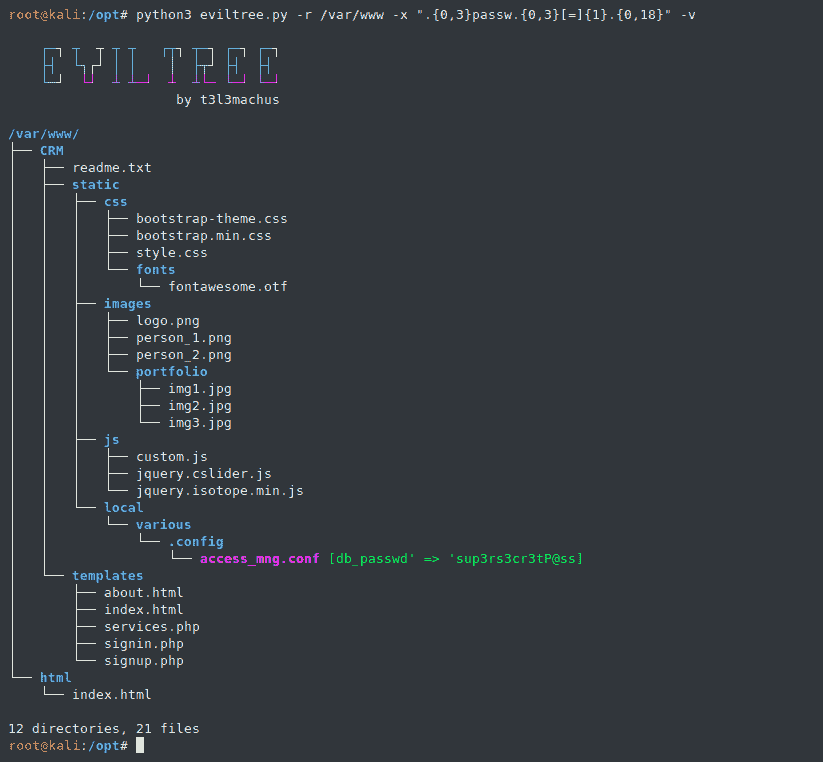
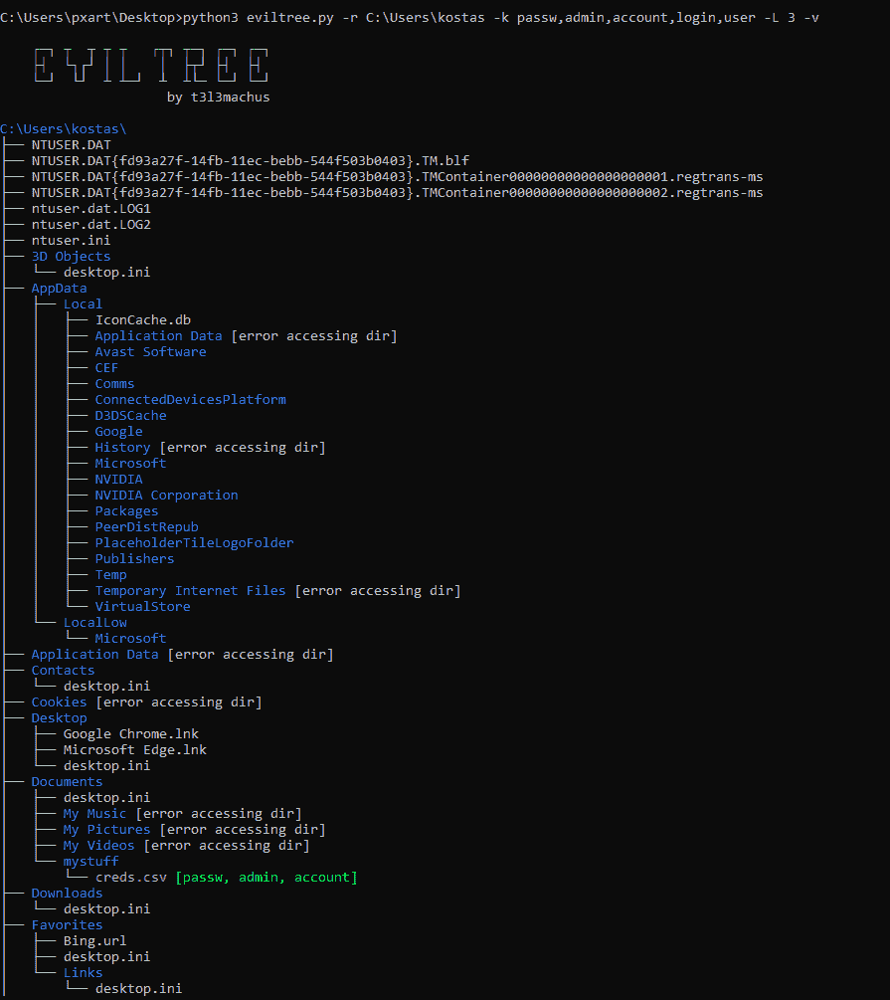
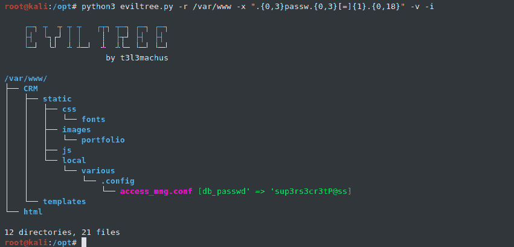

# EvilTree:翻拍经典的“树”命令

> 原文：<https://kalilinuxtutorials.com/eviltree/>

EvilTree 是一个独立的 python3，是经典的“Tree”命令的翻版，具有在文件中搜索用户提供的关键字/正则表达式的附加功能，突出显示那些包含匹配的内容。创建有两个主要原因:

*   当在嵌套目录结构的文件中搜索秘密时，能够可视化哪些文件包含用户提供的关键字/正则表达式模式以及那些文件在文件夹层次结构中的位置，提供了显著的优势。
*   “树”是一个分析目录结构的神奇工具。有一个独立的替代命令用于漏洞后枚举真的很方便，因为它不是预先安装在每个 linux 发行版上的，并且在 Windows 上有所限制(与 UNIX 版本相比)。

## 用法示例

**例子#1** :运行一个正则表达式，基本上匹配类似于:`password = something`对`/var/www`的字符串

**例 2** :使用逗号分隔的关键字代替正则表达式:

**免责声明**:仅在 Windows 10 Pro 上测试。

## 更多选项&使用提示

**显著特征:**

*   Regex `-x` search 实际上返回一个文件中所有匹配模式的唯一列表。将它与`-v`(–verbose)结合使用时要小心，尽量具体一些，并限制字符的长度以匹配。
*   您也可以通过提供选项`-b`在二进制文件中搜索关键字/正则表达式。
*   如果不提供关键字`-k`和正则表达式`-x`值，您可以将该工具用作经典的“树”命令。如果您在一台机器上获得了一个有限的 shell，并且想要查看带有彩色输出的“树”,这将非常有用。
*   在`eviltree.py`中有一个列表变量`filetype_blacklist`，它可以用来从内容搜索中排除某些文件扩展名。默认情况下，它不包括以下内容:`gz, zip, tar, rar, 7z, bz2, xz, deb, img, iso, vmdk, dll, ovf, ova`。
*   一个非常有用的功能是`-i`(–仅有趣)选项。它指示 eviltree 只列出具有匹配的关键字/正则表达式内容的文件，从而大大减少了输出长度:

## 有用的关键字/正则表达式模式

*   查找密码的正则表达式:`-x ".{0,3}passw.{0,3}[=]{1}.{0,18}"`
*   查找敏感信息的关键字:`-k passw,db_,admin,account,user,token`

[Click Here To Download](https://github.com/t3l3machus/eviltree)