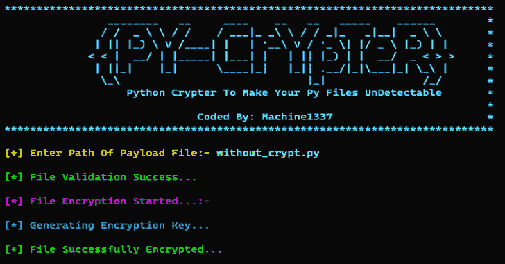

# Pycrypt:基于 Python 的加密程序，可以绕过任何反病毒产品

> 原文：<https://kalilinuxtutorials.com/pycrypt/>

Pycrypt 是一个基于 python 的密码器，可以绕过任何杀毒产品。防病毒软件保护计算机免受恶意软件的攻击，包括键盘记录程序、浏览器劫持程序、特洛伊木马、蠕虫、rootkits、间谍软件、广告软件、僵尸网络和勒索软件。

## **Pycrypt 特性**

1.  FUD 比率 0/40
2.  绕过任何 [EDR 解决方案](https://gbhackers.com/endpoint-detection-response-edr/)
3.  轻型密码器
4.  非常小而简单的密码器

## **注:**

*   确保您的有效负载文件导入了所有库，并且它将是一个有效的有效负载文件
*   不要上传任何有效载荷到 VirusTotal.com Bcz 这个工具将不会与时间合作。
*   Virustotal 与 AV 公司共享签名。
*   再说一次，别犯傻了！

## **如何使用？**

*   在 GitHub 上找到任何基于 [Python](https://kalilinuxtutorials.com/bayanay/) 的后门/RAT。
*   用 pycrypt 加密它的负载
*   现在使用 pyinstaller 将加密的有效负载转换为 exe

## **下载 Python3**

*:-对于 Windows:在此下载。

*:-对于 Linux:

*sudo apt-get 安装 python3
sudo apt-get 安装 python 3-pip*

确保安装了 Python3 和 Pip。

*   pip 安装术语颜色
*   pip 安装请求

## **如何运行**

### ***:-对于 Windows:-**

确保安装了 python3 和 pip，并且还安装了需求

***python pycrypt.py***

然后给出你的有效载荷文件的路径，并享受

### ***:-对于 Linux:-**

确保安装了所有要求。

***python 3 pycrypt . py***

然后输入你的有效载荷文件的路径，在下面的平台上享受。

1.  Windows 操作系统
2.  基于 Linux 操作系统

## **如何安装**

***git 克隆[https://github.com/pycrypt](https://github.com/pycrypt)
CD pycrypt
python 3 pycrypt . py***

## **克莱恩斯坎扫描仪结果**

1.  生成的 stub.py [结果](https://kleenscan.com/scan_result/39e61c692ee91dd6cd48aca77a8bb220ef27fcc40df75807d4a1f96b4db8df69) :-
2.  密码器代码[结果](https://kleenscan.com/scan_result/24487da561419105e29cabd5fc66c503ee767719029fae2f9a041b04d6a75d4b) :-

## **演示视频**

警告:仅将此工具用于教育目的，我们不对您的残忍行为负责。

[Click Here To Download](https://github.com/machine1337/pycrypt)